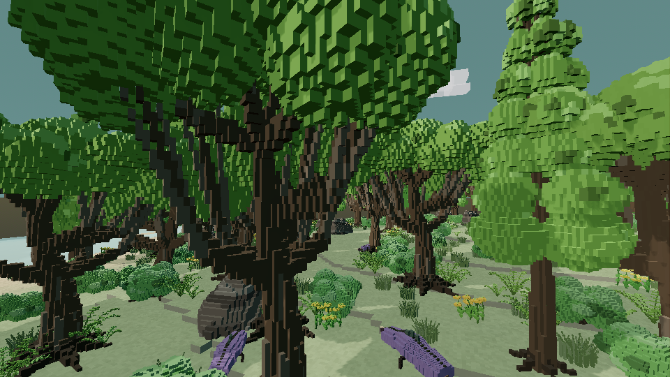
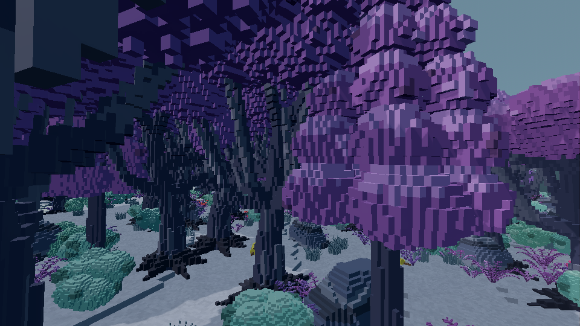
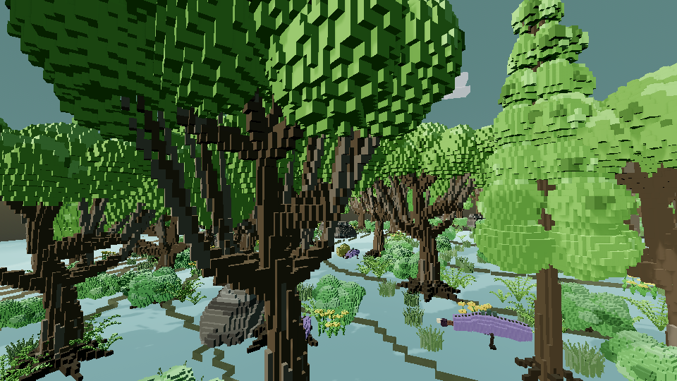
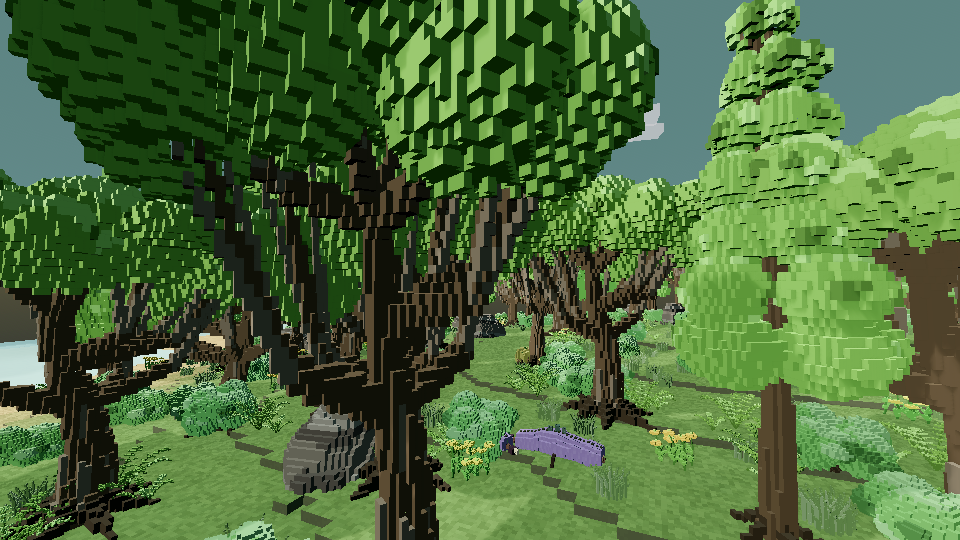

# Godot render acceptance — 2026-09-08

This review uses the actual Godot 4.6.3 renderer and imported runtime assets.
The screenshots are unedited viewport captures. The source commit and workflow
artifacts are recorded in `evidence.json`; raw capture distributions are retained
alongside this document. Earlier CPU art previews remain in `../benchmark_v2/`.

## Review scope

- Forward+ through Mesa Vulkan and Compatibility through Mesa OpenGL, 960 × 540.
- Two dense reference seeds: verdant `15838` and violet `23757`.
- Four cases per seed: actual world, seven-family LOD lineup, Far cluster A/B,
  and rigid creature voxel A/B. Near / Mid / Far run from left to right.
- The controlled A/B cases require fewer viewport draw calls, unchanged source
  geometry/palette contracts and mean normalized RGB error at most 0.004.
- World captures require the intended scenic spawn, 25 populated chunks and at
  least 1,000 vegetation instances for these two reference seeds.

The CI adapter is a software renderer. Its short timing samples certify neither
target-PC FPS nor a frame-time ceiling. Full target-PC commands and the stationary
camera/disabled review-player combat scope are in
[ENVIRONMENT_REVIEW.md](../../../docs/ENVIRONMENT_REVIEW.md).

## Images

Verdant world (Forward+):

Violet world (Forward+):

The original Compatibility capture exposed inward-facing terrain tops. The
worker path had lost the legacy terrain builder's winding correction. The
before/after images below use the same seed, camera and resolution; moving
wildlife and wind are not pixel-synchronized between these separate runs.

## Controlled draw-count comparisons

Godot viewport counters at the same camera and with identical source geometry:

| Renderer | Seed | Far batches → cluster | Individual creature → batched |
|---|---:|---:|---:|
| Forward+ | 15838 | 14 → 5 | 933 → 158 |
| Forward+ | 23757 | 13 → 5 | 2182 → 158 |
| Compatibility | 15838 | 13 → 4 | 3529 → 627 |
| Compatibility | 23757 | 12 → 4 | 8208 → 575 |

Counters include the fixture's other visible draws and renderer-specific passes;
compare within a renderer. Primitive counts are unchanged in every A/B pair.
The largest normalized mean RGB error is 0.000718, below the 0.004 gate. These
are draw-count reductions, not measured target-hardware FPS improvements.

Both actual world captures contain 25 chunks: 2,274 vegetation instances on the
verdant seed and 3,093 on the violet seed. Animated wildlife means separate world
captures are not exact A/B performance comparisons.

## All seven LOD lineups

Near, Mid and Far run left to right. All 24 Forward+ PNGs are preserved in this
repository; additional Compatibility captures remain in the workflow artifact.

| Family | Verdant | Violet |
|---|---|---|
| ancient_oak_v2 | [PNG](forward_plus/assets_15838/ancient_oak_v2.png) | [PNG](forward_plus/assets_23757/ancient_oak_v2.png) |
| tall_pine_v2 | [PNG](forward_plus/assets_15838/tall_pine_v2.png) | [PNG](forward_plus/assets_23757/tall_pine_v2.png) |
| dense_bush_v2 | [PNG](forward_plus/assets_15838/dense_bush_v2.png) | [PNG](forward_plus/assets_23757/dense_bush_v2.png) |
| fern_cluster_v2 | [PNG](forward_plus/assets_15838/fern_cluster_v2.png) | [PNG](forward_plus/assets_23757/fern_cluster_v2.png) |
| flower_cluster_v2 | [PNG](forward_plus/assets_15838/flower_cluster_v2.png) | [PNG](forward_plus/assets_23757/flower_cluster_v2.png) |
| layered_rock_v2 | [PNG](forward_plus/assets_15838/layered_rock_v2.png) | [PNG](forward_plus/assets_23757/layered_rock_v2.png) |
| grass_tuft_v2 | [PNG](forward_plus/assets_15838/grass_tuft_v2.png) | [PNG](forward_plus/assets_23757/grass_tuft_v2.png) |

Controlled violet comparisons: [original Far batches](forward_plus/cluster_23757/far_batches.png),
[Far cluster](forward_plus/cluster_23757/far_cluster.png),
[individual creature boxes](forward_plus/creature_23757/creature_individual.png),
[batched creature](forward_plus/creature_23757/creature_batched.png).

## Remaining human and hardware gates

These captures make the benchmark reviewable in its actual lighting and palette
pipeline. They do not grant final art approval. Review fern connections, coarse
Mid/Far silhouettes, tree repetition, contact with soil, shadowing and palette
balance in Blockbench and in motion. The world views also expose crowded foreground
canopies: scenic terrain viewsheds currently do not account for vegetation occlusion.
Plan a deliberate opening toward landscape landmarks before expanding the horizon. The seven editable source files remain in
`art/source/blockbench/environment/benchmark_v2/`.

Profile the two dense scenes on the target PC before increasing streaming radius
or density. Cold shader/resource creation and mesh uploads remain indivisible
steps; the 1.8 ms generation budget is an admission target, not a hard limit.
Clusters have explicit capacity fallback and retain original Far instances when
that limit is reached. Hero-trunk collision and additional alien architectures
remain separate production work.
