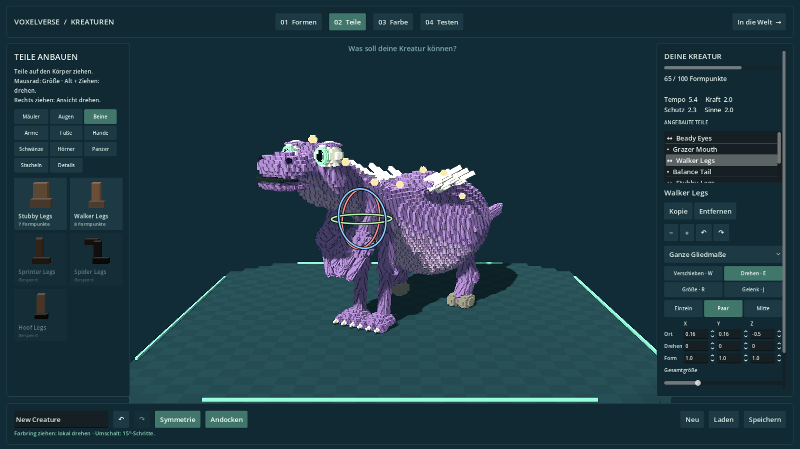
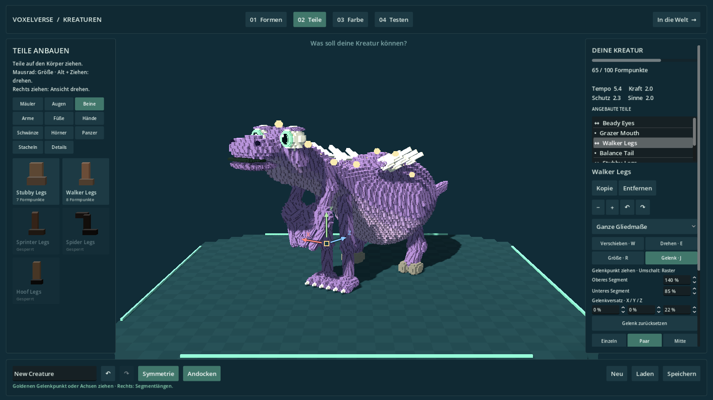
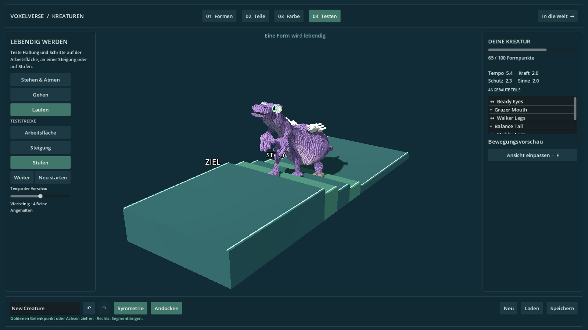

# Direkte Griffe, Gelenke und Bewegungstest

Die Kreaturen-Werkstatt in Draft PR #12 erhält direkte Bearbeitung an der Kreatur. Der Editor öffnet sich im Spiel mit F2. Die feine Voxeloberfläche und die bisherigen Zahlenfelder bleiben verfügbar.

| Werkzeug | Bedienung |
|---|---|
| Verschieben · W | Einen farbigen Pfeil ziehen. Andocken und die vorhandenen Befestigungsgrenzen gelten weiter. |
| Drehen · E | Einen Farbring ziehen. Er dreht das Teil um seine lokale Achse. Umschalt rastet in 15°-Schritten ein. |
| Größe · R | Ein Achsenquadrat ändert eine Proportion; das mittlere Quadrat ändert die Gesamtgröße. |
| Gelenk · J | Bei einem Arm oder Bein den goldenen Gelenkpunkt frei in der Ansicht oder einen Achsenpfeil ziehen. |
| Abbrechen | Esc während des Ziehens stellt den vorherigen Entwurf und den bisherigen Rückgängig-/Wiederholen-Verlauf wieder her. |
| Rückgängig | Eine vollständige Ziehbewegung zählt als ein Bearbeitungsschritt. |

Die Griffe bearbeiten das ausgewählte Körperteil. Bei „Fuß bearbeiten“ oder „Hand bearbeiten“ wirken Drehung und Größe auf das Endstück. Gelenk und Verschieben sind dort nicht verfügbar, weil das Endstück am Arm oder Bein befestigt bleibt. Beide Seiten eines Paares übernehmen die Bearbeitung gespiegelt.

Im Gelenkwerkzeug lassen sich oberes und unteres Segment unabhängig zwischen 40 und 220 Prozent einstellen. Der Gelenkversatz verändert Knie oder Ellenbogen in drei Richtungen. Damit sind unter anderem lange Unterschenkel, kurze Oberarme und stärker abgewinkelte Gliedmaßen möglich. „Gelenk zurücksetzen“ stellt die Standardproportionen dieses Teils wieder her. Es bleibt ein Modell mit zwei Segmenten je Arm oder Bein.

## Gang und Teststrecke

Die sichtbare Beinreichweite beeinflusst Schrittlänge, Schrittfrequenz und Fußhub. Die Anordnung und Anzahl der Beine beeinflusst die Schrittfolge und das seitliche Gewichtsverlagern. Die tragenden Füße gleichen das Atmen und die Körperbewegung aus. Im Gelände werden Fußkontakte auf dem vorhandenen Kollisionsboden geprüft; die Sohlen richten sich nach dessen Neigung.

Unter „Testen“ stehen die Arbeitsfläche, eine Steigung und eine Treppe mit vier Höhenübergängen zur Verfügung. Auf Steigung und Stufen bewegt sich die aktuelle Kreatur tatsächlich vom Start zum Ziel. „Gehen“ und „Laufen“ wählen die Gangart. „Pause“, „Weiter“, „Neu starten“ und der Temporegler steuern die Vorschau. Die Strecke besitzt passende native Kollisionsflächen. Beim Verlassen kehrt die Kreatur in ihre Bearbeitungsstellung zurück.

Der Test verändert keine gespeicherten Körperteile oder Gelenke. Es handelt sich um eine geführte Bewegungsprobe; die vorhandene Spielerkapsel und die Spielwerte bleiben erhalten. Schwimmen, Flugbewegung und frei verlängerbare Gelenkketten gehören zu späteren Arbeitspaketen.

## Speicherung und Prüfung

Das abwärtskompatible V7-Format ergänzt je Teil `joint.upper`, `joint.lower` und `joint.offset`. Ältere Entwürfe erhalten Standardwerte. Nicht endliche Werte und Werte außerhalb der erlaubten Bereiche werden normalisiert. Gelenkproportionen verändern keine Fähigkeiten oder Formpunktkosten.

`tests/creature_joint_studio_test.gd` prüft native Mausgesten, Rückgängig und Abbrechen, Endstückdrehung, gespeicherte Gelenke, Spiegelung, unterschiedliche Beinreichweiten und Bewegungen mit zwei, vier und sechs Beinen. Die Teststrecke wird zusätzlich mit echten Physikstrahlen gegen bekannte Rampen- und Stufenhöhen geprüft. Derselbe Test läuft auch im Windows- und Linux-Release-Paket.

Die Bildprüfung ergänzt vier native Aufnahmen: Drehringe, Gelenkregler, Gehen auf der Steigung und Laufen auf den Stufen. Insgesamt wurden 13 Aufnahmen in 1600×900 fehlerfrei erzeugt und visuell geprüft.

Geprüfter Code: `f7a1c9d0103b9290a0c6a2b5726a1f6dab32cf18` mit Godot 4.6.3. Die [vollständige Projektprüfung](https://github.com/MajorDragonfly/voxelverse/actions/runs/34328389469) besteht mit 53/53, die [Werkstattprüfung](https://github.com/MajorDragonfly/voxelverse/actions/runs/34328389419) mit 8/8 und die [Windows-/Linux-Exporte](https://github.com/MajorDragonfly/voxelverse/actions/runs/34328389468) jeweils mit 14/14 Prüfungen. Die native Gelenkprüfung läuft auch in beiden exportierten Release-Paketen. Synchrone Körperänderungen benötigen bei den vier Vorlagen im Median 38,9–64,2 ms auf diesem CI-Rechner, ohne Rendering; dies ist keine Messung der Bildrate auf dem Ziel-PC. [Rohmessungen](../art/review/creature_joint_studio/detail_metrics.json), [vollständige Prüfnachweise und Rendererstatus](../validation/creature-joint-studio.json).

[Windows-Testbuild herunterladen](https://github.com/MajorDragonfly/voxelverse/actions/runs/34328389468/artifacts/10094762892). Die Änderungen bleiben im separaten Draft PR #12 auf PR #10; sie sind noch nicht in `main` integriert.

