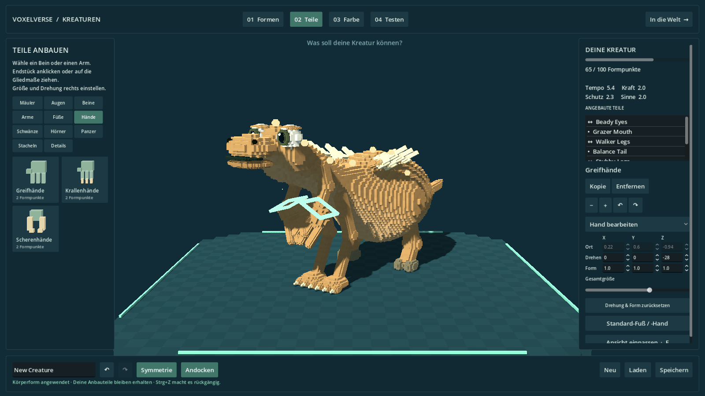
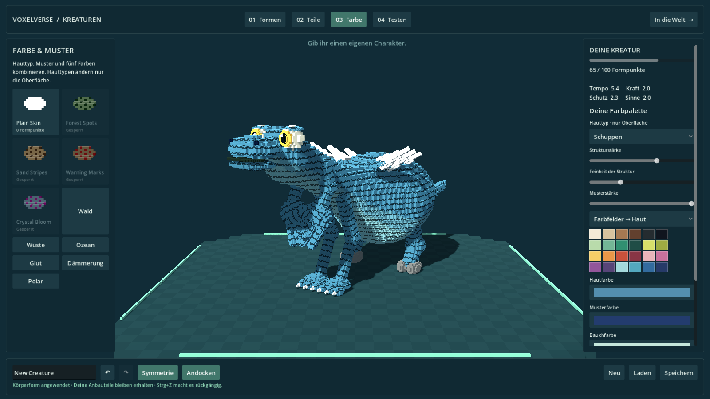

# Körperteile, Hände, Füße und Hauttypen

Dieses Paket erweitert die Kreaturen-Werkstatt in Draft PR #12 auf `agent/creature-editor-spore`. Die feine Voxeloberfläche bleibt gemeinsam für Editor, Spieler und Wildtiere erhalten. Die Arbeiten anderer Branches werden damit nicht zusammengeführt.

Die anschließende Erweiterung mit direkten Griffen, einstellbaren Gelenken und einer Bewegungsstrecke ist in [Direkte Griffe, Gelenke und Bewegungstest](CREATURE_JOINT_STUDIO.md) beschrieben. Die Nachweise weiter unten dokumentieren den ursprünglichen Teile-Stand.

## Gestalten

Alle 29 vorhandenen Anbauteile haben eigene feinere Formen: Mäuler mit getrennten Kiefern, Nasenöffnungen und Zähnen; Augen mit Iris, Pupille und Lid; gegliederte Arme und Beine; Schwanzvarianten; verzweigte Geweihe; gerichtete Seitenstacheln; Panzersegmente sowie Federn und Kristalle. Die bekannten Teile-IDs und ihre Fähigkeiten bleiben erhalten.

| Aktion | Bedienung |
|---|---|
| Teil wählen | Auf der Kreatur oder in „Angebaute Teile“ anklicken |
| Drehen | Rechts unter „Drehen“ X/Y/Z in Grad einstellen; alternativ Alt+Ziehen oder Drehknöpfe |
| Proportionen | „Form“ verändert Breite, Länge/Höhe und Tiefe getrennt; „Gesamtgröße“ skaliert gleichmäßig |
| Befestigung | „Einzeln“, „Paar“ oder „Mitte“ wählen |
| Mittellinie | Ein Teil auf einen der sieben goldenen Andockpunkte ziehen; es bleibt auf X=0 |
| Fuß austauschen | Bein wählen → Kategorie „Füße“ → Ballen-, Krallen-, Huf- oder Schwimmfuß anklicken; alternativ auf das Bein ziehen |
| Hand austauschen | Arm wählen → Kategorie „Hände“ → Greif-, Krallen- oder Scherenhand anklicken; alternativ auf den Arm ziehen |
| Endstück einstellen | Rechts „Fuß bearbeiten“ bzw. „Hand bearbeiten“ wählen; Drehung, Form und Größe wirken dann auf dieses Endstück |
| Standard-Endstück | „Standard-Fuß / -Hand“ setzt Variante und Endstück-Transformation zurück |

Hände und Füße bleiben am beweglichen Gelenkende befestigt. Sie sind keine frei schwebenden Einzelteile. Explizite Endstückvarianten kosten jeweils zwei Formpunkte pro gespeichertem Gliedmaßeneintrag (Einzelteil oder Paar); sie verändern hier noch keine Fähigkeiten. Die Werkstatt begrenzt Anbauen, Kopieren und Endstückwechsel auf 100 Formpunkte. Die vorhandene Freischaltung der eigentlichen Körperteile bleibt wirksam; kosmetische Endstücke benötigen keine zusätzliche Entdeckung.

Paare werden tatsächlich über die Körpermitte gespiegelt, einschließlich Drehung und asymmetrischer Details. Ein mittig befestigtes Teil wird nur einmal erzeugt. Die farbigen lokalen Achsen zeigen die Orientierung des ausgewählten Teils oder Endstücks. Rückgängig und Wiederholen behalten die Auswahl bei, solange die individuelle Teile-ID im wiederhergestellten Entwurf vorkommt.

## Stand und Bewegung

Alle Beine werden beim Aufbau an dieselbe Standfläche angepasst. Das gilt auch für mehrere Beinpaare an unterschiedlich hohen oder gekrümmten Körperabschnitten und für gemischte Beintypen. Zwei bewegliche Beinsegmente reichen vom jeweiligen Hüftpunkt zum Fuß; die Sohlen werden anhand der tatsächlichen Endstückgeometrie ausgerichtet. Bewusste Fußdrehungen bleiben erhalten, wobei der tiefste Sohlenpunkt den Boden berührt.

In der Werkstatt bleiben die tragenden Füße beim Atmen, Gehen und Laufen auf der Arbeitsfläche. Die Geländeanimation korrigiert den Bodenkontakt pro Fuß. Diese visuelle Anpassung überschreibt die gespeicherte Beinform nicht. Der Spieler verwendet weiterhin seine vorhandene Bewegungskapsel; die Silhouette ersetzt nicht die Kollisionsform. Beliebig gebaute Gelenkketten, Schwimmen und Fliegen sind weiterhin eigener Umfang.

Wilde Kreaturen richten die gesamte Darstellung anhand ihrer tatsächlichen Sohlenhöhe und der Unterkante ihrer Bewegungskapsel aus. Dadurch bleiben auch kleine und große Individuen mit verschiedenen Beintypen am physischen Boden. Dieser Aufbau wird mit zwei erzeugten Arten auf einem echten Kollisionsboden geprüft.

## Haut und Farben

Unter „Farbe“ stehen **Glatt, Schuppen, kurzes Fell, Leder und Chitin** zur Wahl. Strukturstärke und Feinheit sind einstellbar. Kleine auf die Oberfläche projizierte Farbtexturen erzeugen diese Unterschiede: keine zusätzlichen Schuppen, Haare, Polygone oder Verformung. Die Auswahl verändert keine Spielwerte. Gleiche Hauttexturen werden zwischen Materialien geteilt und freigegeben, sobald keine Kreatur sie mehr verwendet.

Haut, Muster, Bauch, Iris und Hörner/Krallen erhalten getrennte Farben. 24 Farbfelder und sechs Paletten ergänzen die freie Farbauswahl. Auch die Stärke des vorhandenen Musters ist einstellbar. Musterfreischaltungen bleiben erhalten.

## Speicherung und Nachweise

Das V7-Format speichert die zusätzlichen optionalen Felder `shape_scale`, `center_locked`, `end_part_id`, `end_scale`, `end_shape_scale` und `end_rotation` je Anbauteil. Unter `appearance` stehen `skin_type`, `skin_strength`, `skin_scale`, `belly_color`, `eye_color` und `horn_color` neben den bisherigen Haut- und Akzentfarben. Alte Entwürfe verwenden Standardproportionen, glatte Haut und passende Standardhände/-füße. Ungültige oder unpassende Endstücke werden auf den Standard zurückgesetzt.

`tests/creature_parts_studio_test.gd` prüft den vollständigen Anbauteilkatalog, Spiegelung nach Drehung, Mittelbefestigung, Stand und Bewegung mit zwei/vier/sechs Beinen, individuelle Geländekontakte, kleine und große Wildtiere auf einem Kollisionsboden, Texturunterschiede ohne Geometrieänderung, Speicherung sowie die native Drehbedienung und Endstückauswahl. Die bestehenden Projekt-, Werkstatt- und Exportprüfungen bleiben erhalten. Die Bildprüfung erweitert die echten Godot-Aufnahmen um Stachelsymmetrie, Handregler, vierbeinigen Stand sowie Schuppen- und Felloberflächen.

Geprüfter Code: `d566a6c9a2fd8954918102e2fd1bcc1486e4f9e8`. Die vollständige Projektprüfung besteht mit 52/52 Prüfungen, die gezielte Werkstattprüfung mit 7/7. Neun native Godot-Aufnahmen in 1600×900 wurden fehlerfrei erzeugt und visuell geprüft. Windows und Linux bestehen jeweils 13/13 Exportprüfungen einschließlich der neuen Teilebedienung im Release-Paket. Der Standardentwurf benötigt 33 Geometrieobjekte. Die vier Körpervorlagen benötigen im Median 29,1–49,2 ms pro synchroner Formänderung auf dem CI-Rechner; Rendering ist darin nicht enthalten, und die Werte sind keine zugesicherte Bildrate auf dem Ziel-PC. [Rohmessungen](../art/review/creature_parts_studio/detail_metrics.json). [Maschinenlesbare Prüfnachweise](../validation/creature-parts-studio.json). [Windows-Testbuild](https://github.com/MajorDragonfly/voxelverse/actions/runs/34324064579/artifacts/10093181490). Ein manueller Spieltest auf dem Ziel-PC bleibt für extreme Entwürfe und die spätere gemeinsame Integration erforderlich.

