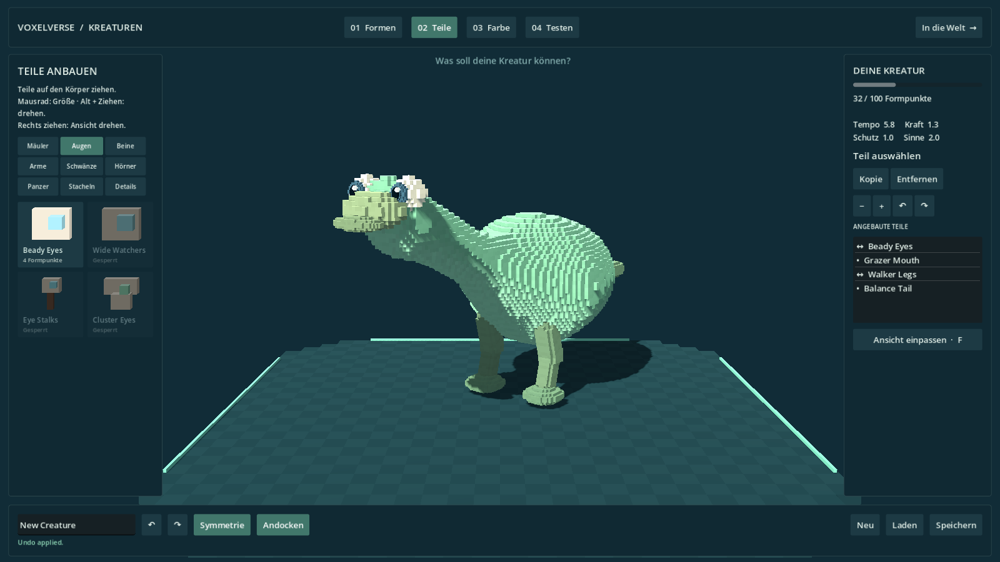

# Kreaturen-Werkstatt in Voxeloptik

Lars hat am 9. September 2026 die gewünschte Darstellung präzisiert: Die direkte Gestaltung soll sich an Spore orientieren, Kreaturen und Werkstatt sollen zur Voxelgrafik von Voxelverse passen. Anschließend wurde das Kreaturenraster weiter verfeinert, damit Körperkonturen, Augen und Anbauteile mehr Details zeigen. Dieser Ausbau folgt auf die erste Kreaturen-Werkstatt in PR #12.

## Darstellung und Bedienung

Körper, Augen, Mäuler, Gliedmaßen, Hörner und Schmuck bestehen aus kleinen Würfeln mit ebenen Flächen. Haut- und Musterfarben werden pro Voxel gesetzt; die Oberfläche hat keine geglätteten Normalen und keine glänzende Kunststoffwirkung. Augen behalten Iris, Pupille und Lichtpunkt. Zwei bewegliche Beinsegmente und ein voxelisiertes Gelenk bleiben an der vorhandenen Knieanimation befestigt.

Körperpunkte, Auswahlrahmen, Teilekarten und die gekachelte Arbeitsfläche sind ebenfalls kantig. Die vier Arbeitsbereiche Formen, Teile, Farbe und Testen sowie die Tastatur- und Mausbedienung bleiben erhalten. Die direkte Formung verändert weiterhin die zugrunde liegende Körperkurve; die Darstellung setzt diese in Würfel um. Symmetrie, Andocken, Farben, Entwurfs-IDs, Speichern und Rückgängig verwenden weiterhin die bestehenden V7-Verträge.

Beim Anbauen werden die tatsächlich sichtbaren Körpervoxel getroffen. Leere Zellen innerhalb der Körpergrenzen akzeptieren kein Teil. Der Treffer wird auf die bestehenden Anatomieanker übertragen, damit Anbauteile beim späteren Formen mitgeführt werden. Die Körperdarstellung gilt gemeinsam für Editor, Spieler und prozedurale Wildtiere.

## Geometrie

`creature_voxel_mesh.gd` erzeugt nur die nach außen sichtbaren Flächen benachbarter Würfel. Ein zusammenhängender Körper benötigt eine Mesh-Oberfläche; bewegliche Teile behalten ihre eigenen kleinen Meshes. Es entsteht kein Szenenknoten pro Würfel. Wiederkehrende Teilgeometrie wird in einem begrenzten Cache wiederverwendet.

Die Körperzellen sind in allen drei Richtungen gleich groß. Der Standardabstand beträgt jetzt **0,035 statt 0,105 Einheiten** mal Körpermaßstab: drei Zellen ersetzen die bisherige Kantenlänge eines Körpervoxels. Bei sehr großen Formen wird das Raster anhand der längsten Ausdehnung auf ungefähr **128 statt 64 Zellen** begrenzt. Deshalb variiert der Detailgewinn bei extremen Entwürfen. Augen, Pupillen, Mäuler, Gelenke und Schmuck verwenden halbierte Zellkanten; ihr Raster bleibt auf ungefähr 48 Zellen entlang der längsten Ausdehnung begrenzt. Extrem dünne Stellen werden weiterhin mindestens durch ein kleines symmetrisches Voxelprofil repräsentiert. Körpergriffe und Arbeitsfläche behalten ihre gut erkennbaren Größen.

Für das feinere Körperraster ermittelt der Aufbau zusammenhängende Voxelreihen und deren sichtbare Ränder. Nur die Randzellen erhalten Hautmuster und durchlaufen die Flächenerzeugung. Die vollständige Belegung bleibt für das Ausblenden innerer Flächen und das präzise Anbauen erhalten. Vertex- und Indexspeicher werden pro Mesh einmal passend reserviert; sechs Flächenvorlagen ersetzen wiederholte Hilfsarrays. Eine Vergleichsprüfung erzeugt denselben Körper zusätzlich mit dem vollständigen Nachbarschaftsverfahren und prüft identische Flächen, Dreiecke und Farben, einschließlich dünner, versetzter und stark verlängerter Formen.

Die gespeicherten Entwürfe enthalten weiterhin die formbare Anatomie und Farben, keine gerenderten Würfel. Vorhandene Entwürfe benötigen keine neue Dateiversion. Der historische Schalter `sculpted_surface` bleibt als interne Kompatibilität erhalten: `true` wählt jetzt die bearbeitbare Voxeloberfläche, `false` den alten Voxel-Scheibenpfad für bestehende Vergleichsprüfungen.

## Prüfung und Grenzen

Die gezielte Werkstattprüfung kontrolliert zusätzlich exponierte Würfelflächen ohne innere Doppelpolygone, kubisches Raster, harte Normalen, konstante Flächenfarben, korrekte Dreiecksrichtung und Treffer auf sichtbaren Zellen einschließlich Lücken. Die vorhandenen Prüfungen für echte GUI-Eingaben, Drag-and-drop, Körperformung, Symmetrie, Speicherung, Undo/Redo und zwei-, vier- und sechsbeinige Bewegung bleiben erhalten.

Die erste Voxelumstellung (`b474fff`, vor der weiteren Verfeinerung) bestand **51/51 Projektprüfungen**, **6/6 gezielte Werkstattprüfungen** und **12/12 Prüfungen je Windows-/Linux-Export**. Ihre vier Werkstattansichten und zwei Wildtier-Referenzen sind als Ausgangsvergleich erhalten. Die vollständigen historischen Ergebnisse stehen in [validation/creature-voxel-style.json](../validation/creature-voxel-style.json). Die Normalenprüfung berücksichtigt die geringe Rundungsabweichung der komprimierten Normalen beim Auslesen aus Godot; schräge oder geglättete Flächen bestehen die Prüfung weiterhin nicht.

Die weitere Verfeinerung ist im Code **`f5c0a61`** geprüft: erneut **51/51 Projektprüfungen**, **6/6 Werkstattprüfungen** und **12/12 Exportprüfungen je Windows/Linux** bestanden. Vier neue Werkstattbilder und zwei neue Wildtierbilder wurden direkt in Godot aufgenommen und visuell geprüft. Die Wildtier-Referenzen benötigen weiterhin 40 beziehungsweise 33 Mesh-Nodes. [Aktuelle Prüfnachweise](../validation/creature-fine-voxels.json), [Windows-Build](https://github.com/MajorDragonfly/voxelverse/actions/runs/34314073414/artifacts/10089443006).

Die vier aktuellen Werkstattaufnahmen verwenden dieselben Körpervorlagen, Farben, Kameras und dieselbe Auflösung von 1600×900 wie der Ausgangsvergleich. Die Aufnahme führt je Vorlage sieben tatsächliche Breitenänderungen über den Editor aus und stellt den Entwurf anschließend per Rückgängig wieder her. Die gemessenen synchronen Änderungszeiten mit bereits gefülltem Teilecache schließen Rendering aus:

| Körpervorlage | Körpervoxel | Körperdreiecke | Median pro Änderung | Höchste der sieben Messungen |
|---|---:|---:|---:|---:|
| Kugelbauch | 72.058 | 27.264 | 56,94 ms | 58,60 ms |
| Langhals | 42.978 | 22.040 | 44,71 ms | 46,58 ms |
| Aufrecht | 26.686 | 16.344 | 31,58 ms | 31,71 ms |
| Kriecher | 33.508 | 19.316 | 42,37 ms | 42,82 ms |

Die Rohwerte liegen in [detail_metrics.json](../art/review/creature_fine_voxels/detail_metrics.json). Das ist eine begrenzte Messung auf dem CI-Rechner, keine zugesicherte Bildrate; insbesondere dichte Körper bleiben beim kontinuierlichen Formen teurer. Der Standardentwurf verwendet weiterhin 21 Geometrie-Nodes.

Die vollständige Umgebungsrenderprüfung ist in **Forward+ und Compatibility** erfolgreich. Die Renderprüfung verwendet einen Software-Renderer und belegt keine Bildrate auf dem Ziel-PC.

Dies ist eine Anpassung der Darstellung und der zugehörigen Trefferberechnung. Die in M3A dokumentierten offenen Punkte zu frei aufgebauten Gelenkketten, Schwimmen/Fliegen, Spielerkollision und Geländeabnahme bleiben bestehen. Der Spieler verwendet weiterhin die bestehende Bewegungskapsel. Ein manueller Spieltest auf Lars’ Rechner und die gemeinsame Integration mit der parallelen Planetenarbeit stehen weiterhin aus.
