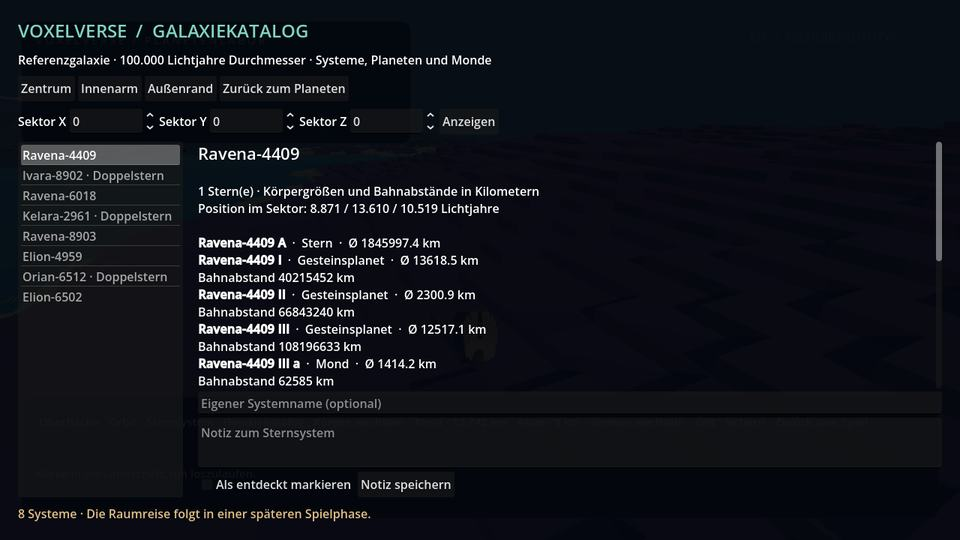
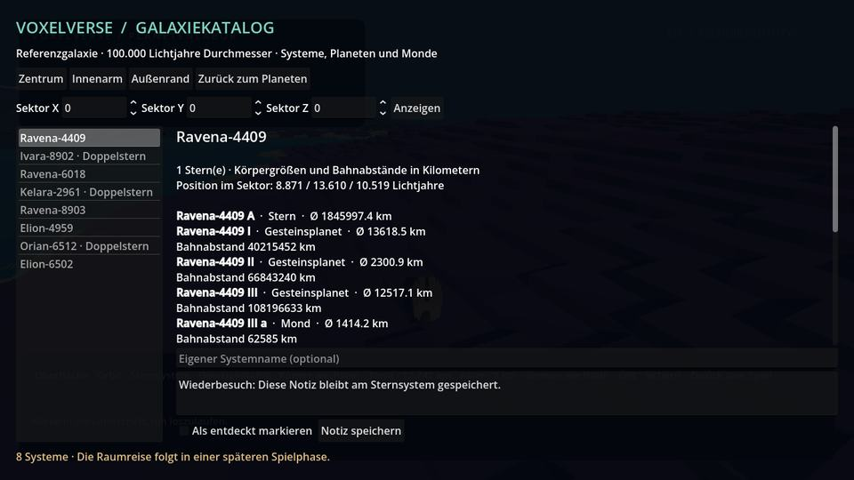
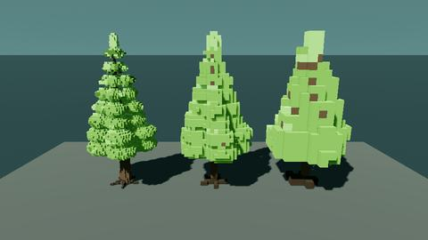
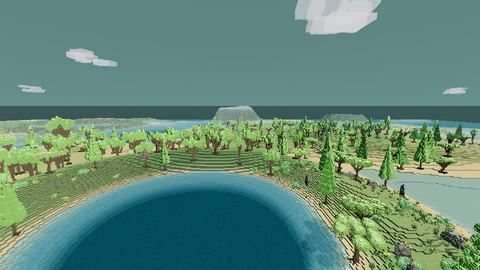
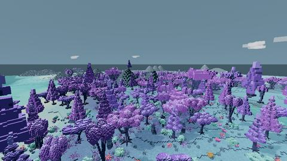

# M1c: Galaxiekatalog und durchgehende Fernlandschaft

9. September 2026 · Branch `agent/galaxy-catalog` · Basis `b870bb6`, PR #15 (`agent/planet-real-scale`). Laufzeitstand `f7040b1dcca6913be76bb9b916f6e07fad8ec7c3`.

**Aktueller Folgeausbau:** [Planetenstreaming und gespeicherte Katalogbesuche](PLANET_STREAMING_AND_VISITS.md). Der folgende Bericht bewahrt den damaligen Prüfstand und dessen Grenzen.

M1c macht die Galaxie als reproduzierbaren Datenkatalog abfragbar. Im Planetenlabor lassen sich Sternsysteme und ihre Körper ansehen sowie eigene Namen, Notizen und Entdeckungsmarkierungen speichern. Gleichzeitig behebt dieser Stand die unterbrochenen Baum-Fernmodelle und verbessert den Übergang vom geladenen Gelände zur Fernlandschaft nach Lars’ Spieltest. Seine positive Rückmeldung zu Bergen und Wolken bleibt in der Roadmap festgehalten.

## Im Testpaket ausprobieren

Das vollständige Paket in einen frischen Ordner entpacken und EXE/PCK zusammenlassen. Im Spiel F4 oder im Esc/F8-Menü **Planetenlabor öffnen** wählen. Dort öffnet **Galaxiekatalog** die neue Ansicht. Die Schaltflächen Zentrum, Innenarm und Außenrand wechseln zwischen weit auseinanderliegenden Sektoren. Die drei Sektorfelder erlauben eigene ganzzahlige Adressen; leere Sektoren sind erlaubt.

Ein Sternsystem auswählen, eigenen Namen oder eine Notiz eingeben und **Notiz speichern** anklicken. Auch eine Entdeckungsmarkierung lässt sich setzen. Beim Sektorwechsel oder Verlassen werden ausstehende Änderungen gespeichert; bei einem Schreibfehler bleibt die Eingabe sichtbar. Esc oder **Zurück zum Planeten** schließt den Katalog. Öffnen und Neustarten stellt die gespeicherten Einträge wieder her. Während der Ansicht bewegt sich die Laborfigur nicht; Esc öffnet kein zweites Menü dahinter.

Die Katalogansicht zeigt Körperdurchmesser und Bahnabstände in Kilometern sowie den lokalen Systemversatz in Lichtjahren. Die bestehenden Terra-/Neris-/Orin-Schaltflächen und der M1b-Referenzbetrieb bleiben verfügbar. Die Katalogansicht lädt noch kein ausgewähltes Sternsystem als begehbare Szene.

## Stabile Adressen und begrenzte Erzeugung

Eine vollständige Körperadresse sieht beispielsweise so aus:

`vx1/u9007199254740993/g0/s0,0,0/t0/b2`

| Teil | Vertrag |
|---|---|
| `vx1` | Version des Adressformats |
| `u…` | Universumsseed als kanonischer, vorzeichenbehafteter 64-Bit-Dezimalstring; JSON darf ihn nicht auf eine Fließkommazahl runden |
| `g…` | Galaxieindex von 0 bis 1.000.000 |
| `sX,Y,Z` | Ganzzahlige Sektorindizes zwischen −1.000.000.000 und +1.000.000.000; Sektorkante 16 Lichtjahre |
| `t…` | Einer von höchstens acht stabilen Systemslots im Sektor; leere Slots werden nicht umnummeriert |
| `b…` | Stabiler Körperslot; Sterne, Planeten und Monde haben eigene IDs und Elternbezüge |

Sektorindizes bleiben bei der Speicherung Strings; lokale Versätze bleiben separate skalare Double-Werte. Bei relativen Positionen werden erst die ganzzahligen Sektoren subtrahiert und dann die lokalen Versätze addiert. Ein unpräziser globaler `Vector3` bestimmt weder Adresse noch Systemidentität. Ungültige, nichtkanonische und unbekannte zukünftige Adressformate werden abgelehnt.

`galaxy_catalog_v1` wählt Felder jeweils aus einem SHA-256-Hash von Version, Adresse und Feldname. Die Besuchsreihenfolge, ein globaler Zufallszahlengenerator und das Verdrängen alter Cacheeinträge beeinflussen das Ergebnis nicht. Rückgaben sind Kopien; ein verändertes Anzeigeobjekt verändert keine späteren Katalogabfragen.

Die Referenzgalaxie hat 100.000 Lichtjahre Durchmesser und eine vereinfachte Scheiben-/Zentrumsdichte. Ein angefragter Sektor untersucht höchstens acht Kandidaten. Außerhalb der Referenzgalaxie bleiben Sektoren leer. Diese Referenz legt keine endgültige Produktionssternzahl, Galaxiedichte oder Reisezeit fest; Änderungen der Verteilungsregeln benötigen eine neue Katalogversion.

Systeme enthalten einen oder zwei Sterne, zwei bis acht Planeten und gegebenenfalls Monde. Gesteinsplaneten besitzen 2.000–22.000 km Durchmesser, Gasriesen 60.000–170.000 km; Monde erhalten kleinere körperabhängige Radien. Radien und Bahnabstände sind Meter, Massen Kilogramm, Umlaufzeiten Sekunden. Gasriesen und Sterne haben keine normale begehbare Oberfläche. Kreisbahnen, vereinfachte Massen-/Radiusbeziehungen und Mondabstandsgrenzen sind Spielmodelle; dynamische Vielkörperstabilität ist kein M1c-Nachweis. Die in Körperprofilen enthaltene Eignung zur Landung ist zunächst ein Datenmerkmal.

| Laufzeitbestand | Feste Obergrenze |
|---|---:|
| Sektoren im LRU-Cache | 16 |
| Sternsysteme im LRU-Cache | 32 |
| Geöffnete Änderungsdatensätze | 16 |
| Terrainmeshes durch Katalogabfragen | 0 |

Die Anzahl insgesamt adressierbarer Systeme vergrößert diese Grenzen nicht. Noch nicht besuchte Systeme benötigen keine vorab erzeugten Voxeloberflächen.

## Änderungen bleiben nach Wiederbesuch erhalten

Das eigene Verzeichnis `user://galaxy_m1c` enthält ein Manifest mit Adress-/Katalogversion, Universumsseed und Galaxie-ID. Pro tatsächlich geändertem System entsteht eine separate Datei mit gehashter System-ID. Reines Blättern schreibt keine Systemdateien. Die Ausgangssysteme werden aus dem Katalog erzeugt; gespeichert werden nur Name, Notiz, Entdeckungsmarkierung, Revision und entsprechende körperbezogene Beobachtungen.

Die Oberfläche bearbeitet Systembeobachtungen. Körperbeobachtungen besitzen bereits denselben geprüften Speichervertrag. Kolonien, Eigentum, Gebäude, Terrainänderungen und Fraktionszustände benötigen später eigene Schemas; dafür wird kein freies, ungeprüftes Datendictionary als fertige Spielfunktion angeboten.

Das Schreiben ersetzt die Datei atomar mit einer gültigen Sicherung. Eine beschädigte Systemdatei kann aus ihrer letzten gültigen Sicherung gelesen werden. Beim nächsten Schreiben bleibt diese Sicherung erhalten. Unbekannte zukünftige Formate und ein fremdes Universum werden nicht überschrieben. Ein veralteter Editorstand wird anhand der Revision beim erneuten Lesen der tatsächlichen Datei erkannt und mit `ERR_BUSY` zurückgewiesen. Das verhindert den geprüften Fall eines nacheinander schreibenden zweiten Bearbeiters; eine allgemeine Sperre für gleichzeitig schreibende Prozesse ist nicht implementiert.

Datensätze sind auf 128 KiB, Namen auf 80 und Notizen auf 1.024 Zeichen begrenzt. Beschädigte Manifeste öffnen keine neue Galaxie über bestehenden Daten. Die Kampagnensicherung und die bisherige M1-Laborsicherung behalten ihre eigenen Formate; deren Migration ist ein späteres Integrationspaket.

## Fernbäume und Übergang ins Inland

Die bisherigen groben Voxelgitter konnten dünne Stämme zwischen ihren Zellmitten vollständig verfehlen. In sieben der zwölf mittleren/fernen Modelle entdeckt die neue unabhängige Zusammenhangsprüfung den ursprünglichen Fehler. Die überarbeiteten Modelle behalten entlang der gezeichneten Stamm-/Astpfade eine über gemeinsame Zellflächen verbundene Voxelmitte; bei fernen Kiefern bleiben auch die tragenden Primäräste bestehen. Die anschließende Bildprüfung zeigte zusätzlich zu kahle Kiefernspitzen: Dünne Nadelpolster werden in Mittel/Fern jetzt konservativ über ihre Überschneidung mit den Voxelzellen erfasst, statt nur über deren Mittelpunkte. Alle sechs Kiefern-LODs behalten dadurch ihre Nadelkappe mindestens bis zur Stammspitze. Alle zwölf GLBs sind aus den Quellen reproduzierbar. Die 15 bisherigen Nahmodelle bleiben beim Source-Roundtrip bytegleich. Alle Baumfamilien reduzieren ihre Dreieckzahl weiterhin von Nah über Mittel nach Fern.

Die native Baumgruppe erhält eine gemeinsame Boundingbox über alle drei LOD-Geometrien. Ein späterer Wechsel zum gröberen Modell kann dadurch keine Baumteile an einer zu kleinen Box abschneiden. Die maximale Sichtweite einer vollständigen Baumgruppe schaltet sie außerdem nicht mehr vorzeitig ab; ihr besitzender Chunk begrenzt ihre Lebensdauer.

Eine zusätzliche Waldvorschau erzeugt auf einem Worker dieselben Baumpositionen und Varianten wie später die spielbaren Chunks. Sie erzeugt keine zusätzlichen Geländemeshes, Physikobjekte oder Einzelbaum-Nodes. Der Suchradius beträgt 224 m um einen nur gelegentlich versetzten Mittelpunkt, höchstens 2.048 Bäume in sechs MultiMesh-Gruppen. Bis zur fertigen neuen Vorschau bleibt die bisherige sichtbar. Es gibt höchstens sechs aktive und sechs vorbereitete Gruppen und höchstens einen budgetierten Upload pro Frame.

Sobald eine native Baumgruppe tatsächlich veröffentlicht ist, übernimmt sie ihre Baumart/-variante im Chunk. Der Shader blendet dabei die komplette Vorschauinstanz aus. Er schneidet keine Löcher in Stamm oder Krone. Die Vorschau passt ihren gesamten Baumfuß an die grobe Geländehöhe an; ihre Boundingbox umfasst die möglichen Höhenversätze. Der lokale Lauf in Seed 15838 erzeugte 341 Bäume in fünf Gruppen über 149 untersuchte Vorschaukacheln; die Positionsparität wird zusätzlich gegen echte Terrain-Chunkdaten geprüft. Der Radius ist begrenzt: weit darüber hinaus folgt noch kein vollständiger Wald bis zum Berghorizont.

Die Fernlandschaft übernimmt eine Kopie des fertig konfigurierten Nahgeländematerials. Schnee, Fels, Schichtung und Farbberechnung stimmen dadurch überein. Zuvor zeichnete ein eigenes vereinfachtes Material den Horizont ohne dieselben Schneeregeln; dadurch konnte eine weiße Nahfläche abrupt an einer gelbgrünen Ferne enden. Feine Texturkontraste laufen mit der Entfernung aus. Die vorhandene Übergangsgeometrie und Chunkabdeckung bleiben zuständig für die Geländekanten. Grasschichten, Kleinstpflanzen, Schatten und echte LOD-Wechsel können weiter sichtbar wechseln; ein vollständig nahtloser Übergang auf jeder Hardware wird noch nicht behauptet.

## Abnahme und verbleibende Arbeit

Die gezielten lokalen Prüfungen für Katalog, Waldpositionsparität, echten Weltlauf, Terrainübergang und Cluster bestehen. Der Katalogtest fragt 96 Sektoren mit insgesamt 595 Systemen ab und prüft deren Körperverträge. Die Sektoren werden nach Cacheverdrängung in umgekehrter Reihenfolge verglichen. Ein vollständiges Referenzsystem und seine gespeicherten Änderungen werden zusätzlich in einem separaten Godot-Prozess wiedererzeugt und verglichen. Sein Seed `9007199254740993` liegt bereits oberhalb des exakten JSON-Double-Ganzzahlbereichs. Weitere Fälle prüfen negative Sektoren, Grenzwerte, Sicherungswiederherstellung, veraltete Bearbeitungen und den Schutz zukünftiger Formate.

Laufzeitstand: `f7040b1dcca6913be76bb9b916f6e07fad8ec7c3`. Die [nativen Windows-/Linux-Exporte](https://github.com/MajorDragonfly/voxelverse/actions/runs/34322863360) bestehen jeweils 13 Prüfungen. Sie starten die echte Release-Anwendung außerhalb des Quellprojekts und prüfen unter anderem F4, Linksklicks im Menü sowie Katalogöffnung, Speichern, Esc und Wiederöffnen.

**Testpakete:** [Windows](https://github.com/MajorDragonfly/voxelverse/actions/runs/34322863360/artifacts/10092640623) · [Linux](https://github.com/MajorDragonfly/voxelverse/actions/runs/34322863360/artifacts/10092618654).

Die [Gesamtprüfung der Endfassung](https://github.com/MajorDragonfly/voxelverse/actions/runs/34322863339) besteht alle 58 Prüfungen. Auch Planetenvielfalt und Modular Assembly sind grün. Die [Bildprüfung](https://github.com/MajorDragonfly/voxelverse/actions/runs/34322863320) besteht **je 94 Aufnahmen in Forward+ und Compatibility**: 64 Welt-/Asset-/Terrainaufnahmen und 30 Wasser-/Planeten-/Katalogaufnahmen je Grafikmodus. Die abschließenden Daten und Dateiprüfsummen stehen in der [Abnahmedatei](../art/review/m1c/acceptance.json). Der erste Prüfstand `95de317` brauchte einen Wiederholungsversuch nach einem HTTP-500-Fehler beim Godot-Download; die Endfassung `f7040b1` besteht den Gesamtlauf im ersten Versuch. Ein Software-Renderer belegt Darstellung und Shaderbetrieb, keine FPS auf dem Ziel-PC.

M1c stellt die technische Kataloggrundlage bereit. Es fehlen die zoomfähige Galaxiekarte, das Laden eines ausgewählten Katalogsystems als reale Szene, interstellare Reisen, Kolonien und die Übernahme von Kampagnenorten. Die M1b-Nachladepausen auf großen Planeten bleiben ebenfalls offen. Die nächsten Arbeiten verbinden diese klaren Grenzen schrittweise; M9 enthält weiterhin die eigentliche Weltraumspielschleife.

## Parallele Projektarbeit

Dieser Branch baut gezielt auf dem Planeten-/Weltraumzweig auf. Parallele Kreaturen-, Sozial-, Skilltree-, Hauptmenü- und Soundbranches wurden nicht integriert. Gemeinsame Berührungspunkte für das spätere Zusammenführen sind insbesondere `ROADMAP.md`, `tools/capture_environment.gd` und die kurze modale Eingabesicherung in `core/display_settings.gd`. Ein gemeinsamer Lauf aller parallelen Arbeitsstände ist damit nicht geprüft.

## Tatsächliche Spielaufnahmen

Die folgenden JPEG-Vorschauen sind unveränderte Ausgaben der Godot-Bildprüfung der Endfassung `f7040b1`. Die vollständigen PNGs liegen im Renderartefakt.

Galaxiekatalog im Zentrum und nach erneutem Öffnen mit gespeicherter Notiz. Compatibility, Renderlauf `34322863320`, Job `102373340907`; der Katalog verwendet Universumsseed `15838`.

Kiefer in Nah-, Mittel- und Fernstufe. Die gröberen Kronen bleiben bewusst einfacher und erhalten jetzt auch ihre Nadelspitzen. Compatibility, derselbe Renderlauf, Job `102373340479`, Seed `15838`.

Erhöhter Blick ins Inland mit fortgesetztem Wald in Seed `15838` und `23757`. Derselbe Job prüft beide Landschaften und ihre Terrainübergänge.

