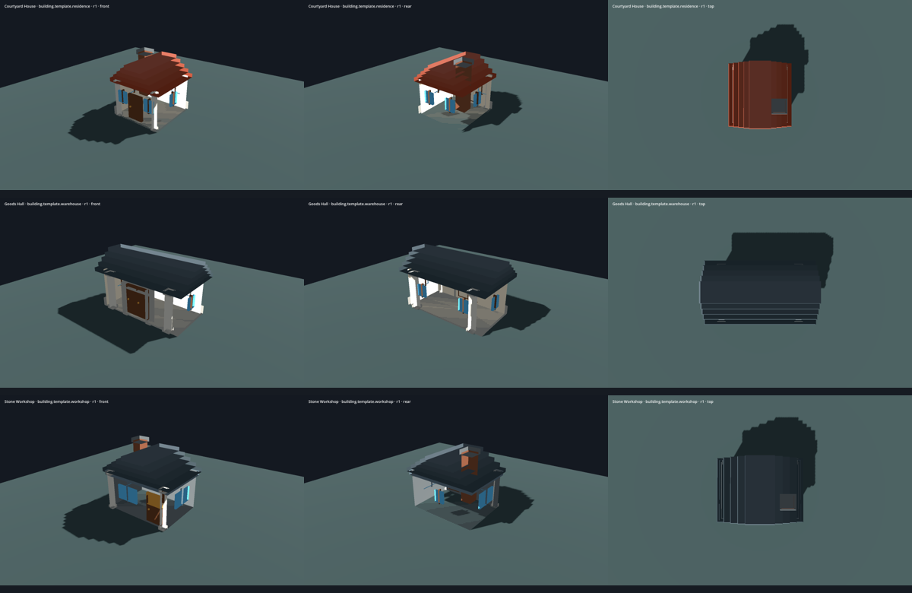

# INT30-25 · Gebäudevorlagen

Fachbasis: `2b1ac023db4074c2ce6b7db8fbab09ab929a8435`,
Tree `5f815f478ceeabefcfc50a6388e3e4b0daa2ac45`.
Fachbranch: `agent/int30-25-building-templates`.
Produkt-/Prüfquellstand: `24a48366e3ef880a5d47313083776e2d226eb35f`,
Tree `9cf3c8a4eb8fc198353267342ab7aa769c0032bf`.
Der folgende Liefercommit ergänzt ausschließlich diese Übergabe und Prüfbelege;
die tatsächlichen Quellen sind zusätzlich in den Renderbelegen per SHA256 erfasst.

Die Zuordnung ist in [#137, aktuelle Runde Chats 1–25](https://github.com/MajorDragonfly/voxelverse/issues/137#issuecomment-5918892397)
bestätigt. BuildingBlueprint, Assembly, Teilebibliothek, DesignRegistry,
Gebäudeeditor und Austauschmodule sind in diesem Branch unverändert.

## Ergebnis

Drei native schema-1-Entwürfe mit stabiler Vorlagen-ID, Design-ID,
Platzierungs-UIDs und Quellrevision 1:

| Vorlage | Datei | Typ | Teile | Kosten | Wohnen | Handel | Industrie | Verteidigung | Ansehen | Energie | Verschmutzung |
|---|---|---|---:|---:|---:|---:|---:|---:|---:|---:|---:|
| `building.template.residence` | [residence.json](../civilization/buildings/templates/designs/residence.json) | residential | 12 | 54 | 15 | 0 | 3 | 6 | 11 | 0 | 2 |
| `building.template.warehouse` | [warehouse.json](../civilization/buildings/templates/designs/warehouse.json) | commercial | 13 | 77 | 18 | 2 | 0 | 14 | 14 | 0 | 0 |
| `building.template.workshop` | [workshop.json](../civilization/buildings/templates/designs/workshop.json) | industrial | 11 | 68 | 2 | 8 | 12 | 5 | 9 | -2 | 4 |

Die Tabelle zeigt ausschließlich aktuelle Katalogsummen. Der Auswahlhelfer liest
die Werte durch `BuildingBlueprint.calculate_stats`; keine duplizierte Balance.
Die Lagerhalle hat keinen Lagerkapazitätswert im heutigen Teilekatalog, und
der Wohnhaus-Schornstein trägt die vorhandenen Industrie-/Verschmutzungswerte
bei. Diese Werte lösen hier keine Wirtschaft oder Produktion aus.

Die Verwendung erzeugt einen eigenen Entwurf: neue Design-/Teil-IDs, Revision 0,
identische Geometrie, Herkunft mit genauer Quell-ID/Revision und ein eindeutiger
Standardname. Explizites Speichern verwendet BuildingBlueprint/DesignStore,
verweigert bestehende Zieldateien/Snapshot-Einträge und erzeugt Revision 1.
Keine Kopie schreibt in eine Vorlagendatei. Auswahl ohne Verwendung verändert
den laufenden Editorentwurf nicht; Verwendung, Bearbeitung und Undo/Redo laufen
über die vorhandenen Editor-/History-Anschlüsse.

## Geprüft

Engine `4.6.3.stable.official.7d41c59c4`, Linux, isolierte Nutzerdaten.

| Prüfung | Ergebnis | Nachweis |
|---|---|---|
| `int30_building_templates_test` | 464 Kontrollen bestanden; 11,071 s | [Log](evidence/int30-building-templates/headless/int30_building_templates_test.log) |
| `modular_assembly_framework_test` | bestanden; 7,417 s | [Log](evidence/int30-building-templates/headless/modular_assembly_framework_test.log) |
| `blueprint_contract_test` | bestanden; 14,480 s | [Log](evidence/int30-building-templates/headless/blueprint_contract_test.log) |
| Editor-/Renderablauf | 479 Kontrollen, 15 PNGs, bestanden | [Ergebnis](evidence/int30-building-templates/render/results.json) |
| Zweiter, frischer Prozess | 10 Kontrollen, alle drei bearbeiteten Entwürfe geladen | [Log](evidence/int30-building-templates/render/fresh-process-reload.log) |

Rohdatenvalidierung vor Kompatibilitätsnormalisierung; deterministisches Laden;
separate Design- und Teilidentitäten; kopierte Positionen, Gradrotationen und
nicht uniforme Skalierungen; unabhängige Katalogsummen; unveränderte Summen bei
Skalierung; Geometriebounds gegen die tatsächlichen gerenderten Katalogboxen;
Bodenkontakt und zusammenhängender Kontaktgraph sämtlicher Platzierungen;
eine bestehende zusammengefasste Meshsurface; Erhalt sämtlicher Originaldateien;
unbekannte Kennungen; verweigerte Überschreibung eines Zukunftsversions-Originals;
Auswählen ohne Übernahme; echter Kopierbutton; Undo/Redo der Vorlagenübernahme;
Maus-/Tasteneingaben für Bewegung, Drehung und Größe; erneutes Editoröffnen;
Sprachwechsel DE/EN; voller Persistenzvergleich und frischer Prozess.

Der unveränderte offizielle Fachrunner prüfte eine separate Arbeitskopie des
Quellstands mit **genau dem beigefügten Registry-Patch**; ausschließlich dieser
zentrale Append war dort schmutzig. Source-Contracts, Ressourcenimport,
Art-Quellen und Quellintegrität bestanden. Der Featurebranch selbst enthält
keine Registry-/Katalogänderung. Damit ist kein grünes Gesamt-CI-Gate des
Featurebranches behauptet; die Registrierung wird durch Chat 1 integriert.

```sh
python3 tools/validate_godot.py --godot GODOT --tests int30_building_templates_test modular_assembly_framework_test blueprint_contract_test --skip-main --output OUTPUT
python3 tools/review_int30_building_templates.py --godot GODOT --output OUTPUT
```

Der Renderlauf nutzt GL Compatibility, Mesa llvmpipe/Software, 1600×1000,
`LIBGL_ALWAYS_SOFTWARE=1`, `LP_NUM_THREADS=2`, Dummy-Audio, Xvfb TCP auf Loopback.
Die Gebäudeansichten haben dieselbe Kamera: FOV 45°, Ziel (0,1.5,0), relative
Positionen (-10,8,-13), (10,8,13), (0,18,0.1); Sonnenrotation (-45,-30,0),
Energie 1,25 und dieselbe Umgebung. Die Editoransichten benutzen dieselbe
frontseitige Kamera und zeigen eigene, anschließend bearbeitete Kopien.

[Vergleich: alle drei Richtungen](evidence/int30-building-templates/render/comparison.png)



Die zwei früheren Captureversuche liefen in die unveränderte 150-s-Grenze,
einer nach der ersten Aufnahme. [Historische Fehlerbelege](evidence/int30-building-templates/failed-attempts/timeouts.json)
bleiben erhalten. Die Fixture gibt nach GPU-Readback einen Prozessframe frei,
bevor sie erneut Editormeshes verändert; der vollständige aktuelle Durchlauf
und Neustart bestehen bei gleicher Grenze. Ein fehlgeschlagener Wiederholungslauf
überschreibt nun den Ergebnisstatus statt ein altes Erfolgsergebnis stehenzulassen.

## Übergabe an Besitzer

- **Chat 14:** [enger Pickeranschluss](evidence/int30-building-templates/integration/chat14-building-builder.patch),
  auf der Fachbasis mit `git apply --unidiff-zero` geprüft; beim verbesserten
  Editor gegebenenfalls den Einhängepunkt neu setzen. Der Adapter verwendet
  vorhandenes `_record`, `_name_edit`, `_refresh_all` und Auswahlzustand.
  Im Fachtest wird dieser Anschluss über eine äquivalente isolierte Fixture
  eingesetzt; die Produktionsdatei bleibt beim Besitzer. Die bestehende
  gespeicherte Entwurfsauswahl kann lange ID-Dateinamen horizontal abschneiden;
  ihre Darstellung bleibt ausdrücklich Aufgabe des Editorbesitzers.
- **Chat 1:** [Registry-Patch](evidence/int30-building-templates/integration/chat1-validation.patch)
  für genau einen Eintrag im Vertrag `blueprints`, [DE/EN-Append](evidence/int30-building-templates/integration/localization.append.json)
  für den vorhandenen Katalog und Generator sowie optionaler Renderjob mit dem
  beigefügten Runner. Keine zweite Übersetzungsquelle im Produkt; nur die Fixture
  lädt diesen Append vorübergehend für die Prüfung.
- **Chat 17:** Gewöhnliche native Gebäudedaten; vorhandene Part-IDs, Design-ID,
  Revision und Herkunft können unverändert durch den Austauschadapter laufen.
  Es wird kein Adapter-/Formatanschluss in fremden Dateien geändert.

Der [konservative Änderungsplan](evidence/int30-building-templates/headless/conservative-plan.txt)
fordert volle Integration (248 Quelltests plus Main/Runtime), unter anderem
wegen des separaten Registry-Append. Der gezielte Fachlauf ersetzt diese
Gesamtprüfung, native Exporte oder Ziel-PC-Abnahme nicht. Diese gemeinsamen
Gates werden auf dem neuen Integrations-Tree durch Chat 1 ausgeführt.

Die Gebäudeteile sind additive Voxel-/Boxgeometrie. Es gibt in diesem Katalog
keine Gebäudesockets, keine ausgeschnittenen Öffnungen und keinen begehbaren
Innenraum; Kontaktprüfungen belegen physische Geometrieanschlüsse. Die Lieferung
fügt keine Bauwirtschaft, Produktionsfunktion, Epochenfreigabe oder Kampagnen-
platzierung hinzu. Originale und bestehende Freigaben bleiben erhalten.

PR gegen `agent/integration-pt19-20260930`; als Fachentwurf zur getrennten
Integration der Besitzeranschlüsse. Kein Auto-Merge oder main-Merge.
