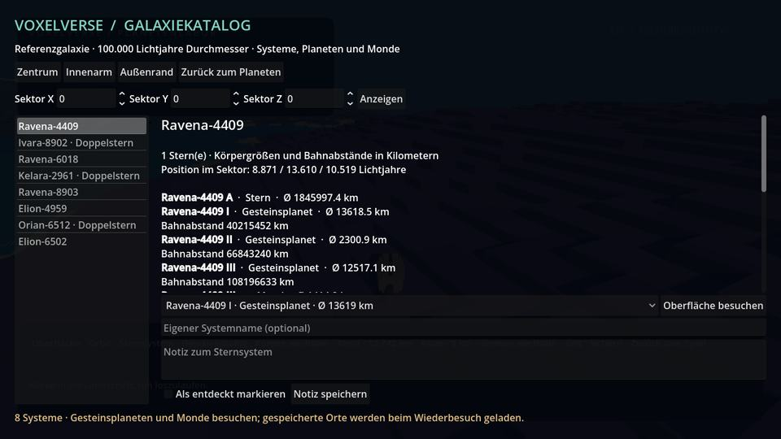
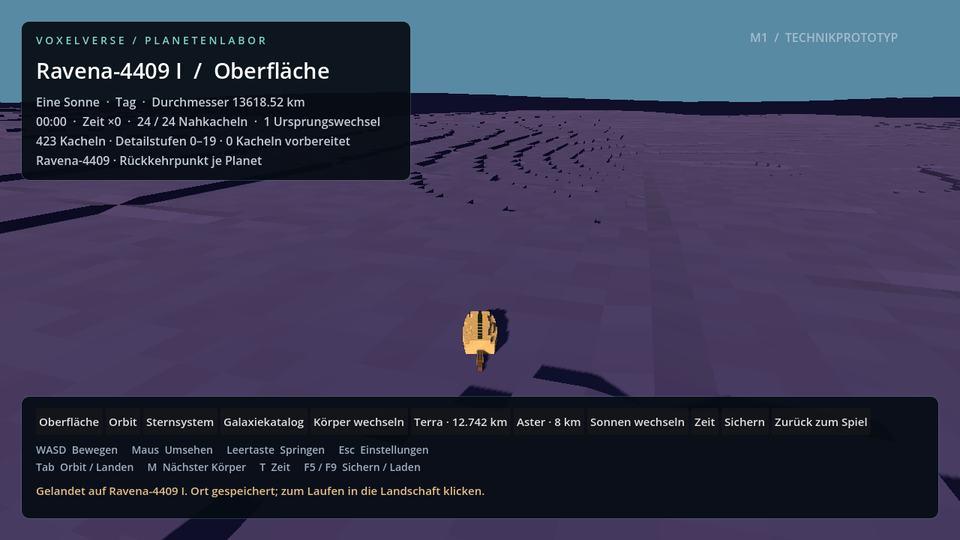
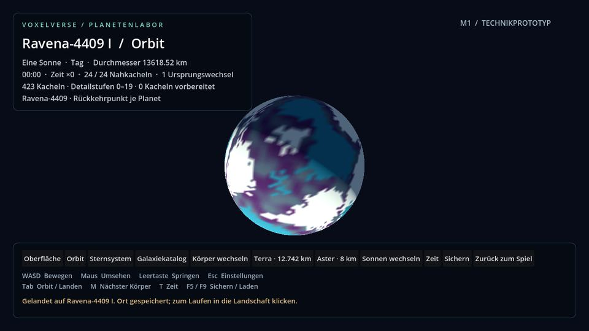
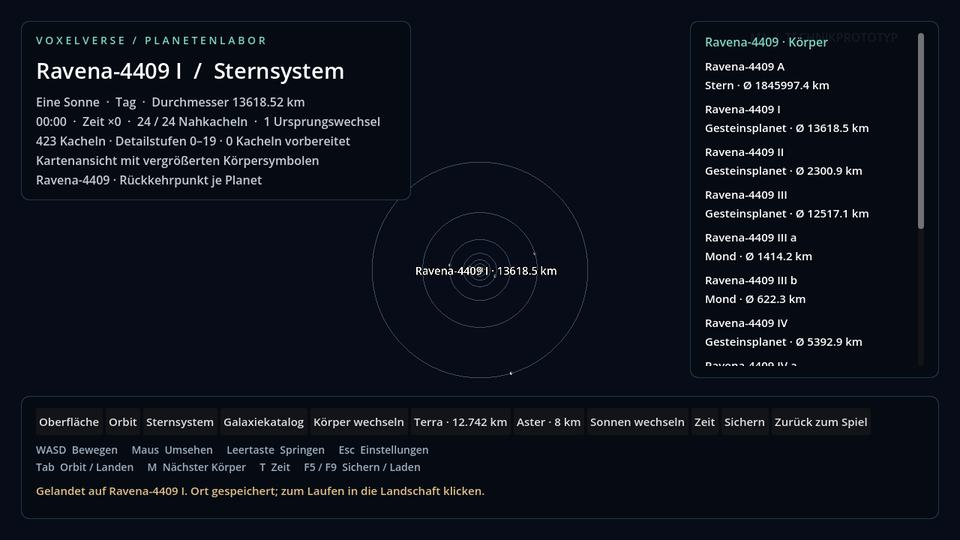
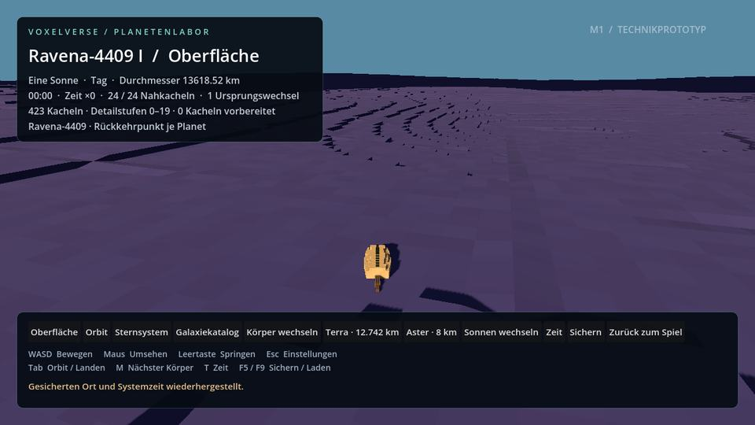
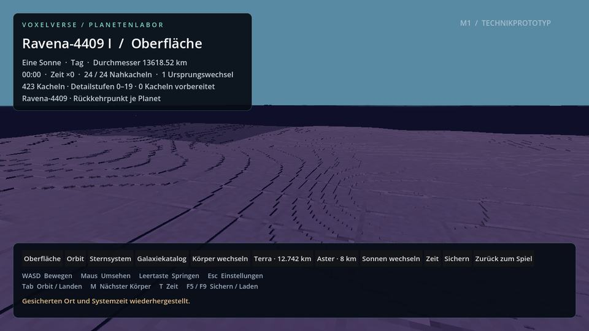

# M1b/M1c: Planetenstreaming und gespeicherte Katalogbesuche

9. September 2026 · Branch `agent/planet-streaming-visits` · Basis `63fb400c4dec5a8a3490f1a5e6e5fa9e283ece72` auf PR #22 (`agent/galaxy-catalog`).

Der Galaxiekatalog ist mit dem Planetenlabor verbunden. Eine Auswahl lädt den tatsächlichen Katalogkörper mit dessen Radius, Seed, Schwerkraft, Rotation und Sternsystem. Gesteinsplaneten und Monde sind in Originalgröße begehbar. Rückkehrpunkte bleiben je Körper erhalten; der zuletzt gespeicherte Planet öffnet nach einem Neustart wieder. Das Nachladen großer Oberflächen verwendet mehrere Worker, einen begrenzten Meshcache und eine zeitliche Überblendung vollständiger Geländeabdeckungen.

## Ausprobieren

Das Testpaket vollständig in einen frischen Ordner entpacken; EXE, PCK und mitgelieferte Bibliotheken zusammenlassen. Im Spiel **F4** drücken oder das Planetenlabor im **Esc/F8-Menü** öffnen.

1. Im Labor **Galaxiekatalog** anklicken und ein Sternsystem wählen.
2. Im Körperfeld einen Gesteinsplaneten oder Mond auswählen; **Oberfläche besuchen** anklicken. Sterne und Gasriesen erscheinen in der Liste, sind aber keine Landeziele.
3. In die Landschaft klicken und mit WASD laufen. Tab wechselt zwischen Oberfläche und Orbit; **Sternsystem** zeigt die zugehörigen Körper und Bahnen.
4. Einen anderen Körper oder ein anderes Sternsystem besuchen. Beim Verlassen wird der bisherige Ort gespeichert. Die erneute Auswahl stellt ihn wieder her.
5. Mit **Sichern/F5** speichern und die Anwendung neu starten. Beim nächsten Öffnen des Labors erscheinen derselbe Planet und derselbe Ort. **F9** lädt den zuletzt gespeicherten Laborzustand.

Der Katalog öffnet sich beim aktuellen Sternsystem. Namen, Notizen und Markierungen bleiben separat bearbeitbar. Ungespeicherte Notizen werden vor der Reise geschrieben; bei einem Schreibfehler bleibt die Eingabe erhalten. Terra, Neris, Orin und die kleinen Referenzkörper bleiben über die bestehenden Laborschaltflächen erreichbar.

Dies ist eine direkte Laborreise über die Auswahl. Start, Flug, Landemanöver, Reisezeit und Treibstoff gehören zum späteren Weltraumspielablauf. Das Verfahren skaliert auf große Adressräume, weil immer nur die angefragten Katalogdaten und ein aktives Sternsystem geladen werden.

## Streaming

Die Auswahl der vollständigen, balancierten Cube-Sphere-Abdeckung läuft auf einem Worker. Anschließend erzeugen höchstens vier Worker voneinander unabhängige Meshbatches. Jeder besitzt eigene Oberflächen-/Rauschobjekte; die Worker erzeugen keine Nodes oder Renderingressourcen. Der Hauptthread übernimmt fertige Ergebnisse erst nach dem Join. Er bereitet höchstens zwei neue Patches pro Frame mit einem weichen Zeitbudget von 4 ms vor. Ein einzelner Upload, die Physikvorbereitung oder die Betriebssystemplanung kann dieses Zeitbudget überschreiten; es ist keine garantierte Framezeit.

Kachelgeometrie verwendet pro Sample dieselbe skalare Double-Richtung für Land und Wasser. Globale Meterpositionen werden weiterhin vor der Konvertierung in lokale Float-Vektoren vom Ursprung abgezogen. Die Nahtprüfungen und die radiale Voxelgeometrie bleiben erhalten.

Die Vorauswahl berücksichtigt Bewegungsrichtung und die zuletzt gemessene Berechnungsdauer, begrenzt auf 32 m Vorlauf. Vor dem Veröffentlichen wird geprüft, ob die neue Abdeckung unter der Figur hinreichend fein ist. Beim Laufen bleibt der Schutz gegen noch nicht vorbereitetes Nahgelände aktiv.

| Bestand | Obergrenze |
|---|---:|
| Aktive Geländekacheln | 768 |
| Aktive Kollisionskörper | 24 |
| Verdrängte Meshvarianten im Cache | 256 |
| Gelände-Meshressourcen inklusive Vorbereitung, Übergang und Cache | 1.536 |
| Worker für Meshbatches | 4 |
| Neue vorbereitete Patches pro Frame | 2 |
| Systemprofile im Katalogcache | 32 |
| Besuchsdatensätze im Speicher | 16 |
| Aktive Orbitmodelle | Körper des aktuellen Systems, höchstens 34 |

Ein Gelände-Patch kann zusätzlich ein Wassermesh besitzen. Cacheeinträge gehören genau zu diesem Oberflächenobjekt und sind über Kachel-ID und Nahtmaske unterschieden. Beim Rückweg werden passende Ressourcen wiederverwendet. Ursprungwechsel verschieben auch vorbereitete, noch unsichtbare Nodes und die auslaufende Abdeckung. Beim Körperwechsel oder Beenden werden alle laufenden Jobs gejoint.

Der sichtbare Wechsel dauert 180 ms. Alte und neue vollständige Abdeckungen verwenden komplementäre, deckende Bildschirmmuster. Das benötigt keine transparente Sortierung. Land und Wasser haben dieselbe Phase; unveränderte Kacheln bleiben voll sichtbar. Vier gemeinsame Materialparameter werden je Frame aktualisiert. Alte Kollisionskörper werden beim Veröffentlichen entfernt; die Bildüberblendung behält keine doppelte Physik. Nach ihrem Ende werden auslaufende Nodes freigegeben. Bei erzwungenen Sprüngen wird ein laufender Übergang sauber beendet.

## Speicherung und echte Systemidentität

Die bisherige Laborsicherung erhält Schema 4 für Katalogbesuche. Es enthält Katalogversion, kanonische System-/Körper-ID, Größenmodus, Terrainrevision, Cube-Sphere-Ort, Blickrichtung und Systemzeit. Die bestehenden Schemas 1–3 bleiben lesbar. Ein Schema-4-Ort wird gegen den reproduzierten Katalogkörper geprüft; ein fremder Körper, eine unlandbare Körperklasse oder eine unbekannte Katalogversion ist kein gültiger Rückkehrpunkt.

Ein separates Besuchsverzeichnis unter `user://galaxy_visits_m1c/<Galaxie-Hash>` verwendet ein zweckgebundenes Manifest und eine Datei pro besuchtem System. Jeder Körper behält seinen eigenen Ort und seine Blickrichtung; jedes System behält seine Zeit. Der Speicher wächst mit tatsächlich besuchten Systemen. Der Notizvertrag unter `user://galaxy_m1c` und die Kampagnensicherung bleiben eigenständig.

Besuchsdateien übernehmen die atomare Ersetzung, Größenbegrenzung, Sicherungswiederherstellung und Revisionsprüfung des vorhandenen Journal-Stores. Ein beschädigter Datensatz kann aus einer gültigen Sicherung wiederhergestellt werden. Zukünftige Terrain-/Katalogformate werden nicht durch eine ältere Sicherung überschrieben. Nacheinander schreibende veraltete Bearbeiter werden zurückgewiesen; dies ist keine allgemeine Prozesssperre für gleichzeitig schreibende Anwendungen.

Zuerst wird der aktuelle Körperort geschrieben, danach der Laborcheckpoint. Beide Dateien sind jeweils atomar; sie bilden keine gemeinsame Transaktion. Scheitert das zweite Schreiben, bleibt der Körperort erhalten und die Oberfläche meldet den fehlgeschlagenen Speichervorgang. Ein unbekanntes vorhandenes Format wird geschützt.

Neue Landeplätze bevorzugen trockenes, begehbares Gelände. Die Sternbeleuchtung verwendet die tatsächliche primäre Katalogsonne. Die Systemdarstellung berechnet ihren Maßstab aus den geladenen Bahnradien. Ein Kartenmaßstab verändert weder Radius noch Oberflächenphysik. Eine scrollbare Körperlegende hält Namen und Durchmesser auch in dicht besetzten Systemen lesbar; direkt an der Karte wird nur der aktuelle Körper beschriftet. Orbitressourcen des vorigen Systems werden entfernt; Gasriesen besitzen eine gebänderte Darstellung und keine begehbare Kruste.

## Prüfung und Messungen

Die lokale Reiseprüfung betätigt den Besuchsknopf mit echten Viewport-Mausereignissen, läuft auf der Katalogoberfläche, wechselt zu einem größeren als erdgroßen Planeten in einem anderen Sektor und kehrt zum ursprünglichen Ort zurück. Ein separater Godot-Prozess prüft anschließend Planet, Position, Blickrichtung und Systemzeit. Zusätzliche Fälle prüfen eine beschädigte Sicherung, fremde Universen, veraltete Bearbeitungen, ungültige Körperkoordinaten und zukünftige Terrain-/Katalogversionen.

Die Streamingprüfung kontrolliert die realen Cachemeshes gegen frisch berechnete Geometrie, einen Ursprungwechsel während der Vorbereitung, die zeitliche Überblendung, das Entfernen alter Physik und das Beenden bei laufendem Worker. Im lokalen Rückweg-Test wurden 339 Meshvarianten wiederverwendet; der Höchstbestand lag bei 560 Gelände-Meshressourcen. Der bisherige 167-m-Flächenkantenlauf auf Terra, Neris und Orin behält die bestehenden Anforderungen an echte Kontakte, Naht-Raycasts, lokale Voxel und Speichergrenzen.

Drei abwechselnde Läufe des alten und neuen Streamingstands im selben Container ergeben folgende Mediane. Die Bewegung führt jeweils über 167 m mit 24 m/s Sollgeschwindigkeit; die Wartezeit zählt Simulationsframes mit angehaltenem Vortrieb. Der Benchmarkstand `5cd690c` und die nachfolgenden Katalogkorrekturen in `3062ad4` besitzen bytegleiche Streamingdateien.

| Körper | Nachladehalt vorher → jetzt | Erstes Gelände vorher → jetzt | Maximum des Veröffentlichens, Median vorher → jetzt |
|---|---:|---:|---:|
| Terra, Ø 12.742 km | 5,33 → 2,97 s | 4,40 → 2,49 s | 25,0 → 12,7 ms |
| Neris, Ø 100 km | 2,10 → 0,43 s | 3,19 → 1,64 s | 28,8 → 11,0 ms |
| Orin, Ø 1.000 km | 1,88 → 0,17 s | 3,40 → 2,34 s | 19,4 → 12,5 ms |

Die aktuellen Wartezeiten streuen über die drei Durchläufe: Terra 2,50–4,35 s, Neris 0,00–1,13 s, Orin 0,12–1,75 s. Der Spitzenbestand steigt durch Übergang und Wiederverwendung; der höchste Wert dieser Vergleichsläufe beträgt 1.182 Gelände-Meshressourcen und liegt unter der Grenze 1.536. Einzelne Vorbereitungsframes erreichen weiter bis zu 51,8 ms. Auch die frühere Fassung besitzt einzelne Ausreißer. Diese Werte belegen eine Verbesserung der gemessenen Nachladehalte und Erstvorbereitung, aber keine durchgehend ruckelfreie Darstellung oder Ziel-PC-FPS. Alle Einzelwerte, Streuungen, CPU-Angaben und Quellprüfsummen stehen im [vollständigen Vergleich](../art/review/planet_visits/paired_benchmark.json).

Laufzeitstand **`3062ad4f9a48c74de481d6b44baf9bfc7a28617b`**, Godot **4.6.3**. Die abschließende [Gesamtprüfung](https://github.com/MajorDragonfly/voxelverse/actions/runs/34328828626) besteht **alle 60 Checks**. Modular Assembly und Planetenvielfalt bestehen ebenfalls. Die [Desktopprüfung](https://github.com/MajorDragonfly/voxelverse/actions/runs/34328828590) besteht **je 13 Checks unter Windows und Linux**. Die echte Release-Anwendung läuft dabei außerhalb des Quellprojekts; der native Eingabetest klickt das Katalogziel an und prüft das Speichern und Laden seiner tatsächlichen Oberfläche.

**Testpakete:** [Windows](https://github.com/MajorDragonfly/voxelverse/actions/runs/34328828590/artifacts/10094977347) · [Linux](https://github.com/MajorDragonfly/voxelverse/actions/runs/34328828590/artifacts/10094936734).

Die [Bildprüfung](https://github.com/MajorDragonfly/voxelverse/actions/runs/34328828662) besteht **je 104 Aufnahmen in Forward+ und Compatibility**: 64 Welt-/Asset-/Wasser-/Terrainaufnahmen sowie 40 Wasser-/Planeten-/Katalog-/Reiseaufnahmen. Die letztgenannte Gruppe enthält die ausdrücklich markierte Negativkontrolle. Darstellungsbetrieb und Shader sind mit Software-Renderern geprüft; der Ziel-PC-Spieltest bleibt offen.

Die feste Prüfkamera behält bei Überblendungsphase 0 dieselben Bildpixel wie die ursprüngliche Abdeckung (mittlerer RGB-Fehler 0 in beiden Grafikmodi). Die Übergänge 0→50 und 50→100 verändern in beiden Modi tatsächlich sichtbares Gelände. Die absichtlich entfernte neue Abdeckung wird deutlich erkannt: RGB-Fehler 0,0510 in Compatibility und 0,0182 in Forward+. Beim ersten Prüfstand war eine nahezu einfarbige Wasserfläche kein brauchbarer LOD-Bildnachweis. Die Endfassung korrigiert den anfänglichen Landeplatz, prüft über trockenem Gelände mit feststehender Anzeige und besitzt die fehlende-Abdeckung-Negativkontrolle.

Workflow-IDs, Einzelchecks, Bildherkunft, Prüfsummen und die Pixelvergleiche stehen in [acceptance.json](../art/review/planet_visits/acceptance.json). Nachfolgende Dokumentationscommits ändern den getesteten Laufzeitcode nicht.

## Grenzen und nächste Arbeit

Schnelle Bewegung kann weiterhin auf feines Nahgelände warten. Die vollständige Vorbereitung und anschließende Veröffentlichung einer neuen Abdeckung bleiben ein Engpass; die maximalen Einzelzeiten hängen außerdem von Hardware und Renderer ab. Worker und Cache ersetzen keine Ziel-PC-Abnahme. Die Bildüberblendung reduziert sprunghafte Detailwechsel; sie ist kein geometrisches Morphing und kann während des kurzen Wechsels als feines Raster sichtbar sein.

Die planetaren Oberflächen sind weiterhin technische Terrainreferenzen. Kugel-Flora/Fauna, ausgearbeitete Kontinente und Biome, Höhlen sowie frei veränderbares Volumenterrain sind eigene Schritte. Es fehlen die zoomfähige Galaxiekarte, Schiffsflug, Kolonien und die Übernahme von Kampagnenorten. Die tatsächliche Weltraumspielschleife bleibt M9.

Dieser Zweig baut auf PR #22 auf. Parallele Kreaturen-, Sozial-, Skilltree-, Hauptmenü-, Sound- und Wildtierarbeiten wurden nicht integriert. Gemeinsame Berührungspunkte sind insbesondere `ROADMAP.md`, die Laborschnittstellen und die Diagnose-/Capture-Werkzeuge.

## Tatsächliche Spielaufnahmen

Die folgenden JPEGs sind unveränderte Preview-Ausgaben der Godot-Bildprüfung von `3062ad4`, Compatibility, Lauf `34328828662`, Job `102392419712`. Der Capture-Startseed ist `12345`; der unabhängige Galaxiekatalog verwendet Universumsseed `15838`. Gezeigt wird `vx1/u15838/g0/s0,0,0/t0/b2`, Ravena-4409 I, Ø 13.618,52 km.

Die zusätzliche erhöhte Prüfkamera zeigt den Detailwechsel bei 50 Prozent. Die vollständigen PNGs der Phasen 0/50/100 und einer ausdrücklich als Negativkontrolle markierten fehlenden Abdeckung liegen im Renderartefakt.

