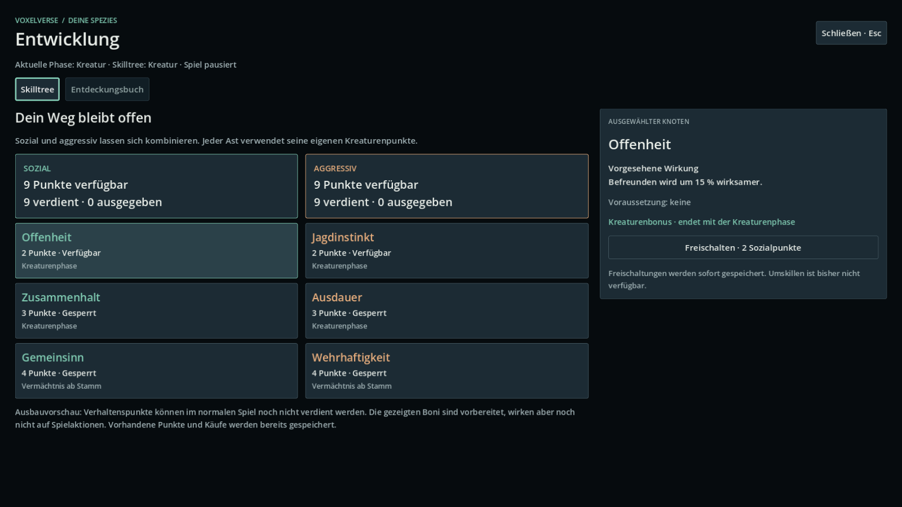
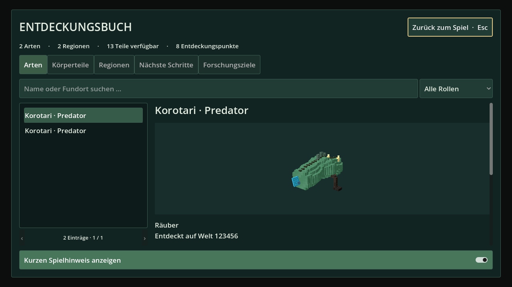

# Spielerfortschritt: Skilltree und Entdeckungsbuch

Stand: 9. September 2026. Geprüfter Code: `7a1d1ba35b7340bdb4e505a0b1b360e93928196f`.
Die nachstehenden ursprünglichen Abnahmen beziehen sich auf den Skilltree-Branch. Das Artenbuch wird inzwischen im eigenen Arbeitsstrang weitergeführt, siehe [aktueller Anschluss](DISCOVERY_JOURNAL_M4A.md).

Ursprünglicher Branch `agent/player-progression-ui`, [Draft PR #14](https://github.com/MajorDragonfly/voxelverse/pull/14), aufbauend auf M2A / PR #10.

## Bedienung

Im normalen Spiel **K** drücken oder nach Freigabe des Mauszeigers auf **Entwicklung · K** klicken. **Esc**, K oder der Schließen-Button kehrt zurück. Im Suchfeld bleibt K ein normaler Buchstabe. Tab und Umschalt+Tab wechseln den Fokus, Enter aktiviert den gewählten Button. Kleinere Fenster verwenden einen scrollbar angeordneten Inhalt.

Der Skilltree zeigt zwei unabhängige Verhaltensäste mit je drei Knoten. Einen Knoten auswählen, Voraussetzung und vorgesehene Wirkung lesen und bei ausreichenden Punkten freischalten. Die Oberfläche verwendet immer die bestehenden Kreaturenpunkte, auch wenn die Kampagne schon eine spätere Phase erreicht hat. Vermächtnisse sind als spätere Wirkung gekennzeichnet; Umskillen ist bisher nicht verfügbar.

Der Button **Entdeckungsbuch · J** wechselt zum gemeinsamen Artenbuch; **J** öffnet es direkt aus dem Spiel. Es enthält beobachtete Arten mit gespeicherter Vorschau, besuchte Regionen und verfügbare/gesperrte Körperteile. Suche und Kategorien filtern vorhandene Daten; pro Seite erscheinen höchstens 100 Einträge. Neue Beobachtungen speichern Anatomie und tatsächliche Teilherkunft. Bei Altdaten bleibt eine nicht bekannte Herkunft ausdrücklich unbekannt.

Die Bilder stammen aus einem isolierten Prüfszenario. Dessen Testpunkte und Beispielart werden nicht in normale Kampagnen übernommen.

## Tatsächlicher Funktionsumfang

Die Oberfläche und der Kaufweg sind implementiert. M2A stellt die Punkte- und Effektregeln bereit; **im normalen Spiel fehlen weiterhin die Produzenten für abgeschlossene Befreunden-/Helfen-/Konfliktereignisse sowie die Anwendung der Boni auf Spielaktionen**. Das Fenster benennt diese Grenze. Eine neue Kampagne beginnt daher weiterhin mit null Verhaltenspunkten. Der Skilltree gewährt selbst keine Punkte. Die additiven Beobachtungsfelder gehören zum separat dokumentierten Artenbuch.

M4 ist damit nicht abgeschlossen. Der nächste fachliche Anschluss sind reale soziale Handlungen und Konfliktabschlüsse, stabile Begegnungsidentitäten und Verbraucher der vorhandenen Effektabfragen. Änderungen an der Tierwelt müssen wegen des parallelen Kreaturenbranches gesondert zusammengeführt werden.

## Verhalten und Architektur

- `ui/progression_hud.gd` installiert den Skilltree und genau eine Instanz von `ui/discovery/discovery_journal.gd`. Der Skilltree erhält diese als direkte Referenz; die alte eingebettete Übersicht ist entfernt. `progression_style.gd` bündelt die Darstellung.
- Käufe laufen ausschließlich über `ProgressionService.purchase_behavior_node()`. Erst nach erfolgreicher gemeinsamer Sicherung erscheint die Erfolgsmeldung. Ein Schreibfehler setzt Punkte und Knoten vollständig zurück und erlaubt einen erneuten Versuch.
- Signale aktualisieren Punktestände, Knoten, Phase und Entdeckungen nach Laden, neuen Entdeckungen oder Zurücksetzen. Die Oberfläche besitzt keine Kopie der Fortschrittsregeln.
- Das Fenster übernimmt die globale Pause nur, wenn kein anderes Menü pausiert. Seine Controls bleiben während der Pause bedienbar. Mausmodus und vorheriger Fokus werden wiederhergestellt. Das Schließen wartet eine Eingabeframe ab, bevor die Spielerabfrage weiterläuft; Szenenabbau löst die eigene Pause ebenfalls.
- Konkurrierende Funktionstasten werden bereits vor den globalen Menühändlern abgefangen. `core/display_settings.gd`, Kreatureneditor und Planetenlaufzeit werden dafür nicht verändert.

## Ursprüngliche PR-14-Prüfungen

| Prüfung | Nachweis und Umfang |
|---|---|
| Reale GUI | [CI](https://github.com/MajorDragonfly/voxelverse/actions/runs/34318068001): Maus- und Tastatureingaben, Kauf, Schreibfehler/Rücknahme, Laden, spätere Vermächtniskäufe, Suchfeld, Seitenwechsel, Pause und Szenenabbau bestanden |
| Darstellung | Sechs echte Godot-Viewport-Aufnahmen in Compatibility; 1600×900, 1280×720 und 800×900, leere/verfügbare/gekaufte Zustände und Entdeckungsbuch. Bilder zusätzlich visuell geprüft |
| Bestehende Verträge | Verhaltensfortschritt, Kampagnengrundlage, Meta-Runtime und die neuen Oberflächentests lokal bestanden; maschinenlesbare Ergebnisse in `validation/player-progression-ui.json` |
| Desktop-Pakete | [Windows und Linux](https://github.com/MajorDragonfly/voxelverse/actions/runs/34318068005) bestanden. Unveränderte Release-Programme werden gestartet; die detaillierten GUI-Verträge werden mit dem Editor gegen die tatsächlich exportierte PCK ausgeführt. Das ist keine vollständige grafische Prüfung der Windows-EXE |
| Gemeinsamer Arbeitsstand | Temporäre Zusammenführung mit Kreaturencommit `e17f40c6e06fc83d8ca7d9dbc710df4273c05d02` und Planetencommit `59b232897baf6d88f87eb7a437c527c31429d7dd`: Import, sechs Vertrags-/Editorprüfungen sowie abschließend Skilltree und Spielmenü bestanden |

Die allgemeinen Godot- und Umgebungsprüfungen sind zusätzlich am Codecommit in GitHub verfügbar. Software-Rendering ersetzt Lars' manuellen Spieltest und keine Leistungsprüfung auf dem Ziel-PC.

## Zusammenführung und Testpaket

Die temporäre Zusammenführung wurde nicht veröffentlicht oder mit `main` gemergt. Laufzeitdateien dieses Pakets ließen sich mit den geprüften Parallelständen ohne Textkonflikte kombinieren. `ROADMAP.md` benötigt die gemeinsame Pflege der Meilensteintexte. In `tools/validate_export.py` gab es einen Konflikt ausschließlich bei der README des Testpakets; dort beide Bedienhinweise erhalten. Die Testlisten konnten automatisch zusammengeführt werden.

[Windows-Testpaket](https://github.com/MajorDragonfly/voxelverse/actions/runs/34318068005/artifacts/10090820652) · [Linux-Testpaket](https://github.com/MajorDragonfly/voxelverse/actions/runs/34318068005/artifacts/10090807814).
Das Paket enthält diesen Fortschrittsbranch auf M2A-Basis, nicht die separat laufenden neuesten Kreaturen- und Planetenfeatures. Vollständig in einen eigenen Ordner entpacken und EXE sowie PCK zusammen lassen. Neuere Spielstände aus anderen Branches können zusätzlichen Migrationsregeln unterliegen; die Branches bleiben deshalb klar getrennt.
