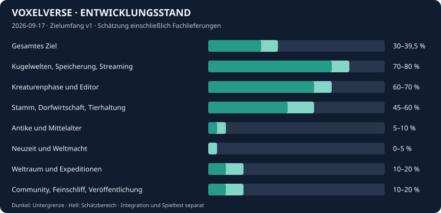

# Voxelverse – Projektübersicht

<!-- Generated by tools/project_dashboard.py; data 6ba0e9942576. -->
Stand der Bewertung: **2026-09-17** · Zielumfang **v1**.

**Rund 35 % entwickelt**, gewichteter Korridor **30–39,5 %**.

Vollständige Singleplayer-Zielvision: Kreatur → Stamm → Antike/Mittelalter → Neuzeit/Weltmacht → Weltraum; gemeinsame Editoren, Community-Vorlagen und ausgereifte Veröffentlichung. Gewichtung und Schätzintervalle sind die anfängliche Planungsbewertung, keine gemessene Fertigquote.

Manuelle Planungsschätzung einschließlich veröffentlichter Fachzweige. Keine Zeitprognose und keine Release-Abnahme. Lokale, unveröffentlichte Arbeit ist nicht erfasst. Teilaufträge innerhalb eines Bereichs erhöhen dessen Gewicht nicht.

## Umfang und Fortschritt

| Bereich | Gewicht | Schätzung | Vorhanden | Nächste Grenze |
|---|---:|---:|---|---|
| [Kugelwelten, Speicherung, Streaming](https://github.com/MajorDragonfly/voxelverse/blob/d57b1ef385728728b132518a1ea05683888dcae0/docs/PROJECT_STATUS.md) | 15 % | 70–80 % | Kugelkampagne, IDs, Archive und begrenzte Simulation | Langzeitbetrieb, Lade-/Darstellungsspitzen und Ziel-PC |
| [Kreaturenphase und Editor](https://github.com/MajorDragonfly/voxelverse/blob/d57b1ef385728728b132518a1ea05683888dcae0/ROADMAP.md) | 15 % | 60–70 % | Scan, Fähigkeiten, Körperbaukasten und Bedürfnis-KI | Weitere Teile, Ökologie, Bewegung und zusammenhängendes Spielgefühl |
| [Stamm, Dorfwirtschaft, Tierhaltung](https://github.com/MajorDragonfly/voxelverse/blob/d57b1ef385728728b132518a1ea05683888dcae0/docs/PROJECT_STATUS.md) | 15 % | 45–60 % | Milch/Eier, Berufe, zwei Orte und Lagertransporte | Größere Gesellschaft, Reiten/Pflügen und lange Wirtschaftsketten |
| [Antike und Mittelalter](https://github.com/MajorDragonfly/voxelverse/blob/d57b1ef385728728b132518a1ea05683888dcae0/ROADMAP.md) | 15 % | 5–10 % | Gemeinsame Bauplan-/Orts-/Epochenverträge | Spielbare Epoche, Handel, Wege und mehrere entwickelte Siedlungen |
| [Neuzeit und Weltmacht](https://github.com/MajorDragonfly/voxelverse/blob/d57b1ef385728728b132518a1ea05683888dcae0/ROADMAP.md) | 10 % | 0–5 % | Gemeinsame technische Grundlagen | Industrie, Energie, Staaten, Diplomatie und globale Spielschleife |
| [Weltraum und Expeditionen](https://github.com/MajorDragonfly/voxelverse/pull/129) | 20 % | 10–20 % | Schiffseditor und integrierter Flottentest mit Instanz-/Hangarverwaltung | Flug, Landung, vollständige Expedition, Forschung und Kolonien |
| [Community, Feinschliff, Veröffentlichung](https://github.com/MajorDragonfly/voxelverse/blob/d57b1ef385728728b132518a1ea05683888dcae0/docs/COMMUNITY_DESIGNS_PLAN.md) | 10 % | 10–20 % | Lokale Vorlagen/Favoriten, DE/EN, Audio, Kapitel-Einführung und Projekt-Dashboard | Online-Austausch, Gesamtbalancing, Langzeit-/Release-Abnahme |

Berechnung: Summe aus Bereichsgewicht × Bereichsschätzung / 100. Der Mittelwert wird auf ganze Prozent gerundet. Neue Wünsche ändern zunächst den versionierten Zielumfang; ARCH-Pakete sind keine zusätzlichen Spielphasen.

## Gemeinsamer Stand und Abnahme

- **Veröffentlichtes main beim Abgleich:** [176d088d3432](https://github.com/MajorDragonfly/voxelverse/commit/176d088d34324de14952bc7506fe9763a22cf4b0) auf `main`. [Übergabe](https://github.com/MajorDragonfly/voxelverse/commit/176d088d34324de14952bc7506fe9763a22cf4b0).
- **Gemeinsamer Spieltest-Kandidat:** [303a4bef27f2](https://github.com/MajorDragonfly/voxelverse/commit/303a4bef27f250f9b91c0ff7725f231f10c5b282) auf `agent/integration-playtest-20260917`. [Übergabe](https://github.com/MajorDragonfly/voxelverse/pull/165).
- **Ziel-PC-Abnahme:** Neuer gemeinsamer Windows-Spieltest noch offen; keine FPS-, Langzeit- oder Spielspaßfreigabe aus automatischen Prüfungen ableiten.
- **Referenzhardware:** Ryzen 7 9800X3D, RTX 4070 Ti, 32 GB / 5200 MT/s. Vorläufiges Ziel: 1920 × 1080 bei 60 FPS. Preset, Treiber und Messwerte gehören in die Abnahme; keine Mindesthardwarefestlegung.
- **CI/Build:** [aktuelle Läufe](https://github.com/MajorDragonfly/voxelverse/actions). Ein grüner Fachlauf ist nur ein Nachweis für dessen Quelle und Prüfumfang.

Der Kandidat ist kein Alias für main. Die festen Referenzen oben sind ein datierter Abgleich. `python3 tools/project_dashboard.py live` erkennt veränderte Köpfe und zeigt offene PRs; es erteilt keine Freigabe.

## Nächste drei Prioritäten

1. Die 18 Lieferungen in #165 mit allen vier vollständigen Pflichtgates prüfen, anschließend den festen Windows-Build auf dem Ziel-PC spielen.
2. Stammesablauf, neue Körperteile, Fernsicht/Wasser und Speichern/Laden gemeinsam abnehmen.
3. Nur lokal gemeldete M4-Navigationsfolgen wiederfinden; offene Wirtschaftslatenz und sichtbare Wasserbewegung als Folgearbeit erhalten.

## Offene Grenzen

- Die vier vollständigen Pflichtgates des aktuellen Prüfkopfs in #165 sind Voraussetzung für die Veröffentlichung; die persönliche Windows-Spieltest-Abnahme bleibt offen.
- M4-WILDLIFE-NAVIGATION und M4-GROUP-NAVIGATION sind nur als lokale Übergaben gemeldet; ihre Commitobjekte sind in den verfügbaren Checkouts und Remote-Branches nicht auffindbar.
- Mittelalter, Neuzeit und Weltraum sind noch keine vollständig spielbaren Epochen.

## Veröffentlichte Folgepakete

Datierter Ausschnitt nach dem Spieltest-Kandidaten; keine Live-Belegung und keine Zählgrundlage für den Prozentwert. Abhängigkeiten beziehen sich auf diese Pakete; gemeinsame Basis ist der Kandidat oben.

| Paket | Status | PR / fester Lieferstand | Zuerst | Offene Abnahme / Grenze |
|---|---|---|---|---|
| WEATHER-02B | Im Kandidaten | [#126](https://github.com/MajorDragonfly/voxelverse/pull/126) / `1ce00d33705b` | — | Native Sichtprüfung; Feuer-/Sandstürme und Wetterfolgen bleiben Folgearbeit. |
| ATMOSPHERE-SETTINGS-DETAIL | Im Kandidaten | [#127](https://github.com/MajorDragonfly/voxelverse/pull/127) / `97adbc1e875c` | — | Visuelle Ziel-PC-Abnahme und eigene Grafik-/FPS-Messung. |
| M4-SOCIAL-PLAY | Im Kandidaten | [#128](https://github.com/MajorDragonfly/voxelverse/pull/128) / `df3aab820a92` | — | Native Beobachtungs-/Hörabnahme und Langzeitbalance. |
| ARCH-30-SHIP-INSTANCES | Im Kandidaten | [#129](https://github.com/MajorDragonfly/voxelverse/pull/129) / `9b7164fea928` | — | Verwaltungs-/Speichertest; Flug, Landung und normale Weltraumepoche folgen. |
| ARCH-26-CONSTRUCTION-CONTROL | Im Kandidaten | [#130](https://github.com/MajorDragonfly/voxelverse/pull/130) / `71fb50582f77` | — | Eine Baustelle pro Ort, zwei Orte und sechs Bewohner; Ziel-PC-Abnahme offen. |
| ARCH-14-ATLAS-SEARCH | Im Kandidaten | [#131](https://github.com/MajorDragonfly/voxelverse/pull/131) / `f51bdd023b1d` | — | Native Bedien-/Sichtprüfung; einzelne synchrone Archivzugriffe bleiben. |
| BP-COMMUNITY-LIBRARY-FAVORITES | Im Kandidaten | [#132](https://github.com/MajorDragonfly/voxelverse/pull/132) / `13ad4f33e9e9` | — | Native Bedienabnahme; Online-Austausch bleibt offen. |
| M4-RECOVERY | Im Kandidaten | [#133](https://github.com/MajorDragonfly/voxelverse/pull/133) / `1aa1609602ce` | — | Native Bild-/Windows-Abnahme und zusammenhängender Spieltest. |
| UI-MENU-REBIND | Im Kandidaten | [#134](https://github.com/MajorDragonfly/voxelverse/pull/134) / `002a63fe88c2` | ARCH-14-ATLAS-SEARCH | Windows-Tastaturlayout und optische Abnahme. |
| UI-SAVE-BROWSER-SEARCH | Im Kandidaten | [#135](https://github.com/MajorDragonfly/voxelverse/pull/135) / `7f2d4ebbf8da` | — | Mit \#138 schrittweise Prüfung; Einzeldateien und Fortsetzen bleiben synchron. |
| M10-GUIDANCE | Im Kandidaten | [#136](https://github.com/MajorDragonfly/voxelverse/pull/136) / `ea14f5a704b4` | — | Zusammenhängender Einstiegsspieltest auf dem Ziel-PC. |
| ARCH-13-SLOT-BROWSE-BUDGET | Im Kandidaten | [#138](https://github.com/MajorDragonfly/voxelverse/pull/138) / `75b2656078ec` | UI-SAVE-BROWSER-SEARCH | Einzelne Datei-/Blobprüfungen bleiben synchron; Ziel-PC-Abnahme offen. |
| PROJECT-DASHBOARD | Im Kandidaten | [#139](https://github.com/MajorDragonfly/voxelverse/pull/139) / `d7b1c04c63e9` | — | Planungsschätzung bleibt manuell begründet; Ziel-PC-Abnahme getrennt. |
| M4-WILDLIFE-HUNTING | Im Kandidaten | [#140](https://github.com/MajorDragonfly/voxelverse/pull/140) / `ad3648312ad8` | M4-SOCIAL-PLAY | Langzeitbalance, viele gleichzeitige Mahlzeiten und native Sichtprüfung offen. |
| ARCH-19-TARGET-PC | Geplant | — | — | Referenzhardware ist in docs/PROJECT\_STATUS.md benannt; Preset und Treiber beim Lauf protokollieren. Automatische oder Headless-Prüfung ersetzt Lars' visuellen Windows-Spieltest nicht. |
| PERF-COLD-START | Im Kandidaten | [#152](https://github.com/MajorDragonfly/voxelverse/pull/152) / `7d1fad4b23e2` | — | Messinstrumentierung; Ziel-PC-Zeiten und FPS erst nach tatsächlicher Messung. |
| RENDER-DISTANT-FOREST | Im Kandidaten | [#150](https://github.com/MajorDragonfly/voxelverse/pull/150) / `c3cf494b3dd5` | — | Ziel-PC-Messung; unveränderte Streaming- und Kollisionsbudgets. |
| WEATHER-03-STORM-PREVIEW | Im Kandidaten | [#151](https://github.com/MajorDragonfly/voxelverse/pull/151) / `e3a4ca14af9a` | — | Diagnosevorschau; kein Wetterschaden, kein gefährliches reguläres Reiseziel. |
| WEATHER-05-FORECAST-UI | Geplant | — | WEATHER-03-STORM-PREVIEW | Nach WEATHER-03-STORM-PREVIEW. HUD-Anschluss mit abgeschlossenem Issue-91-Stand abstimmen. Kein zweiter Wettersimulator und keine Aufgabenübernahme vom Audio-Chat. |
| BP-COMMUNITY-SERVICE-CONTRACT | Im Kandidaten | [#164](https://github.com/MajorDragonfly/voxelverse/pull/164) / `2fe6cd051cce` | — | Kein aktivierter Online-Anbieter, kein öffentlicher Dienst und keine Kontenentscheidung. |
| M6-PLAYTEST-PLAN | Im Kandidaten | [#145](https://github.com/MajorDragonfly/voxelverse/pull/145) / `129ed576c095` | — | Planung; noch offene Wirtschafts- und Navigationsfolgen bleiben eigene Arbeit. |
| UI-PREVIEW-STABLE-ROTATION | Im Kandidaten | [#146](https://github.com/MajorDragonfly/voxelverse/pull/146) / `6da3d8fe72a0` | — | Native Bedienabnahme im gemeinsamen Spieltest. |
| UI-CREATURE-COMPARISON-ALIGNMENT | Im Kandidaten | [#147](https://github.com/MajorDragonfly/voxelverse/pull/147) / `b7c214bf9af6` | — | Optische Abnahme auf dem Ziel-PC. |
| WATER-SHORE-DEPTH | Im Kandidaten | [#148](https://github.com/MajorDragonfly/voxelverse/pull/148) / `e14fa7c02039` | — | Keine sichtbare Strömungssimulation; Wasserbewegung bleibt Folgearbeit. |
| UI-DEVELOPMENT-BOOK-COMPACT | Im Kandidaten | [#149](https://github.com/MajorDragonfly/voxelverse/pull/149) / `d876906bf5b4` | — | Bedien- und Lesbarkeitsabnahme offen. |
| M6-ORDERS-BUILDING-PREVIEW | Im Kandidaten | [#153](https://github.com/MajorDragonfly/voxelverse/pull/153) / `0190ca599746` | — | Gemeinsame Bauprüfung; Wegfindung, Wirtschaftslatenz und Langzeitbalance weiter beobachten. |
| ARCH-24-MOUTHS-ORNAMENTS | Im Kandidaten | [#154](https://github.com/MajorDragonfly/voxelverse/pull/154) / `1db2d4e43963` | — | Revision 1 bleibt erhalten; Altentwürfe nur ausdrücklich im Editor aktualisieren. |
| ARCH-24-WING-FAMILIES | Im Kandidaten | [#155](https://github.com/MajorDragonfly/voxelverse/pull/155) / `724d475bfac1` | — | Körperteile und Animation; keine neue Flugfähigkeit. |
| M6-STOCKPILE-VISUALS | Im Kandidaten | [#156](https://github.com/MajorDragonfly/voxelverse/pull/156) / `e7d6ec7e612f` | M6-ORDERS-BUILDING-PREVIEW | Darstellung tatsächlicher Bestände; keine getrennte Wirtschaftssimulation. |
| M6-TRIBE-CAMERA | Im Kandidaten | [#157](https://github.com/MajorDragonfly/voxelverse/pull/157) / `84841dd9b7b4` | M6-STOCKPILE-VISUALS | 128 m Kamerabereich; keine zusätzliche Kartenerkundung oder versetzte Kollisionssimulation. |
| ARCH-24-FINS-EARS | Im Kandidaten | [#158](https://github.com/MajorDragonfly/voxelverse/pull/158) / `c027c943e813` | ARCH-24-WING-FAMILIES | Gemeinsam mit Geweihen/Kämmen 62 platzierbare Teile und elf Endstücke. |
| M4-LIVING-CREATURES | Im Kandidaten | [#159](https://github.com/MajorDragonfly/voxelverse/pull/159) / `41f805ce1f4d` | — | Balance und zusammenhängende Beobachtung offen; unveröffentlichte Navigationsfolgen fehlen. |
| M10-TRIBE-TUTORIAL | Im Kandidaten | [#160](https://github.com/MajorDragonfly/voxelverse/pull/160) / `7edf64e694dd` | M6-TRIBE-CAMERA | Tatsächlich ausgeführte Befehle und Arbeit zählen; Ziel-PC-Einstiegstest offen. |
| DEV-SKILL-WORKFLOW | Im Kandidaten | [#163](https://github.com/MajorDragonfly/voxelverse/pull/163) / `14dfa43840e9` | — | Bestehende Skill-/Skripthelfer; das Custom-GPT-Team ist gestrichen. |

Bereits im festen Kandidaten enthalten: **30 dokumentierte Eingänge** laut zentraler Statusdatei. Ihre offenen Fach-PRs werden bei identischem Kopf im Live-Bericht als bereits enthalten gekennzeichnet. Nachlieferungen bleiben sichtbar.

## Effizient übergeben

1. [Zentrale Koordination](https://github.com/MajorDragonfly/voxelverse/issues/137) einmal zum Paketstart lesen; genau ein Integrationsbesitzer vergibt die gemeinsame Runde.
2. `python3 tools/work_packet.py start PAKET-ID --owner CHAT` gibt einen kurzen Startauftrag aus dem vorhandenen Paketbrief aus. Ein lokaler Aufruf reserviert nichts.
3. Nur Paketdateien und direkte Verbraucher lesen. Bei Fortsetzung denselben Kontext weiterverwenden.
4. `python3 tools/validate_godot.py --changed-since BASIS_SHA --plan` bestimmt die bestehende Prüfauswahl; bei Tooling/Dokumentation den beschriebenen Fachumfang verwenden.
5. `python3 tools/work_packet.py handoff PAKET-ID --base BASIS_SHA` erzeugt eine Übergabe mit tatsächlichem Branch, Commit, Tree und Diff. Ergebnisse und Grenzen ergänzen.

Statusdaten: [`tools/workflow/project.json`](../tools/workflow/project.json). Nur der Integrationsbesitzer pflegt Bewertung/Referenzen nach einer Lieferung. `python3 tools/project_dashboard.py render` erzeugt Dashboard, README-Block und Grafik. CI prüft die Übereinstimmung und liefert zusätzlich einen Live-Bericht. Fachchats liefern ihre Evidenz im PR; sie pflegen keine Kopien der zentralen Dateien.

Details: [Arbeitsablauf](PARALLEL_WORKFLOW.md) · [Statuspflege](PROJECT_TRACKING.md).
