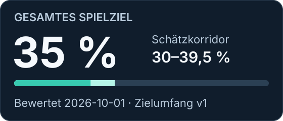

# Voxelverse · Dashboard

<!-- Generated by tools/project_dashboard.py; data 4784005b602c. -->
**[Aufgaben & Zuständigkeiten](https://github.com/MajorDragonfly/voxelverse/issues/137)** · [Offene Änderungen](https://github.com/MajorDragonfly/voxelverse/pulls) · [Prüfungen & Builds](https://github.com/MajorDragonfly/voxelverse/actions)

[Fortschritt](#user-content-umfang-und-fortschritt) · [Pakete](#user-content-veröffentlichte-folgepakete) · [Spieltest](#user-content-gemeinsamer-stand-und-abnahme)

**Planungsstand 2026-10-01** · Rund **35 % entwickelt** · Schätzkorridor **30–39,5 %** · Zielumfang **v1**.

Die Bewertung unten ist kein Live-Status. Aktuelle Aufgaben und Zuweisungen stehen in der [zentralen Runde](https://github.com/MajorDragonfly/voxelverse/issues/137), neue Lieferungen bei den [offenen Änderungen](https://github.com/MajorDragonfly/voxelverse/pulls).

## Umfang und Fortschritt

Bereich aufklappen für vorhandene Funktionen und nächste Ziele.

<strong>Kugelwelten, Speicherung, Streaming</strong> · 70–80 %

**Vorhanden:** Kugelkampagne, IDs, Archive und begrenzte Simulation.

**Nächstes Ziel:** Langzeitbetrieb, Lade-/Darstellungsspitzen und Ziel-PC.

Gewicht am Gesamtziel: **15 %** · [Nachweis](https://github.com/MajorDragonfly/voxelverse/blob/d57b1ef385728728b132518a1ea05683888dcae0/docs/PROJECT_STATUS.md)

<strong>Kreaturenphase und Editor</strong> · 60–70 %

**Vorhanden:** Scan, Fähigkeiten, Körperbaukasten und Bedürfnis-KI.

**Nächstes Ziel:** Weitere Teile, Ökologie, Bewegung und zusammenhängendes Spielgefühl.

Gewicht am Gesamtziel: **15 %** · [Nachweis](https://github.com/MajorDragonfly/voxelverse/blob/d57b1ef385728728b132518a1ea05683888dcae0/ROADMAP.md)

<strong>Stamm, Dorfwirtschaft, Tierhaltung</strong> · 45–60 %

**Vorhanden:** Milch/Eier, Berufe, zwei Orte und Lagertransporte.

**Nächstes Ziel:** Größere Gesellschaft, Reiten/Pflügen und lange Wirtschaftsketten.

Gewicht am Gesamtziel: **15 %** · [Nachweis](https://github.com/MajorDragonfly/voxelverse/blob/d57b1ef385728728b132518a1ea05683888dcae0/docs/PROJECT_STATUS.md)

<strong>Antike und Mittelalter</strong> · 5–10 %

**Vorhanden:** Gemeinsame Bauplan-/Orts-/Epochenverträge.

**Nächstes Ziel:** Spielbare Epoche, Handel, Wege und mehrere entwickelte Siedlungen.

Gewicht am Gesamtziel: **15 %** · [Nachweis](https://github.com/MajorDragonfly/voxelverse/blob/d57b1ef385728728b132518a1ea05683888dcae0/ROADMAP.md)

<strong>Neuzeit und Weltmacht</strong> · 0–5 %

**Vorhanden:** Gemeinsame technische Grundlagen.

**Nächstes Ziel:** Industrie, Energie, Staaten, Diplomatie und globale Spielschleife.

Gewicht am Gesamtziel: **10 %** · [Nachweis](https://github.com/MajorDragonfly/voxelverse/blob/d57b1ef385728728b132518a1ea05683888dcae0/ROADMAP.md)

<strong>Weltraum und Expeditionen</strong> · 10–20 %

**Vorhanden:** Schiffseditor und integrierter Flottentest mit Instanz-/Hangarverwaltung.

**Nächstes Ziel:** Flug, Landung, vollständige Expedition, Forschung und Kolonien.

Gewicht am Gesamtziel: **20 %** · [Nachweis](https://github.com/MajorDragonfly/voxelverse/pull/129)

<strong>Community, Feinschliff, Veröffentlichung</strong> · 10–20 %

**Vorhanden:** Lokale Vorlagen/Favoriten, DE/EN, Audio, Kapitel-Einführung und Projekt-Dashboard.

**Nächstes Ziel:** Online-Austausch, Gesamtbalancing, Langzeit-/Release-Abnahme.

Gewicht am Gesamtziel: **10 %** · [Nachweis](https://github.com/MajorDragonfly/voxelverse/blob/d57b1ef385728728b132518a1ea05683888dcae0/docs/COMMUNITY_DESIGNS_PLAN.md)

Wie wird der Fortschritt berechnet?

Vollständige Singleplayer-Zielvision: Kreatur → Stamm → Antike/Mittelalter → Neuzeit/Weltmacht → Weltraum; gemeinsame Editoren, Community-Vorlagen und ausgereifte Veröffentlichung. Gewichtung und Schätzintervalle sind die anfängliche Planungsbewertung, keine gemessene Fertigquote.

Manuelle Planungsschätzung einschließlich veröffentlichter Fachzweige. Keine Zeitprognose und keine Release-Abnahme. Lokale, unveröffentlichte Arbeit ist nicht erfasst.

Berechnung: Summe aus Bereichsgewicht × Bereichsschätzung / 100. Der Mittelwert wird auf ganze Prozent gerundet. Paket- und PR-Anzahl erhöhen den Wert nicht. Neue Wünsche ändern zunächst den versionierten Zielumfang.

## Veröffentlichte Folgepakete

**Bewertung vom 2026-10-01** · Nach Status gruppiert. Für die aktuelle Belegung [Aufgaben öffnen](https://github.com/MajorDragonfly/voxelverse/issues/137).

<strong>In Arbeit</strong> · 1 Paket

#### Weltkarte: vorhandene Analyse in eine geprüfte Bedienlieferung überführen

**Paket:** INT30-11-WORLD-MAP

**Voraussetzung:** Keine Paketabhängigkeit eingetragen.

**Offene Abnahme:** Branch unverändert auf Fachbasis, kein Produkt-Diff oder PR. Besitzer bleibt Chat 11; kein bereits integrierter Kartenfix.

<strong>Geliefert</strong> · 15 Pakete

#### PT17-02: Überbelichtung begrenzen und Lichtvergleich absichern

**Paket:** INT30-PR-183

[Änderung #183](https://github.com/MajorDragonfly/voxelverse/pull/183) · [Fester Lieferstand 3327beb2b86c](https://github.com/MajorDragonfly/voxelverse/commit/3327beb2b86c30711050a322c4b18a3085bd8a11) · [Prüfnachweis](https://github.com/MajorDragonfly/voxelverse/pull/183)

**Voraussetzung:** Keine Paketabhängigkeit eingetragen.

**Offene Abnahme:** Aktueller Nachlieferungskopf erzeugt beim dreiseitigen Abgleich Konflikte; seine vollständige Enthaltenheit ist damit nicht bewiesen. Frühere Fachumsetzung kann in \#199/\#220 vorhanden sein. Kein ungeprüftes Übernehmen, Überschreiben oder Schließen; gezielter Anschlussabgleich beim zuständigen Fachchat.

#### PT17-03: Kachelbeleuchtung und Waldübergänge im Kugelmodus korrigieren

**Paket:** INT30-PR-184

[Änderung #184](https://github.com/MajorDragonfly/voxelverse/pull/184) · [Fester Lieferstand 0903215ddbd5](https://github.com/MajorDragonfly/voxelverse/commit/0903215ddbd5f605a65894bcaa0b42d26884fc77) · [Prüfnachweis](https://github.com/MajorDragonfly/voxelverse/pull/184)

**Voraussetzung:** Keine Paketabhängigkeit eingetragen.

**Offene Abnahme:** Aktueller Nachlieferungskopf erzeugt beim dreiseitigen Abgleich Konflikte; seine vollständige Enthaltenheit ist damit nicht bewiesen. Frühere Fachumsetzung kann in \#199/\#220 vorhanden sein. Kein ungeprüftes Übernehmen, Überschreiben oder Schließen; gezielter Anschlussabgleich beim zuständigen Fachchat.

#### PT17-15: Audioeinstellungen, Hörproben und skalierbare Bedienung

**Paket:** INT30-PR-185

[Änderung #185](https://github.com/MajorDragonfly/voxelverse/pull/185) · [Fester Lieferstand e2cdc45656ac](https://github.com/MajorDragonfly/voxelverse/commit/e2cdc45656acebdeec43498aee94721d1b2c5dfb) · [Prüfnachweis](https://github.com/MajorDragonfly/voxelverse/pull/185)

**Voraussetzung:** Keine Paketabhängigkeit eingetragen.

**Offene Abnahme:** Aktueller Nachlieferungskopf erzeugt beim dreiseitigen Abgleich Konflikte; seine vollständige Enthaltenheit ist damit nicht bewiesen. Frühere Fachumsetzung kann in \#199/\#220 vorhanden sein. Kein ungeprüftes Übernehmen, Überschreiben oder Schließen; gezielter Anschlussabgleich beim zuständigen Fachchat.

#### PT17-14: Esc-Menü ordnen und Grafik/Audio direkt zugänglich machen

**Paket:** INT30-PR-186

[Änderung #186](https://github.com/MajorDragonfly/voxelverse/pull/186) · [Fester Lieferstand 61473315b626](https://github.com/MajorDragonfly/voxelverse/commit/61473315b626bb877452e04b533fd9852d2b1f75) · [Prüfnachweis](https://github.com/MajorDragonfly/voxelverse/pull/186)

**Voraussetzung:** Keine Paketabhängigkeit eingetragen.

**Offene Abnahme:** Aktueller Nachlieferungskopf erzeugt beim dreiseitigen Abgleich Konflikte; seine vollständige Enthaltenheit ist damit nicht bewiesen. Frühere Fachumsetzung kann in \#199/\#220 vorhanden sein. Kein ungeprüftes Übernehmen, Überschreiben oder Schließen; gezielter Anschlussabgleich beim zuständigen Fachchat.

#### PT17-12: Kreaturen- und Stammes-HUD verschlanken

**Paket:** INT30-PR-188

[Änderung #188](https://github.com/MajorDragonfly/voxelverse/pull/188) · [Fester Lieferstand ea1a77b8cbac](https://github.com/MajorDragonfly/voxelverse/commit/ea1a77b8cbac0c94fddf6e3e88e8387e92c465e6) · [Prüfnachweis](https://github.com/MajorDragonfly/voxelverse/pull/188)

**Voraussetzung:** Keine Paketabhängigkeit eingetragen.

**Offene Abnahme:** Aktueller Nachlieferungskopf erzeugt beim dreiseitigen Abgleich Konflikte; seine vollständige Enthaltenheit ist damit nicht bewiesen. Frühere Fachumsetzung kann in \#199/\#220 vorhanden sein. Kein ungeprüftes Übernehmen, Überschreiben oder Schließen; gezielter Anschlussabgleich beim zuständigen Fachchat.

#### PT17-13: schnellere Stammeskamera und Blicksteuerung auf der Minimap

**Paket:** INT30-PR-189

[Änderung #189](https://github.com/MajorDragonfly/voxelverse/pull/189) · [Fester Lieferstand ed68295fce16](https://github.com/MajorDragonfly/voxelverse/commit/ed68295fce162e2495920edd61afcf38717bf5e0) · [Prüfnachweis](https://github.com/MajorDragonfly/voxelverse/pull/189)

**Voraussetzung:** Keine Paketabhängigkeit eingetragen.

**Offene Abnahme:** Aktueller Nachlieferungskopf erzeugt beim dreiseitigen Abgleich Konflikte; seine vollständige Enthaltenheit ist damit nicht bewiesen. Frühere Fachumsetzung kann in \#199/\#220 vorhanden sein. Kein ungeprüftes Übernehmen, Überschreiben oder Schließen; gezielter Anschlussabgleich beim zuständigen Fachchat.

#### PT17-08: Kurze Zustandszeichen und gezielter Kreaturenscan

**Paket:** INT30-PR-190

[Änderung #190](https://github.com/MajorDragonfly/voxelverse/pull/190) · [Fester Lieferstand 8c877b21e3c5](https://github.com/MajorDragonfly/voxelverse/commit/8c877b21e3c58f92f2392471a1a6b92153559aed) · [Prüfnachweis](https://github.com/MajorDragonfly/voxelverse/pull/190)

**Voraussetzung:** Keine Paketabhängigkeit eingetragen.

**Offene Abnahme:** Aktueller Nachlieferungskopf erzeugt beim dreiseitigen Abgleich Konflikte; seine vollständige Enthaltenheit ist damit nicht bewiesen. Frühere Fachumsetzung kann in \#199/\#220 vorhanden sein. Kein ungeprüftes Übernehmen, Überschreiben oder Schließen; gezielter Anschlussabgleich beim zuständigen Fachchat.

#### PT17-07: Nester erst nach gezieltem Scan enthüllen

**Paket:** INT30-PR-192

[Änderung #192](https://github.com/MajorDragonfly/voxelverse/pull/192) · [Fester Lieferstand 1d2d4969ff3e](https://github.com/MajorDragonfly/voxelverse/commit/1d2d4969ff3e3145c02437836b6189a009560029) · [Prüfnachweis](https://github.com/MajorDragonfly/voxelverse/pull/192)

**Voraussetzung:** Keine Paketabhängigkeit eingetragen.

**Offene Abnahme:** Aktueller Nachlieferungskopf erzeugt beim dreiseitigen Abgleich Konflikte; seine vollständige Enthaltenheit ist damit nicht bewiesen. Frühere Fachumsetzung kann in \#199/\#220 vorhanden sein. Kein ungeprüftes Übernehmen, Überschreiben oder Schließen; gezielter Anschlussabgleich beim zuständigen Fachchat.

#### PT17-10: Kreaturen durch Körperreaktionen beleben

**Paket:** INT30-PR-194

[Änderung #194](https://github.com/MajorDragonfly/voxelverse/pull/194) · [Fester Lieferstand 9c6ef686543c](https://github.com/MajorDragonfly/voxelverse/commit/9c6ef686543ce6150311dd51a6bdab0c39fb83cd) · [Prüfnachweis](https://github.com/MajorDragonfly/voxelverse/pull/194)

**Voraussetzung:** Keine Paketabhängigkeit eingetragen.

**Offene Abnahme:** Aktueller Nachlieferungskopf erzeugt beim dreiseitigen Abgleich Konflikte; seine vollständige Enthaltenheit ist damit nicht bewiesen. Frühere Fachumsetzung kann in \#199/\#220 vorhanden sein. Kein ungeprüftes Übernehmen, Überschreiben oder Schließen; gezielter Anschlussabgleich beim zuständigen Fachchat.

#### \[WEATHER-05\] Lokale Wetterprognose und klare Sturmvorschau

**Paket:** INT30-PR-195

[Änderung #195](https://github.com/MajorDragonfly/voxelverse/pull/195) · [Fester Lieferstand 3eb3084bb1b3](https://github.com/MajorDragonfly/voxelverse/commit/3eb3084bb1b3040c04c534160e2d34291f51a324) · [Prüfnachweis](https://github.com/MajorDragonfly/voxelverse/pull/195)

**Voraussetzung:** Keine Paketabhängigkeit eingetragen.

**Offene Abnahme:** Aktueller Nachlieferungskopf erzeugt beim dreiseitigen Abgleich Konflikte; seine vollständige Enthaltenheit ist damit nicht bewiesen. Frühere Fachumsetzung kann in \#199/\#220 vorhanden sein. Kein ungeprüftes Übernehmen, Überschreiben oder Schließen; gezielter Anschlussabgleich beim zuständigen Fachchat.

#### \[PT18-05\] Ausgewählten Bewohner mit echten Zuständen anzeigen

**Paket:** INT30-PR-213

[Änderung #213](https://github.com/MajorDragonfly/voxelverse/pull/213) · [Fester Lieferstand 0a4e8a5efe6b](https://github.com/MajorDragonfly/voxelverse/commit/0a4e8a5efe6b4cfdc6b814dce4545e84b879cc3c) · [Prüfnachweis](https://github.com/MajorDragonfly/voxelverse/pull/213)

**Voraussetzung:** Keine Paketabhängigkeit eingetragen.

**Offene Abnahme:** Aktueller Nachlieferungskopf erzeugt beim dreiseitigen Abgleich Konflikte; seine vollständige Enthaltenheit ist damit nicht bewiesen. Frühere Fachumsetzung kann in \#199/\#220 vorhanden sein. Kein ungeprüftes Übernehmen, Überschreiben oder Schließen; gezielter Anschlussabgleich beim zuständigen Fachchat.

#### PT18-07: Bauplatz anklicken und Materialstand öffnen

**Paket:** INT30-PR-214

[Änderung #214](https://github.com/MajorDragonfly/voxelverse/pull/214) · [Fester Lieferstand 582be07e4d3c](https://github.com/MajorDragonfly/voxelverse/commit/582be07e4d3cd8bd93d24e096c6caaa7b1dff710) · [Prüfnachweis](https://github.com/MajorDragonfly/voxelverse/pull/214)

**Voraussetzung:** Keine Paketabhängigkeit eingetragen.

**Offene Abnahme:** Aktueller Nachlieferungskopf erzeugt beim dreiseitigen Abgleich Konflikte; seine vollständige Enthaltenheit ist damit nicht bewiesen. Frühere Fachumsetzung kann in \#199/\#220 vorhanden sein. Kein ungeprüftes Übernehmen, Überschreiben oder Schließen; gezielter Anschlussabgleich beim zuständigen Fachchat.

#### PT18-09: Obere Dorfressourcen und Spieltempo

**Paket:** INT30-PR-215

[Änderung #215](https://github.com/MajorDragonfly/voxelverse/pull/215) · [Fester Lieferstand 1e4f95bb6d50](https://github.com/MajorDragonfly/voxelverse/commit/1e4f95bb6d503030d61fad335d5200bfc9163e3e) · [Prüfnachweis](https://github.com/MajorDragonfly/voxelverse/pull/215)

**Voraussetzung:** Keine Paketabhängigkeit eingetragen.

**Offene Abnahme:** Aktueller Nachlieferungskopf erzeugt beim dreiseitigen Abgleich Konflikte; seine vollständige Enthaltenheit ist damit nicht bewiesen. Frühere Fachumsetzung kann in \#199/\#220 vorhanden sein. Kein ungeprüftes Übernehmen, Überschreiben oder Schließen; gezielter Anschlussabgleich beim zuständigen Fachchat.

#### PT18-PERF: Population früher anzeigen und Frame-Spitzen entzerren

**Paket:** INT30-PR-216

[Änderung #216](https://github.com/MajorDragonfly/voxelverse/pull/216) · [Fester Lieferstand e724bbe59b0d](https://github.com/MajorDragonfly/voxelverse/commit/e724bbe59b0d58b6f65126a64acb124695011eaf) · [Prüfnachweis](https://github.com/MajorDragonfly/voxelverse/pull/216)

**Voraussetzung:** Keine Paketabhängigkeit eingetragen.

**Offene Abnahme:** Aktueller Nachlieferungskopf erzeugt beim dreiseitigen Abgleich Konflikte; seine vollständige Enthaltenheit ist damit nicht bewiesen. Frühere Fachumsetzung kann in \#199/\#220 vorhanden sein. Kein ungeprüftes Übernehmen, Überschreiben oder Schließen; gezielter Anschlussabgleich beim zuständigen Fachchat.

#### PT18-02: Holz, Laub und Stein differenzierter darstellen

**Paket:** INT30-PR-217

[Änderung #217](https://github.com/MajorDragonfly/voxelverse/pull/217) · [Fester Lieferstand 65b199511949](https://github.com/MajorDragonfly/voxelverse/commit/65b1995119492a7240b65ad7f79ec0e4c6a18df4) · [Prüfnachweis](https://github.com/MajorDragonfly/voxelverse/pull/217)

**Voraussetzung:** Keine Paketabhängigkeit eingetragen.

**Offene Abnahme:** Aktueller Nachlieferungskopf erzeugt beim dreiseitigen Abgleich Konflikte; seine vollständige Enthaltenheit ist damit nicht bewiesen. Frühere Fachumsetzung kann in \#199/\#220 vorhanden sein. Kein ungeprüftes Übernehmen, Überschreiben oder Schließen; gezielter Anschlussabgleich beim zuständigen Fachchat.

<strong>Geplant</strong> · 2 Pakete

#### Gemeinsamen Kandidaten auf Zielhardware messen

**Paket:** ARCH-19-TARGET-PC

**Voraussetzung:** Keine Paketabhängigkeit eingetragen.

**Offene Abnahme:** Referenzhardware ist in docs/PROJECT\_STATUS.md benannt; Preset und Treiber beim Lauf protokollieren. Automatische oder Headless-Prüfung ersetzt Lars' visuellen Windows-Spieltest nicht.

#### Wetterprognose und Vorwarnung verständlich anzeigen

**Paket:** WEATHER-05-FORECAST-UI

**Voraussetzung:** WEATHER-03-STORM-PREVIEW.

**Offene Abnahme:** Nach WEATHER-03-STORM-PREVIEW. HUD-Anschluss mit abgeschlossenem Issue-91-Stand abstimmen. Kein zweiter Wettersimulator und keine Aufgabenübernahme vom Audio-Chat.

<strong>Im Kandidaten</strong> · 70 Pakete

#### WEATHER-02B: Planetenklimata speichern und die Heimat dauerhaft schützen

**Paket:** WEATHER-02B

[Änderung #126](https://github.com/MajorDragonfly/voxelverse/pull/126) · [Fester Lieferstand 1ce00d33705b](https://github.com/MajorDragonfly/voxelverse/commit/1ce00d33705b83643ec90ef26385a912541cd273) · [Prüfnachweis](https://github.com/MajorDragonfly/voxelverse/pull/126)

**Voraussetzung:** Keine Paketabhängigkeit eingetragen.

**Offene Abnahme:** Native Sichtprüfung; Feuer-/Sandstürme und Wetterfolgen bleiben Folgearbeit.

[Integration 1111567a0622](https://github.com/MajorDragonfly/voxelverse/commit/1111567a06223ff8692fb5a71596d488e4f8c183)

#### ATMOSPHERE-SETTINGS-DETAIL: 18 Grafikregler mit eigenen gespeicherten Werten

**Paket:** ATMOSPHERE-SETTINGS-DETAIL

[Änderung #127](https://github.com/MajorDragonfly/voxelverse/pull/127) · [Fester Lieferstand 97adbc1e875c](https://github.com/MajorDragonfly/voxelverse/commit/97adbc1e875ca4dbd3c8b4bcfd03d9383e897319) · [Prüfnachweis](https://github.com/MajorDragonfly/voxelverse/pull/127)

**Voraussetzung:** Keine Paketabhängigkeit eingetragen.

**Offene Abnahme:** Visuelle Ziel-PC-Abnahme und eigene Grafik-/FPS-Messung.

[Integration 1111567a0622](https://github.com/MajorDragonfly/voxelverse/commit/1111567a06223ff8692fb5a71596d488e4f8c183)

#### M4-SOCIAL-PLAY: gegenseitiges Spielverhalten der Wildtiere

**Paket:** M4-SOCIAL-PLAY

[Änderung #128](https://github.com/MajorDragonfly/voxelverse/pull/128) · [Fester Lieferstand df3aab820a92](https://github.com/MajorDragonfly/voxelverse/commit/df3aab820a92fa0f62ae52ccf557a6c70e6f1851) · [Prüfnachweis](https://github.com/MajorDragonfly/voxelverse/pull/128)

**Voraussetzung:** Keine Paketabhängigkeit eingetragen.

**Offene Abnahme:** Native Beobachtungs-/Hörabnahme und Langzeitbalance.

[Integration 1111567a0622](https://github.com/MajorDragonfly/voxelverse/commit/1111567a06223ff8692fb5a71596d488e4f8c183)

#### ARCH-30: Schiffsinstanzen, Hangarverwaltung und gespeicherter Flottentest

**Paket:** ARCH-30-SHIP-INSTANCES

[Änderung #129](https://github.com/MajorDragonfly/voxelverse/pull/129) · [Fester Lieferstand 9b7164fea928](https://github.com/MajorDragonfly/voxelverse/commit/9b7164fea92832fcf152b448a0f4eef5e15f40e8) · [Prüfnachweis](https://github.com/MajorDragonfly/voxelverse/pull/129)

**Voraussetzung:** Keine Paketabhängigkeit eingetragen.

**Offene Abnahme:** Verwaltungs-/Speichertest; Flug, Landung und normale Weltraumepoche folgen.

[Integration 1111567a0622](https://github.com/MajorDragonfly/voxelverse/commit/1111567a06223ff8692fb5a71596d488e4f8c183)

#### ARCH-26: Baustellen pausieren, abbrechen und Material sicher zurückführen

**Paket:** ARCH-26-CONSTRUCTION-CONTROL

[Änderung #130](https://github.com/MajorDragonfly/voxelverse/pull/130) · [Fester Lieferstand 71fb50582f77](https://github.com/MajorDragonfly/voxelverse/commit/71fb50582f7783484fb34966b788a863d6d4d5c0) · [Prüfnachweis](https://github.com/MajorDragonfly/voxelverse/pull/130)

**Voraussetzung:** Keine Paketabhängigkeit eingetragen.

**Offene Abnahme:** Eine Baustelle pro Ort, zwei Orte und sechs Bewohner; Ziel-PC-Abnahme offen.

[Integration 1111567a0622](https://github.com/MajorDragonfly/voxelverse/commit/1111567a06223ff8692fb5a71596d488e4f8c183)

#### ARCH-14: Bekannte Orte im Atlas suchen und gefiltert durchblättern

**Paket:** ARCH-14-ATLAS-SEARCH

[Änderung #131](https://github.com/MajorDragonfly/voxelverse/pull/131) · [Fester Lieferstand f51bdd023b1d](https://github.com/MajorDragonfly/voxelverse/commit/f51bdd023b1d239d392fa6d9bc38340d49ab406b) · [Prüfnachweis](https://github.com/MajorDragonfly/voxelverse/pull/131)

**Voraussetzung:** Keine Paketabhängigkeit eingetragen.

**Offene Abnahme:** Native Bedien-/Sichtprüfung; einzelne synchrone Archivzugriffe bleiben.

[Integration 1111567a0622](https://github.com/MajorDragonfly/voxelverse/commit/1111567a06223ff8692fb5a71596d488e4f8c183)

#### BP-COMMUNITY: Favoriten und erweiterte Suche für Kreaturenvorlagen

**Paket:** BP-COMMUNITY-LIBRARY-FAVORITES

[Änderung #132](https://github.com/MajorDragonfly/voxelverse/pull/132) · [Fester Lieferstand 13ad4f33e9e9](https://github.com/MajorDragonfly/voxelverse/commit/13ad4f33e9e93ca6a698aede54996c714c860e3e) · [Prüfnachweis](https://github.com/MajorDragonfly/voxelverse/pull/132)

**Voraussetzung:** Keine Paketabhängigkeit eingetragen.

**Offene Abnahme:** Native Bedienabnahme; Online-Austausch bleibt offen.

[Integration 1111567a0622](https://github.com/MajorDragonfly/voxelverse/commit/1111567a06223ff8692fb5a71596d488e4f8c183)

#### M4-RECOVERY: Sichere Rückkehr zur Heimat nach dem Tod

**Paket:** M4-RECOVERY

[Änderung #133](https://github.com/MajorDragonfly/voxelverse/pull/133) · [Fester Lieferstand 1aa1609602ce](https://github.com/MajorDragonfly/voxelverse/commit/1aa1609602cededc80856c3bdc7f7ecf4b8b11ee) · [Prüfnachweis](https://github.com/MajorDragonfly/voxelverse/pull/133)

**Voraussetzung:** Keine Paketabhängigkeit eingetragen.

**Offene Abnahme:** Native Bild-/Windows-Abnahme und zusammenhängender Spieltest.

[Integration 1111567a0622](https://github.com/MajorDragonfly/voxelverse/commit/1111567a06223ff8692fb5a71596d488e4f8c183)

#### UI: Menütasten für Weltkarte, Entdeckungsbuch und Entwicklung belegen

**Paket:** UI-MENU-REBIND

[Änderung #134](https://github.com/MajorDragonfly/voxelverse/pull/134) · [Fester Lieferstand 002a63fe88c2](https://github.com/MajorDragonfly/voxelverse/commit/002a63fe88c251b9acb7f86e9fb01cab672ad1bd) · [Prüfnachweis](https://github.com/MajorDragonfly/voxelverse/pull/134)

**Voraussetzung:** ARCH-14-ATLAS-SEARCH.

**Offene Abnahme:** Windows-Tastaturlayout und optische Abnahme.

[Integration 1111567a0622](https://github.com/MajorDragonfly/voxelverse/commit/1111567a06223ff8692fb5a71596d488e4f8c183)

#### UI: Spielstände suchen, filtern und seitenweise verwalten

**Paket:** UI-SAVE-BROWSER-SEARCH

[Änderung #135](https://github.com/MajorDragonfly/voxelverse/pull/135) · [Fester Lieferstand 7f2d4ebbf8da](https://github.com/MajorDragonfly/voxelverse/commit/7f2d4ebbf8da1af84b0ae48f93de34e817290277) · [Prüfnachweis](https://github.com/MajorDragonfly/voxelverse/pull/135)

**Voraussetzung:** Keine Paketabhängigkeit eingetragen.

**Offene Abnahme:** Mit \#138 schrittweise Prüfung; Einzeldateien und Fortsetzen bleiben synchron.

[Integration 1111567a0622](https://github.com/MajorDragonfly/voxelverse/commit/1111567a06223ff8692fb5a71596d488e4f8c183)

#### M10-GUIDANCE: Einführung von der Kreatur bis zum ersten Stamm

**Paket:** M10-GUIDANCE

[Änderung #136](https://github.com/MajorDragonfly/voxelverse/pull/136) · [Fester Lieferstand ea14f5a704b4](https://github.com/MajorDragonfly/voxelverse/commit/ea14f5a704b4bf5b862d7fff7a1d5c506d15d0b4) · [Prüfnachweis](https://github.com/MajorDragonfly/voxelverse/pull/136)

**Voraussetzung:** Keine Paketabhängigkeit eingetragen.

**Offene Abnahme:** Zusammenhängender Einstiegsspieltest auf dem Ziel-PC.

[Integration 1111567a0622](https://github.com/MajorDragonfly/voxelverse/commit/1111567a06223ff8692fb5a71596d488e4f8c183)

#### ARCH-13: Spielstände und Sicherungen schrittweise prüfen

**Paket:** ARCH-13-SLOT-BROWSE-BUDGET

[Änderung #138](https://github.com/MajorDragonfly/voxelverse/pull/138) · [Fester Lieferstand 75b2656078ec](https://github.com/MajorDragonfly/voxelverse/commit/75b2656078ec80f0babbf526e41ab59a889895ca) · [Prüfnachweis](https://github.com/MajorDragonfly/voxelverse/pull/138)

**Voraussetzung:** UI-SAVE-BROWSER-SEARCH.

**Offene Abnahme:** Einzelne Datei-/Blobprüfungen bleiben synchron; Ziel-PC-Abnahme offen.

[Integration 1111567a0622](https://github.com/MajorDragonfly/voxelverse/commit/1111567a06223ff8692fb5a71596d488e4f8c183)

#### Projekt-Dashboard und zentrale Koordination für parallele Chats

**Paket:** PROJECT-DASHBOARD

[Änderung #139](https://github.com/MajorDragonfly/voxelverse/pull/139) · [Fester Lieferstand d7b1c04c63e9](https://github.com/MajorDragonfly/voxelverse/commit/d7b1c04c63e9e68142cf04df89c5db8e0e3d9b16) · [Prüfnachweis](https://github.com/MajorDragonfly/voxelverse/pull/139)

**Voraussetzung:** Keine Paketabhängigkeit eingetragen.

**Offene Abnahme:** Planungsschätzung bleibt manuell begründet; Ziel-PC-Abnahme getrennt.

[Integration 1111567a0622](https://github.com/MajorDragonfly/voxelverse/commit/1111567a06223ff8692fb5a71596d488e4f8c183)

#### M4: Wildtierjagd und endliches Aasfressen

**Paket:** M4-WILDLIFE-HUNTING

[Änderung #140](https://github.com/MajorDragonfly/voxelverse/pull/140) · [Fester Lieferstand ad3648312ad8](https://github.com/MajorDragonfly/voxelverse/commit/ad3648312ad8b33bacb872ac453bcdca906aaea1) · [Prüfnachweis](https://github.com/MajorDragonfly/voxelverse/pull/140)

**Voraussetzung:** M4-SOCIAL-PLAY.

**Offene Abnahme:** Langzeitbalance, viele gleichzeitige Mahlzeiten und native Sichtprüfung offen.

[Integration 1111567a0622](https://github.com/MajorDragonfly/voxelverse/commit/1111567a06223ff8692fb5a71596d488e4f8c183)

#### Kaltstart in messbare Abschnitte zerlegen

**Paket:** PERF-COLD-START

[Änderung #152](https://github.com/MajorDragonfly/voxelverse/pull/152) · [Fester Lieferstand 7d1fad4b23e2](https://github.com/MajorDragonfly/voxelverse/commit/7d1fad4b23e22e33a50c0583dd4f3df10ad81c18) · [Prüfnachweis](https://github.com/MajorDragonfly/voxelverse/pull/152)

**Voraussetzung:** Keine Paketabhängigkeit eingetragen.

**Offene Abnahme:** Messinstrumentierung; Ziel-PC-Zeiten und FPS erst nach tatsächlicher Messung.

[Integration f2e92d27dcb6](https://github.com/MajorDragonfly/voxelverse/commit/f2e92d27dcb633963a9eb17974816c54b8df4427)

#### Vegetation und Terrain bis zur Fernsicht gemeinsam erhalten

**Paket:** RENDER-DISTANT-FOREST

[Änderung #150](https://github.com/MajorDragonfly/voxelverse/pull/150) · [Fester Lieferstand c3cf494b3dd5](https://github.com/MajorDragonfly/voxelverse/commit/c3cf494b3dd5bf72464264c355d32cd295ab543e) · [Prüfnachweis](https://github.com/MajorDragonfly/voxelverse/pull/150)

**Voraussetzung:** Keine Paketabhängigkeit eingetragen.

**Offene Abnahme:** Ziel-PC-Messung; unveränderte Streaming- und Kollisionsbudgets.

[Integration f2e92d27dcb6](https://github.com/MajorDragonfly/voxelverse/commit/f2e92d27dcb633963a9eb17974816c54b8df4427)

#### Deterministische Sturmvorschau

**Paket:** WEATHER-03-STORM-PREVIEW

[Änderung #151](https://github.com/MajorDragonfly/voxelverse/pull/151) · [Fester Lieferstand e3a4ca14af9a](https://github.com/MajorDragonfly/voxelverse/commit/e3a4ca14af9a80622e5be408ee128ac4c9d91549) · [Prüfnachweis](https://github.com/MajorDragonfly/voxelverse/pull/151)

**Voraussetzung:** Keine Paketabhängigkeit eingetragen.

**Offene Abnahme:** Diagnosevorschau; kein Wetterschaden, kein gefährliches reguläres Reiseziel.

[Integration f2e92d27dcb6](https://github.com/MajorDragonfly/voxelverse/commit/f2e92d27dcb633963a9eb17974816c54b8df4427)

#### Begrenzter Community-Kataloganschluss

**Paket:** BP-COMMUNITY-SERVICE-CONTRACT

[Änderung #164](https://github.com/MajorDragonfly/voxelverse/pull/164) · [Fester Lieferstand 2fe6cd051cce](https://github.com/MajorDragonfly/voxelverse/commit/2fe6cd051ccea75f43dba8c3208ebe5c13013608) · [Prüfnachweis](https://github.com/MajorDragonfly/voxelverse/pull/164)

**Voraussetzung:** Keine Paketabhängigkeit eingetragen.

**Offene Abnahme:** Kein aktivierter Online-Anbieter, kein öffentlicher Dienst und keine Kontenentscheidung.

[Integration f2e92d27dcb6](https://github.com/MajorDragonfly/voxelverse/commit/f2e92d27dcb633963a9eb17974816c54b8df4427)

#### Stammes-Spieltest und Folgearbeit konkretisieren

**Paket:** M6-PLAYTEST-PLAN

[Änderung #145](https://github.com/MajorDragonfly/voxelverse/pull/145) · [Fester Lieferstand 129ed576c095](https://github.com/MajorDragonfly/voxelverse/commit/129ed576c0951fdba5800982ac75e3376cd0784c) · [Prüfnachweis](https://github.com/MajorDragonfly/voxelverse/pull/145)

**Voraussetzung:** Keine Paketabhängigkeit eingetragen.

**Offene Abnahme:** Planung; noch offene Wirtschafts- und Navigationsfolgen bleiben eigene Arbeit.

[Integration f2e92d27dcb6](https://github.com/MajorDragonfly/voxelverse/commit/f2e92d27dcb633963a9eb17974816c54b8df4427)

#### Stabile Drehachse für Kreaturenvorschauen

**Paket:** UI-PREVIEW-STABLE-ROTATION

[Änderung #146](https://github.com/MajorDragonfly/voxelverse/pull/146) · [Fester Lieferstand 6da3d8fe72a0](https://github.com/MajorDragonfly/voxelverse/commit/6da3d8fe72a02b8a466adaebdca43ba5e04177f7) · [Prüfnachweis](https://github.com/MajorDragonfly/voxelverse/pull/146)

**Voraussetzung:** Keine Paketabhängigkeit eingetragen.

**Offene Abnahme:** Native Bedienabnahme im gemeinsamen Spieltest.

[Integration f2e92d27dcb6](https://github.com/MajorDragonfly/voxelverse/commit/f2e92d27dcb633963a9eb17974816c54b8df4427)

#### Vergleichswerte übersichtlich ausrichten

**Paket:** UI-CREATURE-COMPARISON-ALIGNMENT

[Änderung #147](https://github.com/MajorDragonfly/voxelverse/pull/147) · [Fester Lieferstand b7c214bf9af6](https://github.com/MajorDragonfly/voxelverse/commit/b7c214bf9af62fe068e9f704cd61edc3a84beb4d) · [Prüfnachweis](https://github.com/MajorDragonfly/voxelverse/pull/147)

**Voraussetzung:** Keine Paketabhängigkeit eingetragen.

**Offene Abnahme:** Optische Abnahme auf dem Ziel-PC.

[Integration f2e92d27dcb6](https://github.com/MajorDragonfly/voxelverse/commit/f2e92d27dcb633963a9eb17974816c54b8df4427)

#### Seepegel, Ufer und Wassertiefe korrigieren

**Paket:** WATER-SHORE-DEPTH

[Änderung #148](https://github.com/MajorDragonfly/voxelverse/pull/148) · [Fester Lieferstand e14fa7c02039](https://github.com/MajorDragonfly/voxelverse/commit/e14fa7c020394333d8a0e82ab9b03bcb93f263c5) · [Prüfnachweis](https://github.com/MajorDragonfly/voxelverse/pull/148)

**Voraussetzung:** Keine Paketabhängigkeit eingetragen.

**Offene Abnahme:** Keine sichtbare Strömungssimulation; Wasserbewegung bleibt Folgearbeit.

[Integration f2e92d27dcb6](https://github.com/MajorDragonfly/voxelverse/commit/f2e92d27dcb633963a9eb17974816c54b8df4427)

#### Entwicklungsbuch mit kompakten Epochen

**Paket:** UI-DEVELOPMENT-BOOK-COMPACT

[Änderung #149](https://github.com/MajorDragonfly/voxelverse/pull/149) · [Fester Lieferstand d876906bf5b4](https://github.com/MajorDragonfly/voxelverse/commit/d876906bf5b4255c3fbfbe2962e15fd359bc6ffe) · [Prüfnachweis](https://github.com/MajorDragonfly/voxelverse/pull/149)

**Voraussetzung:** Keine Paketabhängigkeit eingetragen.

**Offene Abnahme:** Bedien- und Lesbarkeitsabnahme offen.

[Integration f2e92d27dcb6](https://github.com/MajorDragonfly/voxelverse/commit/f2e92d27dcb633963a9eb17974816c54b8df4427)

#### Kompakte Stammesbefehle und echte Bauvorschau

**Paket:** M6-ORDERS-BUILDING-PREVIEW

[Änderung #153](https://github.com/MajorDragonfly/voxelverse/pull/153) · [Fester Lieferstand 0190ca599746](https://github.com/MajorDragonfly/voxelverse/commit/0190ca599746ccf9984bb83deb0012459a9973f6) · [Prüfnachweis](https://github.com/MajorDragonfly/voxelverse/pull/153)

**Voraussetzung:** Keine Paketabhängigkeit eingetragen.

**Offene Abnahme:** Gemeinsame Bauprüfung; Wegfindung, Wirtschaftslatenz und Langzeitbalance weiter beobachten.

[Integration f2e92d27dcb6](https://github.com/MajorDragonfly/voxelverse/commit/f2e92d27dcb633963a9eb17974816c54b8df4427)

#### Zehn Mundrevisionen, zwei Geweihe und vier Kämme

**Paket:** ARCH-24-MOUTHS-ORNAMENTS

[Änderung #154](https://github.com/MajorDragonfly/voxelverse/pull/154) · [Fester Lieferstand 1db2d4e43963](https://github.com/MajorDragonfly/voxelverse/commit/1db2d4e43963e7c2250c6e31a13330325245a258) · [Prüfnachweis](https://github.com/MajorDragonfly/voxelverse/pull/154)

**Voraussetzung:** Keine Paketabhängigkeit eingetragen.

**Offene Abnahme:** Revision 1 bleibt erhalten; Altentwürfe nur ausdrücklich im Editor aktualisieren.

[Integration f2e92d27dcb6](https://github.com/MajorDragonfly/voxelverse/commit/f2e92d27dcb633963a9eb17974816c54b8df4427)

#### Vier Flügelformen mit Bewegungsvorschau

**Paket:** ARCH-24-WING-FAMILIES

[Änderung #155](https://github.com/MajorDragonfly/voxelverse/pull/155) · [Fester Lieferstand 724d475bfac1](https://github.com/MajorDragonfly/voxelverse/commit/724d475bfac1d1f4e5d575ddffb99d9ad12eec81) · [Prüfnachweis](https://github.com/MajorDragonfly/voxelverse/pull/155)

**Voraussetzung:** Keine Paketabhängigkeit eingetragen.

**Offene Abnahme:** Körperteile und Animation; keine neue Flugfähigkeit.

[Integration f2e92d27dcb6](https://github.com/MajorDragonfly/voxelverse/commit/f2e92d27dcb633963a9eb17974816c54b8df4427)

#### Tatsächliche Dorfvorräte sichtbar darstellen

**Paket:** M6-STOCKPILE-VISUALS

[Änderung #156](https://github.com/MajorDragonfly/voxelverse/pull/156) · [Fester Lieferstand e7d6ec7e612f](https://github.com/MajorDragonfly/voxelverse/commit/e7d6ec7e612fc84d75586995dcd0815e61b653d9) · [Prüfnachweis](https://github.com/MajorDragonfly/voxelverse/pull/156)

**Voraussetzung:** M6-ORDERS-BUILDING-PREVIEW.

**Offene Abnahme:** Darstellung tatsächlicher Bestände; keine getrennte Wirtschaftssimulation.

[Integration f2e92d27dcb6](https://github.com/MajorDragonfly/voxelverse/commit/f2e92d27dcb633963a9eb17974816c54b8df4427)

#### Stammeskamera frei bewegen, drehen, neigen und zoomen

**Paket:** M6-TRIBE-CAMERA

[Änderung #157](https://github.com/MajorDragonfly/voxelverse/pull/157) · [Fester Lieferstand 84841dd9b7b4](https://github.com/MajorDragonfly/voxelverse/commit/84841dd9b7b4e09bb500c5de704883606ddc4934) · [Prüfnachweis](https://github.com/MajorDragonfly/voxelverse/pull/157)

**Voraussetzung:** M6-STOCKPILE-VISUALS.

**Offene Abnahme:** 128 m Kamerabereich; keine zusätzliche Kartenerkundung oder versetzte Kollisionssimulation.

[Integration f2e92d27dcb6](https://github.com/MajorDragonfly/voxelverse/commit/f2e92d27dcb633963a9eb17974816c54b8df4427)

#### Sechs Flossen und sechs Ohren

**Paket:** ARCH-24-FINS-EARS

[Änderung #158](https://github.com/MajorDragonfly/voxelverse/pull/158) · [Fester Lieferstand c027c943e813](https://github.com/MajorDragonfly/voxelverse/commit/c027c943e813e656c5ec44784e06d30d91c9d5a6) · [Prüfnachweis](https://github.com/MajorDragonfly/voxelverse/pull/158)

**Voraussetzung:** ARCH-24-WING-FAMILIES.

**Offene Abnahme:** Gemeinsam mit Geweihen/Kämmen 62 platzierbare Teile und elf Endstücke.

[Integration f2e92d27dcb6](https://github.com/MajorDragonfly/voxelverse/commit/f2e92d27dcb633963a9eb17974816c54b8df4427)

#### Gegnerkolonien, laufender Kampf und aktive Begleiter

**Paket:** M4-LIVING-CREATURES

[Änderung #159](https://github.com/MajorDragonfly/voxelverse/pull/159) · [Fester Lieferstand 41f805ce1f4d](https://github.com/MajorDragonfly/voxelverse/commit/41f805ce1f4d85d08c32c40364314e42cdbc6905) · [Prüfnachweis](https://github.com/MajorDragonfly/voxelverse/pull/159)

**Voraussetzung:** Keine Paketabhängigkeit eingetragen.

**Offene Abnahme:** Balance und zusammenhängende Beobachtung offen; unveröffentlichte Navigationsfolgen fehlen.

[Integration f2e92d27dcb6](https://github.com/MajorDragonfly/voxelverse/commit/f2e92d27dcb633963a9eb17974816c54b8df4427)

#### Stammes-Einführung mit drei Kapiteln und elf Aufgaben

**Paket:** M10-TRIBE-TUTORIAL

[Änderung #160](https://github.com/MajorDragonfly/voxelverse/pull/160) · [Fester Lieferstand 7edf64e694dd](https://github.com/MajorDragonfly/voxelverse/commit/7edf64e694dd149b5aa4fc526540164dc64703f6) · [Prüfnachweis](https://github.com/MajorDragonfly/voxelverse/pull/160)

**Voraussetzung:** M6-TRIBE-CAMERA.

**Offene Abnahme:** Tatsächlich ausgeführte Befehle und Arbeit zählen; Ziel-PC-Einstiegstest offen.

[Integration f2e92d27dcb6](https://github.com/MajorDragonfly/voxelverse/commit/f2e92d27dcb633963a9eb17974816c54b8df4427)

#### Kompakter Paketstart und wiederverwendbare Prüfplanung

**Paket:** DEV-SKILL-WORKFLOW

[Änderung #163](https://github.com/MajorDragonfly/voxelverse/pull/163) · [Fester Lieferstand 14dfa43840e9](https://github.com/MajorDragonfly/voxelverse/commit/14dfa43840e9b0da91ae4c98f15d506995144dad) · [Prüfnachweis](https://github.com/MajorDragonfly/voxelverse/pull/163)

**Voraussetzung:** Keine Paketabhängigkeit eingetragen.

**Offene Abnahme:** Bestehende Skill-/Skripthelfer; das Custom-GPT-Team ist gestrichen.

[Integration f2e92d27dcb6](https://github.com/MajorDragonfly/voxelverse/commit/f2e92d27dcb633963a9eb17974816c54b8df4427)

#### PT17-11: Entwicklungsbuch kompakt und mehrsprachig

**Paket:** INT30-PR-187

[Änderung #187](https://github.com/MajorDragonfly/voxelverse/pull/187) · [Fester Lieferstand 1200e37a945b](https://github.com/MajorDragonfly/voxelverse/commit/1200e37a945bf7a91b1f125ca2cc1680fc63d625) · [Prüfnachweis](https://github.com/MajorDragonfly/voxelverse/pull/187)

**Voraussetzung:** Keine Paketabhängigkeit eingetragen.

**Offene Abnahme:** Fester Kopf in \#221 durch Abstammung oder unveränderten konfliktfreien Merge-Tree enthalten. Vollständige aktuelle Integrationsgates und ausdrückliche Sicht-/Ziel-PC-Abnahmen getrennt offen; Quell-PR und Branch bleiben erhalten.

[Integration e217ba6fadc2](https://github.com/MajorDragonfly/voxelverse/commit/e217ba6fadc29722d37b9be0691981ccac03b4c1)

#### \[PT17-09\] Responsive Befreundung mit drei Begegnungsschritten

**Paket:** INT30-PR-191

[Änderung #191](https://github.com/MajorDragonfly/voxelverse/pull/191) · [Fester Lieferstand d5b44aa898e6](https://github.com/MajorDragonfly/voxelverse/commit/d5b44aa898e68dd0e48046cf063320606e19ed3f) · [Prüfnachweis](https://github.com/MajorDragonfly/voxelverse/pull/191)

**Voraussetzung:** Keine Paketabhängigkeit eingetragen.

**Offene Abnahme:** Fester Kopf in \#221 durch Abstammung oder unveränderten konfliktfreien Merge-Tree enthalten. Vollständige aktuelle Integrationsgates und ausdrückliche Sicht-/Ziel-PC-Abnahmen getrennt offen; Quell-PR und Branch bleiben erhalten.

[Integration e217ba6fadc2](https://github.com/MajorDragonfly/voxelverse/commit/e217ba6fadc29722d37b9be0691981ccac03b4c1)

#### PT17-04: Strukturierte Bodenmaterialien auf Kugelplaneten

**Paket:** INT30-PR-193

[Änderung #193](https://github.com/MajorDragonfly/voxelverse/pull/193) · [Fester Lieferstand 51a176476f7c](https://github.com/MajorDragonfly/voxelverse/commit/51a176476f7c33477b4eadf9a6723d0ae4b12ea7) · [Prüfnachweis](https://github.com/MajorDragonfly/voxelverse/pull/193)

**Voraussetzung:** Keine Paketabhängigkeit eingetragen.

**Offene Abnahme:** Fester Kopf in \#221 durch Abstammung oder unveränderten konfliktfreien Merge-Tree enthalten. Vollständige aktuelle Integrationsgates und ausdrückliche Sicht-/Ziel-PC-Abnahmen getrennt offen; Quell-PR und Branch bleiben erhalten.

[Integration e217ba6fadc2](https://github.com/MajorDragonfly/voxelverse/commit/e217ba6fadc29722d37b9be0691981ccac03b4c1)

#### PT17-16: Windbewegung und echte Dorfarbeit sichtbar machen

**Paket:** INT30-PR-196

[Änderung #196](https://github.com/MajorDragonfly/voxelverse/pull/196) · [Fester Lieferstand 049b32a043d8](https://github.com/MajorDragonfly/voxelverse/commit/049b32a043d82956282c587bcbefb01da5e8d74a) · [Prüfnachweis](https://github.com/MajorDragonfly/voxelverse/pull/196)

**Voraussetzung:** Keine Paketabhängigkeit eingetragen.

**Offene Abnahme:** Fester Kopf in \#221 durch Abstammung oder unveränderten konfliktfreien Merge-Tree enthalten. Vollständige aktuelle Integrationsgates und ausdrückliche Sicht-/Ziel-PC-Abnahmen getrennt offen; Quell-PR und Branch bleiben erhalten.

[Integration e217ba6fadc2](https://github.com/MajorDragonfly/voxelverse/commit/e217ba6fadc29722d37b9be0691981ccac03b4c1)

#### WATER-FLOW-VISUAL: Meeresströmung auf Kugelwasser sichtbar machen

**Paket:** INT30-PR-197

[Änderung #197](https://github.com/MajorDragonfly/voxelverse/pull/197) · [Fester Lieferstand 14ef15c316f1](https://github.com/MajorDragonfly/voxelverse/commit/14ef15c316f1a886a723d8ae49d939c3541f42ba) · [Prüfnachweis](https://github.com/MajorDragonfly/voxelverse/pull/197)

**Voraussetzung:** Keine Paketabhängigkeit eingetragen.

**Offene Abnahme:** Fester Kopf in \#221 durch Abstammung oder unveränderten konfliktfreien Merge-Tree enthalten. Vollständige aktuelle Integrationsgates und ausdrückliche Sicht-/Ziel-PC-Abnahmen getrennt offen; Quell-PR und Branch bleiben erhalten.

[Integration e217ba6fadc2](https://github.com/MajorDragonfly/voxelverse/commit/e217ba6fadc29722d37b9be0691981ccac03b4c1)

#### M6: validate tribal order saves once after serialization

**Paket:** INT30-PR-198

[Änderung #198](https://github.com/MajorDragonfly/voxelverse/pull/198) · [Fester Lieferstand d1f11efa7c24](https://github.com/MajorDragonfly/voxelverse/commit/d1f11efa7c24245cb1767c98df808dd22bb03fc2) · [Prüfnachweis](https://github.com/MajorDragonfly/voxelverse/pull/198)

**Voraussetzung:** Keine Paketabhängigkeit eingetragen.

**Offene Abnahme:** Fester Kopf in \#221 durch Abstammung oder unveränderten konfliktfreien Merge-Tree enthalten. Vollständige aktuelle Integrationsgates und ausdrückliche Sicht-/Ziel-PC-Abnahmen getrennt offen; Quell-PR und Branch bleiben erhalten.

[Integration e217ba6fadc2](https://github.com/MajorDragonfly/voxelverse/commit/e217ba6fadc29722d37b9be0691981ccac03b4c1)

#### PT17/M6: technische Integrationsreview mit Stufenkamera und Scankreis

**Paket:** INT30-PR-199

[Änderung #199](https://github.com/MajorDragonfly/voxelverse/pull/199) · [Fester Lieferstand 52989bf76c6b](https://github.com/MajorDragonfly/voxelverse/commit/52989bf76c6b881fbdad6ebd466b32969ef96ed4) · [Prüfnachweis](https://github.com/MajorDragonfly/voxelverse/pull/199)

**Voraussetzung:** Keine Paketabhängigkeit eingetragen.

**Offene Abnahme:** Fester Kopf in \#221 durch Abstammung oder unveränderten konfliktfreien Merge-Tree enthalten. Vollständige aktuelle Integrationsgates und ausdrückliche Sicht-/Ziel-PC-Abnahmen getrennt offen; Quell-PR und Branch bleiben erhalten.

[Integration e217ba6fadc2](https://github.com/MajorDragonfly/voxelverse/commit/e217ba6fadc29722d37b9be0691981ccac03b4c1)

#### M6: ground village stockpiles after terrain streaming

**Paket:** INT30-PR-200

[Änderung #200](https://github.com/MajorDragonfly/voxelverse/pull/200) · [Fester Lieferstand 15c2d1d44fd5](https://github.com/MajorDragonfly/voxelverse/commit/15c2d1d44fd576fa085b00127e70e8390ff2b7f5) · [Prüfnachweis](https://github.com/MajorDragonfly/voxelverse/pull/200)

**Voraussetzung:** Keine Paketabhängigkeit eingetragen.

**Offene Abnahme:** Fester Kopf in \#221 durch Abstammung oder unveränderten konfliktfreien Merge-Tree enthalten. Vollständige aktuelle Integrationsgates und ausdrückliche Sicht-/Ziel-PC-Abnahmen getrennt offen; Quell-PR und Branch bleiben erhalten.

[Integration e217ba6fadc2](https://github.com/MajorDragonfly/voxelverse/commit/e217ba6fadc29722d37b9be0691981ccac03b4c1)

#### M6: hide distant shelter captions in the village view

**Paket:** INT30-PR-201

[Änderung #201](https://github.com/MajorDragonfly/voxelverse/pull/201) · [Fester Lieferstand 446093ee8ebb](https://github.com/MajorDragonfly/voxelverse/commit/446093ee8ebb155b5a33d1db31fc9cbfe0d468cf) · [Prüfnachweis](https://github.com/MajorDragonfly/voxelverse/pull/201)

**Voraussetzung:** Keine Paketabhängigkeit eingetragen.

**Offene Abnahme:** Fester Kopf in \#221 durch Abstammung oder unveränderten konfliktfreien Merge-Tree enthalten. Vollständige aktuelle Integrationsgates und ausdrückliche Sicht-/Ziel-PC-Abnahmen getrennt offen; Quell-PR und Branch bleiben erhalten.

[Integration e217ba6fadc2](https://github.com/MajorDragonfly/voxelverse/commit/e217ba6fadc29722d37b9be0691981ccac03b4c1)

#### \[PT17-01\] Bewegungsruckler messen und Spawnspitze begrenzt beheben

**Paket:** INT30-PR-202

[Änderung #202](https://github.com/MajorDragonfly/voxelverse/pull/202) · [Fester Lieferstand 7c6c747c45f5](https://github.com/MajorDragonfly/voxelverse/commit/7c6c747c45f5f1b9ef91e36c9486b0267ceb5509) · [Prüfnachweis](https://github.com/MajorDragonfly/voxelverse/pull/202)

**Voraussetzung:** Keine Paketabhängigkeit eingetragen.

**Offene Abnahme:** Fester Kopf in \#221 durch Abstammung oder unveränderten konfliktfreien Merge-Tree enthalten. Vollständige aktuelle Integrationsgates und ausdrückliche Sicht-/Ziel-PC-Abnahmen getrennt offen; Quell-PR und Branch bleiben erhalten.

[Integration e217ba6fadc2](https://github.com/MajorDragonfly/voxelverse/commit/e217ba6fadc29722d37b9be0691981ccac03b4c1)

#### \[PT18-01\] Trinkhinweis und Stammeskamera aus Spieltest korrigieren

**Paket:** INT30-PR-211

[Änderung #211](https://github.com/MajorDragonfly/voxelverse/pull/211) · [Fester Lieferstand 6cdba84450de](https://github.com/MajorDragonfly/voxelverse/commit/6cdba84450de3ee036fe6c2d5111b5bad29d9fd5) · [Prüfnachweis](https://github.com/MajorDragonfly/voxelverse/pull/211)

**Voraussetzung:** Keine Paketabhängigkeit eingetragen.

**Offene Abnahme:** Fester Kopf in \#221 durch Abstammung oder unveränderten konfliktfreien Merge-Tree enthalten. Vollständige aktuelle Integrationsgates und ausdrückliche Sicht-/Ziel-PC-Abnahmen getrennt offen; Quell-PR und Branch bleiben erhalten.

[Integration e217ba6fadc2](https://github.com/MajorDragonfly/voxelverse/commit/e217ba6fadc29722d37b9be0691981ccac03b4c1)

#### \[PT18-04\] Tageslauf und Wettervorhersage sichtbar machen

**Paket:** INT30-PR-212

[Änderung #212](https://github.com/MajorDragonfly/voxelverse/pull/212) · [Fester Lieferstand 026a05cc6116](https://github.com/MajorDragonfly/voxelverse/commit/026a05cc611667048135c0a7a653da17a3057ab0) · [Prüfnachweis](https://github.com/MajorDragonfly/voxelverse/pull/212)

**Voraussetzung:** Keine Paketabhängigkeit eingetragen.

**Offene Abnahme:** Fester Kopf in \#221 durch Abstammung oder unveränderten konfliktfreien Merge-Tree enthalten. Vollständige aktuelle Integrationsgates und ausdrückliche Sicht-/Ziel-PC-Abnahmen getrennt offen; Quell-PR und Branch bleiben erhalten.

[Integration e217ba6fadc2](https://github.com/MajorDragonfly/voxelverse/commit/e217ba6fadc29722d37b9be0691981ccac03b4c1)

#### PT18-08: Rohstoffquellen anklicken und Sammler zuweisen

**Paket:** INT30-PR-218

[Änderung #218](https://github.com/MajorDragonfly/voxelverse/pull/218) · [Fester Lieferstand 01099946a66e](https://github.com/MajorDragonfly/voxelverse/commit/01099946a66e82ba15ee20ba822998c25116d1c4) · [Prüfnachweis](https://github.com/MajorDragonfly/voxelverse/pull/218)

**Voraussetzung:** Keine Paketabhängigkeit eingetragen.

**Offene Abnahme:** Fester Kopf in \#221 durch Abstammung oder unveränderten konfliktfreien Merge-Tree enthalten. Vollständige aktuelle Integrationsgates und ausdrückliche Sicht-/Ziel-PC-Abnahmen getrennt offen; Quell-PR und Branch bleiben erhalten.

[Integration e217ba6fadc2](https://github.com/MajorDragonfly/voxelverse/commit/e217ba6fadc29722d37b9be0691981ccac03b4c1)

#### Dashboard: kompakter Einstieg, klare Navigation und aufklappbare Details

**Paket:** INT30-PR-219

[Änderung #219](https://github.com/MajorDragonfly/voxelverse/pull/219) · [Fester Lieferstand 862dbed90a23](https://github.com/MajorDragonfly/voxelverse/commit/862dbed90a23df903f7589f6001fd9dbeee4edf3) · [Prüfnachweis](https://github.com/MajorDragonfly/voxelverse/pull/219)

**Voraussetzung:** Keine Paketabhängigkeit eingetragen.

**Offene Abnahme:** Fester Kopf in \#221 durch Abstammung oder unveränderten konfliktfreien Merge-Tree enthalten. Vollständige aktuelle Integrationsgates und ausdrückliche Sicht-/Ziel-PC-Abnahmen getrennt offen; Quell-PR und Branch bleiben erhalten.

[Integration e217ba6fadc2](https://github.com/MajorDragonfly/voxelverse/commit/e217ba6fadc29722d37b9be0691981ccac03b4c1)

#### PT18: Dorfaktionen und Bauplatzwahl im erweiterten HUD erreichen

**Paket:** INT30-PR-220

[Änderung #220](https://github.com/MajorDragonfly/voxelverse/pull/220) · [Fester Lieferstand 2b1ac023db40](https://github.com/MajorDragonfly/voxelverse/commit/2b1ac023db4074c2ce6b7db8fbab09ab929a8435) · [Prüfnachweis](https://github.com/MajorDragonfly/voxelverse/pull/220)

**Voraussetzung:** Keine Paketabhängigkeit eingetragen.

**Offene Abnahme:** Fester Kopf in \#221 durch Abstammung oder unveränderten konfliktfreien Merge-Tree enthalten. Vollständige aktuelle Integrationsgates und ausdrückliche Sicht-/Ziel-PC-Abnahmen getrennt offen; Quell-PR und Branch bleiben erhalten.

[Integration e217ba6fadc2](https://github.com/MajorDragonfly/voxelverse/commit/e217ba6fadc29722d37b9be0691981ccac03b4c1)

#### INT30-02: nahe Population priorisieren und Nestbewohner-Diagnose absichern

**Paket:** INT30-02-DELIVERY

[Änderung #226](https://github.com/MajorDragonfly/voxelverse/pull/226) · [Fester Lieferstand 6a0881d95df6](https://github.com/MajorDragonfly/voxelverse/commit/6a0881d95df682e6675c6ee19cbe5d4bb3fedd50) · [Prüfnachweis](https://github.com/MajorDragonfly/voxelverse/pull/226)

**Voraussetzung:** Keine Paketabhängigkeit eingetragen.

**Offene Abnahme:** Im gemeinsamen Kandidaten einschließlich Besitzeranschlüssen; neue volle Prüfungen und native Sicht-/Ziel-PC-Abnahme erforderlich. Historische Fachfehler bleiben dokumentiert.

[Integration c14a407859b7](https://github.com/MajorDragonfly/voxelverse/commit/c14a407859b7e655f8229c894111f35b0e451a44)

#### INT30-03: Ursprungfeste Materialstruktur und geprüfte Fernansichten

**Paket:** INT30-03-DELIVERY

[Änderung #224](https://github.com/MajorDragonfly/voxelverse/pull/224) · [Fester Lieferstand f8742c4eeade](https://github.com/MajorDragonfly/voxelverse/commit/f8742c4eeade9fd4a34e68d4d815900b539085df) · [Prüfnachweis](https://github.com/MajorDragonfly/voxelverse/pull/224)

**Voraussetzung:** Keine Paketabhängigkeit eingetragen.

**Offene Abnahme:** Im gemeinsamen Kandidaten einschließlich Besitzeranschlüssen; neue volle Prüfungen und native Sicht-/Ziel-PC-Abnahme erforderlich. Historische Fachfehler bleiben dokumentiert.

[Integration c14a407859b7](https://github.com/MajorDragonfly/voxelverse/commit/c14a407859b7e655f8229c894111f35b0e451a44)

#### INT30-04: Kamera bei Frame-Aussetzern stabilisieren und Süßwasser erreichen

**Paket:** INT30-04-DELIVERY

[Änderung #223](https://github.com/MajorDragonfly/voxelverse/pull/223) · [Fester Lieferstand 298ef65c284c](https://github.com/MajorDragonfly/voxelverse/commit/298ef65c284c61b033e3aaa3b4e08e94210b0878) · [Prüfnachweis](https://github.com/MajorDragonfly/voxelverse/pull/223)

**Voraussetzung:** Keine Paketabhängigkeit eingetragen.

**Offene Abnahme:** Im gemeinsamen Kandidaten einschließlich Besitzeranschlüssen; neue volle Prüfungen und native Sicht-/Ziel-PC-Abnahme erforderlich. Historische Fachfehler bleiben dokumentiert.

[Integration c14a407859b7](https://github.com/MajorDragonfly/voxelverse/commit/c14a407859b7e655f8229c894111f35b0e451a44)

#### INT30-05: sichtbare Scanner-Konturen, Nest-Neustartnachweise und offene Sichtgates

**Paket:** INT30-05-DELIVERY

[Änderung #229](https://github.com/MajorDragonfly/voxelverse/pull/229) · [Fester Lieferstand a3c31235e9c0](https://github.com/MajorDragonfly/voxelverse/commit/a3c31235e9c0d0deb98603838e89b1f147e82f9d) · [Prüfnachweis](https://github.com/MajorDragonfly/voxelverse/pull/229)

**Voraussetzung:** Keine Paketabhängigkeit eingetragen.

**Offene Abnahme:** Im gemeinsamen Kandidaten einschließlich Besitzeranschlüssen; neue volle Prüfungen und native Sicht-/Ziel-PC-Abnahme erforderlich. Historische Fachfehler bleiben dokumentiert.

[Integration c14a407859b7](https://github.com/MajorDragonfly/voxelverse/commit/c14a407859b7e655f8229c894111f35b0e451a44)

#### V30-06: Stammesdetails zuverlässig öffnen und Mausabläufe gerendert prüfen

**Paket:** INT30-06-DELIVERY

[Änderung #243](https://github.com/MajorDragonfly/voxelverse/pull/243) · [Fester Lieferstand 52f1a499ecdc](https://github.com/MajorDragonfly/voxelverse/commit/52f1a499ecdcd4c3a796bc48e8a77ec57be41e16) · [Prüfnachweis](https://github.com/MajorDragonfly/voxelverse/pull/243)

**Voraussetzung:** Keine Paketabhängigkeit eingetragen.

**Offene Abnahme:** Im gemeinsamen Kandidaten einschließlich Besitzeranschlüssen; neue volle Prüfungen und native Sicht-/Ziel-PC-Abnahme erforderlich. Historische Fachfehler bleiben dokumentiert.

[Integration c14a407859b7](https://github.com/MajorDragonfly/voxelverse/commit/c14a407859b7e655f8229c894111f35b0e451a44)

#### fix(creatures): interrupt encounters safely and keep scaled reactions visible

**Paket:** INT30-07-DELIVERY

[Änderung #225](https://github.com/MajorDragonfly/voxelverse/pull/225) · [Fester Lieferstand 76bcadc6d985](https://github.com/MajorDragonfly/voxelverse/commit/76bcadc6d985c81bee33463c2a82907648000b19) · [Prüfnachweis](https://github.com/MajorDragonfly/voxelverse/pull/225)

**Voraussetzung:** Keine Paketabhängigkeit eingetragen.

**Offene Abnahme:** Im gemeinsamen Kandidaten einschließlich Besitzeranschlüssen; neue volle Prüfungen und native Sicht-/Ziel-PC-Abnahme erforderlich. Historische Fachfehler bleiben dokumentiert.

[Integration c14a407859b7](https://github.com/MajorDragonfly/voxelverse/commit/c14a407859b7e655f8229c894111f35b0e451a44)

#### \[INT30-08\] Wetterclock und HUD korrigieren; Tages-, Sturm- und Wasserbelege

**Paket:** INT30-08-DELIVERY

[Änderung #222](https://github.com/MajorDragonfly/voxelverse/pull/222) · [Fester Lieferstand c41d75fbe595](https://github.com/MajorDragonfly/voxelverse/commit/c41d75fbe59599a7d64f93ff72167be95825d778) · [Prüfnachweis](https://github.com/MajorDragonfly/voxelverse/pull/222)

**Voraussetzung:** Keine Paketabhängigkeit eingetragen.

**Offene Abnahme:** Im gemeinsamen Kandidaten einschließlich Besitzeranschlüssen; neue volle Prüfungen und native Sicht-/Ziel-PC-Abnahme erforderlich. Historische Fachfehler bleiben dokumentiert.

[Integration c14a407859b7](https://github.com/MajorDragonfly/voxelverse/commit/c14a407859b7e655f8229c894111f35b0e451a44)

#### INT30-09: Entwicklungsbuch bei kleinen Fenstern lesbar halten und Menü/Audio gemeinsam prüfen

**Paket:** INT30-09-DELIVERY

[Änderung #231](https://github.com/MajorDragonfly/voxelverse/pull/231) · [Fester Lieferstand fa32e58436a7](https://github.com/MajorDragonfly/voxelverse/commit/fa32e58436a78db9bf592d940d7e6f233c969077) · [Prüfnachweis](https://github.com/MajorDragonfly/voxelverse/pull/231)

**Voraussetzung:** Keine Paketabhängigkeit eingetragen.

**Offene Abnahme:** Im gemeinsamen Kandidaten einschließlich Besitzeranschlüssen; neue volle Prüfungen und native Sicht-/Ziel-PC-Abnahme erforderlich. Historische Fachfehler bleiben dokumentiert.

[Integration c14a407859b7](https://github.com/MajorDragonfly/voxelverse/commit/c14a407859b7e655f8229c894111f35b0e451a44)

#### INT30-10: geprüfte Dorfansicht und echte Speicher-Wiederaufnahme

**Paket:** INT30-10-DELIVERY

[Änderung #227](https://github.com/MajorDragonfly/voxelverse/pull/227) · [Fester Lieferstand 6b9b31084197](https://github.com/MajorDragonfly/voxelverse/commit/6b9b31084197806054fbe7a4b6658c4083a2cceb) · [Prüfnachweis](https://github.com/MajorDragonfly/voxelverse/pull/227)

**Voraussetzung:** Keine Paketabhängigkeit eingetragen.

**Offene Abnahme:** Im gemeinsamen Kandidaten einschließlich Besitzeranschlüssen; neue volle Prüfungen und native Sicht-/Ziel-PC-Abnahme erforderlich. Historische Fachfehler bleiben dokumentiert.

[Integration c14a407859b7](https://github.com/MajorDragonfly/voxelverse/commit/c14a407859b7e655f8229c894111f35b0e451a44)

#### INT30-12: lokale Kreaturenvorlagen sortieren und vor Übernahme vergleichen

**Paket:** INT30-12-DELIVERY

[Änderung #230](https://github.com/MajorDragonfly/voxelverse/pull/230) · [Fester Lieferstand 9c65be2d9ccf](https://github.com/MajorDragonfly/voxelverse/commit/9c65be2d9ccf142520f9f3244582f7e6e854a12b) · [Prüfnachweis](https://github.com/MajorDragonfly/voxelverse/pull/230)

**Voraussetzung:** Keine Paketabhängigkeit eingetragen.

**Offene Abnahme:** Im gemeinsamen Kandidaten einschließlich Besitzeranschlüssen; neue volle Prüfungen und native Sicht-/Ziel-PC-Abnahme erforderlich. Historische Fachfehler bleiben dokumentiert.

[Integration c14a407859b7](https://github.com/MajorDragonfly/voxelverse/commit/c14a407859b7e655f8229c894111f35b0e451a44)

#### INT30-13: Eigene Tiere gezielt finden und belegte Eignung anzeigen

**Paket:** INT30-13-DELIVERY

[Änderung #228](https://github.com/MajorDragonfly/voxelverse/pull/228) · [Fester Lieferstand ddb09045fe4b](https://github.com/MajorDragonfly/voxelverse/commit/ddb09045fe4b148326c37e40ab007b1392dd094b) · [Prüfnachweis](https://github.com/MajorDragonfly/voxelverse/pull/228)

**Voraussetzung:** Keine Paketabhängigkeit eingetragen.

**Offene Abnahme:** Im gemeinsamen Kandidaten einschließlich Besitzeranschlüssen; neue volle Prüfungen und native Sicht-/Ziel-PC-Abnahme erforderlich. Historische Fachfehler bleiben dokumentiert.

[Integration c14a407859b7](https://github.com/MajorDragonfly/voxelverse/commit/c14a407859b7e655f8229c894111f35b0e451a44)

#### INT30-14: Gebäudeeditor mit präzisem Bauteilinspector und DE/EN

**Paket:** INT30-14-DELIVERY

[Änderung #233](https://github.com/MajorDragonfly/voxelverse/pull/233) · [Fester Lieferstand 93411209f42b](https://github.com/MajorDragonfly/voxelverse/commit/93411209f42b2913a6aa0e4c5712b8b9a35409a5) · [Prüfnachweis](https://github.com/MajorDragonfly/voxelverse/pull/233)

**Voraussetzung:** Keine Paketabhängigkeit eingetragen.

**Offene Abnahme:** Im gemeinsamen Kandidaten einschließlich Besitzeranschlüssen; neue volle Prüfungen und native Sicht-/Ziel-PC-Abnahme erforderlich. Historische Fachfehler bleiben dokumentiert.

[Integration c14a407859b7](https://github.com/MajorDragonfly/voxelverse/commit/c14a407859b7e655f8229c894111f35b0e451a44)

#### INT30-15: Werftdetails, Fehlerhinweise und Hangarprüfung in DE/EN

**Paket:** INT30-15-DELIVERY

[Änderung #241](https://github.com/MajorDragonfly/voxelverse/pull/241) · [Fester Lieferstand 12656d6b374a](https://github.com/MajorDragonfly/voxelverse/commit/12656d6b374a5c257495c1abc8291512a22182d3) · [Prüfnachweis](https://github.com/MajorDragonfly/voxelverse/pull/241)

**Voraussetzung:** Keine Paketabhängigkeit eingetragen.

**Offene Abnahme:** Im gemeinsamen Kandidaten einschließlich Besitzeranschlüssen; neue volle Prüfungen und native Sicht-/Ziel-PC-Abnahme erforderlich. Historische Fachfehler bleiben dokumentiert.

[Integration c14a407859b7](https://github.com/MajorDragonfly/voxelverse/commit/c14a407859b7e655f8229c894111f35b0e451a44)

#### INT30-16: separate opt-in Community-Galerie mit sicherer Bibliotheksübernahme

**Paket:** INT30-16-DELIVERY

[Änderung #232](https://github.com/MajorDragonfly/voxelverse/pull/232) · [Fester Lieferstand 47cd7b39a6f3](https://github.com/MajorDragonfly/voxelverse/commit/47cd7b39a6f353f95a9f70efd8d196c625dc8db7) · [Prüfnachweis](https://github.com/MajorDragonfly/voxelverse/pull/232)

**Voraussetzung:** INT30-12-DELIVERY.

**Offene Abnahme:** Im gemeinsamen Kandidaten einschließlich Besitzeranschlüssen; neue volle Prüfungen und native Sicht-/Ziel-PC-Abnahme erforderlich. Historische Fachfehler bleiben dokumentiert.

[Integration c14a407859b7](https://github.com/MajorDragonfly/voxelverse/commit/c14a407859b7e655f8229c894111f35b0e451a44)

#### INT30-17: Gebäudeentwürfe sicher importieren und exportieren

**Paket:** INT30-17-DELIVERY

[Änderung #236](https://github.com/MajorDragonfly/voxelverse/pull/236) · [Fester Lieferstand 7a198173d0ea](https://github.com/MajorDragonfly/voxelverse/commit/7a198173d0ead2a82e6b245e9b055c02e40295a0) · [Prüfnachweis](https://github.com/MajorDragonfly/voxelverse/pull/236)

**Voraussetzung:** INT30-14-DELIVERY.

**Offene Abnahme:** Im gemeinsamen Kandidaten einschließlich Besitzeranschlüssen; neue volle Prüfungen und native Sicht-/Ziel-PC-Abnahme erforderlich. Historische Fachfehler bleiben dokumentiert.

[Integration c14a407859b7](https://github.com/MajorDragonfly/voxelverse/commit/c14a407859b7e655f8229c894111f35b0e451a44)

#### INT30-18: Expeditions- und Beibootentwürfe portabel austauschen

**Paket:** INT30-18-DELIVERY

[Änderung #235](https://github.com/MajorDragonfly/voxelverse/pull/235) · [Fester Lieferstand 2c5826c02f2b](https://github.com/MajorDragonfly/voxelverse/commit/2c5826c02f2ba140a1108611394ee315d7b69e17) · [Prüfnachweis](https://github.com/MajorDragonfly/voxelverse/pull/235)

**Voraussetzung:** INT30-15-DELIVERY.

**Offene Abnahme:** Im gemeinsamen Kandidaten einschließlich Besitzeranschlüssen; neue volle Prüfungen und native Sicht-/Ziel-PC-Abnahme erforderlich. Historische Fachfehler bleiben dokumentiert.

[Integration c14a407859b7](https://github.com/MajorDragonfly/voxelverse/commit/c14a407859b7e655f8229c894111f35b0e451a44)

#### INT30-19: Kontextuelle Stammeshilfe für reale Auswahl, Arbeit und Bau

**Paket:** INT30-19-DELIVERY

[Änderung #242](https://github.com/MajorDragonfly/voxelverse/pull/242) · [Fester Lieferstand 726b96dcfa8d](https://github.com/MajorDragonfly/voxelverse/commit/726b96dcfa8dfb5a23cdafedbfa6c3b94454f58e) · [Prüfnachweis](https://github.com/MajorDragonfly/voxelverse/pull/242)

**Voraussetzung:** INT30-06-DELIVERY, INT30-09-DELIVERY, INT30-10-DELIVERY.

**Offene Abnahme:** Im gemeinsamen Kandidaten einschließlich Besitzeranschlüssen; neue volle Prüfungen und native Sicht-/Ziel-PC-Abnahme erforderlich. Historische Fachfehler bleiben dokumentiert.

[Integration c14a407859b7](https://github.com/MajorDragonfly/voxelverse/commit/c14a407859b7e655f8229c894111f35b0e451a44)

#### INT30-20: align compound tree collisions with authored stems

**Paket:** INT30-20-DELIVERY

[Änderung #234](https://github.com/MajorDragonfly/voxelverse/pull/234) · [Fester Lieferstand b5f98110ade4](https://github.com/MajorDragonfly/voxelverse/commit/b5f98110ade47ac3e8cb1fe0c05d3d81f4a1fdb4) · [Prüfnachweis](https://github.com/MajorDragonfly/voxelverse/pull/234)

**Voraussetzung:** Keine Paketabhängigkeit eingetragen.

**Offene Abnahme:** Im gemeinsamen Kandidaten einschließlich Besitzeranschlüssen; neue volle Prüfungen und native Sicht-/Ziel-PC-Abnahme erforderlich. Historische Fachfehler bleiben dokumentiert.

[Integration c14a407859b7](https://github.com/MajorDragonfly/voxelverse/commit/c14a407859b7e655f8229c894111f35b0e451a44)

#### INT30-21: Unterwasserbett dämpfen und Übergangsstimmen begrenzen

**Paket:** INT30-21-DELIVERY

[Änderung #237](https://github.com/MajorDragonfly/voxelverse/pull/237) · [Fester Lieferstand 9251dcca52ed](https://github.com/MajorDragonfly/voxelverse/commit/9251dcca52edc59d59954e0cbb58ed12fefcb074) · [Prüfnachweis](https://github.com/MajorDragonfly/voxelverse/pull/237)

**Voraussetzung:** Keine Paketabhängigkeit eingetragen.

**Offene Abnahme:** Im gemeinsamen Kandidaten einschließlich Besitzeranschlüssen; neue volle Prüfungen und native Sicht-/Ziel-PC-Abnahme erforderlich. Historische Fachfehler bleiben dokumentiert.

[Integration c14a407859b7](https://github.com/MajorDragonfly/voxelverse/commit/c14a407859b7e655f8229c894111f35b0e451a44)

#### \[INT30-22\] Eigener Bereich für Kreaturenfarben, Paletten und Haut

**Paket:** INT30-22-DELIVERY

[Änderung #244](https://github.com/MajorDragonfly/voxelverse/pull/244) · [Fester Lieferstand 0a02afba0661](https://github.com/MajorDragonfly/voxelverse/commit/0a02afba0661dbc46f4d35421e9f74497bef3d67) · [Prüfnachweis](https://github.com/MajorDragonfly/voxelverse/pull/244)

**Voraussetzung:** Keine Paketabhängigkeit eingetragen.

**Offene Abnahme:** Im gemeinsamen Kandidaten einschließlich Besitzeranschlüssen; neue volle Prüfungen und native Sicht-/Ziel-PC-Abnahme erforderlich. Historische Fachfehler bleiben dokumentiert.

[Integration c14a407859b7](https://github.com/MajorDragonfly/voxelverse/commit/c14a407859b7e655f8229c894111f35b0e451a44)

#### INT30-23: Mittelalter-Technikkatalog und isolierte DE/EN-Vorschau

**Paket:** INT30-23-DELIVERY

[Änderung #240](https://github.com/MajorDragonfly/voxelverse/pull/240) · [Fester Lieferstand 42dcba8dfa03](https://github.com/MajorDragonfly/voxelverse/commit/42dcba8dfa0304e8dbe01434abbc7562eea23ef8) · [Prüfnachweis](https://github.com/MajorDragonfly/voxelverse/pull/240)

**Voraussetzung:** Keine Paketabhängigkeit eingetragen.

**Offene Abnahme:** Im gemeinsamen Kandidaten einschließlich Besitzeranschlüssen; neue volle Prüfungen und native Sicht-/Ziel-PC-Abnahme erforderlich. Historische Fachfehler bleiben dokumentiert.

[Integration c14a407859b7](https://github.com/MajorDragonfly/voxelverse/commit/c14a407859b7e655f8229c894111f35b0e451a44)

#### INT30-24: Galaxiebrowser mit Kennungssuche und klaren Körperdetails

**Paket:** INT30-24-DELIVERY

[Änderung #239](https://github.com/MajorDragonfly/voxelverse/pull/239) · [Fester Lieferstand 142ff1d4f987](https://github.com/MajorDragonfly/voxelverse/commit/142ff1d4f987dcbd85cf9af24762f7153856f58d) · [Prüfnachweis](https://github.com/MajorDragonfly/voxelverse/pull/239)

**Voraussetzung:** Keine Paketabhängigkeit eingetragen.

**Offene Abnahme:** Im gemeinsamen Kandidaten einschließlich Besitzeranschlüssen; neue volle Prüfungen und native Sicht-/Ziel-PC-Abnahme erforderlich. Historische Fachfehler bleiben dokumentiert.

[Integration c14a407859b7](https://github.com/MajorDragonfly/voxelverse/commit/c14a407859b7e655f8229c894111f35b0e451a44)

#### INT30-25: Drei native Gebäudevorlagen mit sicherer Kopierauswahl

**Paket:** INT30-25-DELIVERY

[Änderung #238](https://github.com/MajorDragonfly/voxelverse/pull/238) · [Fester Lieferstand d931d7edf141](https://github.com/MajorDragonfly/voxelverse/commit/d931d7edf141d890fa81d809150b146d7fca4c4d) · [Prüfnachweis](https://github.com/MajorDragonfly/voxelverse/pull/238)

**Voraussetzung:** INT30-14-DELIVERY.

**Offene Abnahme:** Im gemeinsamen Kandidaten einschließlich Besitzeranschlüssen; neue volle Prüfungen und native Sicht-/Ziel-PC-Abnahme erforderlich. Historische Fachfehler bleiben dokumentiert.

[Integration c14a407859b7](https://github.com/MajorDragonfly/voxelverse/commit/c14a407859b7e655f8229c894111f35b0e451a44)

Zusätzlich **30 dokumentierte Eingänge** im festen Kandidaten. Die Paketliste ist keine Reservierung und keine Zählgrundlage für den Prozentwert.

## Gemeinsamer Stand und Abnahme

**Ziel-PC-Spieltest · Offen**

INT30/#245: 23 Lieferungen integriert. Vollständige technische 74bb-Referenz getrennt erhalten. c5-Originalnachweis: 266 Source/27 Runtime/acht Rendercaptures/elf native Abläufe grün, Linux 41+3 grün, Windows 25/26 rot ohne Paket; 369 Loghashes verifiziert. Neuer enger age-Klickfix besteht Linux-PCK-Fall in 85,158 s. Eigener FULL-/Windowsnachweis und Forward-Performance-/Sicht-/Ziel-PC-Abnahmen offen. Kein main-/Auto-Merge oder Quell-PR-Schließen.

[Aktuelle Prüfungen & Builds](https://github.com/MajorDragonfly/voxelverse/actions) · [Aktuelle Koordination](https://github.com/MajorDragonfly/voxelverse/issues/137)

Bewerteter Spielstand vom 2026-10-01

**main beim Abgleich** · [Übergabe](https://github.com/MajorDragonfly/voxelverse/commit/0e0a1cda0d645f872cecd42881b3f6e53b3ba34e)

Branch `main` · [Commit 0e0a1cda0d64](https://github.com/MajorDragonfly/voxelverse/commit/0e0a1cda0d645f872cecd42881b3f6e53b3ba34e)

**Gemeinsamer Spieltest-Kandidat** · [Übergabe](https://github.com/MajorDragonfly/voxelverse/pull/245)

Branch `agent/integration-int30-20261001` · [Commit d80bf929a52e](https://github.com/MajorDragonfly/voxelverse/commit/d80bf929a52ec0eab33b0eb58824a9627ed92afb)

Der Kandidat ist kein Alias für main. Diese Referenzen sind ein datierter Abgleich; ein grüner Fachlauf belegt nur seine Quelle und seinen Prüfumfang.

**Referenzhardware:** Ryzen 7 9800X3D, RTX 4070 Ti, 32 GB / 5200 MT/s. Vorläufiges Ziel: 1920 × 1080 bei 60 FPS. Preset, Treiber und Messwerte gehören in die Abnahme; keine Mindesthardwarefestlegung.

Prioritäten & offene Grenzen vom 2026-10-01

### Nächste drei Prioritäten

1. Korrigierten Stammes-Paket-Klickhelfer vollständig auf eigenem exaktem Tree prüfen: 266 Quelltests, 27 Runtime-Fälle, beide Renderer und echte Windows/Linux-Pakete. Originale 74bb/c5 getrennt erhalten.
2. Forward+-Engpass aus tatsächlicher c5-Phasendiagnose ursächlich zuordnen: Materialduplikation, kalte Asset-Vorbereitung, Publikation/Final-Attach und Texturupdate getrennt messen. Grenzen und Cachepfade erhalten; historischen GL-Leak separat erhalten.
3. Serielle Nest-/Reload-/D1.2-Gegenprobe besteht; gemessene p95/p99-Verschlechterung und dichte Scannerkosten weiterhin ursächlich abgrenzen und gezielt beheben.

### Offene Grenzen

- c5: 266/266 Quelltests, Runtime 27, Environment 8, Dashboard, elf native Abläufe/202 Bilder und Linux 41+3 Probes bestanden. Windows-Tabwahl im age-Fixture gescheitert: 25/26, kein Paket. Neuer enger Klickfix besteht tatsächliche Linux-PCK-Gegenprobe in 85,158 s; eigener vollständiger Prüfstand und Windowsbeleg erforderlich.
- Forward+-Kollisionsaufnahme auf c5 erneut unvollständig mit Exit 124: Eichenzelle wanted/unpublished, Near 4/25 nach 90,957 s, Far 7/25 am Gesamtguard. GL mit vier Familien/16 physischen Fällen grün. Getrennte Messung des verantwortlichen Pfads vorbereitet; kein pauschaler IO-/FPS-Befund.
- Surface-Vergleich GL scheitert nach acht erfolgreichen Baseline-Bildern an einem einzelnen RefCounted-Leak im alten main 0e-Referenzlauf; Kandidat nicht gestartet. Headless nicht reproduziert, konkrete native Instanz noch nicht zugeordnet. Strikter Leakfilter und gleicher Messscript-Digest bleiben erforderlich.
- Population #226: frühere Reload-/D1.2-Fehler bestehen in der seriellen Integrationsgegenprobe nicht; Ursache unter Last weiter offen. Gemessener Rückweg p95 195,2→548,0 ms und p99 322,1→730,0 ms bleiben ohne Leistungskorrektur.
- Scanner #229: kalte Abfrage bis 188,6 ms und dichte Zwölf-Tier-Abfrage p95 etwa 40 ms; echte Kampagne und Ziel-PC-Abnahme offen.
- Normale Klimaquelle plant keine Extremstürme; echter Vorwarnung→Sturm-Ablauf fehlt. Wasserclock-Besitzerpatch ist jetzt integriert und neu zu prüfen.
- Weltkarte Chat 11 hat noch keinen Produkt-Diff/PR; Legende/Details/Trefferfläche/Naht-Fit aus Analyse bleiben offen.
- Sichtabnahmen #171/#172, kombinierte Hütte/Dorfplatz/Vorräte sowie gemeinsame Dorf-/Material-/Wetteransicht und Ziel-PC-Leistung #167 bleiben wirksam.
- PR #9, ARCH-24-Körperteile, unbekannte ARCH-13-/ARCH-27-Folgen und Musikproduktion bleiben beim bisherigen Besitzer.
- Mittelalter-Technik, Gebäudeeditor und Galaxie/Schiffseditor sind separate geprüfte Werkzeuge/Prototypen; Mittelalter, Neuzeit und Weltraum bleiben ohne vollständige Spielschleife.

## Effizient übergeben

[Zentrale Zuweisung](https://github.com/MajorDragonfly/voxelverse/issues/137) · [Arbeitsablauf](PARALLEL_WORKFLOW.md) · [Statuspflege](PROJECT_TRACKING.md) · [Zielbild](../ROADMAP.md)

Werkzeuge & Pflege für Entwicklungs-Chats

1. Zentrale Koordination einmal zum Paketstart lesen. Genau ein Integrationsbesitzer vergibt die gemeinsame Runde; fehlende Einträge bedeuten nicht frei.
2. `python3 tools/work_packet.py start PAKET-ID --owner CHAT` gibt den Startauftrag aus. Ein lokaler Aufruf reserviert nichts.
3. Nur Paketdateien und direkte Verbraucher lesen. Bei Fortsetzung denselben Kontext nutzen.
4. `python3 tools/validate_godot.py --changed-since BASIS_SHA --plan` bestimmt die Prüfauswahl; bei Tooling/Dokumentation den beschriebenen Fachumfang verwenden.
5. `python3 tools/work_packet.py handoff PAKET-ID --base BASIS_SHA` erzeugt die Übergabe mit Branch, Commit, Tree und Diff. Ergebnisse und Grenzen ergänzen.

Statusdaten: [`tools/workflow/project.json`](../tools/workflow/project.json). Nur der Integrationsbesitzer pflegt Bewertung und Referenzen einmal je Runde. `python3 tools/project_dashboard.py render` erzeugt die Ansichten; CI prüft ihre Übereinstimmung. Fachchats liefern ihre Evidenz im PR und pflegen keine Kopien der zentralen Statusdaten.

`python3 tools/project_dashboard.py live` liest offene PRs und veränderte Köpfe. Der Live-Bericht erteilt keine Freigabe.

[Zum Anfang](#user-content-voxelverse--dashboard)
