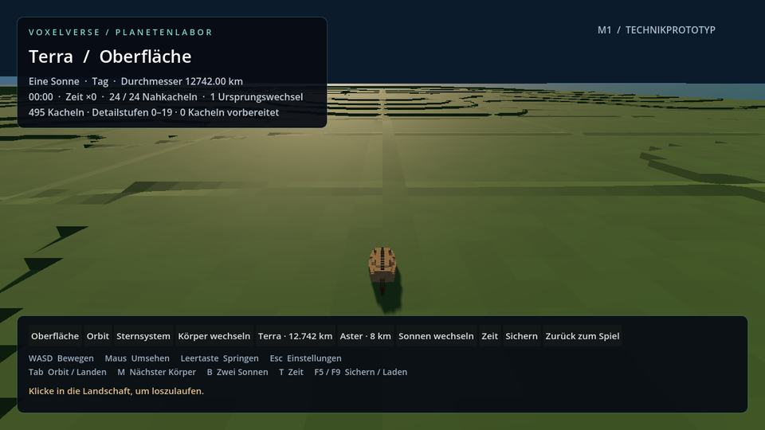
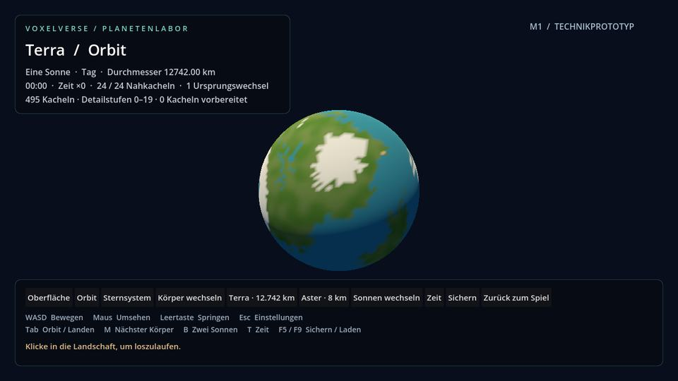
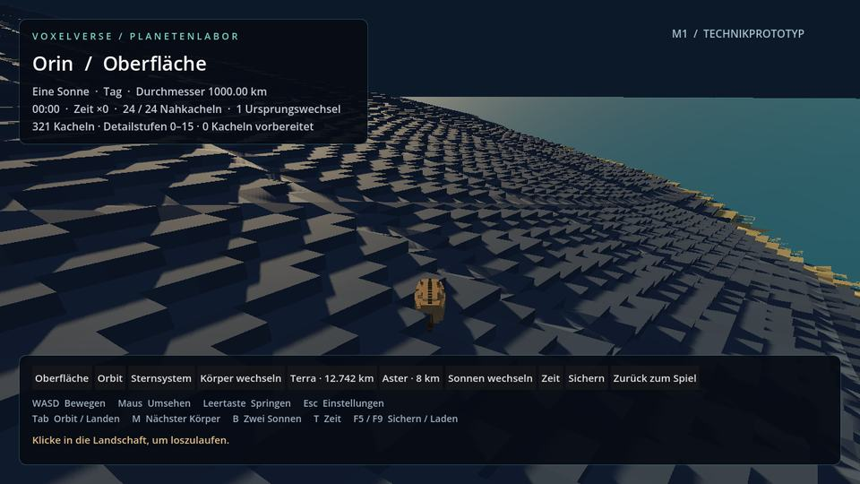
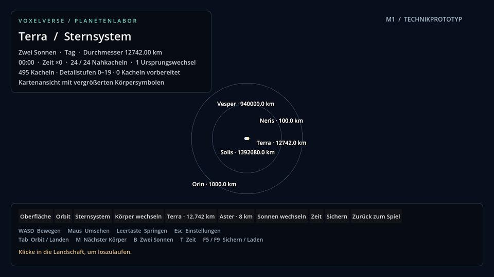
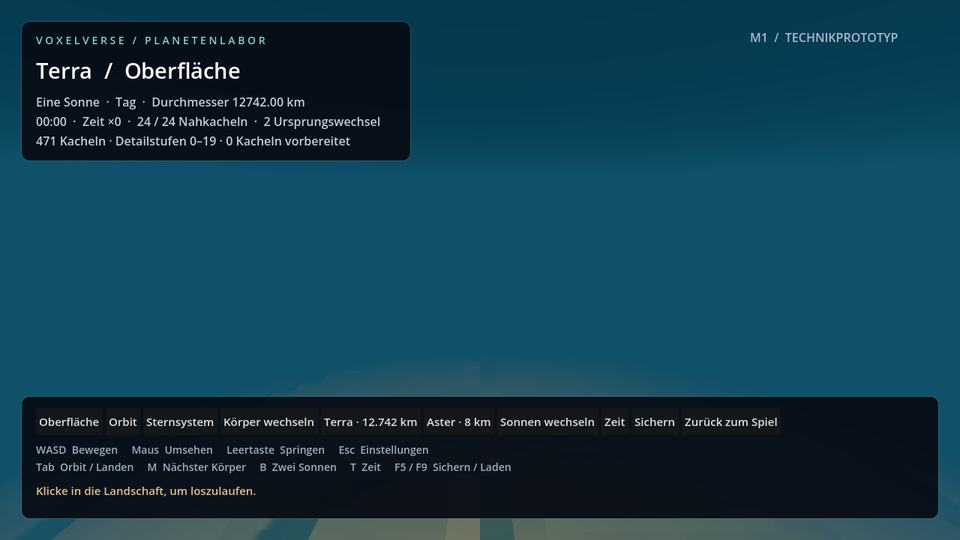

# M1b: Voxelplaneten in realen Größen

9. September 2026 · Branch `agent/planet-real-scale` · Basis PR #13.

Der Referenzbetrieb reicht jetzt bis zu einem erdgroßen Körper. Die Radien sind echte Meterwerte in Gelände, Schwerkraft, Wasser und gespeicherten Orten. Eine verkleinerte Orbit- oder Kartenansicht verändert diese Werte nicht. Die Körper sind prozedurale Referenzen, keine Nachbildung der irdischen Geografie. Die Galaxie bleibt als nächstes eigenständiges Arbeitspaket M1c geplant.

## Einstieg und Körper

Das Paket vollständig in einen frischen Ordner entpacken; EXE und PCK zusammenlassen. Im Spiel F4 oder im Esc/F8-Menü **Planetenlabor** wählen. Im Labor öffnet **Terra · 12.742 km** das große Referenzsystem. M wechselt zu Neris und Orin. Tab wechselt zwischen Oberfläche und Orbit; die Sternsystem-Schaltfläche öffnet die Übersicht. F5/F9 sichern und laden Körper, Ort, Blickrichtung und Systemzeit. Der Aster-Button führt zum bisherigen kleinen Testsystem zurück.

| Körper | Durchmesser | Feinste Detailstufe | Feinste Zellbreite im Würfelraum |
|---|---:|---:|---:|
| Neris | 100 km | 12 | 1,526 m |
| Orin | 1.000 km | 15 | 1,907 m |
| Terra | 12.742 km | 19 | 1,519 m |

Die Kugelprojektion verkürzt diese Abstände abhängig vom Ort. Während der Bewegung bleibt die geladene Zellenbreite unter 4 m im Würfelraum; Höhenterrassen sind 0,5 m hoch. Die kleinen M1-Körper behalten eigene IDs und ihr bisheriges Höhenfeld. Ein bestehender Labor-Spielstand kann deshalb zunächst weiterhin einen kleinen Körper öffnen.

Solis hat 696.340 km Radius; Terra umläuft ihn in 149,6 Millionen km Abstand. Neris liegt 90.000 km von Terra entfernt, Orin 240 Millionen km vom Stern. Der Doppelsternmodus benutzt einen gemeinsamen Bezugspunkt für die Planetenbahnen. Kreisbahnen, beschleunigte Zeiten und die für alle drei begehbaren Referenzen angesetzten 9,81 m/s² sind Laborparameter; daraus wird keine physikalisch vollständige Sternsystemsimulation abgeleitet. Die Systemkarte zeigt ausdrücklich vergrößerte Körpersymbole und beschriftet die wirklichen Durchmesser.

## Präzision und Darstellung

Die Oberflächenadresse und das Höhenfeld behalten skalare Double-Koordinaten bis zum Abzug des lokalen Ursprungs. Kontinente, regionale Formen und lokale Details werden aus derselben kontinuierlichen 3-D-Quelle berechnet. Die lokale Quelle benutzt ganzzahlige Gitter-Hashes und Double-Bruchteile, damit Zentimeterbewegungen auf Terra keine Höhensprünge aus gerundeten globalen Vektoren verursachen.

Die sechs Kugelflächen werden adaptiv unterteilt. Die große Hierarchie beginnt bei Stufe 0; die bisherigen kleinen Körper behalten die Wurzelstufe 2. Die Auswahl berücksichtigt einen Nahbereich von 64 m im Würfelraum und behält bestehende Unterteilungen länger bei. Nachbarn werden über Double-Koordinaten gefunden: Der kleine Versatz über eine Kachelgrenze ging zuvor in einem Float-Vektor verloren. Mesh-Normalen entstehen aus bereits berechneten lokalen Stützpunkten. So muss der Worker nicht für jeden Stützpunkt mehrfach dasselbe Höhenfeld auswerten.

Nahe Voxel besitzen gezeichnete Oberseiten und Seitenwände. Ihre Randstützpunkte gehören tatsächlich zu den gerenderten Flächen. Die Kollision verwendet diese Dreiecke mit höchstens 0,5 mm Überlappung je Eckpunkt in der Dreiecksebene. Dieser begrenzte Überstand schließt numerische Lücken bei Strahlen auf geteilten Kanten; er verändert die sichtbaren Voxel nicht.

Systempositionen bleiben zunächst skalare Double-Werte. Für den Orbit wird die Körperposition abgezogen und erst danach auf Darstellungsgröße skaliert. Die Orbitmeshes haben einen Einheitsradius. Große Körper verwenden dort eine gemeinsame äußere Land-/Ozeanhülle aus derselben Höhenquelle: Zwei fast deckungsgleiche Flächen verursachten an flachen Küsten trotz gemeinsamer Unterteilung Tiefenflimmern. Die Sonnenmodelle werfen keinen Schatten ihres eigenen Lichts. Auch kamerabezogene Himmelsmodelle sind keine Schattenwerfer; ihre künstlich verkleinerten Abstände dürfen keine mit der Kamera wandernden Schatten erzeugen. Am Boden bleiben Land und Wasser getrennte, adaptive Meshes. Kamerabezogene Unterwassersicht und die Wiederherstellung der Luftansicht benutzen die tatsächliche radiale Kamerahöhe.

## Begrenzte Laufzeit und verbleibende Pausen

Es gelten weiterhin höchstens 768 sichtbare Geländekacheln, 1.536 Geländemeshes für Anzeige und Vorbereitung zusammen, ein Wassermesh je Geländekachel und 24 aktive Kachelkollisionen. Neue Meshes werden mit höchstens zwei Uploads pro Frame und einem weichen 4-ms-Budget vorbereitet. Ein einzelner Upload kann dieses Zeitbudget überschreiten; die feste Mengenbegrenzung bleibt bestehen.

Ein Worker berechnet die nächste vollständige Flächenabdeckung. Der Controller fordert Gelände in Bewegungsrichtung an. Er erreicht die Grenze vorbereiteten Nahgeländes unter Last gelegentlich vor dem Worker. Dann erscheint ein Nachladehinweis und die horizontale Bewegung wartet, während Bodenkontakt und Schwerkraft weiterlaufen. Eine inzwischen veraltete Abdeckung darf den feinen Boden unter der Figur nicht durch grobes Gelände ersetzen.

**Das Streaming ist noch nicht durchgehend flüssig.** Im lokalen Headless-Test mit 24 m/s Sollgeschwindigkeit ergaben sich folgende Werte. Diese Strecke ist ein gezielter Flächenkanten-Test mit realer Physik, kein kompletter Planetenrundlauf. Der ursprüngliche kleine Polrundlauf bleibt zusätzlich erhalten.

| Körper | Tatsächliche Strecke | Simulationszeit | Davon Warten auf Gelände | Erste Geländeplatzierung | Spitzenwert sichtbare Kacheln / vorbereitete und sichtbare Meshes |
|---|---:|---:|---:|---:|---:|
| Terra | 167,12 m | 12,25 s | 5,28 s | 4,20 s | 579 / 1.000 |
| Neris | 167,36 m | 8,97 s | 2,00 s | 2,91 s | 369 / 578 |
| Orin | 167,28 m | 8,77 s | 1,78 s | 3,17 s | 459 / 710 |

Alle drei Läufe erreichen zwei Würfelflächen, drei Ursprungswechsel und vier Veröffentlichungen. Bodenkontakt besteht jeweils ab dem zweiten Physikframe durchgehend. 1.869 / 1.346 / 1.341 Kantenstrahlen treffen den Boden. Die größte Zellenbreite unter der Figur beträgt 3,038 / 3,052 / 3,815 m. Godots gemessener statischer Speicher erreicht rund 96,0 / 89,4 / 93,6 MB; das ist kein vollständiger Prozess- oder VRAM-Messwert. Der größte Terra-Upload lag bei 8,188 ms, die größte Veröffentlichung bei 25,328 ms. CPU-Messungen und Software-Renderaufnahmen ersetzen keine FPS-Abnahme auf Lars' Grafikkarte.

Ein zusätzlicher lokaler Lauf derselben Terra-Strecke mit dem normalen Gehtempo von 10 m/s erreicht 167,01 m in 16,67 s ohne Nachladehalt: 999 von 1.000 Physikframes mit Kontakt, 2.528 erfolgreiche Kantenstrahlen und maximal 3,038 m Zellenbreite. Die Erstplatzierung dauert 4,24 s. Das belegt diese konkrete Strecke; die Pausen im schnelleren 24-m/s-Lauf und die offene Ziel-PC-Abnahme bleiben bestehen.

Die nächste Streamingoptimierung muss insbesondere den umfangreichen Ersatz entfernter Kacheln bei Flächenwechseln und den Veröffentlichungsschritt verkürzen. Die aktuellen Wartezeiten werden nicht als erreichte flüssige Produktion gewertet. Zeitliches Geomorphing, ausgearbeitete Kontinente/Biome, Flora/Fauna auf der Kugel, Höhlen und frei bearbeitbares Volumenterrain bleiben weitere Arbeiten. Die vorhandene Kampagnenlandschaft wird durch diesen Labor-Ausbau nicht umgestellt.

## Sicherungen und Nachweise

Reale Körper verwenden Laborschema 3, Terrainrevision 3 und `scale_mode: real`. Schema 1/2 und die Migration der vier kleinen Körper bleiben lesbar. Unbekannte zukünftige Formate werden geschützt. Ein separater Prozess öffnet Terra mit identischem Körper, Doppelsternmodus, Zeit und Ort wieder; die Ortsabweichung bleibt unter 1 mm. Orbit-/Systemwechsel, Rückkehr vom kleinen Testsystem, radiale Unterwasseransicht sowie Nord- und Südpol werden zusätzlich geprüft.

Die Geometrieprüfung betrachtet 24 Positionen je Körper, einschließlich aller sechs Flächen, Ecken und Kanten. Sie prüft vollständige Abdeckung, höchstens eine Stufe Unterschied zwischen Nachbarn und die erhaltene feinste Stufe. In 256 m Entfernung vom Beobachter gilt eine Nahtgrenze von 1 mm. Entfernte Float-Meshes werden mit einer festen 720-Pixel-/70°-Referenzprojektion gegen 0,05 Pixel geprüft; für die ganze Erdkugel wird keine millimetergenaue Float-Darstellung behauptet.

Prüfstand: `4b27e34ba24f72c64b2d4a5970b1ba6aa0784706`. [Gesamtlauf](https://github.com/MajorDragonfly/voxelverse/actions/runs/34317489556), [native Windows-/Linux-Exporte](https://github.com/MajorDragonfly/voxelverse/actions/runs/34317489563), [Forward+/Compatibility-Bildprüfung](https://github.com/MajorDragonfly/voxelverse/actions/runs/34317489568). Bestanden: 56 Gesamtprüfungen, je 13 native Exportprüfungen und je 89 Renderaufnahmen in Forward+ und Compatibility. Die abschließenden Ergebnisse und Messdaten stehen in der [Abnahmedatei](../art/review/real_scale/acceptance.json).

**Testpakete:** [Windows](https://github.com/MajorDragonfly/voxelverse/actions/runs/34317489563/artifacts/10090650561) · [Linux](https://github.com/MajorDragonfly/voxelverse/actions/runs/34317489563/artifacts/10090639224).

Der native Wasser-/Eingabetest startet die tatsächliche Welt mit Seed 15838 neu. Ein zufälliger Startplanet hatte auf Linux einen Fehlalarm ausgelöst, weil der begrenzte Suchbereich dort kein Wasser enthielt. Die reproduzierbare Szene behält die Kamera-, Sicht- und GUI-Anforderungen bei.

Die Windows-/Linux-Prüfung startet die echte Release-Anwendung außerhalb des Quellprojekts. Sie prüft F4, tatsächliche GUI-Linksklicks, den Terra-Button, Erd-Radius, Nahkollisionen und Sichern/Laden. Die Grafikprüfung ergänzt zehn Aufnahmen der großen Körper: drei Oberflächen, drei Orbitansichten, Einzel-/Doppelsternkarte und zwei Unterwasseransichten.

## Anschluss an die Galaxie

M1b belegt den lokalen Betrieb großer Körper. M1c ergänzt als Nächstes versionierte Galaxie-, Sektor- und Systemadressen, einen reproduzierbaren Katalog und begrenzte Caches. Unbesuchte Systeme benötigen keine geladenen Voxel. Gespeicherte Entdeckungen und Veränderungen kommen zum reproduzierbaren Ausgangszustand hinzu. Galaxiekarte, Auswahl, Reisen und Wiederbesuche verbinden diese Daten später in M9. Einheiten und Darstellungsmaßstab sind dafür bereits getrennt; eine fertige Galaxie wird mit diesem Build nicht behauptet.

Die Änderungen liegen auf einem eigenen Branch über PR #13. Der Textvergleich mit dem parallelen Kreaturen-Branch `e17f40c` vereinigt `tools/capture_environment.gd` automatisch; `ROADMAP.md` benötigt beim späteren Zusammenführen die Statusänderungen beider Branches. Ein gemeinsamer Spielstand dieser Branches wurde hier nicht getestet.

## Spielaufnahmen

Die folgenden JPEG-Vorschauen stammen aus tatsächlichen Godot-Aufnahmen des Prüfcodes `4b27e34`, Renderlauf `34317489568`. Die vollständigen PNGs und Bildmessungen liegen in dessen Artefakten. Diese Aufnahmen verwenden Forward+ auf dem Software-Renderer. Compatibility wird in einem eigenen Lauf ebenfalls geprüft.

Terra am Boden: lokale Voxelstufen auf einem Körper mit 12.742 km Durchmesser.

Derselbe Körper aus dem Orbit. Die Küsten verwenden eine gemeinsame äußere Hülle; einzelne halbe Meter sind in dieser Entfernung nicht als Blöcke auflösbar.

Orin mit 1.000 km Durchmesser: Oberseiten und Seitenwände bleiben in der Nähe sichtbar.

Doppelsternkarte mit getrennten Größenbeschriftungen. Die Körpersymbole sind zur Lesbarkeit vergrößert.

Terra unter Wasser, Forward+: kamerabezogene Sichtweite und ein geschlossener Blick zur Wasseroberfläche.

