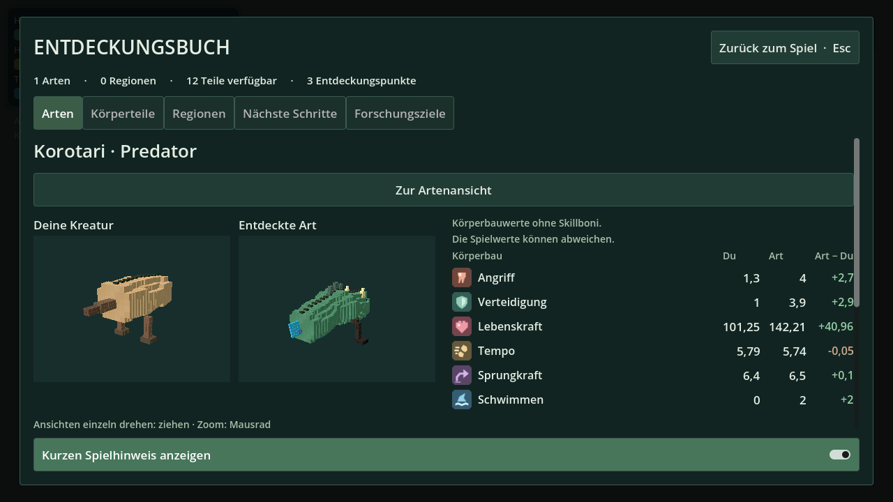

# Artenvergleich mit Wertsymbolen · M4C

Erweiterung des gemeinsamen Entdeckungsbuchs auf dem abgeschlossenen Forschungsstand `9a6f637`. Beauftragt sind der Vergleich mit der eigenen Kreatur, Untersuchung beobachteter Körperteile, die vorhandene Merkliste und passende kleine Bilder neben den Werten.

## Bedienung

**J → Arten → Art auswählen → Mit meiner Kreatur vergleichen.** Die Buchansicht zeigt zwei unabhängig drehbare und zoombare Kreaturen sowie Angriff, Verteidigung, Lebenskraft, Tempo, Sprungkraft und Schwimmen. Die Differenz ist ausdrücklich **Art − Du**; Vorzeichen bleiben zusätzlich zu den Farben sichtbar. Die Symbole ergänzen ausgeschriebene Bezeichnungen und erklärende Tooltips.

Unter dem Vergleich lassen sich die beobachteten Körperteile auswählen. Angezeigt werden ihre Anzahl, ihr Beitrag zum Körperbau, der Freischaltstatus und der Button zum Eintragen oder Entfernen auf der vorhandenen Merkliste. **Zur Artenansicht** öffnet wieder die ausgewählte Art. **Esc** schließt das gesamte Buch. Kleine Fenster nutzen den vorhandenen vertikalen Scrollbereich.

## Bedeutung der Werte

Beide Seiten verwenden `CreatureBlueprint.calculate_stats()` mit Kopien ihrer Baupläne. Links steht der aktuell vom Spieler verwendete Bauplan aus `CreatureRuntimeVisual`, rechts die bereits gespeicherte Beobachtung. Körpermasse und mehrfach verbaute Teile zählen nach denselben Regeln wie im vorhandenen System. Es handelt sich um Körperbauwerte ohne Skillboni, situationsabhängige Änderungen oder die Begrenzungen der Bewegungssteuerung. Ein Angriffswert ist kein garantierter Bissschaden; ein Schwimm- oder Flugwert schaltet keine Bewegungsfunktion frei.

Der Teilebeitrag ist die Differenz zwischen dem gesamten Körperbau und einer temporären Kopie ohne alle Platzierungen der ausgewählten Teil-ID. Die Körperform bleibt dabei gleich. Beim Grundkörper wird ausschließlich seine Teiledefinition aus der Berechnung entfernt; dies ist eine Rechenhilfe, kein baubarer Vorschlag. Kosmetische Teile erfinden keine Werte. Es gibt weder automatische Umbauten noch Punkte, Freischaltungen oder neue Entdeckungen durch den Vergleich.

Die zwölf eigens gezeichneten SVG-Symbole liegen unter `ui/discovery/icons/`. Sie sind kleine, kantige Piktogramme mit gemeinsamer Form und Farbpalette; keine externen Bildquellen oder Emoji-Schriftarten. Ein zentraler Symbolkatalog verbindet Grafik, Bedeutung und Tooltip. SVG-Import und PCK-Verfügbarkeit werden geprüft.

## Bestehende Daten und Schnittstellen

- Alte Entdeckungen ohne Ansicht erklären die fehlende Beobachtung. Unbekannte frühere Teil-IDs führen zu als nicht verfügbar gekennzeichneten Werten; sie werden nicht stillschweigend als schwächere Kreatur dargestellt.
- Der Vergleich selbst ist eine Ansicht und speichert keine zusätzlichen Daten. Merkwünsche laufen ausschließlich über den vorhandenen transaktionalen `ProgressionService.set_part_wished()`; Erfolg, Fehler und Rücknahme bleiben gemeinsam mit dem Forschungsbuch erhalten.
- Schließen, Tabwechsel, leere Suche und Kampagnenwechsel räumen die beiden Vorschauobjekte auf. Die Vorschauen enthalten keine Spielakteure und keine Spielkollisionen.
- Neue Dateien in `core/discovery/` und `ui/discovery/`; bestehender Einstieg ausschließlich `ui/discovery/discovery_journal.gd`. Keine Änderungen am Spawner, Kreatureneditor, Spielercontroller, Skilltree oder Speichervertrag. Laufende andere Entwicklungszweige sind nicht zusammengeführt.

## Abnahme

`tests/species_comparison_test.gd` prüft den echten Spieler mit seinem installierten Buch: bekannte Zahlen für doppelte Körperteile, unveränderte Ursprungsdaten, importierte Symbole, reale Button-Klicks und Mausgesten, getrenntes Drehen/Zoomen, Merkliste mit Speicherausfall und erneutem Laden, Fenster mit 960 × 540 Pixeln, Freigabe der Vorschauen und alte bzw. leere Kampagnen.

Der Test läuft zusätzlich gegen die exportierte PCK außerhalb des Quellprojekts. `journal-validate.yml` prüft die Oberfläche in Compatibility und Forward+. Lokale Ergebnisse stehen unter `validation/species-comparison.json`; die Ergebnisse des veröffentlichten Stands und dessen Windows-Testpaket werden im bestehenden Draft-PR #19 verlinkt. Der manuelle Spieltest auf Lars' PC bleibt gesondert.
