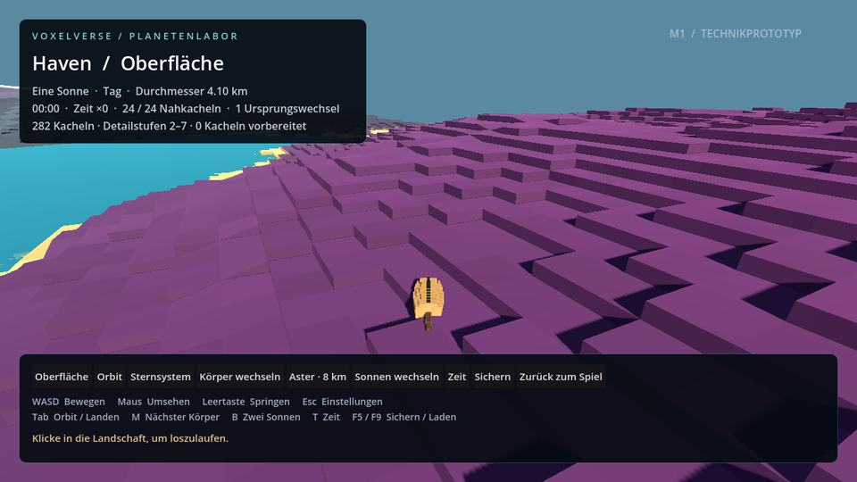
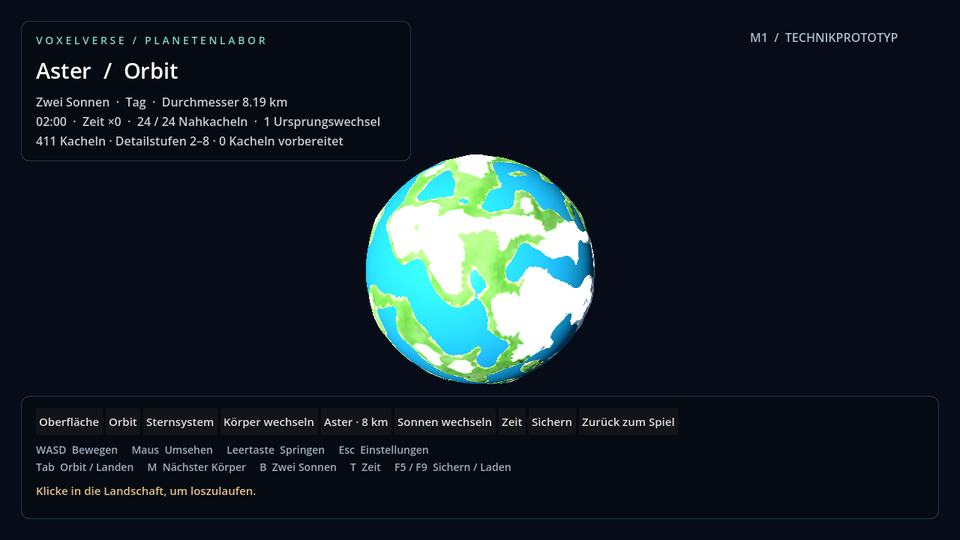
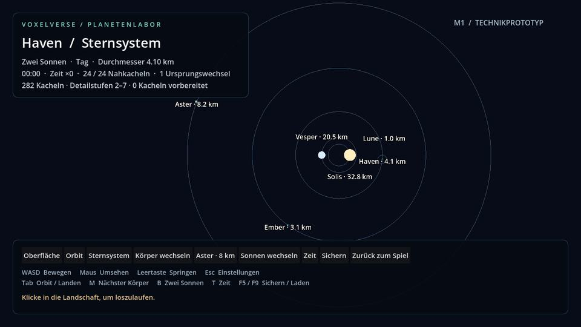

# Unterwasseransicht und Voxelplaneten

8. September 2026 · Branch `agent/underwater-voxel-planets` · Basis `0ad98d9` / PR #11.

Lars' Spieltest zeigt unter Wasser sichtbare Wolken, eine fleckige Wasserunterseite und kaum eingeschränkte Sicht. Das Planetensystem gefällt ihm; seine bisher winzigen Körper und glatten Oberflächen sollen spielbare Größen und die Voxelgestaltung erhalten.

## Unter Wasser

Die Hauptwelt besitzt jetzt eine eigene Kameraatmosphäre für Wasser. Die tatsächliche Augenposition entscheidet über das Eintauchen, unabhängig davon, ob die Kreatur schwimmt. Die Abfrage benutzt die lokale Wasserhöhe und den Gewässergrund, einschließlich höher liegender Seen. Unter Wasser sinkt die Sichtweite mit der Tiefe von höchstens 34 auf 13 Meter; Umgebungslicht und Belichtung werden dunkler und kühler. Die ursprüngliche Kameraumgebung wird beim Auftauchen, Kamerawechsel und Szenenabbau wiederhergestellt. Die gemeinsame Tagesatmosphäre und das HUD werden nicht überschrieben.

Die Wasserunterseite besitzt eine eigene, geschlossene Darstellung. Der bisherige Shader deutete von unten den Himmel oder Vegetation als Gewässergrund; daraus entstanden unpassende Transparenz-/Schaumfelder. Die Oberfläche von oben behält ihre bestehende Tiefenfarbe, flache Randbereiche und die geprüfte Aufteilung zwischen Horizont und Chunks. Im Planetenlabor benutzt die Unterwasserprüfung die radiale Höhe zum aktuellen Körper und berücksichtigt Ursprungswechsel.

## Vorläufige Größen

Alle Angaben sind tatsächliche Durchmesser des jeweiligen Laborkörpers. Die Bahnabstände sind im selben Metermaßstab gespeichert. Es handelt sich um eine komprimierte Spielwelt; eine erdgroße Laufzeitwelt ist damit weiterhin nicht abgenommen.

| Körper | Art | Durchmesser | Bahnradius |
|---|---|---:|---:|
| Solis | Hauptsonne | 32,768 km | Im Einzelsternsystem zentral |
| Vesper | Zweite Sonne | 20,480 km | 48 km um den gemeinsamen Bezugspunkt |
| Haven | Planet | 4,096 km | 120 km |
| Ember | Planet | 3,072 km | 240 km |
| Lune | Havens Mond | 1,024 km | 12 km um Haven |
| Aster | Größter Testplanet | 8,192 km | 420 km |

Im Doppelsternsystem umläuft Solis den Bezugspunkt in 30 km Abstand; Planetenbahnen beziehen sich ebenfalls auf diesen Punkt. Mond und Planeten bleiben bei jeder geprüften Stellung außerhalb der anderen Körper. Orbitansicht und Bodenhimmel verwenden dieselben Körperradien. Die Systemübersicht vergrößert kleine Symbole zur Erkennbarkeit und zeigt den wirklichen Durchmesser in der Beschriftung. Die Sternbeschriftungen sind vertikal versetzt, damit ihre Durchmesser auch neben Haven lesbar bleiben.

## Voxelgelände und Bewegung

Alle vier begehbaren Körper verwenden jetzt die adaptive Kugelunterteilung. Nahe Kacheln besitzen 16 × 16 radiale Geländespalten, Höhenstufen von 0,5 m und echte Seitenflächen. Zusätzliche lokale Höhenvariation sorgt dafür, dass auch größere Kugeln aus der Nähe Geländeformen besitzen. Die Spalten sind relativ zur lokalen Schwerkraft ausgerichtet. Die äußerste Zellenreihe verbindet ihre Stützpunkte mit den gemeinsamen Kachelrändern; damit bleiben die Detailübergänge geschlossen. Weiter entfernte Kacheln verwenden die gröbere, gemeinsame Höhenquelle. Aus dem Orbit sind einzelne halbe Meter naturgemäß nicht auflösbar.

Die Kollision entsteht aus denselben gezeichneten Flächen. Der radiale Controller prüft kleine Aufstiege mit seinem tatsächlichen Körper, freiem Kopfraum und tragfähigem Zielboden. Bodenschnappen hält den Kontakt auf abfallenden Stufen. Die klassische vollständige Polumrundung bleibt als ausdrücklich kleiner 64-m-Regressionskörper erhalten; zusätzlich läuft der produktionsgroße Aster mit den neuen Voxelstufen über eine Würfelflächengrenze.

| Laufzeitgrenze | Umfang |
|---|---|
| Sichtbares Gelände | Höchstens 768 Kacheln |
| Vorbereitung und Anzeige zusammen | Höchstens 1.536 Geländemeshes plus Wasser |
| Nahe Kachel | Höchstens 256 Oberseiten und 480 Seitenflächen, 1.472 Dreiecke / 3.233 Stützpunkte einschließlich gemeinsamer Randstützpunkte |
| Ferne Kachel | 512 Dreiecke |
| Wasser | Höchstens ein 512-Dreieck-Mesh je Geländekachel |
| Physik | Höchstens 24 aktive Kachelkollisionen |
| Upload | Höchstens zwei neue Kacheln je Frame, weiches 4-ms-Budget |
| Nahtabweichung | Höchstens 1 mm am Gelände und Wasser |

Die räumliche Auflösung am Boden hängt von Radius, Würfelflächenposition und gewählter Detailstufe ab. Erstplatzierung und Körperwechsel können laden. Hierarchische Detailwechsel besitzen weiterhin kein zeitliches Geomorphing. Die Kugeloberfläche ist eine geschlossene Höhenlandschaft; Höhlen, frei bearbeitbares Volumenterrain und die Übernahme der Kampagnenobjekte sind spätere Arbeiten.

## Alte Labor-Spielstände

Die Laborsicherung verwendet Schema 2 und Terrainrevision 2. Beim ersten Laden eines alten Schema-1-Orts bleiben Körper, Winkeladresse, Blickrichtung und Systemzeit erhalten. Die alte Bodenfreiheit wird anhand des alten Körperradius und Höhenfelds auf das neue Gelände übertragen; schwimmende Orte in weiterhin vorhandenem Wasser behalten ihre Wasserhöhe. Nach erneutem Sichern wird diese Anpassung nicht nochmals angewendet. Alte Programmfassungen schützen die neue Sicherung durch ihre bestehende Sperre für unbekannte Schemas. Die Hauptwelt-Sicherung wird nicht umgestellt.

## Prüfung und Spieltest

Der lokale gezielte Lauf besteht Kamerawechsel/Auftauchen, die reale Menü-/F4-Eingabeprüfung, vier migrationsfähige Körper und die Kugelgeometrie. Der Aster-Lauf prüft die tatsächlich referenzierten Voxelränder, nicht nur unbezeichnete Stützpunkte: 29.172 Randproben, 2.652 Proben zwischen Würfelflächen, 232 Voxelpatches und 50.171 Seitenflächen. Maximale Gelände-/Wasserabweichung: 0,0772 mm. 246,38 m Lauf, 599 von 600 Frames mit Bodenkontakt oder Auftrieb, vier Ursprungswechsel und 748 erfolgreiche Kollisionsstrahlen. Der Upload lag im 95. Perzentil bei 1,047 ms; die anfängliche Worker-Berechnung bei rund 3,12 s. Das sind CPU-Messungen, keine FPS-Zusage für einen Spieler-PC.

Die native Exportprüfung taucht mit einer Kamera im tatsächlichen Hauptwelt-Gewässer ab und wieder auf; anschließend prüft sie die bisherigen Menü-/Labor-Wechsel und die Aster-Sicherung. Die Renderprüfung ergänzt kontrollierte Sichtproben bei 5/18/45 m Entfernung, größere Wassertiefe, eine verdeckte helle Geometrie über der Wasserunterseite und das Auftauchen. Die beiden bisherigen Welt-Seeds erhalten zusätzlich echte Unterwasseraufnahmen; die Planetenprüfung zeigt alle vier Oberflächen, Orbit, Einzel-/Doppelsternsystem und Menü.

**CI-/Bildabnahme der endgültigen Codefassung `94b4dd3`:** Der GitHub-Gesamtlauf besteht 53/53 Prüfungen; die nativen Windows-/Linux-Exporte jeweils 13/13. Beide Renderer bestehen jeweils alle 79 Aufnahmen: sechs kontrollierte Unterwasserbilder, elf Planeten-/Menübilder sowie 62 Welt-/Assetaufnahmen. Die Wasser-, Gelände- und Orbitansichten wurden visuell geprüft; die abschließende Systemaufnahme bestätigt getrennt lesbare Sternbeschriftungen. Während der Umsetzung bestand außerdem ein lokaler vollständiger 53er-Lauf. Nach den letzten Material-/Beschriftungsänderungen wurden die betroffenen lokalen Prüfungen und anschließend alle GitHub-Prüfungen erneut ausgeführt.

Der neue Aufnahmefall deckte zwei Startprobleme in seiner Einrichtung auf: eine vor den Autoloads geladene Abhängigkeit und noch nicht verfügbare Shader-Standardfarben. Der Aufnahmefall lädt sein Material nach dem Start, und der gemeinsame Wasser-Builder besitzt jetzt explizite Standardfarben. Eine zusätzliche Materialprüfung verhindert eine Scheinprüfung ohne Wassershader. Die Sicht-/Verdeckungsgrenzen wurden beibehalten; die helle Geometrie über Wasser wirft im Sichttest absichtlich keinen Schatten.

**Testpakete:** [Windows](https://github.com/MajorDragonfly/voxelverse/actions/runs/34276507996/artifacts/10076001378) · [Linux](https://github.com/MajorDragonfly/voxelverse/actions/runs/34276507996/artifacts/10075982103). [Exportprüfungen](https://github.com/MajorDragonfly/voxelverse/actions/runs/34276507996) · [Gesamtprüfung](https://github.com/MajorDragonfly/voxelverse/actions/runs/34276508009) · [Renderprüfung](https://github.com/MajorDragonfly/voxelverse/actions/runs/34276508012).

Für Lars' Spieltest: das neue Paket vollständig in einen frischen Ordner entpacken. Im Hauptspiel ins Wasser gehen und die Kamera unter sowie über die Oberfläche bewegen. Im Labor über M Haven, Ember und Lune sowie über den Aster-Button den größten Planeten prüfen; laufen, kleine Stufen überqueren, Tab für Orbit/Rückkehr und F5/F9 zum Sichern/Laden verwenden. Ziel-PC-Leistung und der persönliche Bildeindruck bleiben der nächste manuelle Prüfschritt.

Die Arbeiten liegen auf einem eigenen Branch auf Basis des geprüften Menü-/M1-Ausbaus. Die soziale Spiellogik und ihre autoload-Dateien werden parallel im anderen Chat bearbeitet; beim aktuellen Vergleich mit PR #10 überschneidet sich nur `ROADMAP.md`. Der inzwischen vorhandene Kreaturen-Ausbau #12 ändert ebenfalls `tools/capture_environment.gd`, dort aber die separate Kreaturenaufnahme. Die dreiwegige Textzusammenführung dieser Datei ist konfliktfrei geprüft; ein gemeinsamer Laufzeitstand wurde hier nicht erzeugt.

## Spielaufnahmen

Diese JPEG-Vorschauen stammen aus den tatsächlichen Godot-Aufnahmen von `f730b63`, Renderlauf `34275117737`. Vollständige PNGs und Messprotokolle liegen in dessen Review-Artefakten. Die Software-Renderer dienen der Bildprüfung; ihre Laufzeiten ersetzen keine Messung auf Lars' Grafikkarte.

Unter Wasser in der Hauptwelt, Seed 15838, Forward+: Küstenstufen verschwinden mit der Entfernung in der Wasserfarbe.

Haven, Compatibility: radiale Geländestufen mit eigenen Oberseiten und Wänden.

Aster, Compatibility: derselbe Körper aus dem Orbit. Die einzelnen 0,5-m-Stufen sind in dieser Entfernung kleiner als ein Bildpunkt.

Doppelsternsystem nach der Beschriftungskorrektur, Compatibility, Code `94b4dd3`, Renderlauf `34276508012`.

