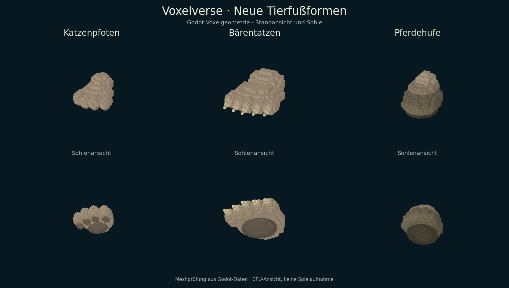

# ARCH-24 – Katzenpfoten, Bärentatzen und Pferdehufe

Status: **zweites Teilpaket veröffentlicht und geprüft** · 10. September 2026.
Branch: `agent/arch24-animal-feet-2026-09-10`.
Basis: fertiger eigener [PR #55](https://github.com/MajorDragonfly/voxelverse/pull/55),
Commit `0200bbbdab82fd1008254412837d62a7e2aee56e` auf `main`-Basis `ea900f2`.
Lokaler Implementierungscommit: `9d9a7495f662a827649bfa874b9f82b8d7c81b44`.
Veröffentlichter Stand: `8384467d002f381869047bb2111a19f23534f347`,
[Entwurfs-PR #66](https://github.com/MajorDragonfly/voxelverse/pull/66).
Der Dateibaum `9883b2f6a6bf2c5eb9cded8677c001eb0e8f783f` entspricht exakt
dem lokalen freigegebenen Modellpaket einschließlich der geprüften PNG-Ansicht.

## Lieferung und Bedienung

Im Kreatureneditor ein Bein auswählen, zu **Füße** wechseln und das gewünschte
Endstück anklicken. Wie die bisherigen Fuß-/Handendstücke sind die drei Formen
direkt auswählbar. Der bestehende Editor übernimmt Drehung, Größe, Form, Spiegelung
sowie Rückgängig/Wiederholen. Die Beinform und ihre gespeicherte UID bleiben erhalten.

| Neue ID | Form | Geometrie-Nodes pro Fuß |
|---|---|---:|
| `feet_feline_paws` | Katzenpfote mit vier runden Zehen, Zehenballen und zentralem Sohlenballen | 11 |
| `feet_bear_paws` | Breite Bärentatze mit Ferse, fünf Zehen und fünf sichtbaren Krallen | 13 |
| `feet_horse_hooves` | Geschlossener Pferdehuf mit Fesselansatz, Kronrand, Hufwand und Sohle | 5 |

Alle verwenden die vorhandenen Körper-/Hornfarben und denselben Voxelrenderer wie
Editor, Spielerkreatur und Wildtiere. Der ältere Blockadapter erhält für die neuen
IDs eine aus denselben Rezepten abgeleitete Darstellung. Der Katalog umfasst jetzt
49 Teile, davon 10 Endstücke: sieben Füße und drei Hände. Die 46 bisherigen
Definitionen und ihre relative Reihenfolge bleiben erhalten.



Diese Abbildung wurde aus den tatsächlich von Godot erzeugten Meshdaten auf der
CPU gerendert und visuell geprüft. Sie zeigt Modellform, getrennte Zehen, Krallen,
Hufwand und Sohlen. Sie ist keine Bildschirmaufnahme des Spiels und kein
Nachweis für dessen Beleuchtung, FPS oder Ziel-PC-Darstellung.

## Abgrenzung und Speichervertrag

- Bestehendes `end_part_id` verwendet drei neue IDs; alte Rezepte werden nicht
  umgedeutet. V7-Dateiformat, gespeicherte Teil-UIDs und Schemafelder bleiben gleich.
- ARCH-23 ist für Schema-/Migrationsänderungen zuständig. Dieses Modellpaket
  verändert keine Bauplan-/Save-Datei und übernimmt keinen fremden Branch. Die
  Kombination mit dessen PR #50 bleibt Teil der gemeinsamen Integration.
- Sohlenkontakt wird weiterhin aus den tatsächlich transformierten Meshes
  abgeleitet. Es gibt keine zusätzlichen konstanten Sohlenhöhen.
- Namen folgen dem bisherigen deutschen Endstückkatalog. Die umfassende
  DE/EN-Überführung des Editors bleibt im Sprachpaket; gemeinsame Sprachdateien
  wurden hier nicht parallel verändert.
- Bestehende prozedurale Arten werden nicht neu ausgestattet. Die neuen Formen
  sind im Editor verwendbar; ihre Verteilung über Wildarten bleibt separat.
- Neue Endstücke verwenden dieselben zwei Formpunkte und leere Stat-Beiträge
  wie bisherige Füße. Sie vergeben keine neuen Bewegungsarten oder Tierrollen.
  `domestic_support` bleibt für neue IDs zunächst aus; eine D1-Zulassung verlangt
  den vollständigen Stand-/Körpernachweis unabhängig vom Namen der Fußform.

## Prüfungen

Godot 4.6.3, echte Headless-Szenen mit isolierten Spielständen: **5/5 bestanden**.
[Maschinenlesbare Ergebnisse](../validation/arch24-animal-feet.json).

| Prüfung | Nachweis |
|---|---|
| `creature_foot_provider_test` | 46 unveränderte Altdefinitionen, relative Reihenfolge und 24 unveränderte alte Geometriefälle |
| `creature_parts_studio_test` | Vorhandener Editor-/Endstückpfad mit zehn Endstücken; Save/Load aller neuen IDs |
| `creature_animal_feet_test` | Drei eigenständige Meshformen; 4/5 Zehen bzw. geschlossener Huf; gespiegelte Details; gemeinsame Vorschau/Silhouette; 2/4/6 Beine auf geneigten Flächen; Stehen/Gehen/Laufen; Editorwechsel, Fußdrehung/-größe, Undo/Redo; gemischter Sechsbeiner nach frischem Neustart mit denselben IDs und Einstellungen |
| `creature_body_contract_test` | Bestehende Körperanschlüsse, radiale Bewegung und Neustart |
| `domestic_surface_catalog_test` | Bestehende D1-Kataloge auf Kugeln, Kanten und Referenzkörpern |

Zusätzlich: `tools/localization/catalog.py --check` bestanden (233 Nachrichten,
zwei Sprachen); dies belegt die Konsistenz der bestehenden Sprachressourcen.

Neue Formen enthalten maximal 13 Mesh-Nodes pro Fuß. Dies ist eine feste
Geometriegrenze, keine gemessene Leistungszusage. Neue Wildtiermengen oder globale
Budgets werden hier nicht erhöht. Ziel-PC- und Exportprüfung offen.

Reproduktion der Modellansicht ohne Grafikfenster:

```sh
godot --headless --path . --script res://tools/export_animal_foot_meshes.gd -- /tmp/animal-feet.json
python tools/render_animal_foot_meshes.py /tmp/animal-feet.json /tmp/animal-feet.png
```

Auf einem Desktop kann `tools/capture_foot_family.gd` zusätzlich die native
gemeinsame Vorschau aufnehmen; nach dem Ausgabepfad bis zu vier Fuß-IDs angeben.
Ohne zusätzliche IDs zeigt der Helfer weiterhin die vier ursprünglichen Formen.

## Übergabe

Dieser Folgebranch baut ausschließlich auf dem fertigen eigenen PR #55 auf.
Entwurfs-PR #66 zielt auf den Branch von #55 und zeigt nur dieses Modellpaket.
Nach Integration von #55 soll #66 auf `main` umgestellt werden. Laufzeitänderungen betreffen nur
`creature_foot_catalog.gd` und `creature_foot_geometry.gd`; weitere Änderungen
sind Tests, Aufnahmehelfer und Dokumentation. ARCH-24/M3-TEILE.2 bleibt teilweise
geliefert: Rüssel, zusätzliche Schnauzen, Oktopusmund und Krebsscheren sind weiter offen.
