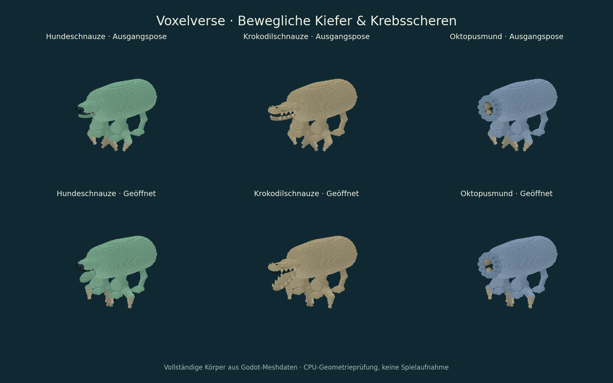

# ARCH-24-ARTICULATION – bewegliche Kiefer und Scheren

Basis: `d378ca0ecd7f03429a5150df6358e0646ec06689` (main nach #92).
Fachbranch: `agent/arch24-articulation-20260915`.
Quellcommit: `027861c61fa452773e200ec267b2d88b0caa4745`.
Quelltree: `901b60124dfc36cec7f4f8ba5d1df9e31ad5de42`.

Teilauftrag aus ARCH-24 / M3-TEILE.2/.4: die vorhandenen Mund- und
Scherenmodelle tatsächlich öffnen. ARCH-24 insgesamt bleibt offen.

## Verhalten

- Sieben Mundformen: Pflanzenfresser, breiter Schnabel, Raubkiefer,
  Filterschnauze, Hundeschnauze, Krokodilschnauze und Oktopusmund.
- Unterkiefer bewegen sich um lokale Anschlüsse. Krokodil-Unterzähne folgen
  ihrem Kiefer; beim Oktopus öffnen beide Schnabelhälften.
- Krebsscheren und alte Zangen besitzen zwei gegenläufige Gelenke. Die
  Zahnreihen bleiben an ihrem Scherenteil; Handgelenk und Handfläche bleiben fest.
- Erfolgreiche Spieler-/Raubtierangriffe öffnen Mund und Scheren. Erfolgreiches
  Fressen bei Spieler und Wildtier löst eine kurze Kaubewegung aus. Abgelehnte
  Spielerangriffe oder Mahlzeiten lösen keine Bewegung aus.
- Im vorhandenen Werkstatt-Testmodus „Stehen“ und bei ruhenden Wildtieren
  sieht man eine leichte Atem-/Greiferbewegung. Die eigentliche Editierpose
  bleibt unverändert; neue UI-Controls oder Sprachkatalogeinträge sind nicht nötig.
- Biss darf Kauen unterbrechen. Glättung verhindert einen unmittelbaren
  Posesprung beim Auslösen; anschließend kehren die Gelenke exakt zurück.
  Pause hält die Zeit an, Neuaufbau verwirft alte Meshreferenzen, Wildtiertod
  beendet die laufende Aktion.

Die Öffnung ist Darstellung. Sie gewährt keine neue Fangfunktion, keinen
zusätzlichen Schaden und keine Freischaltung. Die bereits vorhandenen
Verhaltens-/Nahrungsregeln bleiben zuständig.

## Anschluss und Integration

Die Geometrieanbieter liefern `articulation(id, revision)` mit lokalen
Gelenkpunkten, Achsen, Winkelgrenzen und zugehörigen Meshnamen. Der bestehende
Geometriebauer hinterlegt diese Angaben an Mund oder Handendsockel.
`CreatureRuntimePreview` bindet sie einmal beim Neuaufbau. Der neue
`creature_part_articulation.gd` verändert anschließend nur die gecachten lokalen
Meshtransformationen; keine zusätzlichen Szenenknoten oder Mesherzeugung pro Frame.
Bei Spiegelung werden Achsen als Pseudovektoren behandelt; Größenänderung,
Endstückdrehung und radial gedrehte Elternkoordinaten bleiben erhalten.

Vorschau-/Integrations-API am bestehenden Preview:

```gdscript
preview.play_part_action("bite") # außerdem eat / grip, optional Dauer
preview.set_articulation_pose(1.0, 1.0) # kontrollierte Mund-/Handöffnung 0..1
preview.reset_part_actions()
```

Bestehende Meshes, direkte Kinderhierarchie, Entwurfs-ID, Teil-IDs, Kosten,
Freischaltungen und Schemafassungen bleiben erhalten. Die Originalpose ist
weiterhin die geschlossene Referenz; die kosmetische Bewegung ist kein Saveinhalt.
Unbekannte Modell-/Gelenkrevisionen erhalten kein Ersatzprofil.

Schreibbereiche: Mund-/Handgeometrie, gemeinsamer Geometriebauer,
RuntimePreview, Bissanimator, kleine Aufrufe im Spieler-/Wildtier-/Fressablauf,
ein neuer Test in der vorhandenen Registry sowie zwei QA-Werkzeuge.
ARCH-25-Editor/Sprachkatalog, ARCH-26-Siedlungen/Save und ARCH-30-Schiffe sind
unverändert. PR #96 (Rüssel) berührt ebenfalls Geometriebauer und RuntimePreview;
bei der Integration beide additiven Anschlüsse erhalten. Zentrale Statusseiten
und Backlog-Häkchen bleiben beim Integrationschat.

## Nachweise und Grenzen

[Ergebnismanifest mit Dateihashes, Befehlen und Prüfgrenzen](evidence/arch24-articulation/results.json).
Die Originalprotokolle behalten ihren damaligen Arbeitsstand. Getestete
Spielcode-Dateien sind bis zum Quellcommit unverändert; fünf bestehende
Fachnachweise werden nach der Erweiterung der neuen Testassertionen wiederverwendet.

Sieben unterschiedliche Fachtests bestanden unter Godot 4.6.3:
`creature_part_articulation`, `creature_mouth_provider`, `creature_hand_provider`,
`creature_animation_continuity`, `creature_body_contract`, `wildlife_foraging`
und `creature_behavior_gameplay` (jeweils `_test`).
Der neue Test enthält 6.621 Prüfungen plus einen frischen Kindprozess:
Spiegelachsen, nichtuniforme Formen, Originalpose ohne Drift, 30/60/144 Hz,
Pause, Neuaufbau, echte angenommene/abgelehnte Spieleraktionen und gespeicherte
Entwürfe. Bestehende Tests sichern unter anderem 24 alte Mundgeometriefälle,
18 Handgeometriefälle und 30 deterministische Altarten.

Der erste neue Testlauf scheiterte an fehlender Angriffsbereitschaft der
Raubtier-Testfigur. Die korrigierte Vorbereitung nutzt die vorhandenen Regeln;
der Erstfehler ist im Manifest und Originalprotokoll dokumentiert.



Die Ansicht wurde aus echten Godot-Meshdaten per CPU gerendert und visuell
geprüft. Das Grafikfenster konnte in dieser Umgebung keinen lokalen Socket
anlegen. Daher kein nativer Renderer-/Video-, Windows-Export- oder Ziel-PC-Nachweis.
Gemeinsame Integration, normale Spielansicht und Windows-Abnahme bleiben offen.
