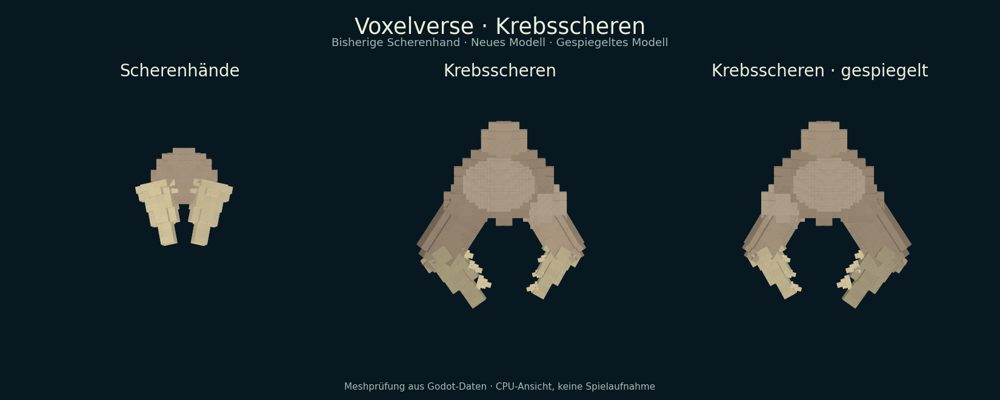

# ARCH-24 – Krebsscheren und gemeinsamer Handanbieter

Status: **drittes Teilpaket veröffentlicht und geprüft** · 10. September 2026.
Branch: `agent/arch24-crab-claws-2026-09-10`.
Basis: eigener [PR #66](https://github.com/MajorDragonfly/voxelverse/pull/66),
Commit `4a3c805287787eabfcca35d4dde94dc8476c74fd`; darunter eigener PR #55.
Veröffentlicht als [Entwurfs-PR #70](https://github.com/MajorDragonfly/voxelverse/pull/70).
Remote-Implementierungscommit `25dab2253c498072253e8fdb89ff9cbac5941cc1`
entspricht lokal `50ca9eecbc7c4accf1b1ee16fca04e64f77204e4`; verifizierter
Git-Dateibaum `9a7ec641fb025d3398e440ad3c54e10e7430e8fb` einschließlich PNG.

## Lieferung und Bedienung

Im Kreatureneditor einen **Arm** auswählen, zu **Hände** wechseln und
**Krebsscheren** anklicken. Das neue Endstück `hands_crab_claws` besitzt einen
breiten Panzer, einen kräftigen festen und einen schmaleren gegenüberliegenden
Scherenfinger, zwei gebogene Spitzen und sechs innere Zähne. Es verwendet die
vorhandenen Körper-/Hornfarben und 15 Voxel-Mesh-Nodes je Hand.

Die Hand folgt dem vorhandenen Arm bei Gehen und Laufen. Der bestehende Editor
übernimmt Spiegelung, eigene XYZ-Drehung, Größe und ungleichmäßige Skalierung,
Rückgängig/Wiederholen sowie Speicherung. Ein ausgewähltes Bein nimmt diese Hand
nicht an. Die Öffnung ist eine feste Modellpose; eine eigene Zukneifanimation
oder neue Greif-/Kampf-/Kletteraktionen sind nicht Bestandteil dieses Pakets.



Diese visuell geprüfte CPU-Ansicht verwendet die tatsächlich von Godot erzeugten
Meshdaten. Sie belegt die unterscheidbare Form und ihre Spiegelung, ist aber
keine native Spielaufnahme, Beleuchtungsabnahme oder Ziel-PC-/FPS-Messung.

## Anbieter und Erhaltungsvertrag

| Gegenstand | Zuständige Quelle |
|---|---|
| Hand-IDs, Namen und bisherige Werte | `creatures/catalog/creature_hand_catalog.gd::get_parts` |
| Anatomie, Armanschluss und Geometrierevision | `creature_hand_catalog.gd::get_profile` |
| Voxelrezepte und historischer Blockadapter | `creatures/editor/creature_hand_geometry.gd` |
| Gemeinsame Darstellung und Spiegelung | bestehende Helfer in `creature_part_geometry.gd` |
| Bewegung, Eingaben, Undo/Redo und Save/Load | bestehender Rig, Editor und Bauplanadapter |

Die drei alten Hände `hands_grasp`, `hands_claws` und `hands_pincers` behalten
ihre Definitionsfelder, Werte, alte Blockdarstellung und exakte Voxelgeometrie.
Vor der Extraktion wurden vom Basiscommit 18 Fälle aufgenommen: drei Handformen,
drei Skalierungen, beide Seiten. Die gespeicherte Baseline vergleicht Mesh-Hashes,
Bounds, Farben, Position und Basis. Die ursprünglichen 46 Katalogdefinitionen
und ihre relative Reihenfolge bleiben erhalten. Mit den drei Füßen aus #66
und dieser zusätzlichen Hand umfasst der Katalog jetzt **50 Teile / 11 Endstücke**.

Die Handprofile liefern unabhängige Lesekopien. Unbekannte IDs und explizit
angefragte zukünftige Revisionen ergeben leere Ergebnisse. Auch der gemeinsame
Geometriebauer zeichnet eine unbekannte Hand-ID nicht mehr als Greifhand.
Normale gespeicherte Endstücke werden weiterhin durch den bestehenden
Bauplanadapter geprüft; dessen Regeln werden nicht geändert.

Die neue Hand verwendet zwei Formpunkte und leere Stat-Beiträge wie die alten
Hände. Anatomische Merkmale gewähren keine zusätzlichen Fähigkeiten oder
Tierrollen. Arm-Endmarker werden weiterhin nicht als stützende Beine gezählt.
Der Katalog hat keine Save-, Fortschritts- oder Besitzschreibrechte.

Es gibt eine additive ID im vorhandenen `end_part_id`, keine neuen gespeicherten
Versionsfelder und keine Umdeutung vorhandener IDs. Die explizite Anbieterrevision
ist vorerst ein API-Vertrag; gespeicherte Revisionen/Migrationen bleiben ARCH-23.
Für das neue Modell wird die historische Blockdarstellung aus demselben Rezept
abgeleitet. Die alten Blockrezepte bleiben aus Erhaltungsgründen separat bestehen.

## Prüfungen

Godot 4.6.3, isolierte Spielstände: **5/5 gezielte Prüfungen bestanden**.
Maschinenlesbare Ergebnisse: [arch24-crab-claws.json](../validation/arch24-crab-claws.json).

| Prüfung | Nachweis |
|---|---|
| `creature_hand_provider_test` | 18 exakte alte Handfälle; vier unterscheidbare Hände; sechs Zähne und 15 Nodes; gespiegelte Positionen und Finger-/Zahnachsen bei drei Skalierungen; Vorschau/Silhouette aller Hände; tatsächlicher Editor einschließlich falschem Beinanschluss und Undo/Redo; alle drei Armtypen beim Gehen/Laufen auf geneigtem Rahmen; frischer Neustart mit identischen IDs, UIDs und Einstellungen |
| `creature_foot_provider_test` | Alte Katalogdefinitionen, 24 Fußgeometriefälle, Vorschau und radialer Kontakt; bisherige D1-Fähigkeitspolitik |
| `creature_parts_studio_test` | Vorhandener Editor und Save/Load aller elf Endstücke; Körper, Füße, Terrain und Wildtiere |
| `creature_animal_feet_test` | Die drei neuen Tierfüße aus #66 einschließlich Editor und Neustart bleiben funktionsfähig |
| `creature_body_contract_test` | Bestehende Körper-/Kontaktverträge und Neustart |

Sprachkatalogprüfung bestanden: 233 Nachrichten, zwei Sprachen. Dies prüft
Ressourcenkonsistenz, keine vollständige Übersetzung des Editors. Die neuen
Handnamen folgen dem bestehenden deutschen Endstückkatalog; ARCH-25 behält den
Editor-DE/EN-Anschluss. Bestehende prozedurale Wildarten bleiben unverändert.

Die erste neue Editorprüfung verwendete versehentlich `shape_scale` statt des
vorhandenen Eingabefeldes `shape`. Der Test wurde am bestehenden Editorvertrag
korrigiert; die abschließende Prüfung besteht. Dafür war keine Laufzeitkorrektur nötig.

Modellansicht reproduzieren:

```sh
godot --headless --path . --script res://tools/export_animal_foot_meshes.gd -- /tmp/hands.json hands_pincers hands_crab_claws hands_crab_claws@-1
python tools/render_animal_foot_meshes.py /tmp/hands.json /tmp/hands.png --hands
```

Die vorhandenen Aufnahmehelfer zeigen ohne zusätzliche Argumente weiterhin die
drei Tierfüße aus #66. `capture_hand_baseline.gd` darf nur gegen den dokumentierten
Stand vor der Extraktion laufen; die Baseline darf nicht aus geändertem Code
neu geschrieben werden, um einen fehlgeschlagenen Vergleich zu verdecken.

## Integration und verbleibende Arbeit

Dieser Branch baut ausschließlich auf den abgeschlossenen eigenen Paketen #55
und #66 auf. Entwurfs-PR #70 zeigt auf den Branch von #66 und soll erst
nach dessen Integration auf `main` wechseln. Keine fremden Arbeitsstände wurden
übernommen. Gemeinsame Abnahme mit ARCH-23/#50 und der neuen Vertragsregistry
bleibt der Integration vorbehalten; dort `creature_hand_provider_test` in die
passende Kreaturen-Prüfgruppe aufnehmen.

Weitere ARCH-24-Modelle sind offen: Rüssel, zusätzliche Schnauzen und Oktopusmund.
Verteilung über Wildarten, neue Greifmechanik, vollständiger Editor-DE/EN-Anschluss
sowie Ziel-PC-/Exportabnahme sind eigene Folgeschritte. ARCH-24 insgesamt bleibt
teilweise geliefert.
