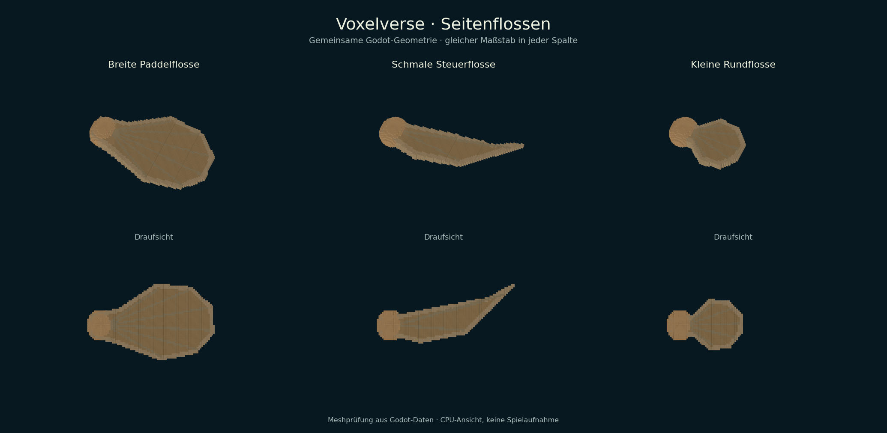
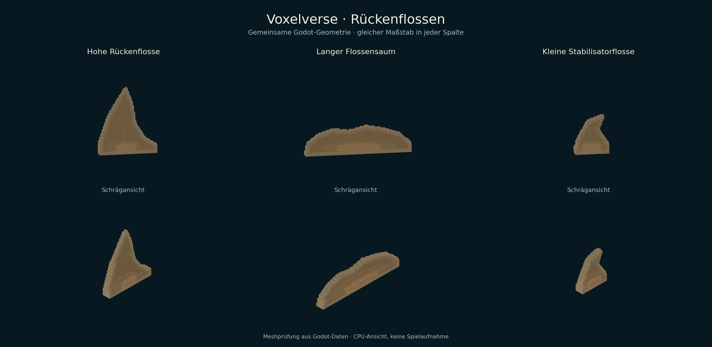
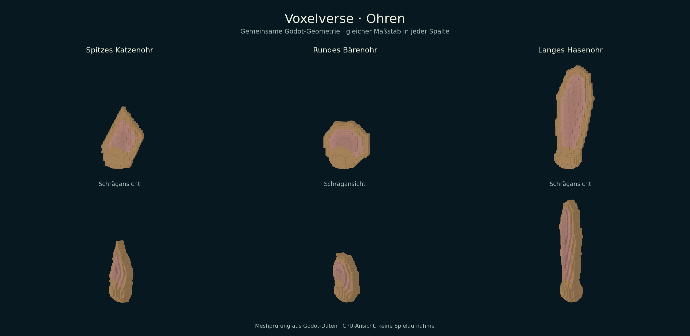
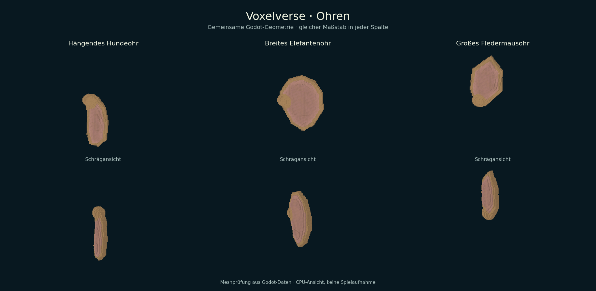

# ARCH-24-FINS-EARS — Flossen und Ohren

Stand: 17.09.2026. Fortsetzung des Körperteile-Auftrags: unterbrochene Flossenarbeit wiederhergestellt und als nächstes Paket sechs Ohren umgesetzt.

## Lieferung

| Familie | Formen | Startplatzierung | Vorhandenes Freischalt-/Werteprofil |
|---|---|---|---|
| Seitenflossen | breite Paddelflosse, schmale Steuerflosse, kleine Rundflosse | Paar, seitlich | `tail_fin` |
| Rückenflossen | hohe Rückenflosse, langer Flossensaum, kleine Stabilisatorflosse | Einzelteil, mittig oben | `tail_fin` |
| Ohren | Katze, Bär, Hase, hängendes Hundeohr, breites Elefantenohr, großes Fledermausohr | Paar, vorn oben | `decor_feathers` |

Alle zwölf IDs sind zusätzliche Revision-1-Modelle mit eigener Kontur. Gemeinsame Geometrie in Editor, Journal, Laufzeit und Offline-Entwurfspaketen; je ein fester Ansatz und eine bewegliche Fläche. Flossenstrahlen, Ohrmuscheln und Innenfarbe sind Teil der Voxel-Geometrie. XYZ-Skalierung, Drehung, Spiegelung, Einzel-/Paar-/Mittelmodus und Undo/Redo laufen über den bestehenden Editor. Die neue Bewegungsvorschau bewegt nur die jeweilige Familie und schreibt keine Posen in Spielstände.

Die Teile übernehmen vorhandene Werte und Freischaltungen. Flossen erscheinen erst nach Freischaltung von `tail_fin`; Ohren folgen `decor_feathers`. Es entstehen keine neuen Fortbewegungs- oder Wahrnehmungsfähigkeiten und keine zusätzlichen Entdeckungspunkte. Bestehende Hände, Füße, Mäuler, Flügel und generierte Spezies behalten ihre Geometrie und Referenzen. Die historische Eierkampagnen-Prüfung ergänzt genau sechs Ohren-Freischaltungen; ohne `tail_fin` erhält ihr alter Spielstand keine neuen Flossen.

## Basis und Abhängigkeiten

- Fachbasis: `724d475bfac1d1f4e5d575ddffb99d9ad12eec81`, Flügel-PR #155.
- Beim Paketstart abgeglichener `main`: `176d088d34324de14952bc7506fe9763a22cf4b0`.
- Branch: `agent/arch24-fins-ears-20260917`; PR baut auf `agent/arch24-wing-families-20260916` auf.
- Geprüfter lokaler Quellcommit: `4b1de0ebe35971f6af3c0feae780572af61ac0d2`.
- Veröffentlichter identischer Quellbaum: Commit `4fa3f59e71309f358d2a39511471edd82aee72c9`, Tree `6eb2658fe9d11adb3bb58c878b849009a655f614`.
- Der API-Commit hat andere Metadaten, aber exakt denselben Git-Tree. Der anschließende Nachweis-Commit ergänzt nur diesen Bericht, Ansichten und Prüfprotokolle.
- #155 muss vor Integration nach `main` übernommen bzw. diese PR entsprechend umgestellt werden. Die getrennte Mund-/Geweih-/Kamm-Lieferung #154 wird durch diese PR nicht dupliziert. Beim späteren Zusammenspiel deren Revision-2-Auflösung und zusätzliche Katalogeinträge erhalten: zusammen 62 platzierbare Teile und elf Endstücke. Die vier Kamm-Freischaltungen müssen in der historischen Kampagnenprobe vor den vier Flügeln und sechs Ohren ergänzt werden, entsprechend der zusammengeführten Katalogreihenfolge.
- Keine Änderungen an zentralen Statusdateien oder an der Rundenvergabe in #137.

## Prüfung

14/14 ausgewählte Godot-Tests erfolgreich; zusätzlich Quellverträge und Quellintegrität erfolgreich. Flossen: **1.720** Checks; Ohren: **1.746** Checks. Altmodelle, Körpervertrag, Modellrevisionen, Editor, Journal, Entwurfsbibliothek, Paketaustausch und historischer Kampagnenspielstand bestanden.

| Test | Ergebnis | Sekunden |
|---|---|---:|
| `creature_fin_family_test` | bestanden | 59.0 |
| `creature_ear_family_test` | bestanden | 58.0 |
| `creature_wing_family_test` | bestanden | 81.6 |
| `creature_foot_provider_test` | bestanden | 5.1 |
| `creature_hand_provider_test` | bestanden | 14.1 |
| `creature_part_articulation_test` | bestanden | 13.0 |
| `creature_parts_studio_test` | bestanden | 35.8 |
| `creature_body_contract_test` | bestanden | 15.2 |
| `creature_part_revisions_test` | bestanden | 22.1 |
| `community_blueprint_package_test` | bestanden | 18.6 |
| `creature_design_library_test` | bestanden | 18.0 |
| `discovery_journal_test` | bestanden | 11.5 |
| `editor_localization_test` | bestanden | 85.3 |
| `egg_species_campaign_test` | bestanden | 99.2 |


Die beiden neuen Tests sind genau einmal im Vertrag `creature_body` registriert. Je Familie: 60 eingefrorene Geometrie-/Farb-Fälle (sechs Modelle × fünf XYZ-Formen × zwei Seiten), zusammenhängende Voxel-Flächen und Obergrenzen, reflektierte Gelenkbewegungen, Kontakt zum festen Ansatz und zur tatsächlich gerenderten Körperhaut, unterstützende Füße unter gedrehtem Elternknoten, echte Editoraktionen und Freischaltungen. Dazu Speichern, Schutz vor Zukunftsrevisionen, Paketexport/-import, Deduplizierung und erneutes Laden in einem separaten Godot-Prozess. Gemeinsame Kreaturen mit Flügeln, Flossen und Ohren prüfen die Trennung der Bewegungskanäle.

Engine: Godot `4.6.3.stable.official.7d41c59c4`, Linux headless; pro Test isolierte Nutzerdaten mit dem vorhandenen Runner. Ressourcen vorab importiert, Quellstand während des gesamten Laufs unverändert. Vollständiger Befehl und Provenienz in `docs/evidence/arch24-fins-ears/checks/results.json`, zugehörige Protokolle und Quellmanifest im gleichen Ordner. Alte Referenzdateien wurden nicht neu erzeugt; nur die 120 Fälle der neuen Modelle sind neue Baselines.

Reproduktion (nach einmaligem Ressourcenimport):

```sh
python3 tools/validate_godot.py --godot /path/to/Godot_v4.6.3-stable_linux.x86_64 --output /tmp/arch24-fins-ears-checks --skip-import --skip-main --tests creature_fin_family_test creature_ear_family_test creature_wing_family_test creature_foot_provider_test creature_hand_provider_test creature_part_articulation_test creature_parts_studio_test creature_body_contract_test creature_part_revisions_test community_blueprint_package_test creature_design_library_test discovery_journal_test editor_localization_test egg_species_campaign_test
```

## Sichtprüfung

Die acht Ansichten in `docs/evidence/arch24-fins-ears/` zeigen die echten Godot-Meshdaten in konstantem Maßstab, einzeln und am Körper. Prüfergebnis: sechs unterscheidbare Flossenkonturen, sechs Ohrformen, geschlossene Ansätze; ein anfänglicher Querstreifen der Elefantenohr-Innenfarbe wurde vor dem Prüflauf korrigiert. Die Exporter geben zusätzlich die maximale Bewegungspose aus; die Tests prüfen Anschluss und Rückkehr in die Ruhepose.






CPU-Meshansichten und gezielte Vertragsprüfungen sind keine Ziel-PC-, FPS- oder vollständige Gameplay-Abnahme. Die vier vorgeschriebenen CI-Gates gelten weiterhin für den aktuellen Integrationsstand; kein vorzeitiger Merge.
