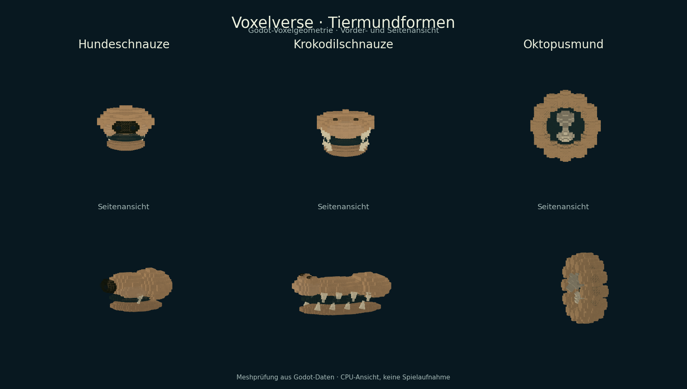

# ARCH-24 – Hundeschnauze, Krokodilschnauze und Oktopusmund

Status: **Modellpaket umgesetzt und geprüft, gemeinsame Integration separat** · 10. September 2026.
Branch: `agent/arch24-mouth-models-2026-09-10`.
Basis: `main` bei `bb2f83b56267964baa7037720c4daca26fe3d007`.
Implementierung: `149864cb6cb7e3a5e8da3f2dfed4f9466039ed62`.
Anpassung des alten Katalogzählers: `44a9facd6af82c4fbf5e4ec617dbf2e58e9c862c`.
ARCH-06, ARCH-07 und ARCH-22 laufen in anderen Chats und wurden nicht übernommen.

## Lieferung und Bedienung

Im Kreatureneditor **Teile → Mäuler** öffnen. Nach der vorhandenen Freischaltung
der **Raubkiefer / Predator Jaws** stehen drei zusätzliche Modelle zur Wahl:

| Teil-ID | Sichtbare Form | Modellbudget |
|---|---|---|
| `mouth_canine_snout` | Schmal zulaufende Hundeschnauze, dunkler Nasenspiegel, zwei Fangzähne | 11 Mesh-Nodes |
| `mouth_crocodile_snout` | Lange flache Schnauze, erhöhte Nasenöffnungen, zwei versetzte Zahnreihen | 25 Mesh-Nodes |
| `mouth_octopus_beak` | Runde Mundöffnung aus zwölf Segmenten, innenliegender oberer und unterer Hakenschnabel | 17 Mesh-Nodes |

Die Modelle verwenden die vorhandenen Haut-, Akzent- und Hornfarben. Editor,
Spielkreaturen und Entdeckungsbuch verwenden dieselbe Geometrie. Gesperrte Teile
erscheinen als Silhouetten derselben Form. Größe, XYZ-Drehung, unterschiedliche
Achsskalierung sowie Rückgängig/Wiederholen und Speicherung bleiben im bestehenden
Editor. Der Kopfanschluss bewegt sich mit dem Körper auf radial ausgerichteten
Oberflächen; die Mundöffnung ist eine feste Modellpose.



Diese sechs visuell geprüften CPU-Ansichten sind keine Spielaufnahme, native
Renderer-Abnahme oder Leistungsmessung auf dem Ziel-PC.

## Katalog, Werte und Erhaltung

`CreatureMouthCatalog` besitzt ausschließlich die drei neuen Modellprofile.
Anatomie, Geometrie und Fortschritt bleiben getrennt. Der gemeinsame Teilekatalog
liest `stats_source` und kopiert die bereits vorhandenen Werte, Formpunktkosten
und Standardgröße von `mouth_predator_jaws`. Es gibt keine neuen Kampf-, Nahrungs-,
Unterwasser- oder Greiffähigkeiten. Der Oktopusmund ist separat mit anderen
Körperteilen kombinierbar; er fügt keine Tentakel hinzu.

Anbieterrevision und Geometrierevision sind **1**. Die APIs geben für unbekannte
IDs und angefragte zukünftige Revisionen leere Ergebnisse zurück. Im vorhandenen
`part_id` werden neue IDs gespeichert; Bauplanversion **7**, Fortschrittsschema
**6** und der gemeinsame SaveGameService bleiben bestehen. Gespeicherte
Teilrevisionen und deren Migration sind weiterhin ein eigener Anschluss.

Die vier bisherigen Munddefinitionen und ihre alten Blockrezepte bleiben
unverändert. Ihre Geometrie wurde vor der Änderung auf der genannten Basis für
drei Skalierungen und beide Seiten eingefroren: **24 exakte Fälle** mit
Mesh-Hashes, Bounds, Farben, Positionen und Achsen. Zusätzlich bleiben **30
vollständige prozedurale Arten** über fünf Seeds und alle sechs ökologischen
Rollen exakt gleich. V7 erhält deshalb seine bisherige Vierer-Mundauswahl samt
Zufallsbereich; bestehende oder erneut aus Seeds gelesene Arten wechseln nicht
unbemerkt ihre Körperteile. Neue Mundmodelle werden noch nicht prozedural verteilt.

Die neuen Formen sind erspielbare Modellalternativen derselben vorhandenen
Raubkiefer-Freischaltung. `ProgressionService` legt dafür normale individuelle
Freischalteinträge an, sodass Editor, Journal, Forschungswünsche und Export
denselben Zustand lesen. Eine echte Artenentdeckung verdient weiterhin nur ihre
bisherigen drei Punkte. Alte Spielstände mit bereits freigeschalteten Raubkiefern
erhalten die Alternativen beim normalen Import; die Quelle wird nicht verändert.
Ohne die Raubkiefer-Freischaltung bleiben sie gesperrt. Wiederholtes Laden erzeugt
keine weiteren Belohnungen oder doppelten Einträge.

## Prüfungen

Godot **4.6.3.stable.official.7d41c59c4**, isolierte Nutzerverzeichnisse:
**8/8 gezielte Godot-Prüfungen bestanden**, zusätzlich Vertrags-/Sprachgate.
[Ergebnisse, Quellprüfsummen und anfänglicher Zählerfehler](../validation/arch24-mouth-models/results.json).

| Prüfung | Nachweis |
|---|---|
| `creature_mouth_provider_test` | 24 alte Geometriefälle, 30 unveränderte Arten, sieben unterscheidbare Mundmodelle, feste Meshbudgets, gespiegelte Positionen/Achsen bei drei Skalierungen, Vorschau/Silhouette, echte Entdeckungsfreischaltung, Import alter Freischaltungen ohne Quellmutation, Editor/Undo/Redo/Transform, radiale Laufzeit, frischer Prozess mit erhaltenen IDs/UIDs/Einstellungen |
| `creature_foot_provider_test` | Ursprüngliche 46 Katalogdefinitionen und relative Reihenfolge, Fußgeometrie und radiale Kontakte erhalten; sieben additive Einträge ausdrücklich erfasst |
| `creature_hand_provider_test` | Alte Hände und Krebsscheren einschließlich Editor und Neustart erhalten |
| `creature_parts_studio_test` | Alle **32** platzierbaren Rezepte und elf Endstücke, Editor, Terrain und Wildlife; bisheriger Zähler 29 auf 32 korrigiert und gezielt erneut bestanden |
| `discovery_journal_test`, `research_goals_test` | Bestehendes Entdeckungsbuch und Forschungs-/Wunschzustände erhalten |
| `blueprint_contract_test`, `community_blueprint_package_test` | Bauplan-/Originalschutz und portables Kreaturenformat erhalten |

Der neue Test ist genau einmal im Vertrag `creature_body` registriert. Das
Quellgate findet **152 Tests in 17 Verträgen**, der Sprachkatalog unverändert
**436 Nachrichten je Sprache**. Dies ist keine Aussage, dass alle 152 Tests
in diesem Fachbranch ausgeführt wurden. Der vollständige Editor-DE/EN-Anschluss
bleibt ARCH-25; die neuen Modellnamen folgen den vorhandenen deutschen Tierformen.

Im ersten Entwicklungsdurchlauf fehlte dem neuen Entdeckungs-Test ein aktiver
Kampagnenkörper. Außerdem verlangt der vorhandene Editor nach Undo/Redo eine neue
Auswahl vor der Transformbearbeitung. Die Prüfszene verwendet nun beide regulären
Anschlüsse; dafür war keine Änderung der Kampagnen- oder Editorlogik erforderlich.

## Integration und nächste Teilpakete

Gemeinsame Berührungspunkte sind `autoload/progression_service.gd`, der zentrale
Teilekatalog/-renderer und `tools/validation/contracts.json`. Der SaveGameService,
Koordinatenvertrag, Tierbesitz und Eierwirtschaft sind unverändert. Die
vollständige Dateiliste und Quellprüfsummen stehen im Ergebnismanifest; Roadmap,
Architekturbacklog und nächste Arbeiten verweisen auf diese Übergabe.

ARCH-24 bleibt teilweise abgeschlossen. Weitere Arbeit: Rüssel als eigenes
Kopfmodul mit separat nutzbarem Mund, weitere Schnauzen/Schnäbel, aktive
Kiefer-/Greiferöffnung, gespeicherte Teilrevisionen und versionierte prozedurale
Verteilung der neuen Modelle. Native Spielansicht, Ziel-PC und Exportabnahme
gehören zur gemeinsamen Abnahme.

Modellansichten reproduzieren:

```sh
godot --headless --path . --script res://tools/export_animal_foot_meshes.gd -- /tmp/mouths.json mouth_canine_snout mouth_crocodile_snout mouth_octopus_beak
python tools/render_animal_foot_meshes.py /tmp/mouths.json /tmp/mouths.png --mouths
```

`capture_mouth_baseline.gd` ausschließlich gegen die dokumentierte Basis vor der
Modelladdition verwenden. Eine veränderte Baseline darf keine Regression verdecken.
