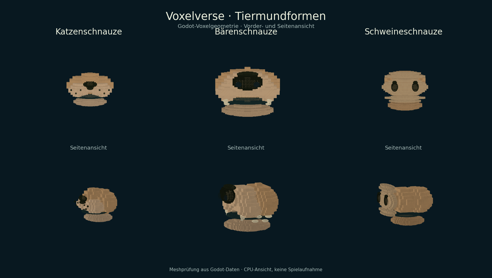
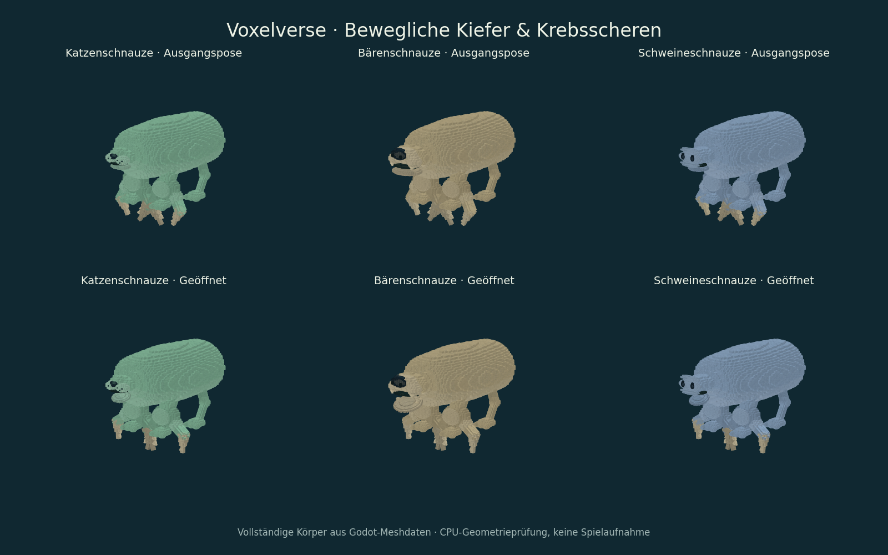

# ARCH-24-SNOUTS – Katzen-, Bären- und Schweineschnauzen

Fachpaket aus ARCH-24 / M3-TEILE.2. Aufbau auf den beweglichen Kiefern in
[PR #100](https://github.com/MajorDragonfly/voxelverse/pull/100).
Branch: `agent/arch24-snouts-20260915`.

Basis remote: `5d3d6321425f2072daafcb70b3b9c0b968252daf`, lokal
`4c4e2d5c3c0c78bc0dffa4d50b24d684c95545b6` mit identischem Tree
`7226a971518cae8ca79b394f8343fb45a4761780`.
Quellcommit: `b6cb30e4989bb3289efc653f1059d230706e1e5a`.
Quelltree: `ecbb692098033ce8b32bd95c4ebcfa539a2c4650`.

## Lieferung

| Form | Teil-ID | Merkmale | Bestehendes Werte-/Freischaltprofil |
|---|---|---|---|
| Katzenschnauze | `mouth_feline_snout` | Kurze Form, zwei Schnurrhaarkissen mit Punkten, kleine Nase, Fangzähne; 16 Meshteile | Raubkiefer |
| Bärenschnauze | `mouth_bear_snout` | Breite Wangen, großer Nasenspiegel, Fang- und Mahlzähne; 20 Meshteile | Breiter Schnabel / vorhandenes Allesfresserprofil |
| Schweineschnauze | `mouth_pig_snout` | Flache abgestufte Nasenscheibe, zwei Nasenlöcher, eigener Unterkiefer; 13 Meshteile | Breiter Schnabel / vorhandenes Allesfresserprofil |

Im Kreatureneditor unter **Teile → Mund** auswählen, sobald das zugehörige
Grundteil freigeschaltet ist. Alle drei Formen besitzen einen beweglichen
Unterkiefer; beim Bären folgen die unteren Mahlzähne. Nase und Oberkiefer
bleiben fest. Die Schweinenase besteht aus nebeneinanderliegenden Bändern,
damit sich keine deckungsgleichen vorderen Flächen überlagern.

Vorschau, gesperrte Silhouette, Editor, Laufzeit und portabler Bauplan verwenden
denselben Anbieter. Rotation, Größe, nichtuniforme Form und Spiegelung bleiben
bedienbar. Biss-/Fressanimation stammt aus PR #100; der Entwurf speichert nur
die vorhandenen Teil-IDs und Platzierungen.

Keine neuen Kosten, Ernährungswerte, Schäden oder Sinnesfähigkeiten. Neue
Modellalternativen erhalten ihr vorhandenes Profil ausdrücklich pro Definition.
Die drei zuvor gelieferten Mundmodelle behalten das Raubkieferprofil.
Neue Formen werden alten Wildarten nicht automatisch zugeteilt.

## Prüfung

Vier unterschiedliche Godot-Fachtests bestanden:
`creature_snout_family_test`, `creature_mouth_provider_test`,
`creature_part_articulation_test`, `community_blueprint_package_test`.
Import, Quellenverträge und Art-Quellenprüfung ebenfalls bestanden.

Der neue Familientest prüft unter anderem:

- 42 eingefrorene Meshfälle aller sieben bisherigen Mundformen; neue Formen
  bleiben geometrisch unterschiedlich und innerhalb ihrer festen Meshbudgets.
- Gespiegelte und nichtuniforme Geometrie, Gelenköffnung, feste Nase,
  mitbewegte Bärenzähne und vollständige Rückkehr zur Originalpose.
- Gesperrte/verdiente Teile im echten Editor, Undo/Redo und Transformationsregler.
- Echte Entdeckungsfreischaltung, idempotenter Import alter Freischaltstände,
  erhaltene Punkte/Entdeckungen und gemeinsame Buchanzeige.
- Speichern und neuer Godot-Prozess; IDs, Revisionen, Platzierungen und Farben
  bleiben erhalten. Portabler Export, doppelter lokaler Import ohne Duplikat
  sowie Offline-Verwendung mit den wirklichen Freischaltungen des Empfängers.

Die bisherigen Tests sichern zusätzlich den historischen Teilekatalog und
30 deterministische Altarten. Der neue Test verwendete im ersten Lauf einen
nicht vorhandenen Kataloghelfer; die Korrektur nutzt den echten lesenden
Freischaltanschluss. Unveränderte drei Verbraucherprüfungen wurden anschließend
wiederverwendet. [Manifest, Dateihashes und Originalprotokolle](evidence/arch24-snouts/results.json).

Die Ansichten stammen aus tatsächlichen Godot-Meshdaten und wurden per CPU
gerendert sowie visuell geprüft. Keine native Spielaufnahme, kein Windows-
Export und kein Ziel-PC-Nachweis. Die bereits in PR #100 festgestellte
Grafikfenstergrenze wurde nicht erneut geprüft.

## Übergabe

Der Folge-PR zeigt ausschließlich dieses Delta gegen den Branch von PR #100;
bei der Integration zuerst dessen Gelenkpaket übernehmen. Die Hauptbasis
bleibt `main` nach #92. Gemeinsame Integration und Windows-Spielansicht stehen aus.

Spielcode-Schreibbereiche: nur Mundkatalog und Mundgeometrie. Dazu gehören ein
neuer registrierter Test, die deklarierte Erweiterung der Katalog-Testliste,
ein korrigierter Altstand-Testaufbau sowie zwei bestehende QA-Hilfen.
ARCH-25-Editor/Sprachkatalog, ARCH-26 und ARCH-30 sind unverändert. Neue
Anbieternamen/Beschreibungen folgen den bisherigen deutschen Strings; die
vollständige DE/EN-Teilnamenabdeckung bleibt beim Sprachpaket.
Zentrale Statusseiten und Backlog-Häkchen bleiben beim Integrationschat.
