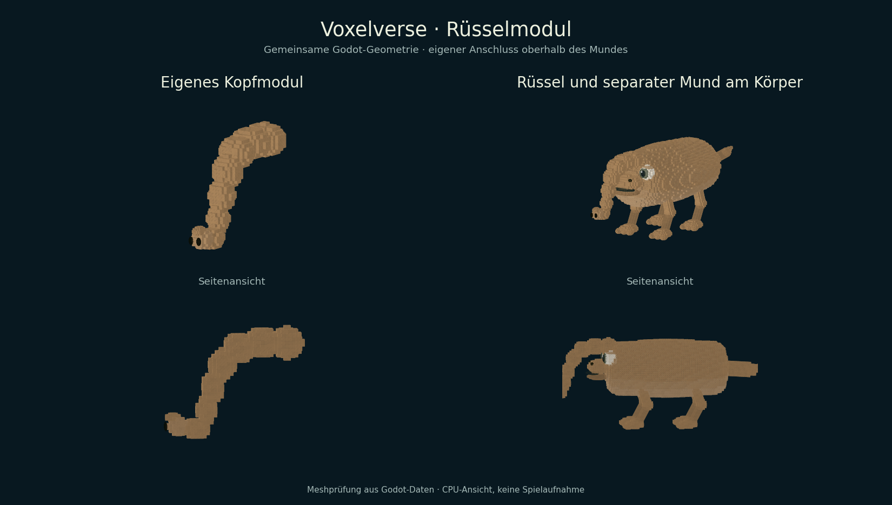

# ARCH-24-TRUNK – Eigenständiges Rüsselmodul

Fachlieferung vom 15. September 2026. Basis: `d378ca0ecd7f03429a5150df6358e0646ec06689`
(zusammengeführter PR #92). Branch: `agent/arch24-trunk`.

Im Kreatureneditor unter **Teile → Kopfmodule → Elefantenrüssel** auswählbar,
sobald die bestehende Filterschnauze freigeschaltet wurde. Alte Spielstände mit
dieser Freischaltung erhalten den Rüssel beim normalen Import, ohne zusätzliche
Entdeckungspunkte. Der vorhandene ProgressionService verarbeitet das neue
Anbieterprofil; eine weitere Freischaltverwaltung ist nicht nötig.

- `head_elephant_trunk`, Kategorie `head`: eigener Körperanschluss oberhalb des
  Mundes. Mund und Rüssel bleiben einzeln platzierbar, verstellbar und löschbar.
- Elf Meshbausteine: verjüngter Bogen, aufgebogene Spitze, zwei Nasenöffnungen.
  Die gemeinsame Mundgeometrie erzeugt Editor, Journal/Silhouette und Laufzeit.
- Neun Formpunkte, keine zusätzlichen Spielwerte. Keine Veränderung bestehender
  Ernährungs-, Kampf-, Greif- oder Tierrollenwerte. Die geringe Kopfbewegung folgt
  dem bestehenden Animator; eigenständige Rüsselgelenke/Greifaktionen bleiben offen.
- Eigene Platzierungs-UID, XYZ-Drehung, Größe, Achsskalierung, Undo/Redo sowie die
  vorhandenen V7-Speicherwege. Keine neue Bauplan- oder Fortschrittsversion.
  Alte Mundgeometrien und prozedurale Arten bleiben erhalten.



Ansichten aus den tatsächlichen Godot-Meshdaten des Anbieters und des vollständigen
`CreatureRuntimePreview`. CPU-Geometrieansichten, keine native Spielaufnahme oder
FPS-Abnahme. Die Front- und Seitenansicht zeigen den separat sichtbaren Mund.

## Prüfung und Übergabe

Godot `4.6.3.stable.official.7d41c59c4`, Linux, isolierte Nutzerverzeichnisse des
bestehenden Runners. [Ergebnismanifest](../validation/arch24-trunk/results.json)
und [vollständige lokale Prüflogs](../validation/arch24-trunk/logs.zip).
Der neue Test ist genau einmal im Vertrag `creature_body` registriert.

Der neue Fachtest prüft Freischaltung durch echte Entdeckung, Import alter
Freischaltungen ohne Quellmutation oder erneute Belohnung, Editor und Undo/Redo,
unabhängiges Entfernen beider Teile, radiale Körperbewegung, unveränderte
Spielwerte und einen neuen Prozess mit erhaltenen IDs, Anschlüssen und Entwürfen.
Bestehende Mund-, Körper-, Animations-, Bauplan-, Journal- und Forschungstests
prüfen die direkten Verbraucher. Die Mundprüfung bewahrt zusätzlich 24 alte
Geometriefälle und 30 deterministisch erzeugte Arten.

Für die erste Testvorbereitung war der vorhandene Anschlussnormalisierer des
Editors noch nicht ausgeführt; außerdem wurden Formpunkte fälschlich mit den
Spielwerten verglichen. Die Vorbereitung verwendet nun den regulären Ladeweg;
unveränderte bestehende Prüfungen wurden nicht nochmals vollständig ausgeführt.

Reproduktion der Modellansicht:

```sh
godot --headless --path . --script res://tools/export_trunk_review.gd -- /tmp/trunk-meshes.json
python3 tools/render_animal_foot_meshes.py /tmp/trunk-meshes.json /tmp/trunk-review.png --trunk
```

Gemeinsame Schreibbereiche: Kreaturenkatalog/-editor, Körperanschluss und
Animator, Journal-Kategorie sowie Testregistry. Der Integrationschat übernimmt
den PR und aktualisiert den zentralen Paketstatus. Native Darstellung, Export
und vollständige Kampagnenabnahme gehören zur gemeinsamen Lieferung.
