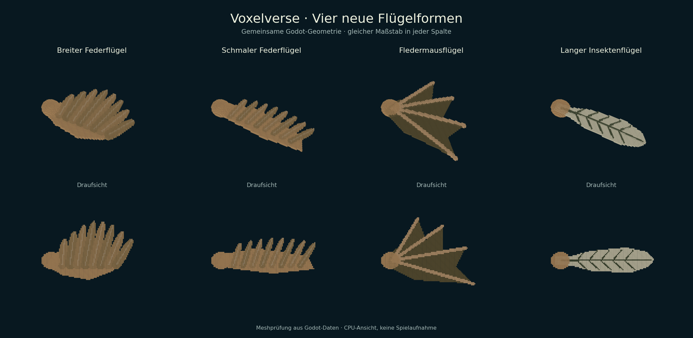
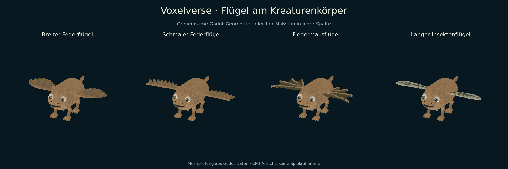
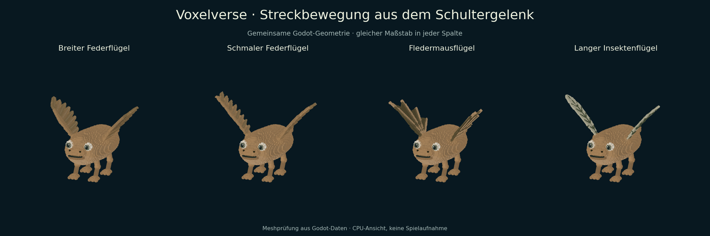

# ARCH-24-WING-FAMILIES · Vier Flügelformen

Nutzerauftrag vom 16.09.2026: nächstes Teilepaket nach den überarbeiteten Mündern,
Geweihen und Kämmen. Auswahl nach der zentralen Runde in Issue #137. Basis:
`176d088d34324de14952bc7506fe9763a22cf4b0`; Fachbranch:
`agent/arch24-wing-families-20260916`.

| Modell | Sichtbare Form | Referenz |
|---|---|---|
| Breiter Federflügel | Gerundeter Fächer mit acht erkennbaren Schwungfedern | `wings_broad_feather`, Revision 1 |
| Schmaler Federflügel | Lange, schmale Schwinge mit zurückgezogenen Federn | `wings_slender_feather`, Revision 1 |
| Fledermausflügel | Hautfläche mit vier tragenden Streben und gebuchtetem Rand | `wings_bat_membrane`, Revision 1 |
| Langer Insektenflügel | Helle, gerundete Fläche mit verzweigten Adern | `wings_long_insect`, Revision 1 |

## Verhalten

Die Kategorie **Flügel** steht im Kreatureneditor und im Entdeckungsbuch bereit.
Neue Flügel werden oben seitlich am Körper als Paar angebaut; Einzel- und
Mittelplatzierung, Rotation, Größe und XYZ-Form verwenden die bestehenden
Editorfunktionen einschließlich Undo/Redo. Die Vorschauaktion **Flügel strecken**
hebt die Fläche um höchstens 48° am festen Schulterstück an und kehrt in die
Ruhepose zurück. Die ruhige Standbewegung hat eine kleine Flügelbewegung.

Die Formen verwenden die vorhandenen Werte und Freischaltung von `decor_feathers`.
Alte Fortschrittsdaten erhalten ausschließlich abgeleitete Modellfreischaltungen;
Entdeckungen und Punkte bleiben erhalten. Fliegen ist keine neue Fähigkeit dieses
Pakets. Die Insektenfläche bleibt für den bestehenden Voxelstil und Renderer opak.

Jede Seite hat zwei Meshes: ein festes Schulterstück und eine verbundene bewegliche
Fläche. Die Bewegung transformiert vorhandene Meshes ohne Neubau. Das Raster hat
ein begrenztes Zellbudget; extreme XYZ-Formen behalten zusammenhängende Flächen.
Die Bibliothek hält höchstens 24 Farb-/Form-/Seitenvarianten im Cache. Vorschau,
Buch und Laufzeit verwenden denselben Anbieter. Die Bilder sind CPU-Ansichten der
tatsächlich exportierten Godot-Geometrie, keine nativen Spielaufnahmen.

## Kompatibilität und Prüfung

Hand- und Fußkataloge sowie deren Geometrieanbieter sind bytegleich zur Basis.
Die alten Katalogdefinitionen, 30 festgehaltenen Arten und vorhandenen Hand-/Fuß-
Modelle bleiben erhalten. Fehlende Modellrevisionen wählen Revision 1; unbekannte
IDs/Revisionen erzeugen keinen Ersatz. Speichern, Offline-Vorlagen und neue
Prozesse erhalten IDs, Revisionen und Form. Zukunftsrevisionen dürfen vorhandene
Entwürfe nicht überschreiben.

Die neue Familienprüfung umfasst 40 festgehaltene Geometrie-/Farbkombinationen,
Zusammenhang aller Flächen, Spiegelung, begrenzte Meshgrößen, Schulterkontakt bei
Streckung, echte Editoraktionen, radial gedrehte Körper, Speicherung und neue
Prozesse. Bestehende direkte Verbraucher wurden gezielt geprüft. Befehle,
Quellstände, Fehlerkorrekturen und vollständige Logs stehen im
[Prüfnachweis](evidence/arch24-wings/README.md). Keine Ziel-PC-, FPS- oder globale
Spielabnahme; die vier Pflichtgates bleiben Voraussetzung für eine Integration.

## Anschluss an die vorherige Lieferung

Die Lieferung basiert unabhängig auf `main` nach #144. Bei der Integration mit
#154 müssen beide additiven Katalogketten, Kategorien und Übersetzungsblöcke
übernommen werden. Der Gesamtumfang ist dann 50 platzierbare Modelle und elf
Endstücke. Die historische Kampagnenprobe muss erst die vier Kamm- und danach die
vier Flügelfreischaltungen ergänzen, passend zur Katalogreihenfolge; der vollständige
Vergleich der übrigen Fortschrittsdaten bleibt bestehen. Die Revision-2-Münder aus
#154 bleiben erhalten. Gemeinsame Statusdateien und die Vorschaukamera werden
hier nicht bearbeitet.

Die zwei vorherigen roten CI-Proben aus #154 wurden auf dessen eigenem Branch
korrigiert und gezielt erfolgreich geprüft: explizite Kamm-Migration und freie
Testaufstellung über die unveränderte produktive Kollisionsabfrage. Die Belege
liegen zusätzlich unter `evidence/arch24-wings/previous-mouth-ci/`.
