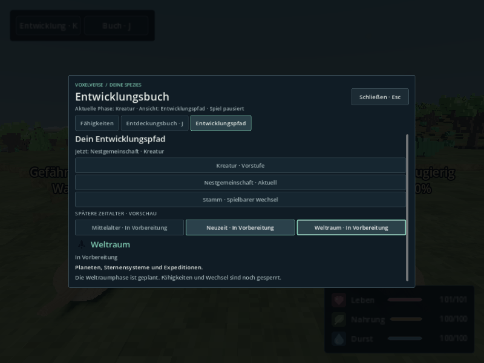
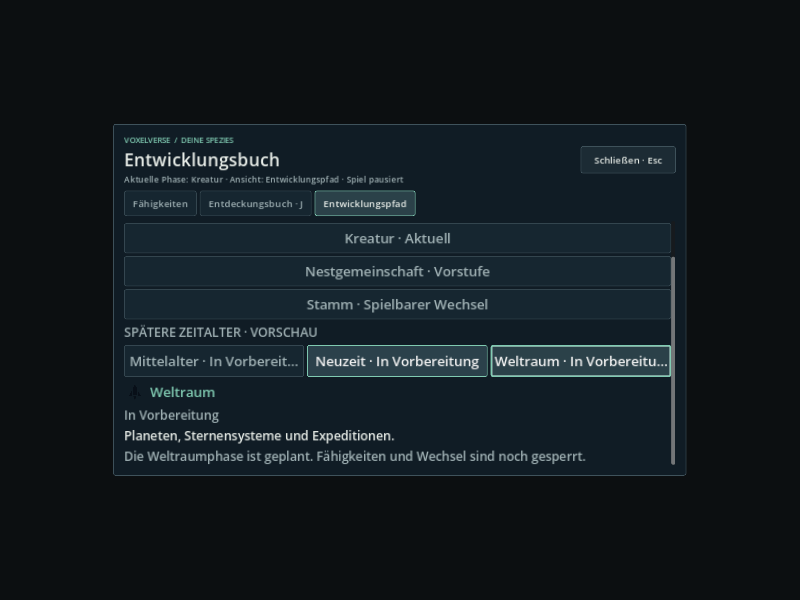

# V30-09 / INT30-09 – Menü, Audio und Entwicklungsbuch

Das Entwicklungsbuch war bei 800×600 und 130 % UI-Skalierung zu klein: Die globale 1920×1080-Canvas-Skalierung verkleinerte die Fließschrift auf 9,21 physische Pixel. `ui/development_path_panel.gd` berücksichtigt jetzt diese letzte Skalierung. Texte erreichen mindestens 12 Pixel, Kapitel- und Epochenknöpfe mindestens 13 Pixel; die kleinste gemessene Fließschrift beträgt 12,46 Pixel. Identische Layoutwerte lösen keine erneuten Minimumgrößen-Änderungen aus.

Bestätigte gemeinsame Basis aus AGENTS.md/#137: `2b1ac023db4074c2ce6b7db8fbab09ab929a8435` (Tree `5f815f478ceeabefcfc50a6388e3e4b0daa2ac45`). Branch: `agent/int30-09-menu-audio-book`; Entwurf [PR #231](https://github.com/MajorDragonfly/voxelverse/pull/231) gegen `agent/integration-pt19-20260930`.

Der vollständig geprüfte Produktionsstand ist lokal `98be4bbc913445d23ce4b598fb32390df8594006`, veröffentlicht als `91e445fda2bf7398801890a174ba8a077b6749c1`; beide haben exakt Tree `f6bc85dd88b163a50098fbd82d90637684ccb6ff`. Die zusätzlichen Bildhelfer wurden auf lokal `243d6b9a45de01fc2d3db350c8f243cf201c01a9` geprüft, veröffentlicht als `d55b49b9b0bda9184ce780e04c036ef7d7ad2934`; beide haben Tree `fcc2d654799ff3c31e5adee18411523ff5879e7e`. Die Produktionskorrektur, der kombinierte Godot-Test und seine Eingabefixture sind zwischen diesen Ständen bytegleich; siehe `tested-code-equality.json`. Abweichende Commit-IDs entstehen durch die Veröffentlichung über die GitHub-Git-API.

## Tatsächlich geprüfte Abläufe

| Ablauf | Ergebnis und Beleg |
|---|---|
| Öffentlicher Kugelkampagnenstart, normale bestätigte Kreatur → Stamm-Übergabe | Vollständiger kombinierter Headless-Lauf: **1.207 Prüfungen**, sauberer unveränderter Quellstand. |
| Esc in Kreaturen- und Stammesphase | Pause, Tastaturfokus, blockierte Bewegung/Simulation; Esc zur Fortsetzung und Wiederherstellung der Maussteuerung. DE/EN, 720p/1080p, 80/130 %; zusätzlich 800×600/720p bei tatsächlich angewandten 130 %. |
| Pause → Einstellungen → Grafik → Audio → zurück | Tab/Enter und echte Mausklicks; einzelne Menüebenen, Rückkehrfokus, Pausenbesitz. Hilfe, erste Schritte und Reiseauswahl kehren eine Ebene zurück. Grafik anwenden bleibt erhalten, verworfener Entwurf überschreibt sie nicht. |
| Taktische Stammespause und F8 | Space hinter Einstellungen setzt das Spiel nicht fort; Esc entfernt nur den Menübesitz, taktische Pause bleibt bis Space erhalten. |
| Master/Musik/Umgebung/Effekte/Menüklänge | **309 Audio-Prüfungen auf dem letzten Code-Tree**, zwölf native Bilder bei DE/EN, 800×600/720p/1080p und 150 %. Produktionsstimmen werden hinter den Bus-Fadern gemessen: halbe Lautstärke ≈ halbe RMS-Ausgabe, fremder Fader ohne Einfluss, Kanal- und Master-Stumm jeweils RMS 0. |
| Hörproben, Stumm/Zurück/Reset | Alle fünf Hörproben durch Enter, korrekter Bus und echte Stream-Instanz beim Start, Musikbesitz bleibt erhalten, Vorschau endet/beendet sich beim Schließen. Stumm und Wiederherstellen per Maus; Defaults per Enter. Rasche Wiederholungen erzeugen keine zusätzlichen Stimmen. Pausierte Kampagnenzeit bleibt gleich. |
| Einstellungen nach echtem Prozessneustart | Kombiniert: Musik 0,37, Nachtmodus, Belichtung 0,93, UI 130 % und Englisch. Audiotest: alle fünf gespeicherten Werte einschließlich Musik 0/Stumm sowie Nacht-/Hintergrundoptionen, erneutes Öffnen synchronisiert die Stummanzeige. |
| Entwicklungsbuch | K → Entwicklungspfad; alle sechs Kapitel (Kreatur, Nestgemeinschaft, Stamm, Mittelalter, Neuzeit, Weltraum) per Maus/Enter, DE/EN, Fokus im Scrollbereich, sichtbarer Schlussknopf, lokalisierte Detailtexte, unveränderte Kampagnen-/Fortschrittsdaten, Zukunftswechsel gesperrt, Esc gibt nur die Buchpause frei. |
| Gerenderter originaler Buchhost | **617 Prüfungen, 72 native PNGs, 48 Kapitelfälle**, 800×600/720p bei 130 %, DE/EN und ausdrücklich deklarierte Kreaturen-/Stammes-UI-Fixtures. Zusätzliche obere Ansichten der langen Kapitel dokumentieren Titel und Voraussetzungen. Dies ist ein separater UI-Nachweis ohne generierte Kugelwelt. |
| Direkter vorhandener Buchverbraucher | `development_path_test`: **DEVELOPMENT_PATH_OK** auf dem letzten Code-Tree; bestehender Heimgruppenvertrag, echte Punkte-/Kaufansicht, unveränderliche Vorschau, Laden, zukünftiges Schema und neue Kampagne. Isolierter Lauf, keine Freigabe des gemeinsamen Gates. |

Engine: Godot `4.6.3.stable.official.7d41c59c4`, Linux, Xvfb/OpenGL-Kompatibilität/Mesa llvmpipe, Dummy-Audiogerät und isolierte Nutzerdaten. Die Audioausgabe ist elektrisch geprüft; eine subjektive Hörabnahme am Ziel-PC wurde nicht behauptet. Buchaufnahmen zeichnen jeden Nachweis wirklich über OpenGL; zwischen den pausierten Aufnahmen entfällt redundantes Rendering. Kein kontinuierliches Video, FPS- oder Windows-Exportnachweis.

## Nachweise und verbleibender Anschluss

Die JSON-Dateien enthalten geprüfte Quellcommits/Trees, Engine/Befehle, saubere Anfangs-/Endstände und Log-/Bildhashes. Vollständige Bilder, Rohprotokolle und Quellmanifeste stehen im beigefügten `voxelverse_V30-09_Nachweise.zip`. Vorher/nachher unten vergleichen die tatsächliche Buchschrift; die Aufnahmehintergründe und Kampagnen-Fixtures unterscheiden sich. `font-diagnosis.json` vergleicht die physische Schriftgröße unter identischen Fenster-/Canvasbedingungen.




Neuere Wiederholungen des öffentlichen Weltstarts sind fehlgeschlagen, auch der letzte kombinierte Headless-Lauf. Sie werden **nicht** als bestandene Abnahme gezählt. Der native vollständige kombinierte Bildlauf mit 96 geplanten Bildern bleibt offen. Die gemeinsame Umgebung erreichte währenddessen ca. 8 GiB/8 GiB Speicher; die Ursache der verzögerten Weltstarts ist damit nicht abschließend isoliert. Vorhandene 90-/60-Sekunden-Watchdogs wurden nicht verlängert und fremde Prozesse nicht beendet. Ein Versuch, schon den Ladevorgang ohne laufendes Rendering aufzunehmen, wurde zurückgenommen. Der frühere erfolgreiche 1.207-Prüfungen-Lauf bleibt ein Nachweis seines exakten Trees.

Der reguläre `--changed-since … --plan --summary` und der gemeinsame Consumer-Runner stoppen beim noch unregistrierten `int30_menu_audio_book_test`. `chat1-connections.patch` wurde mit `git apply --check` gegen die feste Basis geprüft und ergänzt den Test genau einmal in `frontend_locale`, seinen bestehenden langen Prüfrahmen und die zwei Bildabläufe in Frontend-CI. **Chat 1** übernimmt diese gemeinsamen Dateien und prüft den integrierten Merge-Tree. Auf dem Fachbranch sind Registry, gemeinsame Validatoren, CI und Übersetzungskataloge unverändert; der Sprachkatalog prüft erfolgreich 1.938 Nachrichten in zwei Sprachen, neue Übersetzungsschlüssel waren nicht nötig. Stammespanel-Anschlüsse bleiben **Chat 6**.

Nach dem zentralen Anschluss: vollständiger nativer Kombinationslauf in einer verfügbaren Umgebung und die Pflichtprüfungen des integrierten Trees. Ziel-PC-Hören/Windows bleiben separate Abnahmen. Entwurf behalten; kein Main-Merge, Auto-Merge oder Schließen der Vorgänger-PRs.

## Reproduktion

```bash
python3 tools/review_int30_menu_audio_book.py --headless --godot /path/to/godot --output /tmp/int30-combined
xvfb-run -a -s '-screen 0 1920x1080x24' python3 tools/review_int30_menu_audio_book.py --book-frames --godot /path/to/godot --output /tmp/int30-book
xvfb-run -a -s '-screen 0 1920x1080x24' python3 tools/review_audio_settings.py --godot /path/to/godot --output /tmp/int30-audio
# Nach Chat-1-Anschluss: registrierter Consumer sowie vollständiger nativer Lauf
python3 tools/validate_godot.py --tests int30_menu_audio_book_test development_path_test --skip-main --output /tmp/int30-consumers
xvfb-run -a -s '-screen 0 1920x1080x24' python3 tools/review_int30_menu_audio_book.py --godot /path/to/godot --output /tmp/int30-native-world
```
