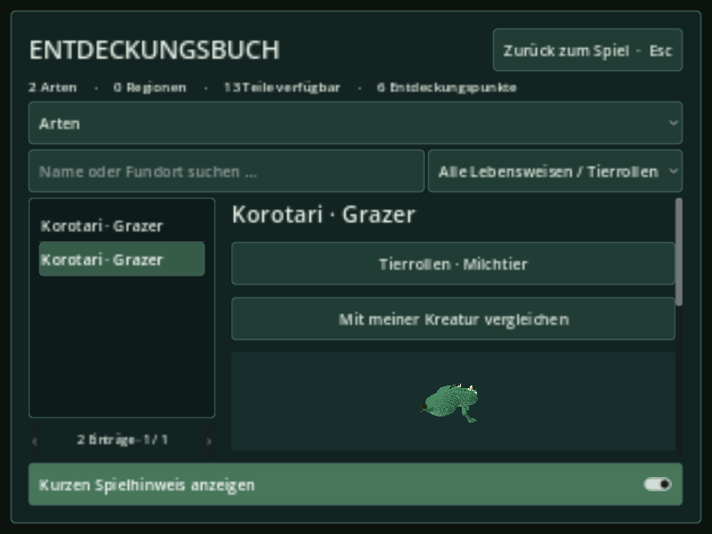
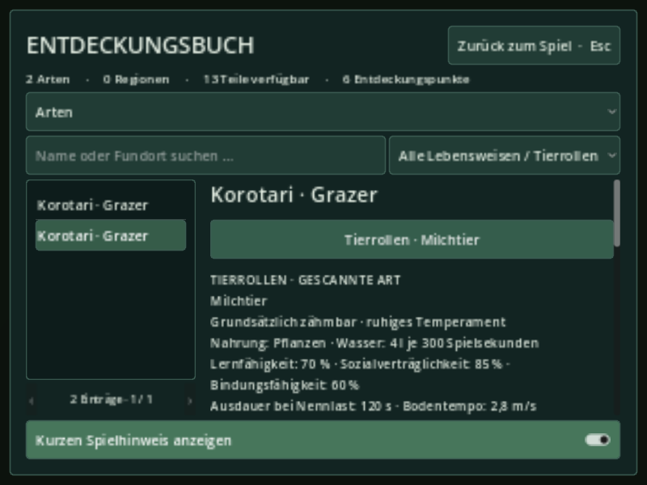
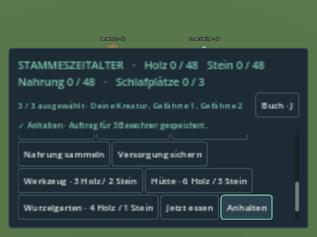
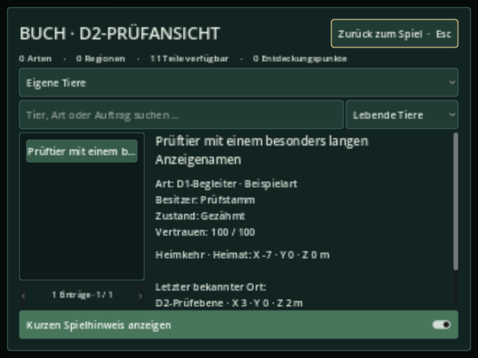
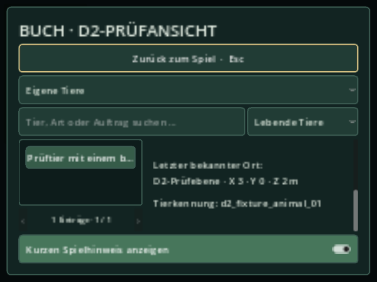
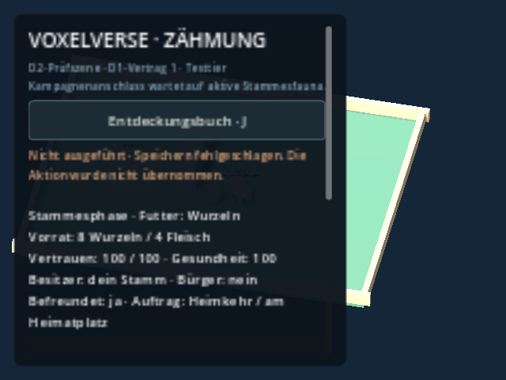

# Auftrag 7 – Entdeckungsbuch, Gruppenrückmeldung und Klang

Stand: 9. September 2026. Abgeschlossenes Teilpaket auf
`agent/interface-audio-task7`.

- Gemeinsame Basis: `3a3e0272375e556f3ff65b7370582af79a9d48b5`.
- Veröffentlichter Codecommit: `5f77966a9dc7e5b8739dc1f4519e558c45685cab`.
- Geprüfter lokaler Codecommit: `b50d290364cd53301056d7819555aed07a65ebf7`.
  Beide besitzen denselben Dateibaum `cf6d9cad730eafc86ca39d052d37ddbca87bd98b`.
- Der nachfolgende Dokumentationscommit ergänzt nur diesen Bericht und Prüfnachweise.
- Fortsetzung Tierregister: Codecommit `c6c409a9a91206caba45bea18c741d50544e44ce`,
  lokal geprüft als `122ddaa032d7255a0e010e3461a72588c7d0225b`.
  Identischer Dateibaum: `d65e7a5a0c9a6b84b514453c20ec9557b1aabc9e`.
- Fortsetzung Tierrückmeldung: Codecommit `d5c5fdcd42bffb826156cf879ca31106360d5cbc`,
  lokal geprüft als `a69f6f89045b76567c9fd15a0d674b474e5f24c8`.
  Identischer Dateibaum: `1350c3c8e65b431ba5d5a445139d6c83e6f32e32`.
- Kein Merge nach `main`, keine fremden unfertigen Arbeiten übernommen.
- Lars hat nach der lokalen Abnahme den öffentlichen Upload dieses Branches nach
  `MajorDragonfly/voxelverse` und die Erstellung eines PR ausdrücklich bestätigt.
  Der Integrationschat entscheidet weiterhin über die Übernahme nach `main`.

## Geliefertes Verhalten

Das gemeinsame Buch zeigt Arten, Körperteile, Regionen, Forschung, Vergleich und
den zusätzlichen Reiter **Eigene Tiere**. J und der Entwicklungseinstieg verwenden dieselbe Instanz. Das Stammes-HUD
hat zusätzlich einen sichtbaren Einstieg **Buch · J**.

Gescannte Arten können ihre D1-Eignung als Milchtier, Zugtier, Reittier und Begleittier
anzeigen. Der kompakte Rollentitel klappt die Einzelwerte auf. Nahrung, Wasserbedarf,
Lernfähigkeit, Sozialverträglichkeit, Bindungsfähigkeit, Ausdauer, Tempo, Wahrnehmung,
Milchmenge/-intervall, Zugkraft und Traglast verwenden die Einheiten aus D1.
Sattel/Geschirr erscheinen als Anforderungen, nicht als freigeschaltete Aktionen.
Suche und Rollenfilter berücksichtigen ausschließlich vorhandene, vollständig
gescannte Einträge. Ökologische Lebensweise und Tierrolle bleiben getrennt.

Eine Freundschaft und eine unvollständige Beobachtung zeigen keine Tierrollendaten.
Alte, fehlende, ungültige und unbekannte Vertragsstände bleiben ohne erfundene Werte
lesbar. Das Öffnen des Buches erzeugt weder Arten, Tiere noch Belohnungen.

Die Gruppenrückmeldung zeigt die Zahl und Namen ausgewählter Bewohner sowie
mitgeführtes Transportgut. Ein angenommener Auftrag heißt ausdrücklich **gespeichert**;
damit wird keine abgeschlossene Arbeit behauptet. Ablehnungen nennen den tatsächlichen
Grund, einschließlich leerer Auswahl, fehlendem Werkzeug, ungeladenem Boden und
Schreibfehlern. Die bisherige Speicherung entscheidet weiterhin über den Erfolg.

Die Klänge hören auf dasselbe `order_resolved`-Ereignis. Eine unmittelbare Ablehnung
nach einem erfolgreichen Befehl bekommt ihren Fehlerklang. Durch die kurze
Ratenbegrenzung unterdrückte Ereignisse können nicht durch spätere Duplikate erneut
klingen. Kein Ton läuft pro Gruppenmitglied oder allein wegen eines Buttonklicks.

Das Stammes-HUD verdeckt fremde Pausenfenster nicht mehr. Sein eigener Pausezustand
bleibt erhalten; es entsteht kein weiterer Pauseverwalter. Scrollbare Gruppenaufträge,
ein kompakter Reiterauswahlschalter und kleinere Vorschauen halten die Bedienung bei
kleinen Fenstern erreichbar.

## D1: geprüfter Anschluss, getrennte Lieferung

Vertragsgrundlage ist der abgegrenzte Commit
`bb43b61482ab129b72a66b5299a6bfec80a1e128` aus Auftrag 3 mit
`docs/D1_DATA_CONTRACT.md` und
`world/fauna/domestication/domestication_contract.gd`.

Der Reader lädt diesen **vorhandenen** Validator optional. Ohne D1 im gemeinsamen
Projekt bleibt das Buch funktionsfähig und meldet fehlende Eignung. Es enthält keine
Kopie des D1-Validators und ruft niemals dessen Generator `suitability()` auf.
Gelesen wird ausschließlich
`discovered_species[...].journal.visual.species.domestication`, nach Dekodierung durch
die vorhandenen `DiscoveryRecords` und Prüfung von `scan.version == 1` sowie
`scan.complete == true`. Der D1-Validator besitzt weiterhin alle Eignungsregeln.

Die positive Integrationsprüfung lädt die exakte Vertragsdatei des genannten Commits
in einem isolierten Testpfad und speichert Testbeobachtungen über die vorhandenen
Services. Das ist kein Nachweis des noch getrennt entwickelten planetaren Generators,
seiner Morphologie oder seiner erreichbaren Vorkommen. Produktive D1-Werte erscheinen
erst, wenn D1 integriert ist und die entsprechenden Tiere tatsächlich gescannt wurden.

## D2: lesender Buchanschluss, Kampagnenintegration noch offen

Der inzwischen geprüfte D2-Vertrag aus PR #30, Commit
`da6dbd62f505a688aba439cefe42ac8f029da4d4`, ist angeschlossen. Der neue Reader
verwendet ausschließlich D2s `owned_animals(faction_id, true)` und dessen vorhandenen
`animal_state.gd`-Validator. Die öffentliche `registry` wird zur Prüfung des
Vertrags und des Kampagnen-/Körperbezugs gelesen, niemals verändert.
Sowohl Register als auch Validator müssen Schema 1 verwenden.

Das Buch zeigt einzelne eigene Tiere mit vorhandenem Anzeigenamen, Art, Besitzer,
Zähmzustand, Vertrauen **0–100**, Auftrag und letztem bekannten Ort. Folgen nennt den
Betreuer; Warten und Heimkehr nennen ihr Ziel. Ein Heimkehr-Auftrag behauptet keine
Ankunft. Positionen verwenden D2s benannten Ebenenadapter und Meter. Hunger, Durst,
Milchproduktion und Ausrüstung werden nicht aus reservierten Feldern behauptet.

Lebende Tiere sind der Standardfilter. Verstorbene bleiben als eigene Historie mit
letztem Besitzer und ohne aktiven Auftrag lesbar. Suche und die vorhandene Seitennavigation
gelten auch für Tiere. Wilde, befreundete und erst teilweise gezähmte Tiere erscheinen
nicht als Besitz. Fehlende Namen werden gekennzeichnet; die stabile Tierkennung bleibt
lesbar. D2 Schema 1 besitzt kein eigenes Namensfeld. Der Host kann vorhandene Namen
auflösen; das Buch erfindet weder Namen noch eine Umbenennungs-/Speicherfunktion.

Bestätigte `animal_changed(object_id, code)`-Ereignisse aktualisieren die offene Ansicht.
Öffnen und Laden erzeugen keine Erfolgsgeräusche, Belohnungen oder Schreibvorgänge.
Ohne D2, nach Abmelden/Freigeben des Controllers, bei fremder Kampagne/Körper/Fraktion
oder unlesbarem Format wird kein alter Tierbestand weiter angezeigt.

### Anschluss für den Integrationshost

Die existierende Journalinstanz verwenden, nachdem D2 erfolgreich konfiguriert wurde:

```gdscript
journal.bind_owned_animals(controller, current_animal_scope, resolve_animal_label)
# Nach erfolgreichem Laden in denselben Controller: configure sendet kein Ereignis.
journal.refresh_owned_animals()
# Vor Verlassen des Hosts oder Wechsel zu einem anderen Controller:
journal.unbind_owned_animals()
```

`current_animal_scope()` liefert die tatsächlichen aktuellen `campaign_id`, `body_id`
und `faction_id` des Hosts. Diese kleinen Identitätswerte werden bei geöffneter Tierseite
auch auf Wechsel geprüft. `resolve_animal_label(kind, id)` ist optional und liefert
vorhandenen Text für `animal`, `species`, `faction`, `handler` oder `body`; ein leerer
Rückgabewert benutzt den gekennzeichneten Ersatztext. Diese Callback-Schnittstelle
ist reine Darstellung, kein zusätzliches D2-Schema. Der Reader besitzt den Controller
nicht und trennt seine Ereignisverbindung beim Wechsel bzw. Verlassen des Buches.

Das gemeinsame Buch enthält bereits den Reiter. Da D2 auf `main` noch keinen
produktiven Host besitzt, zeigt er dort den fehlenden Anschluss an. Der Testwrapper
`tests/fixtures/owned_animal_d2_preview.tscn` bindet das **unveränderte D2-Labor**
an dieselbe Buchklasse. Seine Überschrift und Bezeichnungen markieren Prüfdaten.
Speichern/Zähmung/Bewegung stammen vollständig aus D2; es gibt keinen kopierten
Controller und keine zweite Laborspeicherung. Ohne D2 lässt sich auch dieser Wrapper
öffnen und zeigt den Leerzustand. Der frühere reine Textprüfstand bleibt separat.

## Dateien und gemeinsame Anschlüsse

| Dateien | Änderung |
|---|---|
| `ui/discovery/animal_suitability.gd` | Lesende D1-Präsentation, zentrale D1-Validierung, Scanvoraussetzung, deutsche Einheiten |
| `ui/discovery/discovery_journal.gd` | Bestehendes Buch erweitert, Rollenfilter, aufklappbare Details und kleine Fenster |
| `ui/discovery/owned_animal_reader.gd` | Lesender D2-Vertrag, Fraktions-/Weltbezug, Ereignisbindung und formatierte Tiereinträge |
| `ui/discovery/owned_animal_register.gd` | Tierdetails innerhalb des vorhandenen Buches |
| `ui/frontend/group_feedback.gd` | Lesende Auswahl-/Ergebnisanzeige und Einstieg ins bestehende Buch |
| `ui/tribe/tribe_panel.gd` | Gezielter UI-Anschluss, Scrollbereich, Rücksicht auf vorhandene Pausebesitzer; Bewohnerzahl nicht mehr fest in der Anzeigeschleife |
| `world/tribe/tribe_controller.gd` | Gezielter Ereignisanschluss für ungeladenen Boden und präzise Ablehnungsgründe; Wirtschaft unverändert |
| `audio/runtime/order_audio.gd` | Fehlerfeedback und Duplikatverhalten innerhalb der vorhandenen Klang-API |
| `tests/interface_task7_test.gd` | Reale Buch-/Gruppen-/Save-/Audio-Anschlüsse auf der vorhandenen Stammesprüfszene |
| `tests/fixtures/owned_animal_register_preview.*` | D2-Prüfszene, ausdrücklich ohne Kampagnenanschluss |
| `tests/fixtures/owned_animal_d2_preview.*` | Gemeinsames Buch am unveränderten D2-Labor; Laden-/Reset-Anschluss |
| `tests/owned_animal_register_test.gd` | Echter D2-Ablauf, Speicherfehler, Lebenszustand, Scopewechsel, Neustart und kompakte Bedienung |

Hinzu kommen die UID-Dateien der neuen Skripte und die nachstehenden Nachweise.
**Keine Schemaänderung, kein neuer Speicherpfad, kein neuer Autoload.**
`ROADMAP.md`, `project.godot`, globale Speicher- und Fortschrittsservices sowie
Tiergeneratoren wurden nicht geändert. Die beiden `tribe`-Dateien bei der späteren
Integration mit Auftrag 5 abgleichen; ausschließlich die oben genannten UI-/Ereignis-
Anschlüsse übernehmen und dessen neue Versorgungslogik erhalten.

## Prüfung

Godot `4.6.3.stable.official.7d41c59c4`: Import, Kunstquellenprüfung und sechs gezielte
Testläufe bestanden. Ergebnisse und Protokolle unter
[`validation/interface-task7/`](../validation/interface-task7/).

- Buch mit echter Speicherung und Neustart, Forschung und Vergleich unverändert nutzbar.
- Bestätigter Stammeswechsel, Transporte, Bauaufträge, fehlgeschlagene Speicherung,
  Pause und erneutes Laden über die vorhandene vollständige Stammesprüfung.
- D1-Vertrag positiv für Milch-, Arbeits- und Begleittiere; fehlende Daten, unvollständiger
  Scan und Zukunftsversion bleiben ohne Eignungswerte. Keine zweite Scanbelohnung.
- Erfolgs-/Fehlerklänge, sofortige Ablehnung nach Erfolg, unterdrückte Duplikate,
  Scanner-Lebenszyklus und bestehende Komfort-Audioprüfung bestanden.
- Zusätzlich grafisch mit Mesa/llvmpipe: echte Klicks auf scrollbare Befehle und den
  Buchbutton; alle fünf Reiter, Rolle aufklappen, fremde Pausen und Rückkehr zur Gruppe
  bei 1280 × 720, 800 × 600 und 640 × 480 geprüft.

Reproduktion der gezielten Suite:

```sh
python tools/validate_godot.py --godot /pfad/zu/godot --skip-main \
  --tests interface_task7_test discovery_journal_test research_goals_test \
  species_comparison_test tribal_age_test audio/interface_audio_test
```

Solange D1 noch nicht integriert ist, kann die **exakte** oben genannte Vertragsdatei
über `VOXELVERSE_D1_CONTRACT=/absoluter/pfad/domestication_contract.gd` nur dem Test
bereitgestellt werden. Der Test meldet `d1_checked: true` für den positiven Nachweis;
ohne verfügbaren D1-Validator meldet er ausdrücklich `false` und prüft den Rückfall.

Windows-Zielgerät, endgültige Hörabnahme und echte D1-/D2-Spielschleifen bleiben offen.
Es wird kein neuer Windows-Build und keine komplette D2-Integration behauptet.

## Bildnachweise

D1-Vertragsdaten an einer gespeicherten **Testbeobachtung**, kein Beleg eines
produktiven D1-Spawns:





Echte Gruppenbefehle in der vorhandenen Stammesprüfszene:



## Prüfung der D2-Fortsetzung

Nachweise unter [`validation/interface-task7-d2/`](../validation/interface-task7-d2/).
Godot 4.6.3: Import/Quellen und fünf betroffene Testläufe ohne D2 bestanden;
der neue Test meldet dabei ausdrücklich `d2_checked: false`. Zusätzlich besteht
derselbe Test mit dem echten D2-Paket (`d2_checked: true`) in einem getrennten
Prüfauszug. Dessen fremde Dateien wurden ausschließlich aus dem oben gepinnten
Commit exportiert; sie sind nicht Teil dieses Branches.

- Vier D1-geprüfte Futtergaben über D2, vier reale Inventarkosten, Besitz erst bei 100.
- Befreunden und Teilzähmung bleiben ohne Registereintrag; Folgen/Warten/Heimkehr,
  Pausensperre und abgewiesene Speicherung verwenden die echten D2-Methoden.
- Bestätigter Tod aktualisiert die offene Ansicht; Historie zeigt keinen aktiven Auftrag.
- Leere/fremde Fraktion, fremder Körper und fremde Kampagne werden getrennt geprüft.
  Zukunftsschema und freigegebener Controller entfernen alte Einträge.
- Erneute Bindung erzeugt keine zusätzlichen Abonnements; Lesen verändert weder
  D2-Register noch Labordatei, Fortschritt oder Kampagnen-Sentinel und spielt keinen
  Befehlsklang. Der Buchanschluss führt keine zweite Audioquelle ein.
- Laden in denselben Controller ersetzt die angezeigte Position. Ein zweiter Prozess
  liest dieselbe gespeicherte Tierkennung, denselben Besitz und den Heimkehr-Auftrag.
- Grafisch mit Mesa/llvmpipe bei 1280×720, 800×600 und 640×480: lange Namen,
  scrollbare Details bis zur Tierkennung und echter Klick auf Schließen/Pausenrückgabe.

Die bestehenden Buch-, Forschungs-, Vergleichs- und Gruppenanschlüsse wurden mitgeprüft.
Die vollständige Stammes-/Audioabnahme des ersten Pakets bleibt oben dokumentiert;
das Registerteilpaket veränderte deren Controller und Klangmodule nicht.

Reproduktion ohne integriertes D2:

```sh
python tools/validate_godot.py --godot /pfad/zu/godot --skip-main \
  --tests owned_animal_register_test interface_task7_test discovery_journal_test \
  research_goals_test species_comparison_test
```

Für die positive Prüfung einen separaten Projektordner mit diesem Branch anlegen.
Dort ausschließlich `world/domestication/` und
`world/fauna/domestication/domestication_contract.gd` aus D2-Commit
`da6dbd62f505a688aba439cefe42ac8f029da4d4` ergänzen. Nach Godot-Import:

```sh
godot --headless --path /pfad/zum/pruefauszug \
  --script res://tests/owned_animal_register_test.gd
# Mit demselben isolierten Benutzerverzeichnis in einem neuen Prozess:
godot --headless --path /pfad/zum/pruefauszug \
  --script res://tests/owned_animal_register_test.gd -- --verify-reload
# Manuell: derselbe Prüfauszug, keine Kampagneninstallation.
godot --path /pfad/zum/pruefauszug res://tests/fixtures/owned_animal_d2_preview.tscn
```

Grafische Prüfdaten im bestehenden Buch:





Die produktive D2-Kampagnenfreigabe, Phase-1-Fauna, gemeinsame SaveGameService-
Transaktion und Integration der D1-Spawnlieferung bleiben Aufgaben der Integration.
PR #30 wurde nicht verändert oder übernommen. Die separate optische Überarbeitung
soll die hier dokumentierten Buch-/D1-/D2-/Pausenanschlüsse erhalten. Windows-Zielgerät
und abschließende Hörabnahme bleiben offen. Kein Merge nach `main`.

## Fortsetzung: Meldungen und Klänge für Tieraktionen

`ui/frontend/animal_action_feedback.gd` verbindet den unveränderten D2-Controller
mit einem vorhandenen Meldungsbereich und der vorhandenen Audioverwaltung.
Die Scope-Prüfung und Zahlenformatierung stammen aus dem gemeinsamen Tier-Reader;
die eigentliche Vertragsvalidierung bleibt vollständig bei D2.

| Tatsächliches Ergebnis | Rückmeldung / vorhandener Klang |
|---|---|
| Futter angeboten | Reichweite/Sicht halten; noch kein Erfolgsklang |
| Futtergabe gespeichert | Tatsächliches Vertrauen aus D2, `order_feed` |
| Zähmung vollständig gespeichert | Tier gehört jetzt dem Stamm, Meilensteinklang unter `order_tame` |
| Folgen / Warten / Heimkehr gespeichert | Betreuer bzw. Auftragsziel; `order_move` / `order_wait` |
| Aktion abgewiesen | Verständlicher Grund aus D2s Rückgabe, `order_reject` |
| Unfertige Gabe unterbrochen | Grund und keine Kosten für diese unfertige Gabe; bewusstes Abbrechen bleibt still |
| Laden / Binden / Buch öffnen | Keine wiederholte Aktionsmeldung und kein Erfolgsklang |

Die Texte behaupten bei Bewegungsaufträgen keine Ankunft. Futterwerte und
Vertrauensgewinn werden nicht neu berechnet. Unbekannte interne Ablehnungsgründe
erhalten einen neutralen deutschen Ersatztext. Die Nachricht bleibt auch bei
unterdrücktem oder stummgeschaltetem Klang lesbar.

Die Klangzuordnung ergänzt nur `follow`, `home` und `tame` in der vorhandenen
Befehls-API. `order_tame` referenziert die vorhandene `discovery.wav`; keine neuen
Audiodateien, Stimmenpools, Busse oder Einstellungen. Der Ton vergibt keine Punkte.
Stimmenbegrenzung, Ratenbegrenzung, Fehlerpriorität, UI-Lautstärke und
Komforteinstellungen gelten weiter. Alle konkreten Host-Aufrufe stehen in
[`audio/README.md`](../audio/README.md), Abschnitt „D2-Tieraktionen“.

Erfolge stammen ausschließlich aus `animal_changed`. Der Host leitet tatsächliche
Rückgaben an `report_result()` weiter; erfolgreiche Rückgaben werden dort ignoriert.
Fehler werden über eine Host-Request-ID vor doppelter Meldung geschützt. Nach Laden
ruft der Host `clear_after_load()` auf, beim Wechsel `unbind()`. Während Pause laufen
keine neuen Tierklänge, und danach wird nichts nachgeholt. Der Baustein führt keine
Tieraktion aus, pollt keine Aktionsrückgaben und schreibt keine Daten.

### Prüfung der Tierrückmeldung

Nachweise: [`validation/interface-task7-animal-feedback/`](../validation/interface-task7-animal-feedback/).
Godot 4.6.3: Import/Artquellen sowie vier betroffene Tests ohne D2 bestanden.
Zusätzlich verwendet `tests/audio/animal_action_feedback_test.gd` den unveränderten
D2-Prüfauszug am Commit `da6dbd62f505a688aba439cefe42ac8f029da4d4`:

- Falsches Futter, unbezahlter Reichweitenabbruch und fehlgeschlagene Speicherung
  am Ende einer im ursprünglichen Labor-Physiktakt laufenden Futtergabe.
- Vier tatsächliche Futterkosten, bezahltes Vertrauen und anschließende Zähmung
  mit dem realen vorhandenen Audiostream, ohne zusätzliche Punkte.
- Folgen/Warten/Heimkehr, unmittelbarer Fehler nach Erfolg, wiederholte Rückgaben
  auch nach Ablauf der Klangbegrenzung und idempotente Ereignisbindung.
- Pause, Buch/Laden, fremde Fraktion/Körper, Abmeldung und separater Prozessneustart
  ohne nachträgliche Erfolgsgeräusche; unveränderter Kampagnen-Sentinel.
- Grafisch bei 800×600 und 640×480: realer Klick auf den gescrollten Befehl und
  sichtbare Fehlerrückmeldung. Die Prüfansicht verwendet physische UI-Größen.

Der Wrapper `tests/fixtures/animal_feedback_d2_preview.tscn` erweitert die bestehende
Buch-/D2-Prüfszene. Er leitet reale Button-Ergebnisse weiter. Nur dieser Laborwrapper
beobachtet zusätzlich Änderungen an D2s `last_result`, weil das unveränderte Labor
`advance_offer()` intern aufruft. Der produktive Host soll dessen tatsächliche
Rückgabe direkt weiterleiten. Die Laborquellen wurden nicht geändert oder in diesen
Branch übernommen; ihre vorhandene Zustands-/Bewegungsanzeige bleibt eine Laboranzeige.

Reproduktion im bereits beschriebenen separaten D2-Prüfauszug:

```sh
godot --headless --path /pfad/zum/pruefauszug \
  --script res://tests/audio/animal_action_feedback_test.gd
godot --headless --path /pfad/zum/pruefauszug \
  --script res://tests/audio/animal_action_feedback_test.gd -- --verify-reload
godot --path /pfad/zum/pruefauszug res://tests/fixtures/animal_feedback_d2_preview.tscn
```



Keine zusätzliche Pause-, Zähmungs-, Speicher- oder Buchimplementierung. Die normale
Kampagne braucht weiterhin den freigegebenen D2-Host und dessen gemeinsame
Speicherung; dort sind Buch und Feedback anschließend einmalig anzuschließen.
