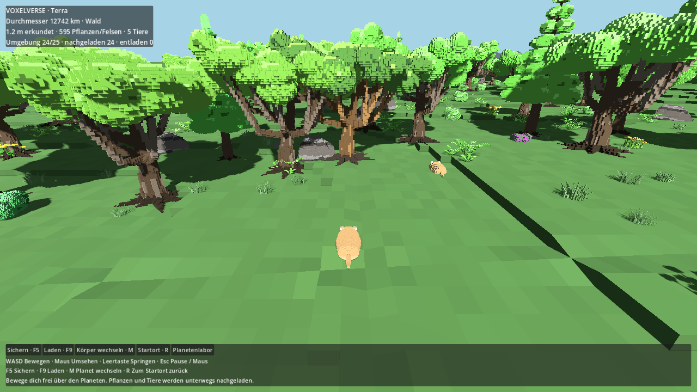

# M1d – belebte Voxelwelt auf real großen Planeten

Stand: 9. September 2026. Fortsetzung von Auftrag 1 nach dem ausdrücklichen Nutzerziel: Die Planeten sollen eine begehbare Landschaft wie das bestehende Flachland tragen, mit einer Funktion wie in Spore.

Nachfolgende Boden-/Wasserüberarbeitung und geprüfte Gründe gegen eine sofortige Flachwelt-Abschaltung: [WORK_M1D_GROUND_WATER.md](WORK_M1D_GROUND_WATER.md).

- Gemeinsame Ausgangsbasis: integrierter `main`, **`3a3e0272375e556f3ff65b7370582af79a9d48b5`**.
- Eigener Branch: **`agent/m1d-surface-adapter`**; [Draft-PR #31](https://github.com/MajorDragonfly/voxelverse/pull/31).
- Erstes Adapterpaket: veröffentlicht als `97e9e91a0b5babd10d303df97bfa719224f72300`; siehe [ersten Übergabebericht](WORK_M1D_SURFACE_ADAPTER.md).
- Belebte Landschaft, Code/Tests/Grafik: **`77f1d9c8a22eeae4524cb33f94612982cca1c3ae`**. Lokal validierter Commit: `85e453b1b81ba32cf3511e8bd9a50f1fcf40308d`. Beide haben exakt denselben Git-Quellbaum **`a75e9d39889dd6de43af4d784d225f83be559e72`**. Die unterschiedlichen Commit-IDs entstehen durch die Veröffentlichung über die GitHub-Verbindung. Dieser Bericht folgt separat.
- Keine fremden unfertigen Änderungen übernommen, keine Übernahme nach `main`. `ROADMAP.md` und gemeinsame Auftragstabelle bleiben beim Integrationschat. **M1d als vollständige Kugelkampagne ist weiterhin offen.**

## Ausprobieren und Ergebnis

Im vorhandenen Planetenlabor **„Belebter Voxelplanet“** wählen. Alternativ:

```sh
godot --path . res://world/planet_lab/living_planet.tscn
```

Terra hat unverändert **6.371.000 m Radius / 12.742 km Durchmesser**. Neris hat 100 km, Orin 1.000 km Durchmesser. Die Szene verwendet einen neuen, ausdrücklich versionierten Kugelgenerator. Berge, Hügel, Küsten und Meer werden auf allen sechs Kugelflächen aus demselben körperfesten dreidimensionalen Feld berechnet. Nahes Terrain besteht aus den vorhandenen Voxelstufen mit echter radialer Kollision; weit entferntes Terrain verwendet das bestehende adaptive LOD-System.

Die Welt übernimmt V9-Planetenprofile, Materialfarben und Biomkomposition aus dem Flachland sowie die vorhandenen Eichen, Kiefern, Büsche, Felsen, Grasbüschel, Farne und Blumen. Die Flachlandkarte selbst wird nicht gebogen oder heimlich ersetzt. Die Vegetation wird deterministisch auf der Kugel verteilt, mit radialen Körperachsen und den vorhandenen Stamm-, Busch- und Felskollisionen. Gras und Blumen erhalten keine festen Hinderniskörper.

Die vorhandene Kreaturendarstellung begleitet den Spieler in dritter Person. Zusätzliche Tiere verwenden die bestehende V7-Artenfabrik und Laufzeitdarstellung. Sie bewegen sich physisch zwischen lokalen Punkten, werden einzeln gespeichert und nach Rückkehr mit demselben Körper aufgebaut. Der Baum und die feste Kreatur aus der Adapterprobe bleiben als Startort-Referenzen erhalten. Wasseroberfläche, Schwimmen und Kamera-Unterwasseransicht benutzen denselben Meeresspiegel auf der Kugel.

WASD bewegt, Maus dreht, Leertaste springt, Esc pausiert. F5 sichert, F9 lädt, M wechselt zwischen den drei Planeten, R kehrt zum Startort zurück. Der Rückweg ins Planetenlabor sichert vorher. Die Benutzeranzeige zeigt erkundete Meter sowie tatsächlich geladene Pflanzen, Felsen und Tiere.



## Geänderte Dateien und gemeinsame Anschlüsse

| Modul | Aufgabe |
|---|---|
| `world/surface/living_planet_surface.gd` | Kontinuierliches radiales Gelände, zehn gewichtete Biome, V9-Paletten und Landschaftskomposition |
| `world/surface/planet_surface_factory.gd` | Auswahl über `surface_generation = living_planet_v1`; Körper ohne diese Kennung verwenden weiterhin den bisherigen Generator |
| `world/surface/surface_population_job.gd` | Reine CPU-Vorbereitung deterministischer Pflanzenpositionen, radialer Transformationsmatrizen und Habitatkandidaten |
| `world/surface/surface_ecosystem.gd` | Begrenztes Nachladen, bestehende MultiMesh-/LOD-Assets und zusammengesetzte Kollision; aktive Tiere und erhaltene Individuen |
| `world/surface/living_planet_store.gd` | Eigene validierte atomare Sicherung einschließlich typgetreuer Tierkörper und Backup |
| `world/planet_lab/living_planet.gd`, `.tscn` | Begehbare Welt, Planetenwechsel, Ortsrückkehr, Wasseransicht, Bedienung |
| `world/planet_lab/planet_lab.gd` | Vier weitere Zeilen für den Einstiegsknopf |
| `world/planet_lab/planet_mesh_batch.gd` | **Gemeinsamer Kernanschluss:** zwei geänderte Zeilen wählen im Terrainworker dieselbe Oberflächenfabrik wie die Physik |
| `world/surface/surface_terrain.gd` | Dieselbe Fabrikauswahl beim Konfigurieren des Adapterterrains |
| `world/planet_lab/surface_adapter_lab.gd` | Austauschbarer Speicheradapter und zugänglicher Hilfetext; bestehende Probe behält ihre bisherigen Standardwerte |
| `world/surface/surface_creature.gd` | Optional übergebener vorhandener Kreaturkörper statt ausschließlich fester Standardform |
| `tests/living_planet_test.gd`, `tests/living_planet_entry_test.gd` | Laufzeit, Kollision, Streaming, typgetreuer Neustart, Wasser und tatsächlicher Menüablauf |
| `art/review/m1d_living_planet/` | `validation.json` mit Messwerten und Prüfergebnissen; tatsächlicher Screenshot `living_planet.png` |

Neue Skripte enthalten ihre Godot-UIDs. Kein geänderter V9-Generator, keine Änderung in `autoload/`, `project.godot`, produktivem Spieler-/Wildtiercode oder globalem Speicherschema. Die Fabrikauswahl im bestehenden Terrainworker ist der gezielt zu prüfende gemeinsame Einbaupunkt.

## Streaming und Speichervertrag

Der Pflanzenstreamer hält höchstens **25 Oberflächenbereiche**; ihre Seitenlänge liegt je nach Planet und Kugelprojektion in der Größenordnung von einigen Dutzend Metern. Ein Worker bereitet jeweils einen Bereich vor. Bestehende Kunstressourcen werden schrittweise vorbereitet; höchstens ein fertiger Bereich wird pro Frame veröffentlicht. Nah-/Mittel-LOD wechseln mit der Entfernung, Hinderniskollision ist innerhalb von 90 m aktiv. Alle gebundenen Bereiche und Tiere teilen die bestehenden präzisen Ursprungswechsel.

Zusätzliche Tiere werden innerhalb von 70 m bei fertiger Nahkollision aktiviert und über 105 m bzw. beim Verlassen des geladenen Bereichs entfernt. Höchstens **vier** solcher Tiere sind gleichzeitig aktiv; hinzu kommt die feste Startort-Kreatur. Entfernte Tiere simulieren nicht weiter. Pro Planet bleiben höchstens **256** einmal angelegte Individuen gespeichert; danach werden keine weiteren erzeugt. Bestehende Individuen werden nicht verdrängt oder neu ausgelost. Dies ist ein begrenzter Oberflächenbetrieb und kein zweiter produktiver Artenkatalog. D1/D2, Zähmung und Tierrollen werden damit nicht vorweggenommen.

Neue Datei: **`user://living_planet_v1.json`** mit atomarem Backup. Header: `schema = 1`, `fixture_revision = 1`, `surface_mode = cube_sphere_m1_v1`, `surface_generation = living_planet_v1`, `fauna_codec = godot_native_v1`. Die drei Referenzkörper behalten ihre festen IDs, Radien, Seeds und Terrain-Revision 3. Zusätzlich zu den bisherigen Spieler-/Startobjektposen enthält jeder Körper `fauna` mit IDs `<body>:land1:<level>:<face>:<x>:<y>:animal`, Körperpose, Heimat/Ziel, Geschwindigkeit, Laufstrecke, Bewegungsrichtung und vollständigem Kreaturentwurf.

Tierentwürfe verwenden Godots typgetreue JSON-Konvertierung; `Vector3`, Farben und Körperanschlüsse werden nicht als verlustbehaftete Textdarstellung geladen. Objektdekodierung bleibt ausgeschaltet. Bekannte zukünftige/inkompatible Versionen werden geschützt. Die bisherigen Dateien `voxelverse_save.json`, `planet_lab_m1.json` und `surface_adapter_m1d.json` bleiben unverändert; in der Szene sind Kampagnenschreibvorgänge deaktiviert und der vorherige Sessionzustand wird beim Verlassen wiederhergestellt. Es gibt keine Migration bestehender Welten oder Arten.

## Prüfungen und Messwerte

Godot **4.6.3.stable.official.7d41c59c4**, Jolt, Linux. Die folgenden Werte stammen aus der abschließenden erweiterten Physikprüfung. Schwankende Erstbesetzung während des Nachladens ist möglich; deterministische Wiederholung desselben Pflanzenbereichs wird separat geprüft.

| Messung | Ergebnis |
|---|---:|
| Geländestichprobe über alle sechs Flächen | 486 Orte, zehn Biome |
| Höhe in der Stichprobe | −100,443 bis +235,252 m |
| Erster geprüfter Umgebungsstand | 24 Bereiche, 599 Pflanzen/Felsen aus sieben Familien |
| Tatsächliche Hindernisformen | 173 |
| Erfolgreiche radiale Physikabfragen an Baum-/Felskörpern | 160 |
| Physisch gelaufene Strecke nach Ortswechsel | 24,001 m |
| Bodenkontakt dabei | 180 / 180 Physikticks |
| Geladene / entladene Bereiche während der Prüfung | 50 / 25 |
| Schwimmhöhe über dem Meeresspiegel | 0,600 m |
| Unterwasserkamera bei −2 m / Luft bei +2 m | bestanden |
| Neustart mit erneut aufgebauten Tierkörpern | bestanden; native Anatomie/Farben/Anschlüsse identisch |
| Erstaufbau der Welt | 5.418,337 ms |
| Größter Pflanzen-Workerauftrag | 6,678 ms, asynchron |
| Größte Veröffentlichung eines Pflanzenbereichs | 1,815 ms |
| Größter Tieraufbau / gesamte Ökosystemarbeit eines Frames | 119,197 / 125,410 ms |

Der Ortswechsel vor der gemessenen Gehstrecke beträgt 210 m und ist ausdrücklich eine Versetzung, kein behaupteter physischer Lauf. Der ursprüngliche Adaptertest prüft zusätzlich weiterhin den echten 180-m-Lauf über eine Kugelflächengrenze, Ursprungswechsel und physische Spieler-/Baum-/Kreaturkontakte.

**Alle acht gezielten Tests bestanden:** `living_planet_test`, `living_planet_entry_test`, `surface_adapter_contract_test`, `surface_adapter_test`, `surface_adapter_entry_test`, `campaign_foundation_test`, `galaxy_visits_test`, `planet_transition_runtime_test`. Editorimport und Kunstquellenprüfung bestanden ebenfalls. Der neue Menütest klickt den sichtbaren Einstieg, sichert/lädt in Pause, besucht Terra → Neris → Orin → Terra und kehrt ins bisherige Labor zurück. Die separate Wassererweiterung des Laufzeittests wurde anschließend ebenfalls erfolgreich geprüft.

Grafikprüfung: **1280 × 720, Compatibility, Mesa llvmpipe**. Sichtbarer Wald, Unterholz, Felsen, Spieler und Tiere auf dem tatsächlichen Spielterrain; vier bewegte zusätzliche Tiere plus Startort-Kreatur. Keine Godot-Skript-/Renderfehler. Keine Behauptung einer Windows-/EXE-, Forward+- oder Ziel-GPU-Abnahme. Zeitwerte auf geteilter Container-CPU sind Diagnosen; insbesondere der Tieraufbau und die anfängliche Terrainladung sind noch sichtbare Spitzen.

```sh
python3 tools/validate_godot.py --godot /pfad/zu/Godot_4.6.3 \
  --tests living_planet_test living_planet_entry_test \
  surface_adapter_contract_test surface_adapter_test surface_adapter_entry_test \
  campaign_foundation_test galaxy_visits_test planet_transition_runtime_test --skip-main

# Mit Grafikdisplay; Screenshot unter user://living_planet.png
godot --path . --script res://tests/living_planet_test.gd -- --living-render
```

## Verbleibende M1d-Arbeit

Das Ergebnis liefert eine begehbare, belebte Kugellandschaft mit den bisherigen Voxelmitteln. Die bestehende Flachlandkampagne läuft weiterhin über ihren bisherigen Einstieg. Produktionskampagne, Häuser/Dörfer, Ressourcenabbau, lokale Flüsse/Seen, räumliche Klänge, produktive Fauna-/D1-Anschlüsse und Navigation über große Entfernungen sind noch nicht auf diese Kugelwelt umgestellt. Anatomischer Fußkontakt beliebiger Tierformen bleibt beim Kreaturenauftrag; hier trägt die bisherige einheitliche Physikkapsel das Tier.

Nächste abgegrenzte Schritte: Tierkörperaufbau über mehrere Frames verteilen und auf dem Ziel-PC messen; vorhandenes Haus und örtliche Ressourcen an den Oberflächenvertrag anschließen; anschließend den Kampagneneinstieg und D1-Fauna koordiniert übernehmen. Ein vollständiger Spore-artiger Kampagnenablauf oder kontinuierlicher Start/Landung/Raumflug wird mit diesem Paket noch nicht behauptet.
