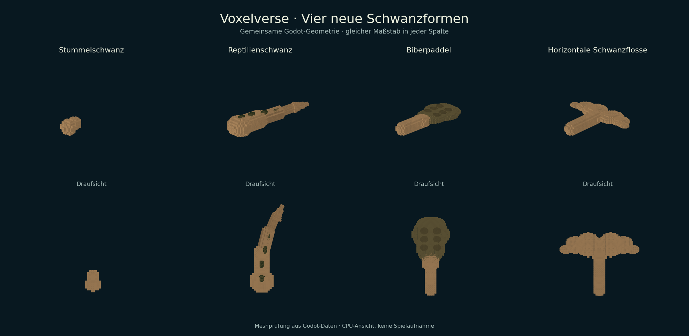
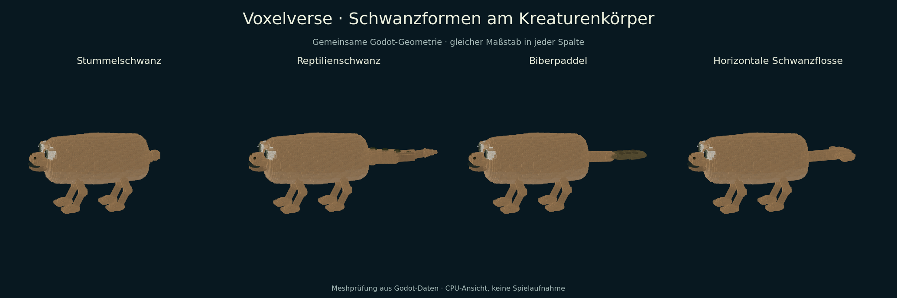

# ARCH-24-TAIL-FAMILIES – Fachnachweis

Vier neue Modelle, gemeinsam in Editor, Entdeckungsbuch, Bibliothek und
bewegtem Kreaturenkörper. [Paketvertrag](../../WORK_ARCH24_TAIL_FAMILIES.md).

## Geprüfter Stand

- Basis PR #112: `9b502ef121a49bcdf2e7c0d0995b8075b61469c9`.
- Anschlusslauf: sauberer Quellcommit `86a9a9c08828faf7710540ec12f8439f56ef0753`,
  Tree `52f4e9c55b027bf9c1aa52223eb1dfe8f60124e8`.
- Korrigierter Schwanztest: sauberer Quellcommit
  `d903f7d7be344a16ea2272559713db9f80cd8254`, Tree
  `922daabf97eea665505af016eb020d198961e0c7`.
- Veröffentlichter Quellcommit `71819110b8c26717f9056884fec8c0e62f0a23f8`
  besitzt exakt denselben Tree wie `d903f7d`. Abweichende Commit-ID durch
  Veröffentlichung über den GitHub-Anschluss. Dieser Nachweis folgt separat.
- Godot `4.6.3.stable.official.7d41c59c4`, Linux Headless, isolierte synthetische
  Nutzerdaten des bestehenden Runners. Ressourcenimport erfolgreich.

## Ergebnis

**Zehn ausgewählte Godot-Tests erfolgreich, davon der Schwanztest im korrigierten
Nachlauf.** Import, Quellverträge/Übersetzungskatalog und Artquellenprüfung
ebenfalls erfolgreich. Die vollständigen ursprünglichen Ergebnisse bleiben
einschließlich des fehlgeschlagenen Zwischenstands enthalten.

| Prüfung | Ergebnis / vollständiger Log |
|---|---|
| Schwanzfamilien | [956 Checks, Neustart eingeschlossen](corrected-tail/creature_tail_family_test.log) |
| Teilewerkstatt | [40 Rezepte, 11 Endstücke, XYZ, Undo, IK](connection-suite/creature_parts_studio_test.log) |
| Vorhandene Mundanbieter/Freischaltung | [erfolgreich](connection-suite/creature_mouth_provider_test.log) |
| Gespeicherte Teilrevisionen | [erfolgreich](connection-suite/creature_part_revisions_test.log) |
| Portable Kreaturenvorlagen | [erfolgreich](connection-suite/community_blueprint_package_test.log) |
| Körpervertrag | [erfolgreich](connection-suite/creature_body_contract_test.log) |
| Kreaturenscanner | [erfolgreich](connection-suite/creature_scan_test.log) |
| Entdeckungsbuch | [erfolgreich](connection-suite/discovery_journal_test.log) |
| Forschungsziele | [erfolgreich](connection-suite/research_goals_test.log) |
| Editor DE/EN | [1.230 Checks](connection-suite/editor_localization_test.log) |

Der Schwanztest prüft zusätzlich zu den 24 historischen Meshfällen auch 24
eingefrorene Geometrien der neuen Revision 1 sowie 30 historische Wildarten.
Editoraktionen, verdiente Freischaltung, Migration, Silhouetten, Spiegelung,
Speichern und Bibliothek werden über die bestehenden Produktionspfade ausgeführt.
Der Neustart lädt alle vier Vorlagen samt Identitäten, Formen und Modellrevisionen.
Ein zukünftiger Modellstand darf die vorhandene Datei nicht überschreiben.

Im Anschlusslauf behandelte die neu ergänzte Bodenprüfung auch einen
`StaticBody3D` für die Teileauswahl als Mesh. Der Runner erkannte die Scriptfehler
und verwarf den Test. Korrigiert wurde ausschließlich der Knotentypfilter in
`tests/creature_tail_family_test.gd`; sichtbare Meshes werden weiterhin vollständig
auf Bodenfreiheit geprüft. Laufzeitcode und die neun bereits erfolgreichen Tests
blieben unverändert. Deshalb wurde nur der betroffene Test einschließlich seines
echten Neustarts wiederholt. Kein Fehler wurde durch Abschwächen des Prüfziels
ausgenommen. [Ursprünglicher Lauf](connection-suite/results.json),
[Nachlauf](corrected-tail/results.json), [Dateihashes](source-manifest.json).

Der erste Entwicklungslauf mit 883 Checks war ebenfalls erfolgreich. Danach
wurden die neuen Modelle als Revision-1-Fixtures eingefroren, die Bodenprüfung
ergänzt und das Biberpaddel für bessere Lesbarkeit in der Standardpalette
angepasst. [Unveränderter Entwicklungsnachweis](development/results.json).

## Befehle

Aus dem Projektverzeichnis, `GODOT` verweist auf Godot 4.6.3:

```bash
python3 tools/validate_godot.py --godot "$GODOT" \
  --tests creature_tail_family_test creature_parts_studio_test \
  creature_mouth_provider_test creature_part_revisions_test \
  community_blueprint_package_test creature_body_contract_test \
  creature_scan_test discovery_journal_test research_goals_test \
  editor_localization_test --skip-main --output /tmp/tail-qa-connection

python3 tools/validate_godot.py --godot "$GODOT" \
  --tests creature_tail_family_test --skip-import --skip-main \
  --output /tmp/tail-qa-corrected
```

Der Nachlauf verwendet den bereits erfolgreich importierten Ressourcenstand.
Der neue Test ist einmal in `tools/validation/contracts.json` registriert.
Die Fachauswahl folgt den direkten Verbrauchern; kein voller CI-/Kampagnen-,
Windows-/Linux-Export- oder Ziel-PC-FPS-Nachweis wird daraus abgeleitet.

## Sichtprüfung

Echte Godot-Meshdreiecke wurden mit `tools/export_tail_review.gd` exportiert und
mit `tools/render_tail_review.py` als CPU-Ansicht gezeichnet. Beide Abbildungen
wurden geöffnet und geprüft. Erkennbar sind vier unterschiedliche Silhouetten,
die Mittelkerbe der horizontalen Flosse, das flache Paddel, der gebogene
Reptilienschwanz und die Anschlüsse an vier vollständigen Standardkörpern.
Die erste Körpergrafik hatte überlappenden Titel/Untertitel; die finale
Darstellung verwendet getrennte Abstände. Keine Spielaufnahme.





Der 87-MiB-Meshzwischenstand ist durch das Exportwerkzeug reproduzierbar und
wird nicht als redundanter Rohdatensatz eingecheckt. Hash, Mesh-/Dreieckzahlen
und Umgebung: [Sichtnachweis](visual-review.json), [Manifest](source-manifest.json).
