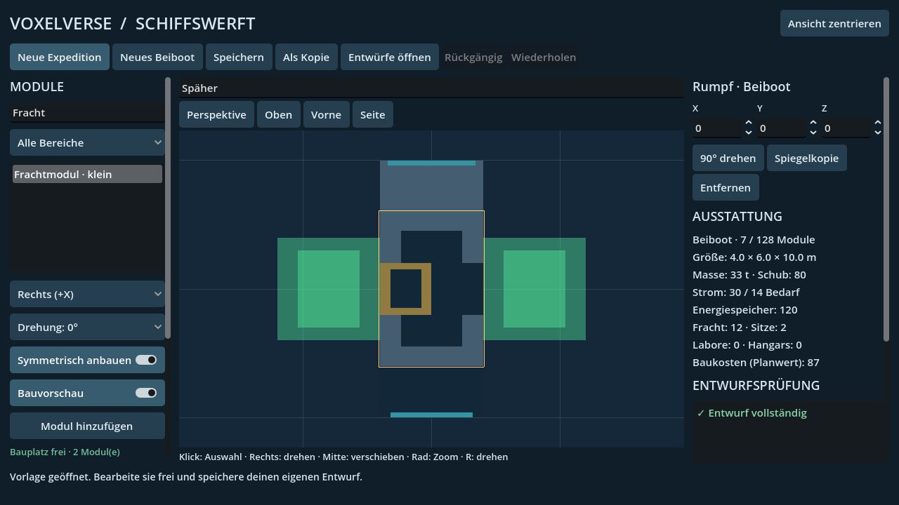
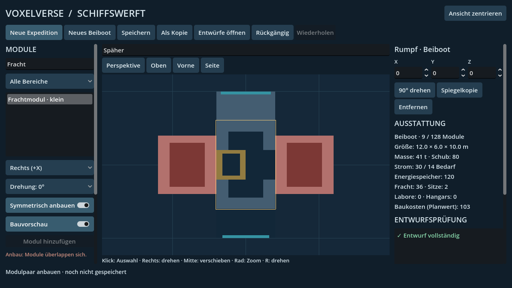
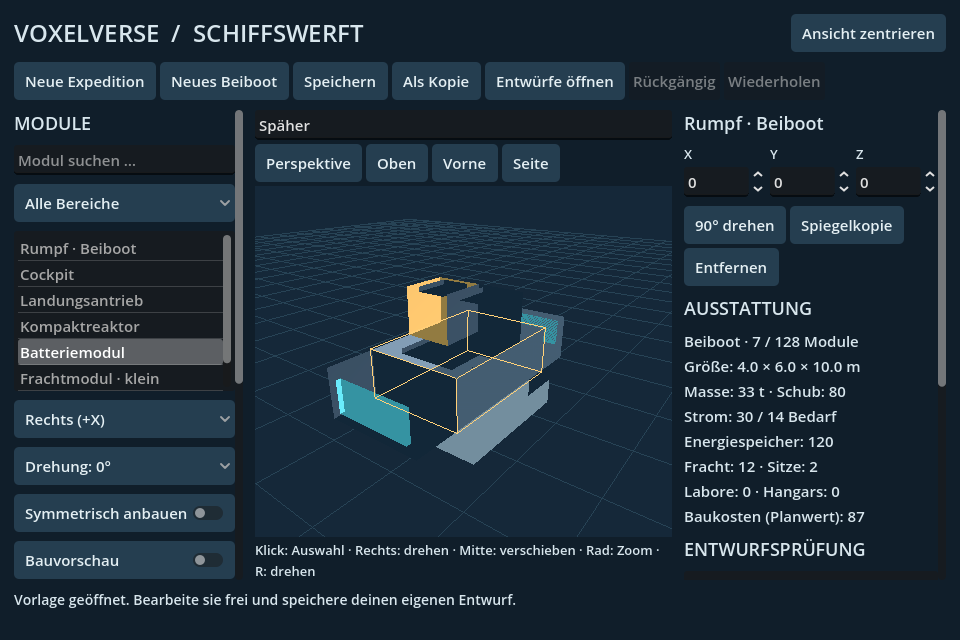

# ARCH-30-SHIPYARD: Ausbau und Optimierung

Geprüfter Quellcommit: `f6d487db76649d964be37f433cb1ae85357abe4f`.
Veröffentlichter Quellcommit: `6e78ef8bcb9885333f15010326fdf0b9d746afec`.
Identischer Quellbaum: `7028a488e069fbc18f5f56693b1c1d63db6642f8`.
Die Commit-Metadaten unterscheiden sich; die Rohlogs behalten ihre lokale
Quellreferenz. Die folgende Evidenzlieferung ändert ausschließlich Nachweise.

[Ergebnisse, Befunde und Dateihashes](results.json) · [Fachtests](headless/results.json)
· [Native Prüfung](native/results.json) · [Benutzung](../../WORK_ARCH30_SHIPYARD.md).

Alle drei direkten Fachtests bestehen auf dem sauberen Quellstand. Die native
Prüfung besteht mit 206 Bedingungen und neun Bedingungen in einem separaten
Godot-Prozess. Das schließt alle neuen Design-/Modul-IDs einer gespeicherten
Kopie, Originalbytes sowie reale Schreibfehler beim Speichern vor Wechsel ein.
Die Grafikprüfung erzeugt neun Bilder bei 960×640, 1280×720 und 1920×1080,
prüft Zeiger-/Tastatureingaben, den Hangarpicker und beide Vorschauzustände.

Bei 100 Auswahlwechseln in einem verbundenen Schiff aus 56 Modulen wurden
**null vollständige Mesh-Neuaufbauten und null Fähigkeitsauswertungen** gemessen.
Der native CPU-Probe brauchte insgesamt rund 420 ms; das ist kein FPS-Nachweis.
Ein separater Pixeltest belegt, dass das 3D-Bild im Leerlauf erhalten bleibt
und erst eine ausdrückliche Renderanforderung die geänderte Szene zeigt.

Die Bibliotheksprüfung erreicht alle 29 Testentwürfe ohne Duplikate über
mehrere Seiten, filtert nach Name/Rolle und prüft die Lesegrenzen pro Frame.
Das 3-ms-Ziel ist kooperativ: einzelne JSON-Lesevorgänge bleiben synchron.

Godot 4.6.3, Linux, OpenGL-Kompatibilität, Mesa llvmpipe und Xvfb; isolierte
Benutzerdaten. Die abgebildete grüne/rote Vorschau und kleine Beibootansicht
wurden visuell geprüft. Frühere fehlgeschlagene Testläufe sind unter `initial`
erhalten und in `results.json` erklärt. Die ursprünglichen Nachweise unter
`../arch30-shipyard` bleiben unverändert.

Keine Flug-, Gesamtspiel-, Windows-Export- oder Ziel-PC-FPS-Freigabe.
