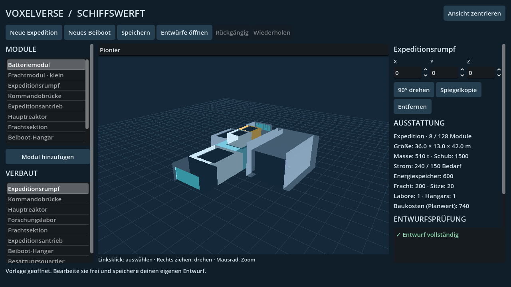
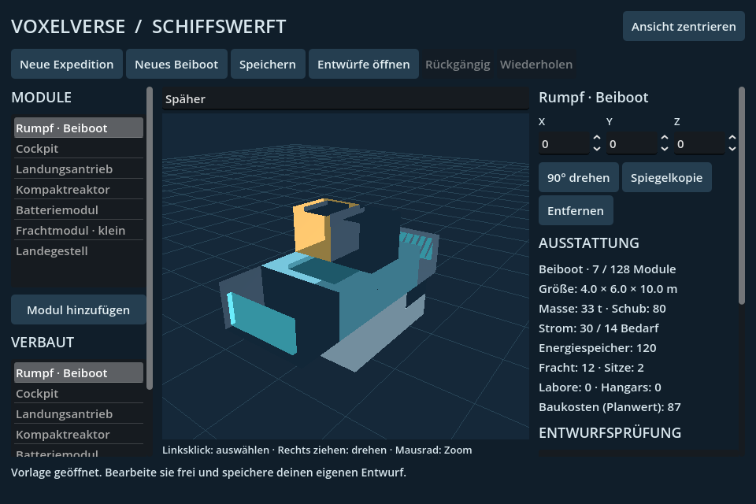
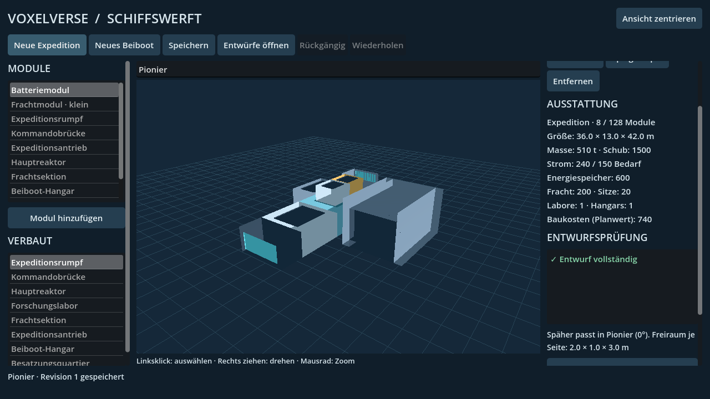

# ARCH-30-SHIPYARD: Fach- und Grafiknachweise

Geprüfter Quellcommit: `0fde3d02c8e06390973f852b19dc6f9a363e9c9e`.
Quellbaum: `0ef680b560d962c33ca69b7ea15d29e2e8a08248`.
Die folgende Evidenzlieferung ändert ausschließlich diese Nachweise.

[Ergebnis und Dateihashes](results.json) · [Headless-Ergebnisse](headless/results.json)
· [Grafikergebnisse](native/results.json) · [Benutzung und Grenzen](../../WORK_ARCH30_SHIPYARD.md).

Alle drei ausgewählten Fachtests bestehen auf dem sauberen Quellcommit:
Schiffseditor, vorhandener Expeditionsvertrag und bestehender Assembly-Verbraucher.
Die separate Grafikprüfung besteht mit sieben Aufnahmen, echten Mausklicks,
Abbruch eines Vorlagenwechsels und der Auswahl eines gespeicherten Beiboots
für die Hangarprüfung. Neustarttests verwenden einen neuen Godot-Prozess.

Godot 4.6.3, Linux, isolierte Benutzerdaten. Grafik: OpenGL-Kompatibilität,
Mesa llvmpipe, Xvfb. Die 1280er Expeditions-/Hangaransicht und die 960er
Beibootansicht wurden zusätzlich visuell geprüft. Import und Art-Quellenprüfung
des unveränderten Ressourcenbestands bestanden im ersten Lauf. Dessen
Anzeigefehler und der erste native Befund sind im Ordner `initial` erhalten;
`results.json` nennt die Korrekturen. Diese frühen fehlerhaften Läufe gelten
nicht als Abschlussnachweis.

Keine Flug-, Gesamtspiel-, Windows-Export- oder Ziel-PC-FPS-Freigabe.
