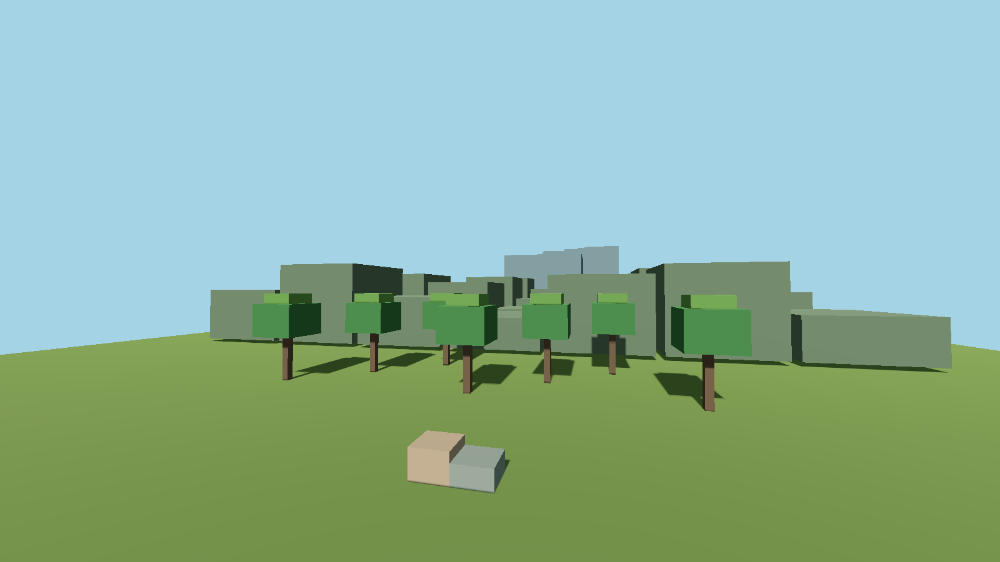
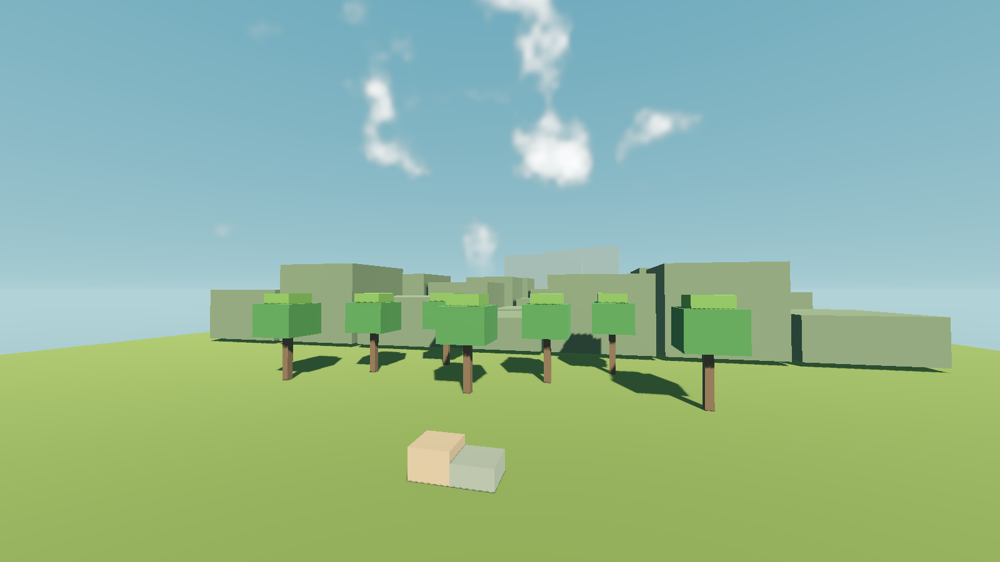
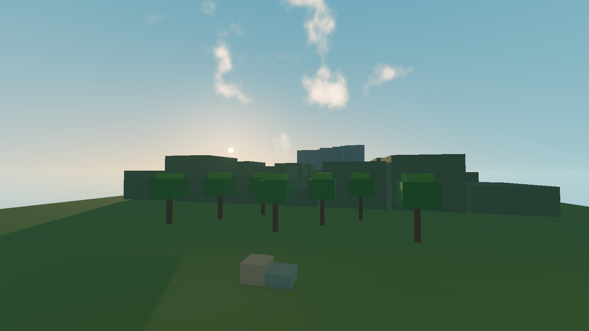

# Atmosphärenprüfung

Geprüfter sauberer Quellcommit `84d42fa8841ca0b12ca38d68e9f4dd11db4ebbf5`,
Tree `8d08597f66dc5709313ad849fdb98c864e959506`.
Veröffentlichter Quellcommit `bee4069410c2e38599795d93a38958ad7e141379` hat exakt denselben Tree.
Die Übertragung durch die GitHub-Anbindung vergibt eine neue Commit-ID; Rohberichte bleiben unverändert.
[Manifest mit Quellhashes und Grenzen](manifest.json).

- Abschließend alle vier Fachtests bestanden: Atmosphäre, Unterwasseransicht,
  Kugelkampagne einschließlich Neustart und Frontend einschließlich echter Menüeingaben.
- Initialer Import, Quellen- und Art-Gates bestanden. Abschließend Quellenprüfung
  und DE/EN-Katalogprüfung bestanden. Derselbe lokale Ressourcenstand wurde weiterverwendet.
- Native Shaderprüfung bestanden: Forward+/Vulkan und OpenGL-Kompatibilität,
  jeweils sechs Aufnahmen. Vier repräsentative Forward+-Bilder beigefügt.
  Atmosphärisch, cineastisch, Abendlicht und Nacht aus dem ersten Lauf sowie die
  finale OpenGL-Ansicht visuell geprüft. Keine Ziel-PC-/FPS- oder Windowsfreigabe.
- Der erste Frontend-Lauf meldete trotz bestandener Fachprüfungen beim Beenden ein
  zurückgebliebenes RefCounted-Objekt. Das Gate wertete ihn korrekt als fehlgeschlagen.
  Die separate unveränderte Basis und der abschließende geänderte Stand bestanden.
  Die Ursache ist nicht nachgewiesen; der Erstbefund bleibt vollständig dokumentiert.
  Es wurden keine Testbedingungen gelockert oder Tests gestrichen.
- Der erste Forward+-Grafiklauf meldete die von Godot intern auf 256 korrigierte
  Echtzeit-Cubemapgröße. Der Controller verwendet jetzt ausdrücklich 256;
  abschließender Forward+-Grafiklauf ohne diese Warnung.

Die Bilder stammen aus einer synthetischen Voxel-Prüfszene mit identischer Geometrie
und Kamera. Sie zeigen die echte Engine-Darstellung, keine normalen Spielaufnahmen.

| Vorher | Atmosphärisch |
|---|---|
|  |  |

Befehle, Renderer, Quellstände und Ergebnisse stehen in den unveränderten
`final/`, `forward-plus/` und `compatibility/`-Berichten. Die historischen
`initial/`, `first-functional/` und `baseline-frontend/`-Verzeichnisse dokumentieren
Prüfung und Eingrenzung während der Entwicklung; sie sind keine Ersatzfreigabe
für den letzten Stand. Sämtliche Nutzerdaten waren isolierte Testdaten.
