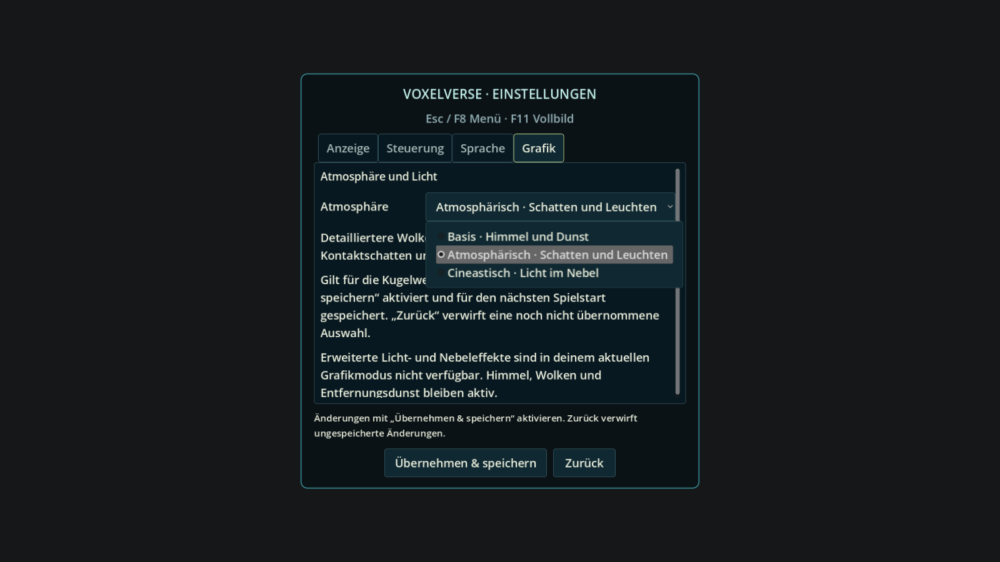
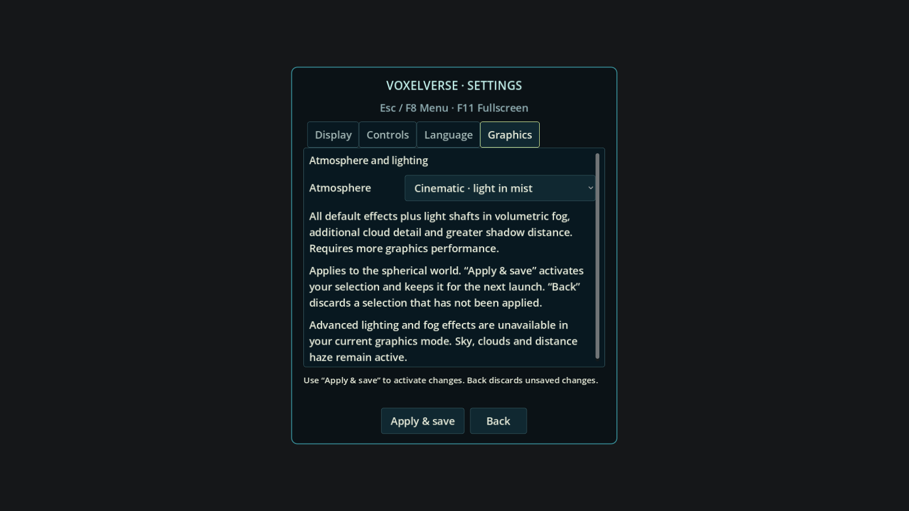

# Grafikreiter und Roadmap-Ergänzung

Auf Nutzerauftrag sind die drei Stufen jetzt im eigenen Reiter
**Einstellungen → Grafik → Atmosphäre** erreichbar; Hauptmenü, Spielpause und F8
verwenden denselben Dialog. Beschreibungen erklären die ausgewählte Stufe.
Ein unübernommener Wechsel wird beim Schließen verworfen; auch ein offenes
Auswahlmenü wird geschlossen. Der separate Folgeauftrag **ATMOSPHERE-SETTINGS-DETAIL**
in der Roadmap plant individuelle Regler und „Benutzerdefiniert“.

Geprüfter Quellcommit `7929f839f58950f39f7507bbeec6e7eeb8e02f92`, veröffentlicht als
`6aab52a3d7e5738ec391c4db4ed01a401b4df33c`; identischer Tree
`68c11200966e27065d3ebacd6ff2e2b02af2863e`.

Atmosphären-/Einstellungsprüfung und bestehender Frontend-Ablauf bestanden,
einschließlich Speichern/Neustart, Übernehmen, Verwerfen und Popup-Schließen.
Import, Quell- und Art-Gates bestanden; der generierte DE/EN-Katalog ist konsistent.
Native DE/EN-Aufnahmen des tatsächlichen Dialogs mit OpenGL-Kompatibilität/Mesa
llvmpipe erstellt und beide visuell geprüft. Der Hinweis auf nicht verfügbare
Zusatzeffekte ist für diesen Renderer korrekt. Kein erneuter Shader-, Windows-
oder FPS-Nachweis erforderlich/behauptet; der Spiel-Shadercode blieb unverändert.
[Manifest und Quellhashes](manifest.json).

