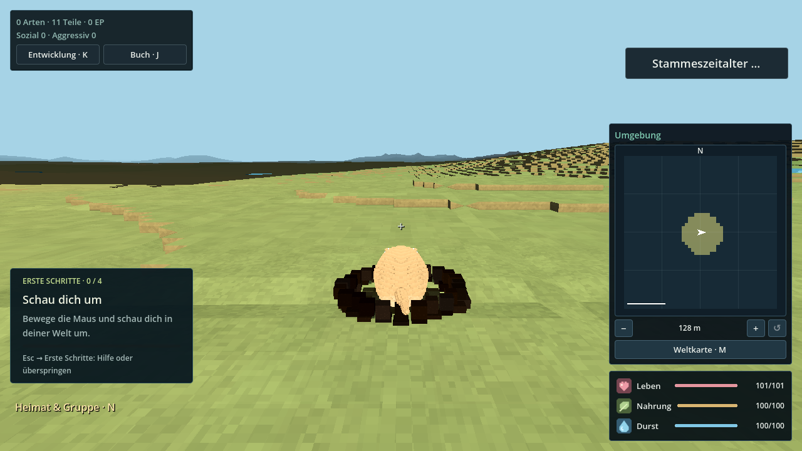
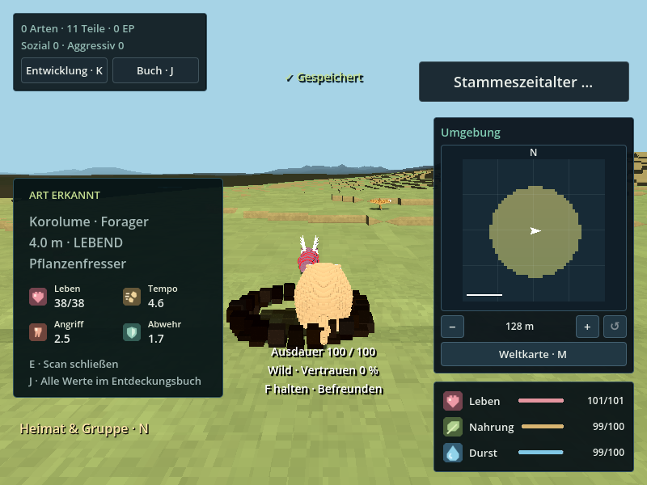

# HUD-Überarbeitung · 15. September 2026

Teilauftrag: `HUD-REDESIGN`. Nutzerauftrag: HUD überarbeiten.
Basis: `d378ca0ecd7f03429a5150df6358e0646ec06689` (`main` beim Start).
Branch: `agent/hud-redesign-20260915`.
Grafisch geprüfter Quellcommit: `9f5207c266888746bb410653d5ed2c081a5a0fb1`.
Quelltree: `7f98f64c89a55edb7006f5af8e3b6748616c33e3`. Sauberer getrackter Arbeitsstand beim Grafiklauf.

## Verhalten

- Gemeinsame rechte Kante für Minimap und Leben/Nahrung/Durst. Anzeige liest
  weiterhin die originalen ProgressBars des Spielercontrollers. Kritische Werte
  erhalten zusätzlich ein `!`; Durst hat ein kantiges Tropfensymbol im gemeinsamen Set.
- Ein Minimap-/Atlas-Paar in der Kugelkampagne: der doppelte Aufbau im Szeneneinstieg entfällt.
- Links kompakte Fortschrittszahlen und direkte Entwicklung-/Buchknöpfe. Der
  bisherige zweite Buchknopf entfällt beim Spieler; eigenständige Buchhosts behalten ihn.
- Scanner links mit Name, Entfernung, Ernährungsart und vier beschrifteten Stat-Symbolen;
  weitere Werte bleiben im Buch. Sozialhinweise geben keine Artidentität mehr preis.
- Getrennte Plätze für Kampfkopf, Spielmeldung, Entdeckungsmeldung und Speicherhinweis.
  Einsteigerhilfe lässt den Heimathinweis frei und tritt während des Scannens zurück.
- Kleine Fenster verkürzen die Kartenfläche bei unverändert quadratischer Projektion.
  Zwölf neue Nachrichten laufen über den bestehenden DE/EN-Katalog. Dies ist keine
  vollständige Übersetzung aller bestehenden HUD-Texte.

## Prüfung

Godot `4.6.3.stable.official.7d41c59c4`, Linux. Grafik: OpenGL-Kompatibilität,
Mesa llvmpipe unter Xvfb; alle Läufe verwenden isolierte Benutzerverzeichnisse.

```sh
python3 tools/validate_godot.py --godot /path/to/godot --tests hud_layout_test minimap_test creature_scan_test research_goals_test onboarding_test ui_visual_refresh_test discovery_journal_test --skip-main --output /tmp/hud-check
python3 tools/review_hud.py --godot /path/to/godot --output /tmp/hud-render
```

Die sieben Fachtests bestanden während der Implementierung. `hud-final-check.json`
protokolliert sechs davon vor dem abschließenden Standalone-Buch-/Kartenhöhen-Fix;
`hud-journal-check.json` prüft den korrigierten eigenständigen Buchzugang;
`hud-short-window-check.json` prüft danach HUD und Minimap erneut. Diese originalen
Berichte nennen den Basiscommit plus schmutzigen Arbeitsstand: geprüft wurden
jeweils die lokalen Änderungen dieses Teilauftrags, keine unveränderte main-Version.
Der abschließende Grafiklauf (`results.json`, `render.log`) stammt vom oben genannten
sauberen Quellcommit und führt den HUD-Test erneut aus. Import, Ressourcenverträge
und Katalogprüfung bestanden (`hud-initial-check.json`). Kein zusätzlicher Vollimport
für reine GDScript-Anpassungen; nach dem Erstimport kamen keine weiteren Assets hinzu.

Abgedeckt: 1920×1080, 1280×720, 800×600, Skalierungsfaktoren 1/1,5, DE/EN,
veränderte Maximalwerte, kritische Werte, Originalreferenzen, Nachrichtenabstände,
Buch öffnen/schließen und Minimap-Rückkehr, Szenenabbau, echter Kugelkampagneneinstieg
mit genau einer sichtbaren Minimap. Scannerbild mit echter Art in gezielt gesetzter
Darstellungsansicht; die reale Zielerfassung prüft `creature_scan_test` separat.
Sechs Aufnahmen, darunter echte Kugelkampagne und gefüllter Scanner; repräsentative
Welt-/Scannerbilder visuell geprüft. Die erste Kartenrasterung ist in den frühen
Kugelkampagne-Aufnahmen noch unvollständig.

Kein Windows-Export, kein vollständiger Integrationslauf und kein FPS-Nachweis auf
Lars' Zielhardware. Zentrale Statusseiten bleiben beim Integrationschat.

## Gemeinsame Schreibbereiche

Beim Zusammenführen insbesondere die begrenzten HUD-Änderungen in
`ui/discovery/discovery_journal.gd`, den zwölf Katalogeinträgen samt generierten PO-Dateien,
`tools/validation/contracts.json` und den drei entfernten Minimap-Zeilen in
`main/spherical_campaign.gd` berücksichtigen. Keine Speicherformate oder Gameplayregeln geändert.



