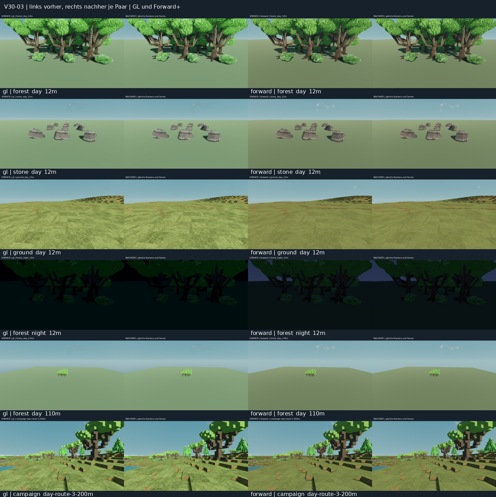

# V30-03: Materialien und Fernsicht

Die kombinierte Basis aus #184, #193 und #217 erzeugt die Materialmaserung in
lokalen Weltkoordinaten. Bei einer Ursprungverschiebung springt dadurch die
Maserung auf unverändert sichtbaren Blöcken. Die Fachkorrektur bindet sie an die
authentischen Modellkoordinaten und filtert jede tatsächliche Detailfrequenz.
Nah- und Fernshader verwenden dieselben Koordinaten vor Wind/Abdeckungsmasken.

Die kontrollierte Rebase-Gegenprobe reproduziert den Fehler auf der alten Basis
in beiden echten Renderern. Nach der Korrektur ist das Probe-Bild pixelgleich.
Das belegt diesen Fehler; es ersetzt keine komplette Sichtabnahme beim Gehen.

[Bildindex](IMAGE_INDEX.md) · [Lokale Galerie](gallery.html) · [Vorher/Nachher-Übersicht](comparison-overview.png) ·
[Alle Renderkosten](render-costs.csv) · [Exakte Paarprüfungen](pair-checks.json) ·
[GL-Materialbewegung](motion/gl/comparison.mp4) · [Forward+-Materialbewegung](motion/forward/comparison.mp4) ·
[CI-Anschluss für Chat 1](integration-attachments/README.md)



## Fester Auftrag und Quellstand

`INT30-03-MATERIALS-DISTANCE`, Fachchat V30-03. Die bestätigte gemeinsame Basis
ist `2b1ac023db4074c2ce6b7db8fbab09ab929a8435`, Tree
`5f815f478ceeabefcfc50a6388e3e4b0daa2ac45`. Die veröffentlichten Köpfe von
#184 (`0903215…`), #193 (`51a1764…`) und #217 (`65b1995…`) sind deren Vorfahren.
Die Baselinebilder vergleichen **diese kombinierte Basis**, keine künstliche
Zusammenstellung einzelner PR-Dateien.

Die nativen Material- und Kampagnenaufnahmen verwenden die Runtime-Dateien
des veröffentlichten Codekopfs `40b15e5556dd48e42a97eb430ba2c2e5aad9d41d`,
Tree `f750ace58b77019fce714cd6c5a6af86d1e28dd6`. Der lokale geprüfte Codekopf
`ce7c8a2e92b2163575259119d4fcc3a4083c947c` hat exakt denselben Tree.
Danach ergänzte eigene Review-/Belegdateien ändern keine Runtime-Datei.
[native-source.json](native-source.json) enthält die SHA256 der drei
Produktdateien und der beiden verwendeten Aufnahme-Skripte.

Produktdateien ausschließlich:

- `assets/catalog/planet_foliage.gdshader`
- `assets/catalog/planet_surface_detail.gdshaderinc`
- `world/surface/visuals/surface_scenery.gdshader`

Eigene native Reviews liegen in `tests/reviews/int30_{materials,surface,detail_motion}.gd`.
Sie werden explizit aufgerufen und sind keine automatisch registrierten
Headless-Tests. Keine Änderungen an Terrain-/LOD-Geometrie, Palette, Population,
Kollision, Windwerten, Sichtweiten, Produktionsbudgets oder Atmosphärenbeleuchtung.
Chat 1 behält gemeinsame Tools/CI/Registry, Chat 8 Atmosphäre/Wetter, Chat 2
Population. Kein main-Merge, kein Auto-Merge und keine Issue-Schließung.

## Vergleichbare Bildmatrix

Godot `4.6.3.stable.official.7d41c59c4`, Linux, echte native Grafikfenster unter
Xvfb, Dummy-Audio, `960×540`. Compatibility nutzt OpenGL/Mesa; Forward+ nutzt
Vulkan/Mesa llvmpipe, LLVM 20.1.2 (Mesa 25.2.8). Die Läufe dieses Fachchats sind
nacheinander ausgeführt, damit sie nicht gegenseitig die eigene Software-GPU
belasten. Weitere Systemlast ist nicht kontrollierbar.

| Vergleich | Gegenstand und Abstände | Fixierte Bedingungen |
| --- | --- | --- |
| Produktionsmaterialfixture | Wald mit Eiche/Kiefer/Busch, Stein, echtes Kampagnengelände; 12 / 45 / 110 m | Seed 15838; Tag 0 s / Nacht 720 s; gleiche Kamera je Paar, Wind 0, Wolken 0,2, Feuchte 0,2 |
| Tatsächliche Kugelkampagne | Hin-/Rückweg 0 / 20 / 100 / 200 / 100 / 20 / 0 m, zusätzlicher Seitenblick | Derselbe Seed, Kameratransform, Ursprung, Sonnenrichtung, Sonnen-/Umgebungsenergie und Uhr je Paar; Tag/Nacht |
| Rebase-Materialprobe | Drei semantische Paletteflächen: Blatt, Holz, Stein | Kamera und Objekte gemeinsam um `(83.25,-77.5,129.125)` m versetzt; unshaded zur Trennung von Schattenkaskaden |
| Nah-/Fernshaderprobe | Gleiche drei Flächen mit identischer Geometrie | Opaque-Nahshader versus Coverage-Fernshader bei vollständiger Abdeckung |
| Materialbewegung | 64 festgelegte Kameraposen je Version, 8 → 110 → 8 m, 2,5 cm seitliche Bewegung | Identische Paletteflächen, unshaded; keine Geh-/Wind-/Silhouetten-LOD-Abnahme |

Insgesamt: 68 feste Vorher-/Nachher-Paare (136 Originalbilder), 16 weitere
Pixelprobebilder und 256 Materialbewegungsframes. Ein erster Forward+-Kampagnenlauf hatte eine 60-s-Streamingfristverletzung
und bleibt zusätzlich unverändert erhalten. Genau eine unveränderte
Gegenprobe bestand vollständig; Erwartungen/Fristen blieben gleich.

Die Materialbilder verwenden die tatsächlichen Near-/Mid-/Far-Meshes. Die
Kampagnenbilder ergänzen den realen Boden, Wald und Horizont im geladenen
Spielweg. Ihre 0/20/100/200-m-Angaben sind **Wegpunkte der Kamera**; sie sind
keine Behauptung über einen Horizontabstand. Kamera-Fernclip dort 30 km,
Wetter-Sichtweite 18 km. Die seitlichen und 0/100/200-m-Blicke stehen jeweils
bei Tag und Nacht als breitere Nah-/Mittel-/Fernkontexte bereit.

Vor jeder Kampagnenaufnahme wird Streaming vollständig abgewartet. Nur in der
unvermessenen Vorbereitung werden bis zu 64 vorhandene Flora-Publikationsschritte
je Frame abgearbeitet; danach 6 Warmup- und 12 Messframes je Bild. Die
Materialfixture misst 16 Frames je Seite/Blick. Spieler/GUI sind für den
Bildvergleich ausgeblendet; Wind und Wolkenuhr stehen still. Die tatsächlichen
Produktionsbudgets sind dadurch nicht geändert. Metadaten und unveränderte
Original-PNGs sind in `materials/{gl,forward}/` und
`campaign/{gl,forward}/{before,after}/` enthalten; die zwölf repräsentativen beschrifteten Paarbilder
in `comparisons/` fügen lediglich eine Kopfzeile hinzu. Die Galerie stellt
alle 68 Paare unmittelbar aus den Originalen nebeneinander. Materialbewegungs-
frames und Erstfehlaufnahmen bleiben verlustfrei in `original-frames.zip`
erhalten; `archive-contents.json` belegt ihre individuellen PNG-Digests.

## Befunde gegen #169, #170 und #204

| Kriterium | Beobachtung / Korrektur | Grenze der Sichtabnahme |
| --- | --- | --- |
| #204: erkennbare Holz-/Blatt-/Steinstruktur | Authored Blockformen und vorhandene semantische Palette erhalten; Modellmaserung folgt dem Block statt dem verschobenen Ursprung. Nahaufnahmen und isolierte Paletteproben liegen für beide Renderer vor. | Subjektive Stärke/Lesbarkeit aller Biome und Arten ist nicht durch einen Seed abgenommen. |
| #204: dunkle Blockflächen | Vorhandene dunkle-slot-Aufhellungen bleiben erhalten; starke natürliche Schatten im Wald bleiben sichtbar. In den angesehenen Vergleichsblicken kein neu eingeführtes pauschales Schwarzflächenproblem. | Kombinierte Helligkeit/Schatten/Atmosphäre ist ein Anschluss an Chat 8; keine Materialänderung versteckt ein Beleuchtungsproblem. |
| #204: flimmernde Details | Die alte Dämpfung misst Weltmeter, unabhängig von der tatsächlichen Sinusfrequenz. Jetzt dämpft jede Holz-/Blatt-/Steinphase nach ihrer Bildschirmableitung. Materialbewegungsstreifen ergänzen die statischen Bilder. | Kein quantitativer Vollnachweis für alle temporalen Aliasingfälle; echte Gehbewegung, Wind und Renderer-AA bleiben eigene Sichtfälle. |
| #169: Ursprung/Nah-/Fernwechsel | Material-Rebasefehler reproduziert und korrigiert. Identische Geometrie ist beim Wechsel zwischen beiden Materialshadern bildgleich. Kampagnen-Hin-/Rückweg überschreitet mehrere Ursprünge. | Die tatsächlichen unterschiedlichen LOD-Meshes und kontinuierliche Streaming-/Maskenübergänge sind durch feste ausgeruhte Wegpunkte nicht vollständig abgenommen. |
| #169: Wald bis Horizont | Echte Wald-/Horizontbilder, Scenery-Verteilung und Nahpatchzahlen werden erfasst. In den geprüften festen Blicken keine neu eingeführte Terrainöffnung. | Bestehende begrenzte Waldreichweite von etwa 224–256 m, Generierungsreserve 288 m, bleibt bestehen; Wald bis an einen beliebigen Horizont ist damit nicht gelöst. Ursprüngliche exakte Problemkameras aus #169 fehlen. |
| #170: Bodenstruktur und Terrainnormalen | Echte Terrainfixture und Kampagnenpaare; Kollisionsflächenhash identisch, maximale Oberseitennormalenabweichung 0. Unser Fix ändert keinen Boden-/Terrainshader. | Keine allgemeine Freigabe aller Planetentypen oder alter Terrain-/Biome-Spieltests. |

Die finalen Materialprobe-Mittelwerte sind normierte RGB-Differenzen über das
gesamte Bild. Hier isolieren exakte, achsenparallele Flächen die Materialphase
von Rundungsabweichungen an komplexen Voxelsilhouetten:

| Renderer | Ursprungwechsel vorher | Ursprungwechsel nachher | Nah-/Fernshader, vorher / nachher |
| --- | ---: | ---: | ---: |
| Compatibility | 0,0028157145 | **0** | 0 / 0 |
| Forward+ | 0,0013373117 | **0** | 0 / 0 |

Eine frühere Diagnose mit komplexen Bäumen zeigte 0,0167075874 → 0,000217789
in Compatibility. Die kleine verbleibende Änderung enthält Silhouettenrundung;
sie wurde deshalb nicht als vollständig unveränderte Materialphase interpretiert.
Die finale Flächeprobe beseitigt diese Verwechslung. Ein frühes fehlerhaftes
Review-Skript ist in `tests/reproduce-invalid-fixture.log` dokumentiert und
ist ausdrücklich **kein erfolgreicher Rendernachweis**.

## Renderkosten und Aussagegrenzen

[render-costs.csv](render-costs.csv) enthält jede Ansicht/Version mit Frame-,
Render-CPU- und Render-GPU-p50/p95 in Millisekunden, Messframezahl, Drawcalls und
Primitiven. [cost-summary.json](cost-summary.json) fasst die Materialfixture
zusammen. Ein Wert weit über 16,7 ms ist hier ein Software-GPU-Wert, keine
Behauptung über Hardware-FPS.

| Material | Compatibility: Median der gepaarten GPU-p50-Quotienten nachher/vorher | Forward+ |
| --- | ---: | ---: |
| Wald | 0,972 | 0,997 |
| Stein | 1,107 | 1,171 |
| Boden, Material unverändert | 1,036 | 0,952 |

Die Waldquotienten liegen in Einzelblicken zwischen 0,726–1,077 (GL) und
0,834–1,191 (Forward+), Stein zwischen 0,929–1,251 / 0,935–1,386. Schon der
unveränderte Boden streut zwischen 0,828–1,218 / 0,838–1,115. Stein kostet in
einigen Softwareblicken mehr; eine Nullregressions-/FPS-Aussage ist nicht belegt.
Die Materialfixture hält Drawcalls und Primitive je Paar exakt gleich.

In den echten Kampagnenpaaren bleiben Kamera/Ursprung/Licht und Terrain-/Scenery-
Besetzung gleich. Einige Nahblicke unterscheiden sich bei gemeldeten Primitiven
und Nodezahlen; die Ursache ist nicht belegt. Alle zwölf Bodenpaare der Materialfixture sind pixelgleich, siehe
[image-differences.json](image-differences.json). GL meldet z. B. am 0-m-Wegpunkt
2.012.836 → 2.057.682 Primitive. Dieser Unterschied und die Softwarestreuung
verbieten es, scheinbar kürzere Kampagnenzeiten als Materialleistungsgewinn
auszugeben. Die vollständigen Abweichungen stehen in `pair-checks.json`. Kamera, Ursprung,
Sonne, Uhr, Drawcalls, Terrain-Tilezahl, Nahpatchzahl und Scenery-Abstandsringe
stimmen in allen 16 Paaren je Renderer exakt überein. Kampagnen-GPU-p50-Quotienten
streuen zwischen 0,396–1,435 (GL, Median 0,822) und 0,736–1,174 (Forward+, Median 0,991);
auch diese Werte sind keine Leistungsfreigabe.

## Prüfungen und Übergabe

Die unveränderte Basis besteht die sechs direkten Verbraucher
`environment_production_test`, `environment_cluster_test`,
`environment_playtest_test`, `living_surface_materials_test`,
`surface_distance_test`, `surface_distance_world_test` sowie Quellverträge,
Import, Assetquellen und Quellenintegrität. Vollständige Logs und Source-
Manifeste: [tests/baseline/results.json](tests/baseline/results.json).

Die finale Fachprüfung besteht alle acht direkten Verbraucher: die sechs
oben genannten sowie `large_planet_geometry_test` und `world_motion_visual_test`.
Import, Quellverträge, Assetquellen und Quellenintegrität ebenfalls bestanden;
unveränderte Erwartungen/Fristen, isolierte Nutzerdaten. Vollständiger Nachweis:
[tests/candidate/results.json](tests/candidate/results.json). Der saubere lokale
Quellcommit `f7151adae43ce6e64d09333ba5d5662418db39c2` und der veröffentlichte
Quellcommit `a2f8e36504a687f4e4ef6087bd7daa320e831651` haben exakt Tree
`5105f57dee0b67abacf2d99435092f896b5b6d79`; Quell-SHA256
`9086ba2ec5e799ada53c372f0ec2f0f859fa0b80ec18c22f5300ed5007a13082`.
Der erste Start brach vor Testausführung bei der Git-Quellbeobachtung ab
(`Git source state changed during observation`); dieser Fehlbericht bleibt
in `tests/source-observation-first-failure/` erhalten. Die erfolgreiche
Prüfung läuft auf einer unabhängigen sauberen Kopie genau desselben Trees.
Alle Befehle, Engine, Umgebung und Grenzen stehen in [handoff.json](handoff.json).

Der konservative Änderungsplan wählt FULL: 247 Quelltests plus Haupt-/Runtimechecks.
[conservative-validation-plan.txt](tests/conservative-validation-plan.txt) ist
ein **Plan**, keine ausgeführte Vollsuite. Der tatsächliche Godot-CI-Lauf [36773077465](https://github.com/MajorDragonfly/voxelverse/actions/runs/36773077465)
besteht 247 disjunkte Quelltests und 27 Runtimechecks auf Mergecommit
`c9f443c777b58033e6df3cf79d4835dccc19ef9f`, Tree
`fe3f30637549991df2eefe99defef184a7fbf285`. Alle fünf heruntergeladenen Artefakte
haben stabile Quellmanifeste und dieselben drei Produktdatei-Digests wie unsere
Aufnahmen; vollständige ZIPs und [CI-Zusammenfassung](tests/ci/summary.json)
sind erhalten. Dieser Techniknachweis gilt für genau diesen Merge-Stand.
Die vier Integrationsgates und ein neuer tatsächlicher Merge-Tree müssen
zentral geprüft werden. Draft-Workflows mit ausgelassenen Capturejobs sind
keine volle Grafikfreigabe.

Der erste gemeinsame Surface-CI-Lauf scheitert nach erfolgreicher Baseline-
Aufnahme am Provenienzwrapper. Der konkret geprüfte, nicht produktiv angewandte
[Patchvorschlag](integration-attachments/README.md) erlaubt ausschließlich das
absichtlich injizierte Messskript mit exaktem Digest. Chat 1 muss ihn prüfen
und zentral übernehmen; danach neue GL-/Forward+-Surface-CI. Gemeinsame Tools
wurden im Fachbranch nicht verändert.

Chat 8 erhält Bilder/Metadaten als Anschluss für Materialschatten und
Atmosphärenlicht; Lichtparameter bleiben beim Besitzer. Der Materialport ist
unverändert. Ein neuer Atmosphären-/Integrationsstand braucht dieselben
Vergleichsblicke neu. Verbleibende Abnahmen: kontinuierliches Gehen/Wind/LOD,
weitere Problemkameras/Seeds/Biome, realer Ziel-PC und die vollständigen
Integrations-/Exportgates. Der Fach-PR bleibt hierfür im Entwurf.

## Reproduktion

Bei Desktopausführung die gewünschte Rendereroption verwenden; Linux-CI braucht
ein natives Display, z. B. Xvfb mit Mesa. Kein `--headless` für diese Reviews.
Godot und sein Nutzerdatenverzeichnis je Prüfung isolieren.

```sh
godot --path . --rendering-method gl_compatibility --audio-driver Dummy \
  --script res://tests/reviews/int30_materials.gd -- OUTPUT BASELINE_SHADER_DIRECTORY
godot --path . --rendering-method forward_plus --audio-driver Dummy \
  --script res://tests/reviews/int30_surface.gd -- OUTPUT
godot --path . --rendering-method forward_plus --audio-driver Dummy \
  --script res://tests/reviews/int30_detail_motion.gd -- OUTPUT BASELINE_SHADER_DIRECTORY
```

Die drei Baselineshader stammen per `git show 2b1ac023:PFAD` aus der bestätigten
gemeinsamen Basis. Für die Kampagnen-Baseline wird ein separater Checkout auf
diesem Commit verwendet und ausschließlich dasselbe eigene
`tests/reviews/int30_surface.gd` als Messskript ergänzt. Nach vollständigen sechs
Material-/Kampagnenjobs erstellt `assemble_review.py --capture-root PARENT`
Paarbilder, Galerie, Kostenliste und strikte Kamera-/Lichtvergleichsprüfung.
