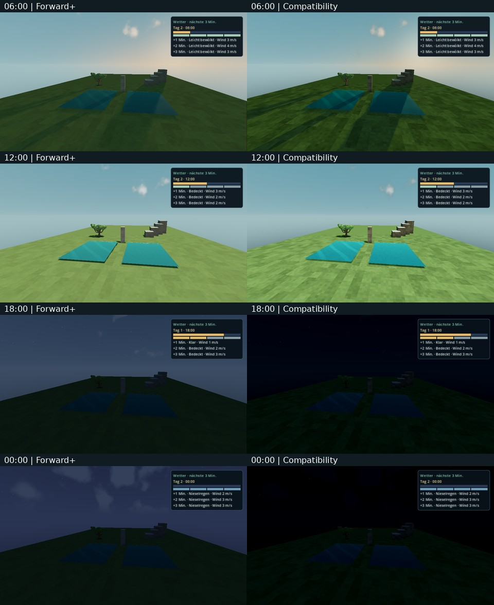
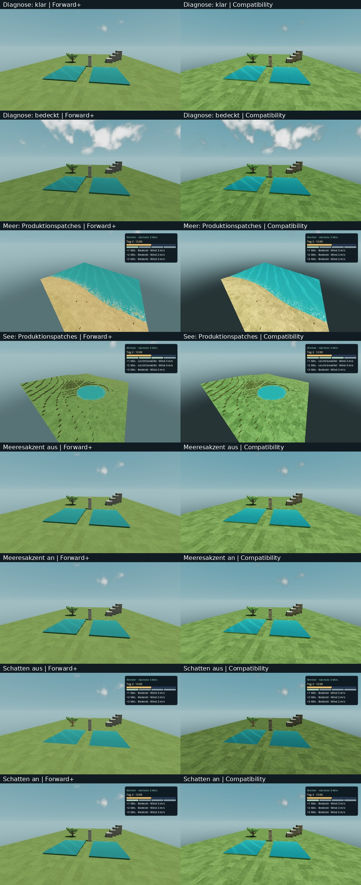
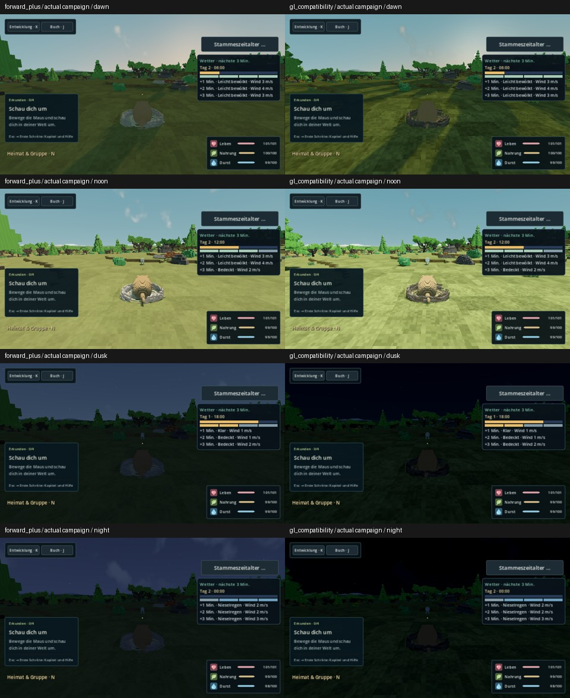
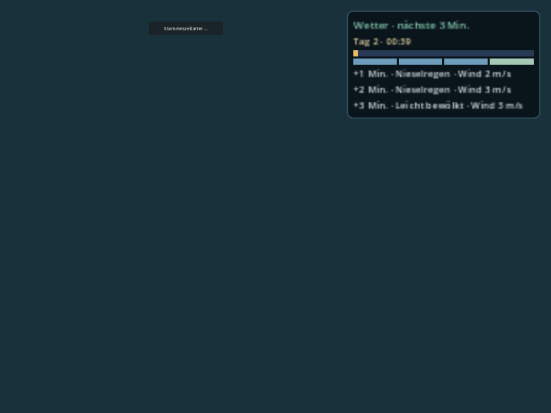

# INT30-08 · Atmosphäre, Wetter und Wasser

Fachbranch `agent/int30-08-weather-water`, Draft-PR [#222](https://github.com/MajorDragonfly/voxelverse/pull/222), feste gemeinsame Basis `2b1ac023db4074c2ce6b7db8fbab09ab929a8435` / Tree `5f815f478ceeabefcfc50a6388e3e4b0daa2ac45`. Keine Übernahme nach main, keine Ziel-PC-Freigabe. AGENTS.md und die aktuelle Zuordnung in [#137](https://github.com/MajorDragonfly/voxelverse/issues/137#issuecomment-5918892397) wurden berücksichtigt.

## Ergebnis und Zusammenspiel

| Lieferung auf der gemeinsamen Basis | Geprüfter Anschluss |
|---|---|
| #183 Lichtbalance | Vorhandene Sonnenenergie/Filmic-Weißpunkte unverändert; Sonnenlicht und Schatten folgen #212. Compatibility bleibt bei Nacht dunkler. |
| #195 lokale Prognose | +1/+2/+3 Kampagnenminuten, DE/EN, drei Auflösungen, Pause/Inspektion/Kamera-/Körperwechsel; aktuelle Tagesanzeige wird unabhängig von der teureren Prognose aktualisiert. |
| #197 Wasserströmung | Gerichtet bewegte Meeresakzente, Seenmaske, Küstentiefe und 128-m-Ursprungsperioden; keine zusätzliche Geometrie oder Flüssigkeitssimulation. |
| #212 Tageslauf | 1440 Kampagnensekunden pro Tag. Sonne, Himmel und UI beziehen denselben gespeicherten Clock. Vorher-Nachher-Gegenprobe deckt UI-Verzögerung unter einer Sekunde und zusätzlich ganzzahlige ProgressBar-Rundung auf. Alle vier Simulationsgeschwindigkeiten 0/1/2/4 werden über den tatsächlichen GameState-Clocktreiber geprüft. |

Korrigierter Produktcode: `CampaignWeather` aktualisiert das aktuelle Snapshot-/Clock-Port auch zwischen den sekündlichen Prognoseabfragen; `ForecastPanel` erlaubt kontinuierliche Balkenwerte. Prognosezeilen tragen explizite Herkunfts-/Hazardmetadaten. „Sturm naht“ verlangt einen echten Sturmnamen und einen positiven endlichen Zukunftshorizont und weist Diagnosekennungen zurück. Nicht-Sturm-Gefahren und bereits gegenwärtige Ereignisse erzeugen keine Vorwarnung. Die positive UI-Portfixture ist ausdrücklich synthetisch und kein Beweis eines natürlichen Sturms.

Die echte Kampagnenaufnahme belegt außerdem eine Überschneidung der Prognose mit „Stammeszeitalter …“. Der Wetterbesitzer liest nun die sichtbaren Bounds von `TribalAgeEntry`/`TribeResourceBar` und setzt seine eigene Prognose darunter; bei ausgeblendeten Controls fällt die Reservierung weg. DE/EN und alle drei Auflösungen, echte Kampagnenbounds und Canvastransform werden geprüft. Auch die getrennte Diagnose-Sturmwarnung nutzt denselben lesenden Bounds-Port: ihr zentriertes 420-px-Banner überschnitt bei 800×600 ebenfalls den Knopf. Diagnose bleibt als solche markiert; die normale Prognose bleibt währenddessen verborgen. Die Stammesdateien bleiben unverändert.

Atmosphärenänderung nur Kommentar zum festen solaren Bezugsrahmen am gespeicherten Spawn. Kein Licht-/Flora-/Terrain-/CI-/Registry-/Katalog-Diff. Vegetationsabstimmung mit Chat 3 ist in [#137](https://github.com/MajorDragonfly/voxelverse/issues/137#issuecomment-5918901404) und [dessen Materialbefund](https://github.com/MajorDragonfly/voxelverse/issues/137#issuecomment-5918901585) dokumentiert.

**Letzter geprüfter Fachcode:** `cc70a42b48a10ea2d2164915f3a1508c40e68ea6`, Tree `7da5f1ad83c97a97b3343cd799b82a9e10aaa46f`. Lokaler Prüfcommit `90720d43c79424b766ba6c9b12c979f55127c6b7`, exakt gleicher Tree; sauber und während des gesamten Laufs stabil. `complete-final.json`: Quellhash `17510e27edc25dd69694b325b0b2aa5c4488539633893b9bb2679983140e0432`, UI 2,823 s und komplette Runtime 87,976 s, beide Exit 0. Damit sind auch getrennte Diagnosewarnung, sichtbare Stammescontrols, vier Geschwindigkeiten, Pause, Speichern/Laden und Planetenwechsel auf dem letzten Codekopf geprüft.

## Quellprüfung

Godot 4.6.3 (official), Linux, isolierte Nutzerdaten, strikte Script-/Shader-/Leak-Fehlerprüfung und SourceRun-Provenienz. `baseline.json`, `fixed-weather.json`, `clock-regression-before.json` enthalten tatsächlich ausgeführte Checks, geprüften Commit/Tree, vollständigen Quellhash, Befehle und Logdigests. Die Gegenprobe rekonstruiert die vollständige gemeinsame Basis per Git-Archiv und setzt nur die erweiterten Tests/den Capturehelfer darauf; ihr lokaler Prüfcommit ist keine ursprüngliche Repositoryhistorie.

- Basis: neun Wetter-/Atmosphären-/Wasserchecks plus Import, Quellenverträge und Assets grün.
- Korrektur: sechs erweiterte Wetter-/Atmosphärenchecks grün, einschließlich echter Kampagne, Pause, Slotreload, Kamera/Rebase, A–B–A, geschützter Heimat, Vakuum und nicht persistierter Diagnose-Stürme.
- Gegenprobe ohne Produktfix: Exit 1 mit „Day UI and sky read different campaign clocks between forecast refreshes“ und „The live day bar retained a previous campaign time“. Mit Fix grün.
- Finale UI- und vollständige Kampagnenprüfung: `final-hud-ui.json` und `final-clock-runtime.json` auf gleichem, stabilem Quellhash `dac82eb0dab153a134ffb3298a36170943b4a82a9a266ded0c90800d94da0960`, sauberer lokaler Kopf `a92c6d75934d9b7b8f81616432dcc84e5348a91c`. Veröffentlicht als `f8ea43b1d562ebb89ef2019f26d379fabbc400ed`, exakt gleicher Tree `bd57e5ce72778ce2193d0a23e662c83012137ce3`. UI 42,837 s, komplette Runtime 136,825 s, beide Exit 0. Die Runtime enthält echte Pause, Slotreload und Hin-/Rückreise sowie 0/1/2/4 über `GameState._process(0.25)`; keine Tests verkürzt und keine Budgets erweitert.
- Änderungsplan: 117/247 ausgewählt, keine Ausführung dieses Plans behauptet. Gesamtgates/aktueller Merge-Tree gehören zur Integration.

Der gleichzeitig ausgelastete lokale Host erzeugte weitere echte Fehlversuche: Startup-/90-s-Weltladegrenzen, einmal fehlendes Snapshot nach nicht beendetem Reload. Diese werden als fehlgeschlagene Evidenz aufbewahrt; die Reloadfixture meldet den Ladefehler nun vor Dictionary-Zugriff. Keine Testbudgets oder Produktgrenzen angehoben. Ein erster zusätzlicher HUD-Test hatte einen unvollständigen TribeStub und eine ausgeblendete Testbar; die strikte Prüfung wies ihn zurück. Der Stub wurde um den bestehenden `is_active`-Vertrag ergänzt und die Bar sichtbar geprüft; aktuelle Kopfprüfungen sind grün. Der spätere volle Lauf ist vom alten fehlgeschlagenen 420-s-Hostversuch getrennt.

## Native Vergleichsbilder

Der letzte geprüfte Fachcode `cc70a42b…` besteht lokal in **beiden Renderern**: je 32 native Aufnahmen, insgesamt 64. Neben den zehn ursprünglichen UI-Bildern und sechs Stammesknopf-Gegenfällen kommen zwei Diagnosebanner-/Knopf-Gegenfälle und vierzehn Welt-/Materialbilder hinzu. Alle Original-PNGs liegen unter `native/forward_plus/` und `native/gl_compatibility/`; `native-manifest.json` enthält Dimensionen, SHA256, Befehle, Logdigests und die genaue Quellenzuordnung. Die folgenden Materialvergleichstafeln stammen aus diesem letzten Lauf. Die gemeinsame Python-UI-Prüfung zählt weiterhin ihre ursprünglichen zehn Fälle; die erweiterten Fälle werden vom GDScript geprüft, die vollständigen 32 Dateien zusätzlich bei der Belegpackung auf Größe/Dimension geprüft.

Die unabhängige neue Grafik-CI [36782214836](https://github.com/MajorDragonfly/voxelverse/actions/runs/36782214836) prüft den zugehörigen Merge-Tree und wird getrennt vom lokalen Erfolg behandelt. Sie lief beim Packen noch. Der folgende frühere CI-Erfolg und seine ZIPs bleiben als datierte Gegenprobe erhalten; kein Erfolg wird auf einen ungeprüften neuen Merge-Tree übertragen.

[Lauf 36778648424](https://github.com/MajorDragonfly/voxelverse/actions/runs/36778648424): Forward+ und Compatibility grün. Tatsächlicher CI-Merge `c8d8c9a2406e30ef57134ef6548fccc14a9ee28b` aus Fachkopf `f8ea43b1d562ebb89ef2019f26d379fabbc400ed` und Integration `0ab9d20b0f448864c6e104c093b3ce97532e95e5`. Je Renderer zehn ursprüngliche UI-Bilder, sechs sichtbare Stammesknopf-Gegenfälle und vierzehn Welt-/Materialbilder, zusammen 60. Beide ZIPs heruntergeladen und GitHub-Digests bestätigt; `ci-native-manifest.json` enthält dessen PNG-/Log-/ZIP-SHA256.

- [Forward+-Originale](https://github.com/MajorDragonfly/voxelverse/actions/runs/36778648424/artifacts/11126853634), ZIP SHA256 `d0fbe0059c963ac5ab15bb70e9fa2c94a88a993758098c1148d33b6180b1304b`.
- [Compatibility-Originale](https://github.com/MajorDragonfly/voxelverse/actions/runs/36778648424/artifacts/11126654040), ZIP SHA256 `25cc0757d2bf338ca45962382b0a955c09b0f6c0247352fcdc1b97d3525757e3`.

Clockphasen: 900 s → 06:00, 1260 s → 12:00, 180 s → 18:00, 540 s → 00:00. Die Materialfixture verwendet Produktionshimmel, Sonnenlicht, Gelände-/Wassershader und authored Eiche. Bewölkungspaar ist eine explizite Diagnosevorschau bei gleicher Zeit/Kamera. Schatten an/aus verändert sichtbare Pixel. Strömung an/aus sowie zwei Zeiten unterscheiden Meeresakzente; folgende eingefrorene Aufnahme bleibt pixelgleich. Solar- und Wolkenübergang am Clockwrap bestehen.

Meer und See werden aus echten Version-4-Körperdaten durch `PlanetMeshBatch`, Produktions-Tiefenpfad und Shader gebaut: je 25 Patches; Meer 5127 nasse Vertices ohne Seenmaske, See 567 nasse Vertices mit Seenmaske. Adressen, Körper, Kameras und Geometriezahlen sind in beiden `*-weather-water.json` enthalten. Diese isolierten Patches zeigen keine vollständige Flora-/Populationskampagne. Beide Wasseransichten und alle Tagesbilder visuell gesichtet. Die abschließenden echten Kampagnenbilder bestehen in beiden Renderern auf dem letzten Code-Tree `7da5f1ad…`: Forward+ 81,656 s, Compatibility 66,466 s, vier feste Phasen pro Renderer, 960×540. Pro Renderer gleiche Kamera; zwischen den Renderern exakt gleiche Cloudcover-/Clock-/Sonnenrichtungswerte, gleiche Geometrie-/Spawnquelle Seed 15838. Die getrennt erzeugten Slot-Körper-IDs sind mitprotokolliert und beeinflussen diese Quelle nicht. Frühere native Ladefehler bleiben historische, fehlgeschlagene Belege und wurden nicht durch höhere Budgets verdeckt. `review_campaign.py` bietet den begrenzten Nachlauf für einen entlasteten Runner, ohne die normale Pause-/Save-/Reiseprüfung abzukürzen.

`forward_plus-campaign-review.json` / `gl_compatibility-campaign-review.json` enthalten Quellprovenienz, Bilderdigests, Befehle und Renderer; die Tagesreports belegen gemeinsam gelesene Clockwerte und den noch unabhängigen Wasser-Shadertime. Aufnahmen visuell gesichtet.

## Renderkosten und Sichtbefunde

Letzter lokaler Codekopf `cc70a42b…`, Linux/Mesa llvmpipe LLVM 20.1.2, 960×540, 36 Frames/Zustand. Beide Renderer liefen parallel auf demselben geteilten Host. Die variable Softwareumgebung erlaubt keinen kausalen FPS-Vergleich oder Ziel-PC-Schluss.

| Messgröße | Forward+ aus / an | Compatibility aus / an |
|---|---:|---:|
| Wasserströmung: p50 ms | 102,702 / 101,636 | 35,312 / 33,346 |
| Wasserströmung: p95 ms | 134,328 / 116,573 | 43,575 / 38,707 |
| Wasserströmung: Draws | 37 / 37 | 37 / 37 |
| Wasserströmung: Primitive | 114392 / 114392 | 114392 / 114392 |
| Schatten: Draws | 16 / 44 | 16 / 44 |
| Schatten: Primitive | 29138 / 114930 | 29138 / 114930 |

Der aktivierte Wasserparameter fügt keine Draws/Primitive hinzu. Schatten benötigen die vorhandenen zusätzlichen Schattenpass-Zeichnungen; keine neue Schattengeometrie eingeführt. Compatibility zeigt deutlich dunklere Abend-/Nachtflächen; Belichtungs-/Vegetationsänderungen verlangen den gemeinsamen Sichtvergleich, keine ungemessene Helligkeitskorrektur hier.

## Offene Funktionen und Besitzeranschlüsse

1. Normale Klimaquelle Revision 1 plant keine Extremstürme. Deshalb gibt es keinen echten normalen Sturm-Warnung→Sturm-End-to-End-Nachweis. Extremprofile/Sand-/Feuerstürme/Blizzards, Gefahren und deren Gameplaywirkung bleiben reserviert; Diagnose unterstützt lediglich Sand-/Aschesturm mit Heimat-/Vakuumschutz, ohne Persistenz/Schaden.
2. Wasseranimation liest bislang Renderdelta, nicht Kampagnenzeit: Simulationsgeschwindigkeit 0 friert sie nicht ein, Reload/Reise starten ihre Materialphase neu. `shared-water-clock.patch` liegt ausschließlich als Anschlussvorschlag für Chat 3/Chat 1 vor ([Abstimmung](https://github.com/MajorDragonfly/voxelverse/issues/137#issuecomment-5919200754)). Material bekommt einen optionalen `clock_source`-Callable, Kugelkampagne bindet den vorhandenen gespeicherten Clock; Planet-Lab behält seinen bisherigen Fallback. Besitzer müssen Anschluss und echte Zeit-/Save-/Reiseprobe integrieren; Fachbranch ändert keine ihrer Dateien.
3. Strömung ist ein visueller Meeresakzent. Keine Hydrodynamik, kein Wetter-/Windanschluss an Wasser, keine veränderlichen physischen Wasserstände.
4. Ältere gemeinsame Grafikhelfer `review_light_balance.gd`, `review_atmosphere.gd`, `capture_surface_transitions.gd` schreiben private Sonnenrichtung, die `update_view` seit #212 wieder aus der Clock erzeugt. Ihre Sunset-/Night-/Low-Sun-Namen beweisen die Phase nicht mehr. Neue Fachbilder setzen echte Clockphasen; zentrale Helfer müssen ihre Quelle/Clock statt `_sun_direction` steuern. Diese Besitzerdateien bleiben unverändert.
5. Abnahme des exportierten kombinierten Spielstands, Nachtlesbarkeit, Sicht-/Schattenwechsel und Renderkosten auf Lars' Ziel-PC bleiben bei Integration/Spieltest. Kein Merge oder Schließen der Quell-PRs.

Der abschließende Belegcommit ergänzt ausschließlich dieses eigene Nachweisverzeichnis. Die ausgeführten Codeprüfungen beziehen sich auf `cc70a42b…`/Tree `7da5f1ad…`; ein zusätzlicher Dokumentationstree wird nicht als vollständig ausgeführter Codetest ausgegeben.

Native Logs und anwendbare Unified-Diffs werden bytegetreu erhalten. Die lokale Git-Attributdatei nimmt nur diese Nachweisformate von Whitespace-Meldungen aus; Produktcode bleibt regulär geprüft.
