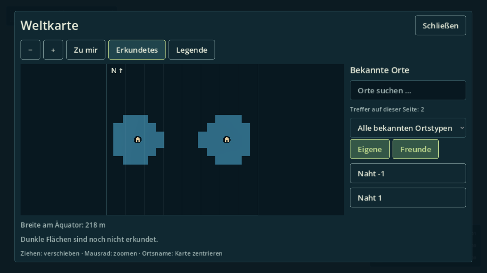
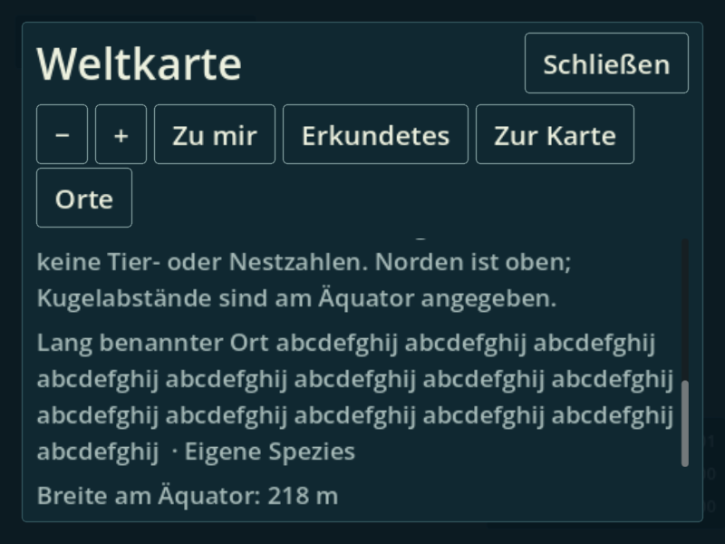

# Native-08 – gerenderte Kartenbedienung

Alle 56 hier verlinkten PNGs sind unbeschnittene Originale des bestandenen
Kampagnenlaufs auf `5e59bc5b42ac1b1b47f57878e0b2c9a5c39a6bf6` / Tree
`2661e09b4b15bebb1d27e1d17c1ed78ea8935fb3`. Die 54 Matrixbilder wurden
zusätzlich in neun temporären Kontaktblättern geprüft; Naht, Details und
800×600/150-%-Legende auch in voller Originalgröße. Keine Rohaufnahme verändert.
[Ergebnisse und Bildhashes](runs/native-08/results.json), [SourceRun](runs/native-08/source-report.json).

## Tatsächliche Bedienfolge

1. Titel → öffentliche neue Kugelkampagne → native M-Taste; Pause und heller
   Spielerpunkt über eigenem Nest. Maus-Wheel, Drag, +/−, Pfeile und Home
   verändern die Ansicht; Atlas-/Progressionszustand bleibt gleich.
2. Native Maus auf Erkundetes; deterministische gespeicherte bekannte Zellen
   beidseits der Kugelnaht am realen Kampagnenatlas. Beide Besuche im Fit,
   vollständiges Live-Sampler-Raster (coverage=1.0), danach Atlas restauriert.
3. Jede Matrixkonfiguration: normale Karte → Mausklick Legende → Zur Karte →
   Orte in kompakter Ansicht. Breite Ansichten behalten dieselbe echte Sidebar.
4. Maus öffnet Typ-Popup; native Down/Enter wählen bekannten Typ, dann Alle.
   Ctrl+F, echtes Tippen „Lang“, Mausklick auf die genaue stabile Ergebnis-ID.
   Legende/Details öffnen, Wheel bis letzte lange Detailzeile (Eigene Spezies).
5. Esc aus Details, Esc aus Karte; M öffnen/schließen. F8 öffnet Settings,
   M bleibt geblockt, F8 stellt Kampagnensteuerung wieder her. Echter Save,
   Atlasinvalidation beendet alle Kartenabfragen; Pause-/Buchblocker und
   Titelrückkehr bestehen. Neuer headless Prozess lädt denselben Save und
   reist über die echte Körperwechselkette; siehe originales Restartlog.

Der UI-Prüfer deaktiviert ausschließlich den pausierten 3D-Hintergrund unter
llvmpipe. Dies ist ein Kartenforeground-/Inputbeleg, keine Ziel-PC-/Weltgrafik-
oder FPS-Abnahme. Der separate Neustart-/Reiseabschnitt hat keine PNGs.

## Bildmatrix

Toolbar, Schließen und Wechsel bleiben im Fenster; keine Überlappung mit
Suchfeld oder Ergebnisliste. Lange Namen umbrechen. Kleine Legenden/Listen
haben sichtbare Scrollwege statt abgeschnittener Inhalte. Die vollständige
Detail-Endansicht ist separat belegt. Der helle Spielerpunkt bleibt sichtbar.
Die unbekannte Südpol-Fixture erscheint in keiner Liste oder Typzählung;
Markeranzahlen bedeuten bekannte Orte, niemals Spezies-/Nestpopulationen.
Gespeicherte benannte Orte behalten ihren eigenen Namen beim Sprachwechsel;
die umgebenden Bedien-, Typ- und Legendentexte wechseln DE/EN.

| Sprache | Fenster | UI-Skala | Karte | Legende | Orte | Review |
| --- | --- | --- | --- | --- | --- | --- |
| DE | 800×600 | 100 % | [map](runs/native-08/images/de-800x600-100-map.png) | [legend](runs/native-08/images/de-800x600-100-legend.png) | [places](runs/native-08/images/de-800x600-100-places.png) | geprüft |
| DE | 800×600 | 125 % | [map](runs/native-08/images/de-800x600-125-map.png) | [legend](runs/native-08/images/de-800x600-125-legend.png) | [places](runs/native-08/images/de-800x600-125-places.png) | geprüft |
| DE | 800×600 | 150 % | [map](runs/native-08/images/de-800x600-150-map.png) | [legend](runs/native-08/images/de-800x600-150-legend.png) | [places](runs/native-08/images/de-800x600-150-places.png) | geprüft |
| DE | 1280×720 | 100 % | [map](runs/native-08/images/de-1280x720-100-map.png) | [legend](runs/native-08/images/de-1280x720-100-legend.png) | [places](runs/native-08/images/de-1280x720-100-places.png) | geprüft |
| DE | 1280×720 | 125 % | [map](runs/native-08/images/de-1280x720-125-map.png) | [legend](runs/native-08/images/de-1280x720-125-legend.png) | [places](runs/native-08/images/de-1280x720-125-places.png) | geprüft |
| DE | 1280×720 | 150 % | [map](runs/native-08/images/de-1280x720-150-map.png) | [legend](runs/native-08/images/de-1280x720-150-legend.png) | [places](runs/native-08/images/de-1280x720-150-places.png) | geprüft |
| DE | 1920×1080 | 100 % | [map](runs/native-08/images/de-1920x1080-100-map.png) | [legend](runs/native-08/images/de-1920x1080-100-legend.png) | [places](runs/native-08/images/de-1920x1080-100-places.png) | geprüft |
| DE | 1920×1080 | 125 % | [map](runs/native-08/images/de-1920x1080-125-map.png) | [legend](runs/native-08/images/de-1920x1080-125-legend.png) | [places](runs/native-08/images/de-1920x1080-125-places.png) | geprüft |
| DE | 1920×1080 | 150 % | [map](runs/native-08/images/de-1920x1080-150-map.png) | [legend](runs/native-08/images/de-1920x1080-150-legend.png) | [places](runs/native-08/images/de-1920x1080-150-places.png) | geprüft |
| EN | 800×600 | 100 % | [map](runs/native-08/images/en-800x600-100-map.png) | [legend](runs/native-08/images/en-800x600-100-legend.png) | [places](runs/native-08/images/en-800x600-100-places.png) | geprüft |
| EN | 800×600 | 125 % | [map](runs/native-08/images/en-800x600-125-map.png) | [legend](runs/native-08/images/en-800x600-125-legend.png) | [places](runs/native-08/images/en-800x600-125-places.png) | geprüft |
| EN | 800×600 | 150 % | [map](runs/native-08/images/en-800x600-150-map.png) | [legend](runs/native-08/images/en-800x600-150-legend.png) | [places](runs/native-08/images/en-800x600-150-places.png) | geprüft |
| EN | 1280×720 | 100 % | [map](runs/native-08/images/en-1280x720-100-map.png) | [legend](runs/native-08/images/en-1280x720-100-legend.png) | [places](runs/native-08/images/en-1280x720-100-places.png) | geprüft |
| EN | 1280×720 | 125 % | [map](runs/native-08/images/en-1280x720-125-map.png) | [legend](runs/native-08/images/en-1280x720-125-legend.png) | [places](runs/native-08/images/en-1280x720-125-places.png) | geprüft |
| EN | 1280×720 | 150 % | [map](runs/native-08/images/en-1280x720-150-map.png) | [legend](runs/native-08/images/en-1280x720-150-legend.png) | [places](runs/native-08/images/en-1280x720-150-places.png) | geprüft |
| EN | 1920×1080 | 100 % | [map](runs/native-08/images/en-1920x1080-100-map.png) | [legend](runs/native-08/images/en-1920x1080-100-legend.png) | [places](runs/native-08/images/en-1920x1080-100-places.png) | geprüft |
| EN | 1920×1080 | 125 % | [map](runs/native-08/images/en-1920x1080-125-map.png) | [legend](runs/native-08/images/en-1920x1080-125-legend.png) | [places](runs/native-08/images/en-1920x1080-125-places.png) | geprüft |
| EN | 1920×1080 | 150 % | [map](runs/native-08/images/en-1920x1080-150-map.png) | [legend](runs/native-08/images/en-1920x1080-150-legend.png) | [places](runs/native-08/images/en-1920x1080-150-places.png) | geprüft |

## Vollständige Sonderansichten

[Naht mit beiden bekannten Besuchen und vollständigem Raster](runs/native-08/images/campaign-spherical-seam.png)

[800×600/150 %, ausgewählter langer Ort bis zur letzten Detailzeile](runs/native-08/images/selected-long-detail.png)

