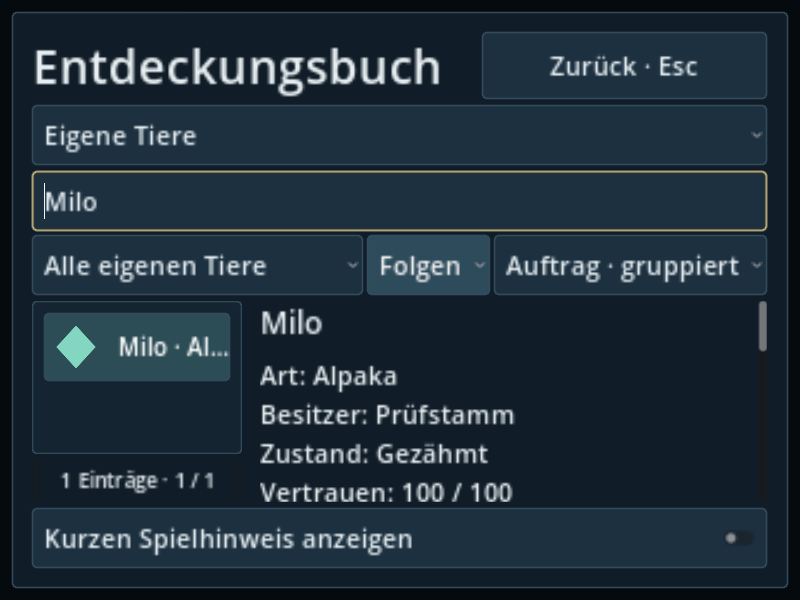
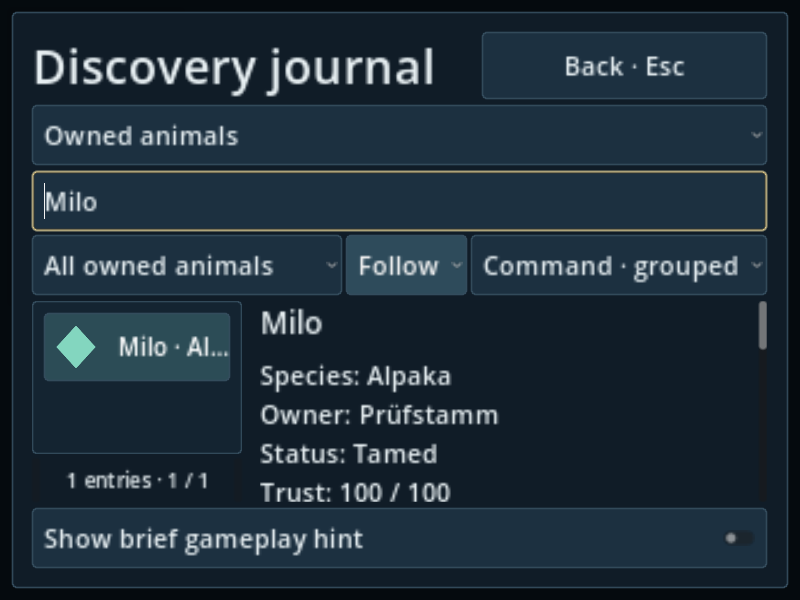
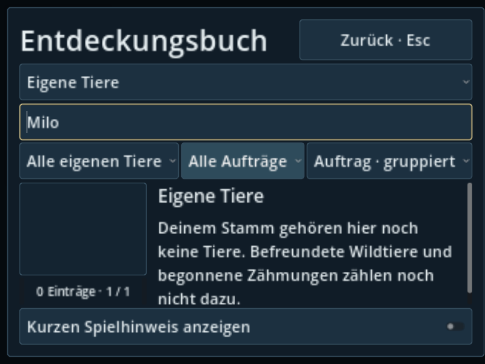
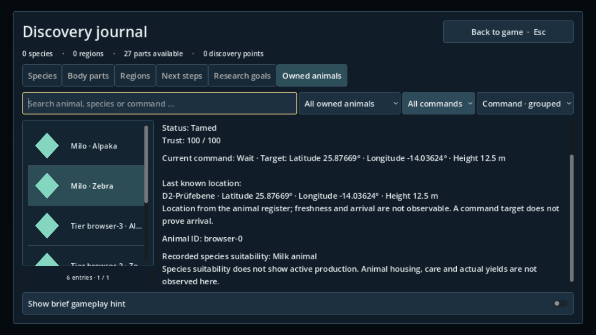

# INT30-13 · Eigene Tiere

Basis `2b1ac023db4074c2ce6b7db8fbab09ab929a8435`.
Lokal geprüfter Codecommit `ac06b16f78e6fc6df799b90da59d05e3c1ae4a08`, veröffentlicht als `672be5ccacdd05cd7609c48b2b0158a9516cd26b`; identischer Tree `722f03727f1038fe372fd960f56a2c29159121b9`. Die API-Veröffentlichung ändert Commit-Metadaten, nicht den Inhalt. Spätere Evidenzdateien ändern ausschließlich dieses Nachweisverzeichnis.

## Bedienung und Datenquellen

Im vorhandenen Reiter **Eigene Tiere** bleiben Suche, Lebenszustand, Auswahl und Seitennavigation erhalten. Die Filterzeile ergänzt **Alle Aufträge/Folgen/Warten/Heimkehr/Kein aktiver Auftrag** nur soweit im lesbaren D2-Bestand vorhanden. Verstorbene Tiere haben keinen aktiven Warteauftrag. **Name, Art, Vertrauen, Auftrag** wählen eine stabile Sortierung; gleiche Namen behalten ihren Schlüssel als letzte Ordnung. Die Liste zeigt auch die Art. Verschwindet der letzte Treffer eines Auftrags durch Verlust/Entfernen/Laden, wird dieser nicht mehr mögliche Filter zurückgesetzt. Suche und Sortierung bleiben erhalten.

Besitzer/letzter Besitzer, Vertrauen in D2-Einheiten (0–100), Auftrag und Betreuer/Ziel sowie letzter bekannter Ort bleiben echte gelesene D2-Werte. Der Standort enthält keinen erfundenen Zeitstempel, Live-Aufenthalt oder bestätigte Ankunft. Fehlende Anzeigenamen bleiben als unbekannt mit stabiler ID erkennbar. Nutztiereignung stammt ausschließlich aus einem vollständigen unterstützten gespeicherten Art-Scan mit derselben stabilen Art- und Körper-ID. Fehlender, unvollständiger, fremder oder zukünftiger Beleg erzeugt keine Eignung. Es werden keine Erträge/Versorgungs-/Tierplatzwerte erzeugt oder vorgespiegelt.

Die neue Steuerung und Texte leben im eigenen Präsentationsbereich. Das Journal hat nur den engen Registeranschluss; Scanner, Tierverhalten, D2-Host, Dorfwirtschaft und SaveService bleiben bei ihren Besitzern. Zuordnung/Anschluss an Chat 1 in #137 gemeldet; keine ausstehende Antwort als Bestätigung behandelt. Übersetzungs- und optionaler CI-Anhang: [integration-append.md](integration-append.md). Der bestehende registrierte Lokalisierungstest wird erweitert; kein neuer Registryeintrag.

## Fachprüfung

Godot `4.6.3.stable.official.7d41c59c4`, Linux, isolierte Nutzerdateien. Kein Zugriff auf echte Kampagnensaves. Das gemeinsame Buch wird tatsächlich geöffnet/pausiert, auf DE/EN umgeschaltet und geschlossen. D2-Zähmen/Befehle/Speicherfehler/Neustart stammen aus dem vorhandenen echten D2-Prüfstand. Die Sammlungen von 127 bzw. sechs Datensätzen und die beobachteten Artprofile sind ausdrücklich synthetische, D2-/D1-validierte UI-Prüfdaten.

| Prüfung | Ergebnis und Nachweis |
|---|---|
| owned_animal_register_test | bestanden; echte D2-Bindung, Besitzer-/Körpergrenze, Zukunftsschutz, Unbind und Laden |
| owned_animal_localization_test | bestanden; 291 Headless-Assertions, kalter Prozess, vorhandene 127-Tier-Sammlung und neue Browserfälle |
| discovery_journal_test | bestanden; direkter Buchverbraucher |
| interface_task7_test | bestanden; gültige/ungültige Art-Eignung und Buchabläufe |
| domestic_fauna_journal_test | Wiederholung bestanden in 29,272 s; zuvor Timeout bei unverändertem 120-s-Limit. Baseline ohne Fachänderung bestand in 60,040 s |
| journal_paging_test | Wiederholung bestanden in 90,491 s; zuvor Timeout bei unverändertem 120-s-Limit |
| Grafik | 27/27 echte GL-Compatibility-/Mesa-llvmpipe-PNGs, 296 Assertions, Mausöffnung und Tastaturauswahl tatsächlicher Dropdowns |
| Import/Quellverträge | bestanden; keine doppelte Registrierung, generierte zentrale Übersetzungen unverändert |

Der erste breitere lokale Lauf war **nicht insgesamt grün**. Beide unveränderten Wiederholungen sind separat belegt; Limits und Erwartungen wurden nicht geändert. Der erste Baselineversuch konnte wegen eines 20-s-Git-Status-Timeouts nicht beginnen; nur der tatsächlich gestartete Baseline-Lauf gilt als Testbeleg. Eine Grafik-Wiederholung erreichte ebenfalls ihr Limit. Der abschließende unveränderte Code lief mit `LP_NUM_THREADS=2` erfolgreich. Git-Status-Timeout, wechselnde Laufzeiten und erfolgreicher unveränderter Wiederlauf sprechen für Umgebungsdruck; die genaue Ursache der einzelnen Timeouts ist damit nicht abschließend belegt. Daraus folgt keine Ziel-PC-Aussage. Fehlläufe bleiben in JSON/Logs erhalten.

Erster Befehl: `python3 tools/validate_godot.py --godot <Godot-4.6.3> --tests owned_animal_register_test owned_animal_localization_test discovery_journal_test domestic_fauna_journal_test interface_task7_test journal_paging_test --skip-main --output <isolierter-Ordner>`. Wiederholung: gleiche Engine, nur die beiden Timeout-Tests, `--skip-import --skip-main` mit demselben erfolgreich importierten Ressourcenbestand. Vier Tests liefen auf dem im ersten Bericht genau gehashten Arbeitsstand; [checked-inputs.json](checked-inputs.json) belegt byteidentische Godot-Dateien zum Codecommit. Wiederholung und Grafik haben den sauberen Codecommit und identische vollständige Quellmanifeste vor/nach Ausführung.

Grafikbefehl: `LIBGL_ALWAYS_SOFTWARE=1 LP_NUM_THREADS=2 python3 tools/review_int30_owned_animals.py --godot <Godot-4.6.3> --output <Ordner>` auf portablem Xvfb über eigenes Loopback-Display, kein Headless-Pixelersatz. Der Helfer aktiviert `--browser-capture`; der ältere Aufnahmehelfer behält seinen 20-Bild-Vertrag. [render-results.json](render-results.json) enthält 27 Namen/Digests und Quellprovenienz. Matrix DE/EN × 800×600/720p/1080p × 100/150 %, zusätzliche leere/ungültige/verstorbene Fälle und die sieben Browseransichten. Alle 27 Bilder wurden von der Layout-/Zustandsmatrix geprüft; vier repräsentative Original-PNGs wurden zusätzlich visuell gesichtet und sind hier dauerhaft beigefügt. Alle übrigen Bilder sind reproduzierbar über denselben Helfer.

## Gerenderte Ansichten

## Integrationsgrenze

Lokales `git merge-tree --write-tree` gegen den beim PR-Start beobachteten Integrationskopf `0ab9d20b0f448864c6e104c093b3ce97532e95e5` ergab konfliktfrei Tree `96c1593511052279dd9598a9ef23c613386996fb` (Code ohne spätere Evidenzdateien). Dies führt keinen Spieltest des Merge-Trees aus. Der konservative Änderungsplan verlangt vollständige Integrationsprüfung; [validation-plan.txt](validation-plan.txt) bleibt ein Plan, kein Testbeleg. FULL-Gates, native Exporte, andere Renderer und Lars’ Ziel-PC-Abnahme bleiben bei Chat 1/Integration. Keine zweite Tierverwaltung, keine Produktions-/Standort-Simulation, kein main-Merge und kein Auto-Merge.
