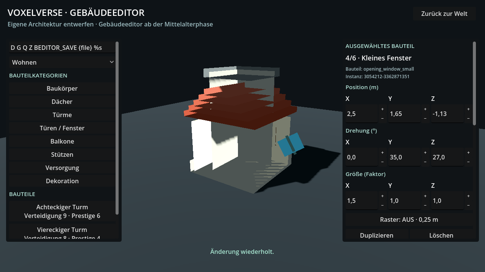

# INT30-14-BUILDING-EDITOR: Fachnachweis

Basis: `2b1ac023db4074c2ce6b7db8fbab09ab929a8435`. Schreibbereich gemäß
Issue #137, Bestätigung `5918892397`: BuildingBuilder, eigene Bedienhelfer,
eigene Tests und Nachweise. PR gegen `agent/integration-pt19-20260930`.

Der Editor zeigt Name, Listenposition, bestehende Teilekennung und Instanz-UID
der Auswahl. Position, Drehung und Größe sind auf X/Y/Z direkt editierbar;
Plus/Minus verwendet das vorhandene Positionsraster bzw. 15°/0,05.
Numerische Änderungen nutzen Assembly, Contract und die bestehende Historie.
Unveränderte Felder, Drehung und Skalierung versetzen ältere ungerasterte
Bauteile nicht. Feste Oberflächentexte verwenden den vorhandenen DE/EN-Weg.
Sprachwechsel bewahrt Entwurf, Eingabetext, Fokus, Scrollposition und Savebytes.

## Abgeschlossene Prüfungen

| Prüfung | Ergebnis | Dauer |
| --- | --- | --- |
| building_editor_input_test | 528 Kontrollen, Exit 0 | 10,111 s |
| modular_assembly_framework_test | bestanden, Exit 0 | 2,648 s |
| blueprint_contract_test | bestanden, Exit 0 | 5,322 s |
| campaign_foundation_test | bestanden, Exit 0 | 5,989 s |
| coordinate_persistence_test | bestanden, Exit 0 | 4,733 s |
| Native Bedienung und Layouts | 534 Kontrollen, Exit 0, sieben PNGs | festes 180-s-Budget eingehalten |
| Neuer Prozess nach nativem Editor | zwei Kontrollen, Exit 0 | festes 60-s-Budget eingehalten |

Maßgeblich sind [input-results.json](input-results.json), die fünf Fachlogs,
[render-results.json](render-results.json), [render.log](render.log) und
[restart.log](restart.log). Quellen blieben bei beiden finalen Läufen unverändert.
Headless-Skripte wurden real ausgeführt; die dort genannte Rendering-Methode
`forward_plus` ist **kein** Forward+-Sichtnachweis.

| Echte Eingabe in der vorhandenen Szene | Geprüftes Verhalten |
| --- | --- |
| Auswahl per Bauteilliste | genau das zweite Fenster einschließlich vorhandener UID |
| Plus-Taste, dann Undo | Rasterbewegung und exakte ursprüngliche Position |
| Zahleneingabe Position X: 2,38 | Rasterwert 2,5; Y/Z unverändert |
| Raster aus, Position Z: −1,13 | eingegebener ungerasterter Wert |
| Drehung Y: 35 und Z: 27; Größe X: 1,5 | nur angeforderte Achse; ursprüngliche Position bleibt erhalten |
| Palette: viereckiger Turm | genau ein neues Bauteil mit bestehender Teile-ID |
| Duplizieren, Löschen, Undo/Redo | neue Duplikat-UID; alte UIDs und Historiezustände bleiben erhalten |
| Name mit D/G/Q/Z, BEDITOR_SAVE, {file}, %s | wörtlicher Nutzertext; keine Editoraktion oder Übersetzung |
| DE/EN während offener Zahleneingabe | Text, Fokus, Caret, Scroll und Entwurf bleiben erhalten |
| Speichern, Neu, Laden, Undo/Redo, Prozessneustart | Revision, Design-ID, Teile-IDs, Transformwerte und Metadaten bleiben erhalten |
| Alle Bauteile löschen, letztes Löschen rückgängig | leere Auswahl deaktiviert Felder; Validierung und Undo funktionieren |
| DE/EN bei drei Fenstergrößen | gebundene Texte übersetzt; keine horizontale Panel-/Feldüberlappung |

## Gerenderte Bediennachweise

Alle sieben Aufnahmen wurden aus dem tatsächlichen X11-Viewport gelesen,
anschließend visuell geprüft und nach Abmessungen/SHA-256 kontrolliert.
Bei 800×600 sind die Seitenleisten vertikal scrollbar; die unteren Größenwerte
liegen unterhalb des sichtbaren oberen Ausschnitts. Bei 1280×720 sind alle neun
Achsenwerte im oberen Inspector sichtbar. Der absichtlich eingegebene Name
`D G Q Z BEDITOR_SAVE {file} %s` ist Nutzertext, kein fehlender Katalogeintrag.

| Größe | Deutsch | Englisch |
| --- | --- | --- |
| 800×600 | [PNG](building-de-800x600.png) | [PNG](building-en-800x600.png) |
| 1280×720 | [PNG](building-de-1280x720.png) | [PNG](building-en-1280x720.png) |
| 1920×1080 | [PNG](building-de-1920x1080.png) | [PNG](building-en-1920x1080.png) |

[Leere Auswahl](building-empty.png).



## Reproduktion und Quellbezug

Finaler Fachcode: Commit `47a236ac7c975699567aeb6de7794b15835ac13a`,
Tree `856b1a51fca1f69279a56e562fe8335da32e9f9a`.
Getrennter sauberer Prüfworktree:
Commit `9a405605b6092d0d42e345962c33f7f86480768e`,
Tree `54741aed70f6bdb33dfa7c150803f8e725193977`,
Quellhash `fc116ec13c20942168ee5437209d482abf5cbc323c00e787b8fb6bad56247d6f`.
Alle 13 Fachdateien sind bytegleich; [feature-hashes.json](feature-hashes.json)
verbindet die Dateien mit dem vollständigen Quellmanifest des Grafikreports.
Der Prüfworktree enthält zusätzlich ausschließlich die vorgeschlagenen zentralen
Katalog-/Registry-Anschlüsse und die daraus erzeugten DE/EN-Dateien.

Godot `4.6.3.stable.official.7d41c59c4`, Linux, Compatibility/OpenGL 4.5,
Mesa 25.2.8 llvmpipe, LLVM 20.1.2. Die ausführbare Datei wurde wegen Stalls
bytegleich in `/dev/shm/int30-14-godot` bereitgestellt;
SHA-256 `f64d4ed19fc9df9440321653fcc80df8c6e365ba7b6de0a29e2cfa9fa71bfeb3`.
Nutzerdateien sind pro Lauf isoliert. Xvfb lief mit 1920×1080×24 über lokalen
TCP-Transport, `LIBGL_ALWAYS_SOFTWARE=1` und `LP_NUM_THREADS=2`.

```sh
python3 tools/validate_godot.py --godot /dev/shm/int30-14-godot \
  --skip-import --skip-main --tests building_editor_input_test \
  modular_assembly_framework_test blueprint_contract_test \
  campaign_foundation_test coordinate_persistence_test --output /tmp/editor-checks

xvfb-run -a -s '-screen 0 1920x1080x24' \
  python3 tools/review_building_editor.py --godot /path/to/godot-4.6.3 \
  --output /tmp/editor-review
```

Der Import der neuen Ressourcen war im Vorlauf erfolgreich (17,293 s;
[import.log](import.log)). Nach der reinen GDScript-Präzisionskorrektur wurde
der bestehende Importcache weiterverwendet; die finale Szene und alle Skripte
wurden durch die tatsächlichen Fach-/Grafikläufe neu geladen und geprüft.
Es wurde kein gemeinsames Zeitbudget erhöht und kein fremder Prozess beendet.

## Vorläufe und Grenzen

Die ersten Eingabetests fanden Fehler in der Neustart-Argumentübergabe bzw.
JSON-Vergleichsreihenfolge; der Neustartvergleich verwendet jetzt einen Pfad
und geparste Dictionaries. Die erste Bildprüfung fand den fehlenden Palette-Key
und transparente Panels. Beide sind korrigiert; die endgültigen Tests prüfen
alle gebundenen Texte. [attempt-4-building_editor_input_test.log](attempt-4-building_editor_input_test.log)
enthält den falschen Testpfad zur verschachtelten Plus-Taste;
[attempt-6-building_editor_input_test.log](attempt-6-building_editor_input_test.log)
belegt den anschließend gefundenen echten Präzisions-/Undo-Fehler.
Die oben genannten finalen Läufe bestätigen deren Korrektur.

Native Vorläufe 2–5 überschritten 180 s, teils beim Prozessstart, teils beim
Neustart/Beenden. Ihre Logs liegen als `native-timeout-*.log` bei und gelten
ausdrücklich nicht als bestandene Grafikläufe. Ein weiterer Importvorlauf
überschritt 180 s ([attempt-5-results.json](attempt-5-results.json)). Zu diesem
Zeitpunkt lag der gemeinsame Ausführungsrechner an der 8-GiB-Speichergrenze.
Nur der finale native Lauf 6 ist hier als bestanden ausgewiesen.

Der rohe Fachbranch wartet auf Chat 1: 139 Katalogeinträge generieren, den Test
einmal unter `blueprints` registrieren; optional den eigenen Grafikworkflow
übernehmen. Enge Patches stehen in [docs/integration](../../integration/int30-14-building-editor/README.md).
Assembly, Blueprint, Teilebibliothek, DesignRegistry und Stamm/Dorfwirtschaft
sind unverändert. Die bestehende Mittelalter-Freischaltung bleibt bestehen.
Chat 17/25 liefern ihre Anschlüsse getrennt.

Keine Vollsuite, Main-/Integrationsgates, Desktop-Exports, Forward+-Sichtprüfung
oder Ziel-PC-/Spielspaß-Abnahme. PR bleibt bis zu den zentralen Anschlüssen
ein Entwurf; kein main-Merge oder Auto-Merge.
