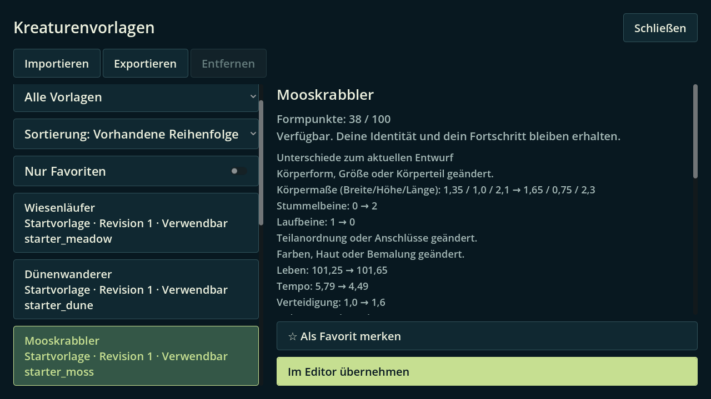
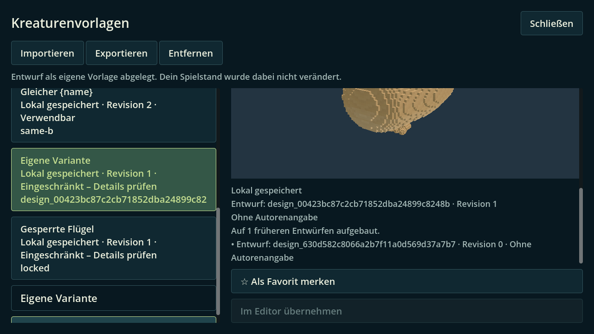
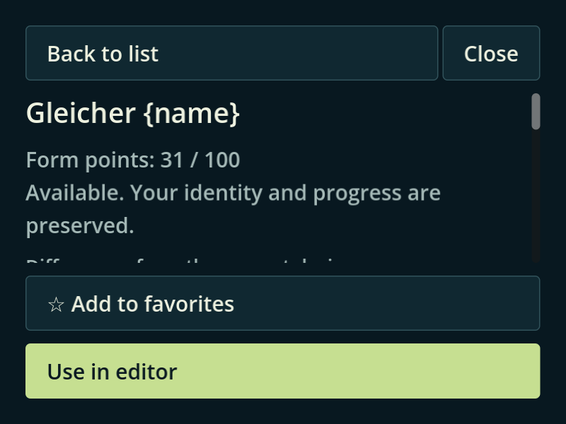
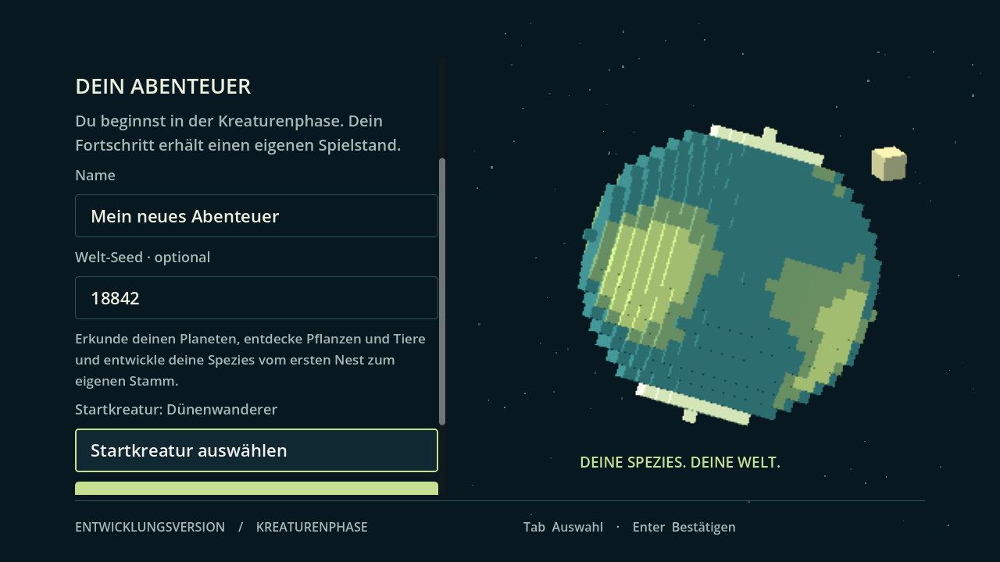

# INT30-12-DESIGN-LIBRARY

Basis: `2b1ac023db4074c2ce6b7db8fbab09ab929a8435`.
Branch: `agent/int30-12-design-library-20260930`.
[Fach-PR #230](https://github.com/MajorDragonfly/voxelverse/pull/230) gegen
`agent/integration-pt19-20260930`. Kein main-Merge/Auto-Merge.

## Ergebnis

- Vorhandene Suche, Herkunftsfilter und Favoriten bleiben kombinierbar. Zusätzlich:
  ursprüngliche Reihenfolge, Name A–Z, höchste Revision und verwendbare zuerst.
  Gleiche Namen werden durch vollständige Entwurfs-ID/Revision unterschieden;
  Sortiergleichstände werden anhand der stabilen Schlüssel aufgelöst.
- Details zeigen echte Quelle, Autor, Revision, Tags und alle gespeicherten
  Herkunftsreferenzen. Das bestehende Format unterscheidet eigene und importierte
  Dateien nicht verlässlich; die Anzeige erfindet dafür keine Herkunft.
- Vor Übernahme: Formpunkte, konkrete fehlende Freischaltungen/Teile, Körpermaße,
  Teilezahlen, Anordnung/Anschlüsse, Aussehen und Änderungen der berechneten
  Fähigkeiten. Empfangsidentität und Fortschritt werden weiter vom bestehenden
  Paket-/Editorpfad geschützt; Editorübernahme bleibt rückgängig zu machen.
- Ein ausgeblendeter Such-/Filtertreffer ist ausdrücklich markiert und gesperrt.
  Extern geänderte Pakete oder Empfangsentwürfe werden vor Übernahme erneut
  angezeigt. Ein neuer ausgewählter Entwurf entfernt alte Importfehlermeldungen.
- Gleicher Entwurf und Freischaltungs-/Phasenkontext verwenden die gelesenen
  Listenprüfungen erneut; geänderte Kontexte invalidieren sie. Auswahl und
  Übernahme prüfen kanonisch. Sprachwechsel baut dieselbe Vorschau nicht erneut.
- Geschützte/fremde Zukunftsentwürfe können keine leere Serialisierung in den
  Vergleich einschleusen: Vergleich nicht verfügbar, Übernahme gesperrt,
  Original erhalten. Beschädigte/future Bibliotheken behalten Startvorlagen und
  erlauben keine Metadatenänderung.

Produktänderungen nur in `ui/blueprints/creature_library_panel.gd` und dem neuen
lesenden `creature_library_presentation.gd`. Gemeinsame Vorschau-, Paket-,
Kampagnen-, Speicher- und Frontendmodule sind auf dem Fachbranch unverändert.
Der genaue Fachbereich wurde in #137 gemeldet; keine Bestätigung durch Chat 1
wird daraus abgeleitet.

## Gemeinsame Anschlüsse

Chat 1 erhält `catalog.patch` / `catalog-append.json` (36 DE/EN-Schlüssel) und
`registry.patch` (neuen `int30_design_library_picker_test` genau einmal im
blueprints-Vertrag registrieren). Danach `python3 tools/localization/catalog.py`
ausführen. Keine parallele Gesamtkatalog-/Registryänderung auf dem Fachbranch.
Ohne den Anschluss bleibt der neue Test im Fachbranch unregistriert und das
Source-Gate blockiert; neue Texte benötigen den Katalogpatch.

Chat 9 erhält `frontend-chat9.patch`: enger lesender `compare_current`-Callback
für die bereits gewählte Startform. Ohne diesen optionalen Anschluss vergleicht
der Startpicker mit der Standardform. Der Editor verwendet unverändert seinen
vorhandenen `capture_current`-Anschluss. `template_chosen(package)` und
`prepare_template` bleiben kompatibel.

## Fachbelege

Godot `4.6.3.stable.official.7d41c59c4`, Linux; pro Prozess isolierte Nutzerdaten.
Native Grafik: OpenGL Compatibility, Mesa 25.2.8, llvmpipe/LLVM 20.1.2;
portables X11 über Loopback, keine Eskalation. Befehle, Laufzeiten und Hashes in
`headless/results.json`, `native/results.json` und `source-manifest.json`.

| Prüfung | Ergebnis | Beleg |
|---|---|---|
| Finaler Fachtest | 118 Erwartungen bestanden, Exit 0, 81,599 s | `headless/picker.log` |
| Native Pickerbedienung | 125 Erwartungen bestanden, Exit 0, 311,996 s; neun PNGs | `native/picker/` |
| Echter Editor/Startmenü-Verbraucher | Exit 0, 174,617 s; acht PNGs; reale Übernahme, Undo/Redo, Speichern, Export/Import, Entfernen, Fokus und Spielstart | `native/editor/` |
| Verbraucherkatalog/Registry | 248 Tests genau einmal zugeordnet, generierte DE/EN-Ressourcen korrekt; keine Ausführung der 248 Tests | `consumer-source-contracts.json` |

Die Fenstermatrix umfasst DE/EN × 800×600/1280×720/1920×1080 ×
100/125/150 %, also **18** Kombinationen. Die vorhandene Editorprüfung ergänzt
1920×1080 und 2560×1080 sowie 800×600/150 %. Aktive Namen mit `{name}` bzw.
Autoren mit `{revision}` bleiben wörtlich erhalten. Originale und Fortschritt
werden vor/nach den Bedienfällen verglichen.

Der native Verbrauchercheckout enthält separat angewandte zentrale/Frontend-
Patches. Seine SHA/Tree und die tatsächlichen Fachdateihashes stehen im Manifest.
Die letzten drei Headless-Erwartungen prüfen den anschließend ergänzten Schutz
gegen leere Serialisierung. Gültige Darstellungen bleiben gleich; der separate
Schutzaufnahmehelfer ist reproduzierbar mitgeliefert. Seine beiden Zusatzläufe
erreichten 180 s ohne Bild/Ergebnis; dieser native Sonderfall bleibt ausdrücklich
offen (`historical/protected-capture-results.json`). Die drei Schutz-Erwartungen
des finalen Headless-Checks bestehen.

## Frühere Fehler und offene Grenzen

`historical/initial-contracts/` enthält die vier erfolgreichen vorhandenen
Bibliotheks-/Paketprüfungen eines früheren Fachstands. Die folgende kombinierte
120-s-Runde scheiterte an mehreren Zeitlimits; `historical/120s-checks/` bewahrt
alle Ergebnisse, nicht als grüne Freigabe. Auch der erste 300-s-Grafiklauf ist
erhalten. Der stark belegte gemeinsame Host zeigte Load Average über 30; daraus
wird keine alleinige Fehlerursache oder Ziel-PC-Leistungsbewertung abgeleitet.
Zentrale Zeitlimits/Assertions wurden nicht geändert.

Der erste native Verbraucher erreichte den unveränderten 90-s-world_started-
Watchdog. Der Aufnahmehelfer verwendete dort außerdem irrtümlich `--capture`
statt des bestehenden `--capture-dir`. Beide Punkte sind im ursprünglichen
Fehlerbeleg erhalten. Der korrigierte Captureaufruf besteht vollständig,
einschließlich tatsächlichem `world_started` und korrekt gestarteter Körperform.

Der konservative Änderungsplan des Consumer-Checkouts verlangt die volle Suite
mit 248 Tests und Runtimechecks (`change-plan-summary.txt`). Diese Gesamtprüfung,
CI des neuen Merge-Trees, native Exporte, Forward+ und Ziel-PC-Spieltest bleiben
bei der Integration. Fachbelege ersetzen diese Gates nicht. Entwurfsstatus bis
zur Übernahme der zentralen Anschlüsse und vollständigen Integration beibehalten.

## Aufnahmen

Alle weiteren Aufnahmen liegen neben diesen Dateien; `review_picker.py` erzeugt
die echten Bedienansichten erneut (`--editor` für beide Abläufe,
`--editor-only` nur für den bestehenden Verbraucher). Standardbudget 300 s;
der ausgewiesene Lastdiagnoselauf verwendete 600 s pro unveränderter Szene.
