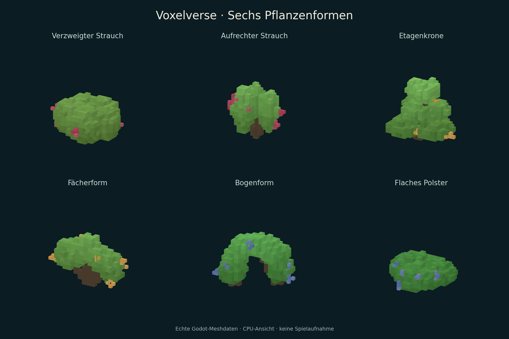
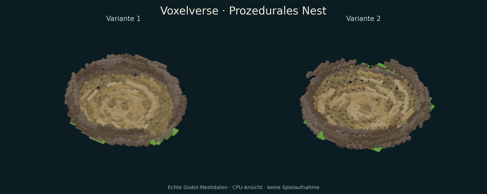

# Integrationsabnahme: Ressourcen und PRs #93–108

15. September 2026. Basis `d378ca0ecd7f03429a5150df6358e0646ec06689`;
Branch `agent/integration-vegetation-nest-20260915`.
Quell-/Werkzeugstand `4648ae9a0f3f3f418889da57e806cffba1f24c7d`;
der folgende Dokumentationscommit enthält ausschließlich Übergabe und Nachweise.

## Ergebnis und genaue Reichweite

| Prüfung | Ergebnis | Quellzuordnung / Einschränkung |
|---|---|---|
| Alle registrierten Godot-Tests | 179 nach Korrekturen erfolgreich | Ein vollständiger Lauf in vier disjunkten Gruppen; zwei alte Testannahmen korrigiert und nachgeprüft; danach gezielte Grafik-Nachläufe |
| Gemeinsamer Start, Lebenszyklus und Streaming | 24/24 einschließlich Quellvertrag | Start am sauberen `41deb8c`; spätere Test-/Textänderungen im beigefügten Delta |
| Import und Art-Quellen | 3/3 einschließlich Quellvertrag | Sauberer `41deb8c`, Godot 4.6.3 |
| Python-Werkzeuge | 101 erfolgreich, 6 optionale ausgelassen | `2f551d0`; vollständiges Protokoll in `python-tooling.log` |
| Voller nativer Linux-Export | 37/37 | Export am sauberen `41deb8c`, **vor** der späteren Flächenkorrektur; unabhängige Release-Starts, echte Produktion/Reise und Instrumentierung des exakten PCK |
| Korrigierter Linux-Export | 6/6 gezielte Nachprüfungen | Sauberer `4648ae9`; erneuter Export, nativer Titel/Kugelkampagne, Ressourcen samt frischem Prozess aus dem PCK, Quelltest und Meshdatenexport |
| Labortier-Backup | Gezielter nativer Lauf erfolgreich | 388 historische Identitäten, maximal 4 aktive Tiere, Cachemaximum 96; Manifestprüfung, Archiv und Neustart ohne Originalverzeichnis |
| Windows, native Grafik und Ziel-PC | Offen | Keine Windows-/FPS-/Hörfreigabe aus Headless-Ergebnissen |

Der volle Linux-Lauf ist **kein Vollnachweis für das später neu gebaute PCK**.
Die späte Änderung dreht ausschließlich die Dreiecksindizes der Ressourcen um;
Vertices, Farben, Kollisionskörper, IDs, Nahrungsvorräte und Simulation bleiben
unverändert. Dafür wurden Ressourcen, Heimatgruppe und Kugelkampagne erneut
geprüft. Der neue Export erhielt einen eigenen gezielten Nachweis. Gemeinsame CI
am veröffentlichten Integrationsstand steht noch aus.

## Korrekturen und unveränderte Rohdaten

- Rüssel-Fachtest: Erwartung sieben Münder war nach der Schnauzenlieferung veraltet.
  Die zehn konkreten Mund-IDs werden geprüft; der Rüssel bleibt separat.
- Vollsuite: `creature_parts_studio_test` erwartete 33 statt der nun 36 Rezepte.
  Die tatsächliche Erstellung aller Rezepte bleibt Bestandteil der Prüfung.
- Vollsuite: `egg_species_campaign_test` verglich das frühere Inline-Begegnungsbuch
  direkt mit dem neuen Archivformat. Der echte alte Spielstand behält nun geprüft
  sämtliche übrigen Fortschrittsfelder; sein leeres Buch muss zu einem gültigen
  leeren Archiv werden. Revisit und frischer Prozess bleiben vollständig geprüft.
- Eigene Abschlussprüfung: Der neue Ressourcen-Mesher hatte falsche Frontflächen,
  und seine erste Prüfung verwendete dieselbe falsche Annahme. Die verstärkte
  Prüfung nimmt Godots `BoxMesh` als Referenz. `resource-winding-negative` beweist
  den Fehler; `resource-winding-corrected` und der spätere PCK-Test bestehen.
  Grundlage: [Godot 4.6: ArrayMesh](https://docs.godotengine.org/en/4.6/classes/class_arraymesh.html).

`validation-logs.zip` enthält die ursprünglichen Berichte und Protokolle,
einschließlich der roten Läufe. Auch eine anfänglich falsche Auswahl zweier
Testnamen im fokussierten Runner bleibt nachvollziehbar erhalten. `source-tests.json`
ordnet jedem der 179 Tests den erfolgreichen Lauf zu; es ersetzt keine Rohdaten.

Der vorhandene Quellrunner erfasst `source` erst beim Schreiben des Berichts.
Der vollständige Lauf begann am sauberen `41deb8c`, währenddessen wurden die
oben genannten Änderungen eingespielt. **Die im alten Bericht genannte
Endrevision ist deshalb nicht automatisch der Startstand.**
`manifest.json` und `validation-source-delta.patch` dokumentieren die tatsächliche
Zuordnung. Test-/Kommentar-/Paketkorrekturen und die isolierte Flächenkorrektur
werden nicht als ein einziger unveränderter Prüflauf ausgegeben.

Der native Labortier-Backuplauf wurde im Terminal separat ausgeführt. Beobachtet:
1172 Dateien, 256 Verzeichnisse, 6.568.511 Bytes, 1428 Archiveinträge; 388 Tier-IDs,
4 aktive Tiere, Cachemaximum 96. Der ursprüngliche stdout liegt nur im
Sitzungsnachweis vor und wurde nicht nachträglich als Rohprotokoll rekonstruiert.

## Vorschauen

Die Bilder verwenden die tatsächlichen, nach der Flächenkorrektur exportierten
Godot-Arrays. Es sind CPU-Ansichten ohne native Beleuchtung, Schatten oder
Backface-Culling, **keine Spielaufnahmen**. Sie wurden visuell geprüft.





`mesh-data.zip` enthält die zugrunde liegenden Arrays. Native Ressourcenansichten
sind zusätzlich in der bestehenden Grafik-CI für Forward+ und Compatibility
registriert. Lokal kann der X-Server keine Sockets öffnen.

## Reproduktion

Godot `4.6.3.stable.official.7d41c59c4`; Linux x86_64/glibc 2.39, 9 sichtbare CPUs,
cgroup-Budget 8 CPU-Kerne, 20 GiB RAM. Isolierte Nutzerdaten über den bestehenden
Runner; Editor außerhalb seines Self-contained-Markers. Keine GPU-/FPS-Messung.

Die ausgewählten Testnamen der vier Gruppen stehen in `shard-selections.json`.
Die Befehle entsprechen einem einmaligen vollständigen Quelllauf plus getrennten
Laufzeit-/Exportprüfungen; auf dem finalen Stand enthält der Exportvertrag zusätzlich
den neuen Ressourcen-PCK-Test:

```sh
python3 tools/validate_godot.py --godot "$VV_GODOT" --tests --skip-main --output /tmp/vv-import
python3 tools/validate_godot.py --godot "$VV_GODOT" --skip-import --skip-main --output /tmp/vv-source
python3 tools/validate_godot.py --godot "$VV_GODOT" --skip-import --tests --output /tmp/vv-runtime
python3 -m unittest discover -s tests/tooling -p '*_test.py' -v
GODOT_BINARY="$VV_GODOT" python3 -m unittest discover -s tests/tooling -p lab_fauna_backup_test.py -v
python3 tools/validate_export.py --godot "$VV_GODOT" --platform linux --skip-import --output /tmp/vv-linux
```

`linux-resource-final-results.json` enthält die exakten Befehle der gezielten
Nachprüfung und den SHA-256 des neuen PCK. `input-pr-heads.json` fixiert die 16
übernommenen PR-Köpfe. `SHA256SUMS.txt` prüft die beigefügten Nachweisdateien.

Zum Abschluss dieses Nachweises ist der Branch lokal vorbereitet. Die automatische
Freigabeprüfung hat den Upload ins öffentliche GitHub-Repository blockiert, weil
die Freigabe für diese Veröffentlichung noch fehlt. Es wurden weder ein Remote-
Integrations-PR angelegt noch `main` gemergt.
