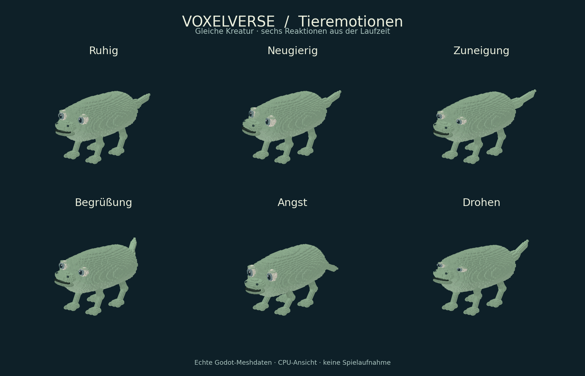

# Prüfstand M4-EXPRESSION

**Aktualisierung nach Nutzerfeedback:** [Korrigierte Augen/Lider und neuer Prüfstand](eyes/README.md).
Der folgende Bericht und seine Vorschau dokumentieren die erste Lieferung.

Geprüfter sauberer lokaler Quellcommit:
`1d8a9e9e3776b80d9d9d5e6063c9ebf50980f360`.
Veröffentlicht als `f425744148c242ec55d64f2a55f989655501e1e0`;
**identischer Git-Tree** `a3a1ee9cccf257b718ff2d3ca9c608bcc5515022`.
Die GitHub-Anbindung vergibt eine andere Commit-ID; die Rohberichte behalten
unverändert die tatsächlich geprüfte lokale ID.

## Ergebnis

Godot `4.6.3.stable.official.7d41c59c4`, Linux/headless, isolierte synthetische
Benutzerdaten. **Sieben Fachtests und Quell-/Sprachgate bestanden.**
[Originaler Abschlussbericht](final/results.json) · [Dateihashes und Zuordnung](manifest.json).

```sh
python3 tools/validate_godot.py --godot GODOT_4_6_3 --skip-main --skip-import \
  --tests creature_expression_test creature_part_articulation_test \
  creature_behavior_gameplay_test domestication_campaign_test wildlife_ai_test \
  wildlife_foraging_test wildlife_drinking_test --output OUTPUT
```

Der neue Test hat 762 Prüfbedingungen; sein frischer Unterprozess prüft 749
Bedingungen einschließlich erneut geladenem Tier und Begrüßung. Enthalten:
Determinismus, 30/60/120 Hz, Pause, Gefahrvorrang, Ende einer Geste, Begrüßung
über den öffentlichen Interaktionspfad, Abklingzeit, Reichweite, echte Wand,
unveränderte Punkte/Begegnung, Save/Load, Prozessneustart, gescheiterte Hilfe,
Tod, 0/2/4/6 Beine im gedrehten Raumrahmen, Fußkontakt beim Stehen/Gehen/Rennen,
keine Transformakkumulation, erhaltene Beißanimation und Rückkehr zum Editormodus.
Die bestehenden Tests prüfen die echten Sozial-/Zähmungs-, Flucht-, Fress- und
Trinkabläufe samt ihren bisherigen Speicher-/Neustartfällen.

Import und Art-Quellprüfung bestanden vor dem Fachlauf im selben Checkout mit
unveränderten importpflichtigen Ressourcen; danach wurden nur GDScript/Python,
Dokumentation und Testregistrierung ergänzt/korrigiert. Deshalb nutzt der
Abschlusslauf `--skip-import`. [Ursprünglicher Importbericht](diagnostics/import-results.json)
ist ausdrücklich ein Diagnosebericht am damaligen schmutzigen Arbeitsstand,
kein separater Gesamtprüfnachweis für den späteren Commit.

Der erste Ausdruckstest hatte einen Fehler im Prüfcode: Er suchte das rohe
JSON-Ergebnis in einer als String dargestellten Ausgabe-Liste, deren Anführungen
escaped waren. Der frische Prozess selbst meldete bereits alle Prüfungen
bestanden. Auswertung auf den verbundenen Ausgabetext korrigiert; Abschlusslauf
inklusive Neustart bestanden. [Unverändertes Erstprotokoll](diagnostics/initial-expression-failure.log).
Die dort absichtlich provozierte Save-Warnung gehört zum Rücknahmetest.

## Sichtprüfung



Die sechs Posen wurden aus dem tatsächlichen RuntimePreview inklusive MultiMesh-
Instanzen, Gelenken und Fußlösung exportiert. Die CPU-Projektion wurde visuell
geprüft: Angst senkt Körper und Schwanz; Zuneigung/Drohen verändern Augenöffnung
und Schwanzhaltung; Kopf und Gesicht bleiben verbunden. Animationsabläufe
wurden funktional geprüft, das Bild zeigt sechs einzelne Zeitpunkte.

```sh
GODOT_4_6_3 --headless --path . --script res://tools/export_creature_expressions.gd -- OUTPUT/meshes.json
python3 tools/render_creature_expressions.py OUTPUT/meshes.json OUTPUT/animal-expressions.png
```

**Keine Spielaufnahme.** Der Versuch, einen nativen Xvfb-Grafiklauf zu starten,
scheiterte, weil die Ausführungsumgebung lokale Sockets sperrt.
[Anzeigeprotokoll](diagnostics/native-display-attempt.log). Kein Windows-Export,
keine Grafik-/Audio-/FPS-Abnahme auf dem Ziel-PC und keine vollständige
Integrationsprüfung. Der gemeinsame Integrationsstand und native Spieltest
bleiben die nächste Abnahmegrenze.
