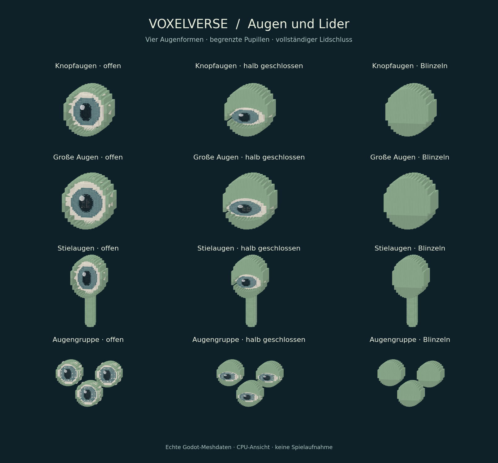
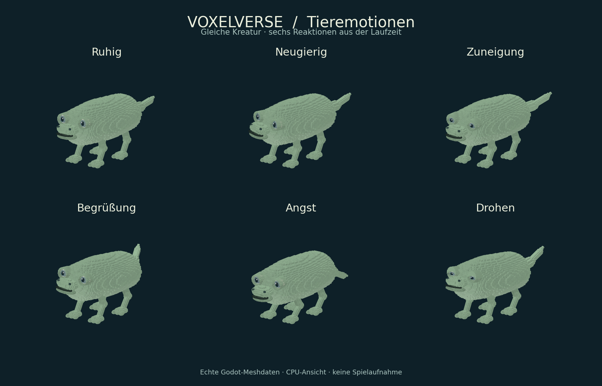

# M4-EXPRESSION – Augen und Lider

Korrektur des vom Nutzer gemeldeten Durchtritts der Augen durch die Brauen.
Dieser Stand ersetzt die frühere Augenansicht im übergeordneten Bericht.
Die damaligen sieben Fachtests bleiben Nachweise ihres damaligen Quellstands.

## Geprüfter Quellstand

Sauberer lokaler Commit `c5d44123b4d721dfacf7ce372292d7e7acd87e2d`;
veröffentlicht als `ca609e1f1a70485f2781aaf136de82eeda959215`.
Identischer Tree: `07a7c8da42b8190b9667d544d93959ce81d1ebf9`.
Die GitHub-Anbindung vergibt eine andere Commit-ID; Originalberichte werden
nicht auf die veröffentlichte ID umgeschrieben.

Godot `4.6.3.stable.official.7d41c59c4`, Linux/headless, isolierte synthetische
Nutzerdaten des vorhandenen Runners. **Vier Fachtests und Quell-/Sprachgate bestanden.**
[Originalbericht](final/results.json) · [Hashes und Umgebung](manifest.json).

```sh
python3 tools/validate_godot.py --godot /workspace/scratch/b25fbf62edbf/toolchain/Godot_v4.6.3-stable_linux.x86_64 --skip-main --skip-import --tests creature_eye_expression_test creature_expression_test creature_studio_test creature_part_articulation_test --output /workspace/scratch/b25fbf62edbf/qa/eyes-final
```

- Augenprüfung: alle vier Familien, drei Formen, beide Spiegelungen im gedrehten
  Raumrahmen, 21 Öffnungsstufen und drei Blickrichtungen. Iris und Glanzpunkt
  bleiben im Auge; kein Augenteil reicht vor die vordere Lidfläche. Der kleinste
  gemessene Tiefenabstand beträgt `0.0036800057` lokale Einheiten.
- Tatsächlich eingereichte Instanzpuffer geprüft: keine Lücken zwischen den
  Lidstreifen, geschlossene Fläche bei vollständigem Blinzeln. Augenstiele und
  Anschlussrahmen bleiben unverändert; keine Transformakkumulation oder neuen Nodes.
- Vollständiger Blinzelschluss bei 30/60/120 Hz und vier Seeds; kein Sprung am
  Übergang zu vollständig offen. Editormodus, Neubau und Löschen geprüft.
  Insgesamt 138.292 Prüfbedingungen des neuen Geometrietests.
- Bestehende Ausdrucks-, Editor- und Gelenktests prüfen die unmittelbaren
  Verbraucher, einschließlich Begrüßung/Neustart, Fußkontakt und Beißanimation.

Import wurde im selben Checkout bereits erfolgreich durchgeführt; geändert
wurden danach nur Skripte, Testregistrierung und Dokumentation. Deshalb
`--skip-import`. Die sieben ursprünglichen Gameplaytests werden für diese
lokale Darstellungskorrektur nicht erneut als komplette Freigabe ausgegeben.

## Nahansicht und ganze Tiere





Aus den tatsächlichen Meshes und eingereichten MultiMesh-Puffern exportiert,
anschließend als CPU-Projektion geprüft. **Keine native Spielaufnahme.**
Die Lider behalten ihre Außenkontur und schließen vor Sclera, Iris, Pupille
und Glanzpunkt. Hautfläche und Stiele bleiben auch bei geschlossenen Augen sichtbar.
Die Bilder zeigen einzelne Zeitpunkte; der Übergang wird funktional geprüft.

```sh
GODOT_4_6_3 --headless --path . --script tools/export_creature_expressions.gd -- OUTPUT/eyes.json --eyes
python3 tools/render_creature_expressions.py OUTPUT/eyes.json OUTPUT/animal-eyes.png --eyes
GODOT_4_6_3 --headless --path . --script tools/export_creature_expressions.gd -- OUTPUT/expressions.json
python3 tools/render_creature_expressions.py OUTPUT/expressions.json OUTPUT/animal-expressions.png
```

Der erste MultiMesh-Diagnoselauf meldete Fehler, weil einzelne
`get_instance_transform()`-Aufrufe im Headless-Renderer nur Identitäten lieferten.
[Unverändertes Fehlerprotokoll](diagnostics/creature_eye_expression_test.log) und
[damaliger Bericht am schmutzigen Arbeitsstand](diagnostics/results.json).
Wie im bestehenden Batchingtest lesen Prüfung und Export jetzt die tatsächlich
an Godot übergebenen Instanzpuffer; der Abschlusslauf auf sauberem Commit besteht.
Zuvor erprobte Platten- und Ringlider wurden nach der Sichtprüfung verworfen;
die gelieferte Kontur schließt vollständig und behält ihre Außenform.

Native Grafik-/FPS-Abnahme und gemeinsame Integrationsprüfung stehen aus.
Die bereits dokumentierte Socket-Sperre verhindert hier einen nativen Grafiklauf;
der gescheiterte Start wurde für diese Fortsetzung nicht wiederholt.
