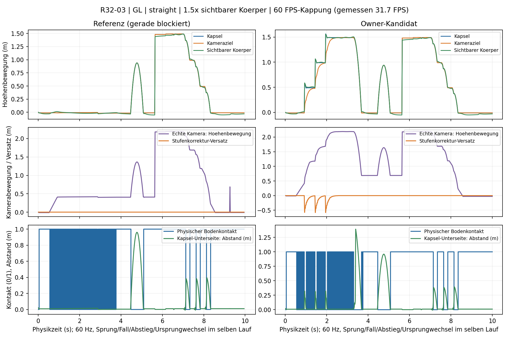
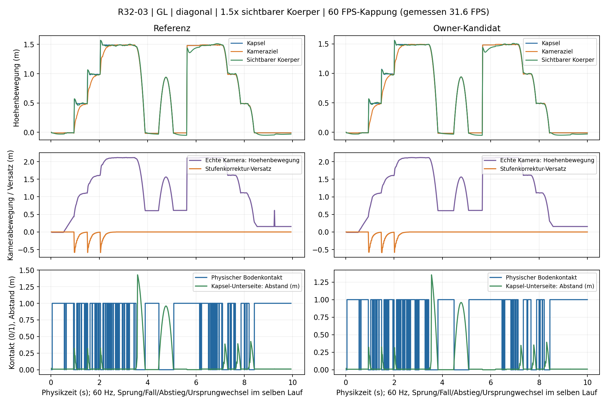

# R32-03 · #171 · Stufenkorrektur des aktiven Kugelspielers

Arbeitsbasis: `2a738a4891a8de11d682c469833ade4dc9b01dfb`, Tree
`f2bda4f815df1c73b9d740ca5282917523faf618`.
Zuordnung: [#137, R32-Rundenliste](https://github.com/MajorDragonfly/voxelverse/issues/137#issuecomment-5946206999).
Der Fachbranch ist `agent/r32-03-step-camera-20261002`; gemeinsame Playerdateien
bleiben im Fachdiff beim Integrationsbesitzer R32-01.

## Befund und Besitzeranschluss

Die vorhandene Stufenkorrektur in `player_controller.gd` wird weiterverwendet:
unmittelbarer physischer Schritt, entgegengesetzter Kamerazielversatz und dessen
zeitbasierter Abbau. Rate, Frame-Delta-Grenze und ursprüngliche 22-cm-Testgrenze
bleiben erhalten. Es gibt keine zweite Bewegungs- oder Glättungskette.

Die neuen Proben verwenden wirklich `spherical_campaign_player.gd`, seine
V2-Vererbung, die Produktionsszene und den echten RadialSurfaceAdapter. Gerade
Anläufe blockieren auf der unveränderten Basis bei x≈0,579/y≈0,014 m an der
ersten 0,5-m-Stufe, sowohl bei 3 als auch bei 4 m/s. Dabei wird `is_on_floor()`
falsch, obwohl die vorhandenen Kopf-/Vorwärts-/Landungs-/begehbarer-Top-Proben
den Schritt erlauben. Diagonale Anläufe durchqueren die Treppe.

`player-controller-owner.patch` ist der **separat anzuwendende R32-01-Anschluss**:

* Bei nicht aufwärts gerichteter Bewegung darf ein realer begehbarer Bodenhit
  innerhalb `safe_margin + 0.02` m die bereits vorhandenen Schrittproben
  freigeben. Der Bodenstatus wird nicht gefälscht. Kopf-, Vorwärts-, Landungs-
  und Top-Prüfung, Kollisionsform, Masken und Höhenlimits bleiben unverändert.
* Die vorhandene Zielkompensation erfasst auch den tatsächlich erfolgreichen
  Schritt nach verlorenem Bodenflag. Bewegung und Sprung werden nicht geglättet.
* Beim Ursprungwechsel wird die zuvor freie Kameralänge konservativ gehalten,
  bis der folgende Physiktick seine Kollisionsprüfung abgewickelt hat. Ein
  kürzerer Treffer zieht weiterhin sofort ein. Ein nur dann aktiver Kindknoten
  läuft nach dem unveränderten nativen SpringArm; dessen Abfragepriorität bleibt
  erhalten. Die Kamera dreht weiterhin direkt mit dem Eingabe-Pivot.

Der Ursprungbefund wurde erst durch getrennte Spuren sichtbar: Der Körper und
das Kameraziel bleiben stabil, während der SpringArm für einen Tick von etwa
4,51 auf 7,20 m ausfährt. Das ergibt etwa 2,69 m Kamera-Ortsbewegung, davon
0,697 m Höhe. Langsame Renderaufnahmen können diesen 1/60-s-Zustand überspringen.
Ein erster Guard im Player-Callback war zu früh; der native SpringArm setzte
seine Kinder danach erneut. Diese negative Gegenprobe bleibt erhalten.

Anwendung auf dem Integrationsstand, seriell mit den anderen Playeranschlüssen:

```sh
git apply --check docs/evidence/r32-03/player-controller-owner.patch
git apply docs/evidence/r32-03/player-controller-owner.patch
python3 tools/validate_godot.py --godot "$GODOT" --tests step_camera_test radial_step_test player_recovery_test --skip-main --output /tmp/r32-03-checks
```

Der Patch betrifft ausschließlich `creatures/player/player_controller.gd`.
Scanner, Trinkaktion, Stammeskamera, Space/Adapter, Save- und Registrydateien
werden nicht geändert. Der Fachhead allein enthält die Gegenproben und den
Patch als Reviewdatei; positive Produktnachweise beziehen sich auf die
**angewandte isolierte QA-Quelle**, nicht auf einen schon integrierten Anschluss.

## Vergleichsaufbau

Alle Paare verwenden dieselben physischen Boxen: drei volle 0,5-m-Stufen mit
2-m-Auftritten, 1,5-m-Plateau, anschließender Fall und eine echte Kamera-Rückwand.
Gleiche Geometrie, Seed 15838, Kamera-Pitch −15°, gerader/20° schräger Anlauf,
4 m/s, unveränderte Physik mit 60 Hz. Die erste Stufe ist zugleich die volle
einzelne Stufe; die folgenden beiden zeigen wiederholte Korrekturen.

Pro Renderer gibt es 12 Fälle: 0,65×/1,50× sichtbare Körpergröße,
gerade/schräg und native Renderkappungen 30/60/120. Die Größe wird am tatsächlichen
CreatureRuntimeVisual variiert; Produktionskapsel und Blueprint-Statistik bleiben
für die vergleichbaren Paare gleich. Phasenübergänge erfolgen am nächsten
Renderframe nach der festgelegten Physikdauer; deren Quantisierung ist in
den Zeitstempeln sichtbar. Dies prüft zwei sichtbare Größen, keine
Freigabe aller möglichen Blueprint-Kollisionsprofile.

Jeder Film enthält Anlauf/Aufstieg/Fall/Landung/Sprung/Landung und den Abstieg
derselben Treppe. Für den unabhängig prüfbaren Abstieg wird der Spieler einmal
auf das Plateau gesetzt; dies ist ausdrücklich eine Fixture-Platzierung, kein
Produkt-Reiseweg. Am Ende folgen Ruhe und ein Ursprungwechsel um (91,−23,17) m;
der echte Kugelspieler führt anschließend seinen normalen weiteren Rebase aus.

Aufzeichnungen bleiben getrennt:

* `rows`: Körper, sichtbarer Körper, Kameraziel, echte Kamera, Bodenflag,
  physische Kontaktpunkte/-normalen, Kapsel-Unterseitenabstand, Animationsfüße,
  Vertikalgeschwindigkeit, Glättungsversatz und rohe SpringArm-Länge bei 60 Hz.
* `native_render_frames`: jedes native Process-Delta und Uhrzeit. Diese Werte
  beschreiben die erreichten Renderintervalle, nicht die Kappung.
* `render_frames`: tatsächlich aufgenommener Zustand nach `frame_post_draw`,
  Uhrzeit und Physikzeit; finale Filme enthalten jedes dieser Bilder.

Ein Mittelstrahlabstand allein ist an einer abgerundeten Kapsel über einer
Stufenkante kein zuverlässiger Kontaktbeweis. Er bleibt in den Rohdaten; die
Abnahme nutzt zusätzlich reale Slide-Kontakte und die abgetastete tatsächliche
Kapselunterseite. Animationsfußstrahlen werden separat protokolliert.

Die Kodierung verwendet die gemessenen Uhrzeiten und eine 1-ms-Eingangszeitbasis.
`ffprobe` muss exakt Aufnahmen+1 Schlussbild zählen. Die ursprüngliche
25-Hz-Bilddemuxer-Zeitbasis hatte Bilder ausgelassen; diese alten Filme werden
als historisch markiert und nicht als finale Bildratenvergleiche ausgegeben.

## Prüfquellen und erhaltene Gegenproben

| Quelle | Commit | Tree | Verwendung |
|---|---|---|---|
| Erste positive Step-QA | `6a9978b4c527558fb918f4dd2e74caeeb67072d0` | `b21ab73249ca370f422958c79036a434b6305f40` | Drei fokussierte Tests, erste GL/F+-Matrix; noch ohne Rebase-Guard |
| Grafische Eingabe-/720p-QA | `3886dd0e9fc29a992a97f0140c296fa3204b39ea` | `8f8fb965a5218d68a076a6e84adcafd4e300624b` | Echte erste Eingabetick- und Mausprobe, lesbare Ansichten |
| Negativer früher Guard | `6df31b4167b3826fc410c31a86f375ef6b9a5fd4` | `df299a024df3adc6716b0d0ffe5a5f0fde948efa` | Kamera nur vor Render, noch nicht in nachfolgender Physik stabil |
| Abschließende angewandte QA | `5a76c7a2f75a4c4685df26a71931128182ef2729` | `c37d2280668eea0fa4b88d669d06ebb4f3c2bf02` | Post-SpringArm-Guard, vollständige Video-Framezahl, endgültige Gegenprobe |

Lokaler abschließender QA-Commit `36af9ab7a43f64fbb55cccd87f5babdc1150bc18`
hat exakt denselben Tree wie die veröffentlichte QA. Die lokale Rebase-Diagnose
dieses Trees ist positiv: Kamera-Spitze 0,001752 m in Physik und 0,001748 m in
Renderaufnahme; 326 Aufnahmen ergeben 327 kodierte Bilder. Auf dieser Software-GPU
beträgt der native Median bei 120-Kappung lediglich 34,29 FPS.

[Erste Matrix-CI 36973678405](https://github.com/MajorDragonfly/voxelverse/actions/runs/36973678405)
ist in GL und Forward+ positiv: `step_camera_test`, `radial_step_test`,
`player_recovery_test`, Import, Source-/Art-Verträge und wiederverwendbare
Quellprovenienz. Alle 24 Step-Kandidatenläufe sind vollständig; gerade
Basisläufe 0/12, schräge Basisläufe 12/12. Diese Aussage gilt für den damaligen
Step-Prüfumfang, der den nachfolgenden Rebase-Kameratick noch nicht abnahm.

Weitere Negative sind im Paket und unter `historical/` erhalten: erweiterte
Basis bei 3/4 m/s, verworfener Floor-Snap-Vorschlag, manuelles just-pressed-
Callback außerhalb des Physikticks und Headless-Mausprobe. Die grafische
Eingabeprobe injiziert zwischen Physikticks und misst nach dem ersten tatsächlichen
Player-Tick: Bewegung (0,05058,0,101161,0) m, bestätigtes Boden-/just-pressed-Flag,
positive Sprunggeschwindigkeit und direkte Mausrotation −0,20 rad.

Die unveränderten ursprünglichen Grenzen bleiben bestehen, einschließlich der
0,25-s-Renderstörung und 22-cm-Kamerazielgrenze. Der registrierte
`step_camera_test` wird erweitert; die neuen Capture-/Boundary-Skripte sind
Diagnosehelfer, keine zusätzlich unregistrierten Tests.

## Abschließende Ergebnisse

[Abschließende CI 36978584688](https://github.com/MajorDragonfly/voxelverse/actions/runs/36978584688)
ist in GL und Forward+ vollständig erfolgreich. Quelle ist der oben benannte
QA-Commit `5a76c7a2f75a4c4685df26a71931128182ef2729` mit sauberem Tree
`c37d2280668eea0fa4b88d669d06ebb4f3c2bf02`. Beide SourceRuns sind
`prepared/reusable`; Log- und Start-/Endmanifest-Hashes wurden unabhängig geprüft.

24/24 Kandidatenfälle der 640p-Matrix und 4/4 lesbare 720p-Zusatzfälle bestehen.
Es gibt **56 finale Originalfilme** (28 Referenz, 28 Kandidat). In der Referenz
übersteigen 14 schräge Läufe die Treppe, 14 gerade blockieren; alle Referenzen
reproduzieren den nachfolgenden Rebase-Transienten und bleiben deshalb in der
abschließenden Gesamtprüfung negativ. Es wird kein blockierter Basislauf mit
scheinbar guter Null-Kamerabewegung als Kameraerfolg gezählt.

| Kandidat, größter Wert über die 12 Matrixfälle | GL | Forward+ |
|---|---:|---:|
| Kameraziel am physischen Aufstieg, m/Physiktick | 0,073994 | 0,073877 |
| Kameraziel beim Abstieg, m/Physiktick | 0,072893 | 0,072904 |
| Echte Kamera beim Abstieg, m/Physiktick | 0,090636 | 0,090648 |
| Kapsel-Unterseitenabstand bei Bodenflag, m | 0,043080 | 0,043080 |
| Kleinster Sprunghöhenbereich, m | 0,950000 | 0,950000 |
| Kamera-Ortsbewegung nach Rebase, m/Physiktick | 0,001752 | 0,001752 |
| Kamera-Ortsbewegung nach Rebase, m/Renderaufnahme | 0,001749 | 0,001749 |

Alle drei vollen Aufstiege sind in jedem Kandidatenfall enthalten; unabhängiger
Fall und Abstieg landen, Offset endet exakt bei Null. Die Boundary-Probe bestätigt
reale nahe Unterstützung, keinen Schritt 0,30 m über Boden, die 1,20-m-Wand,
die niedrige Decke, aktiven Versatz beim Rebase und unmittelbaren Sprung/Move/Look.
Die ursprüngliche 0,25-s-Störung und 22-cm-Zielgrenze bestehen weiterhin.

Auch ungünstigere Paare sind ausgewiesen: Beim Abstieg steigt die größte
Kamerabewegung um bis 0,006140 m (GL) bzw. 0,005992 m (F+). Bei vollständigen
schrägen Aufstiegen liegt ein Kamera-Peak um 0,014566 m (GL) bzw. 0,008735 m (F+)
höher. Das ist kein Nachweis einer pauschalen Glättungsverbesserung aller
Übergänge. Die abgenommenen Zielgrenzen bleiben gleich; die Ziel-PC-Sichtabnahme
umfasst insbesondere diese Übergänge.

| Engine-Kappung | Tatsächlicher nativer Median, GL | Tatsächlicher nativer Median, Forward+ |
|---|---:|---:|
| 30 | 29,97–30,26 FPS | 25,04–26,70 FPS |
| 60 | 31,63–33,32 FPS | 25,08–26,84 FPS |
| 120 | 31,21–33,11 FPS | 25,06–26,59 FPS |

Die Tabelle nutzt die **Uhrzeitdifferenzen aller nativen Renderframes**. Godots
Process-Delta ist separat erfasst und wird bei großen Störungen begrenzt: Die
Rohberichte zeigen dadurch maximal etwa 150 ms Engine-Delta, während reale
Start-/Renderintervalle bis 1,628 s (GL) bzw. 5,819 s (F+) betragen. Die abgeleitete
Auswertung bewahrt beides, statt Engine-Delta als reale Framezeit auszugeben.
Native p95-Intervalle sind 34,89–39,40 ms (GL) und 43,22–47,35 ms (F+). Die
720p-Zusatzansichten erreichen tatsächlich nur etwa 12,2 FPS (GL) bzw. 10,6 FPS
(F+). Keine Leistungsfreigabe; weder echte 60 noch 120 FPS wurden erreicht.

Die Minimap kann sich während der Aufnahme selbst wieder einblenden. Körper,
Kameraannotation und Treppenkontakt sind sichtbar; sie wurde nicht nachträglich
aus Originalbildern entfernt. Vier kritische Originalfilmframes beider Renderer
und die Vergleichskurven wurden visuell geprüft. Sechs unveränderte Reviewfilme
liegen im Repository; alle 56 mit Messspuren/Logs/Quellmanifesten im Videopaket.

| Review | Referenz | Kandidat |
|---|---|---|
| GL, 60-Kappung, 1,5×, gerade | [Original](videos/gl-60cap-1.5-straight-baseline.mp4) | [Original](videos/gl-60cap-1.5-straight-candidate.mp4) |
| GL, 60-Kappung, 1,5×, schräg | [Original](videos/gl-60cap-1.5-diagonal-baseline.mp4) | [Original](videos/gl-60cap-1.5-diagonal-candidate.mp4) |
| 720p GL, gerade | im Videopaket | [Original](videos/gl-720p-30cap-1.5-straight-candidate.mp4) |
| 720p F+, schräg | im Videopaket | [Original](videos/forward-720p-30cap-1.5-diagonal-candidate.mp4) |

[GL-CI-Originalartefakt](https://github.com/MajorDragonfly/voxelverse/actions/runs/36978584688/artifacts/11215490888)
und [F+-CI-Originalartefakt](https://github.com/MajorDragonfly/voxelverse/actions/runs/36978584688/artifacts/11215490995)
sind zusätzlich in `artifacts.json` mit Original-ZIP-SHA256 und Größe belegt.
GitHub-Artefakte haben 14 Tage Aufbewahrung; die Paketkopien enthalten die
unveränderten ausgepackten Originaldateien. Sämtliche 56 Film-/Log-/Trace-Hashes
und ihre kodierten Bildanzahlen wurden nach Download geprüft.

`derived-boundaries.json` beschreibt einen reinen Berichtsformatfehler:
Das originale Boundary-JSON endet mit einem wörtlichen Backslash-n. Nur dieser
Anhang wird zum Einlesen entfernt; Original, Log-Hash, SourceRun-Manifeste und
positiver Assertion-/Exitnachweis bleiben erhalten. Der optionale manuelle
`r32-01-ci.patch` korrigiert diesen Schreibfehler und akzeptiert eine explizite
Quellreferenz für spätere zentrale Wiederholungen. Im Fachbranch wird keine
Workflowdatei direkt geändert. Die Offline-Auswertung wurde anschließend um
reale native Uhrzeitintervalle erweitert; die ausgeführten Godot-Proben und der
Owner-Patch sind bytegleich zur geprüften QA-Quelle.





Auswertungsbefehl für unveränderte heruntergeladene Originale:

```sh
python3 tools/review_r32_03_compare.py --gl /path/to/gl-originals --forward /path/to/forward-originals --output /path/to/derived
```

Die Auswertung prüft Film-/Trace-/Log-Hashes, SourceRun-Manifeste und gleiche
Probe-Hashes je Paar. Von acht erfassten Runtime-Dateien darf ausschließlich
`player_controller.gd` abweichen. Rohberichte werden nicht überschrieben:
der erste Bericht hatte Abstiegsspitzen fälschlich als Null angegeben, weil er
nur Körperereignisse >0,3 m betrachtete. Die abgeleitete Auswertung nutzt alle
aufeinanderfolgenden Abstiegssamples und zeigt auch schlechtere Kamerawerte.

## Offene Abnahmen

Die Fixture ist physisch und nutzt den aktiven Spieler; sie ist keine vollständige
generierte Kugelkampagne. X11/Mesa llvmpipe/lavapipe liefern native Software-GPU-
Aufnahmen. Kappung 120 bedeutet ausdrücklich nicht erreichte 120 FPS.
Ziel-PC-Sichtprüfung, echte 60/120-FPS-Läufe, generierter Terrain-Reiseweg,
zusätzliche Blueprint-/Kapselprofile und Gesamt-/Exportabnahme bleiben separat offen.

R32-01 übernimmt den gemeinsamen Patch seriell, prüft den resultierenden
Integration-Tree und führt die zentrale Suite/Exporte aus. Der formale
Changed-Since-Plan verlangt wegen gemeinsamer Tool-/Testmuster volle Integration;
die fokussierte Fachprüfung ersetzt diese nicht. #171 wird hier nicht geschlossen.
