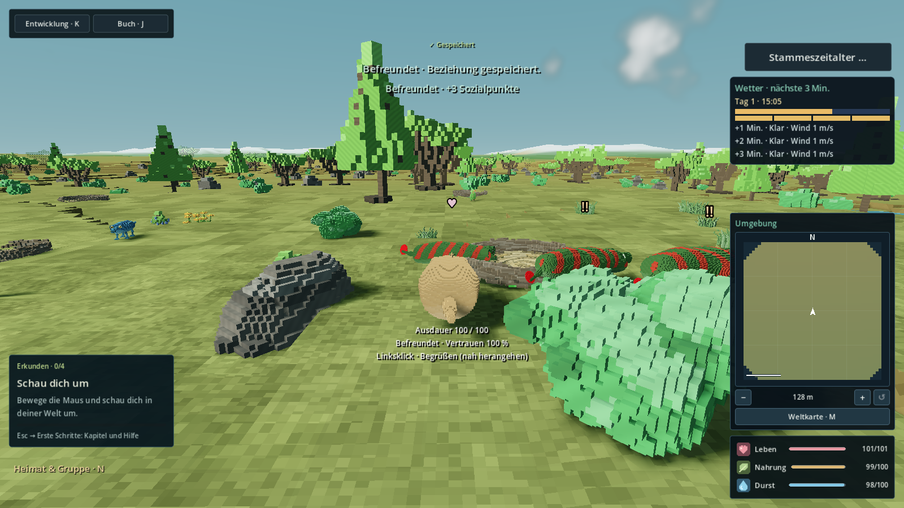

# R32-10 · Zustandszeichen / #174

Vier Neugierzeichen konnten ein späteres Gefahr- oder Schmerzzeichen vollständig
unterdrücken. `CreatureEmotionCue.claim_marker()` priorisiert jetzt Schmerz,
Gefahr, Angst, positives Feedback und Neugier innerhalb des unveränderten Limits
von vier Zeichen. Gleiche Priorität behält die bestehende Auswahl. Es werden nur
die höchstens vier bereits registrierten Marker betrachtet, keine neue Herdensuche.

Der Inspection-HUD übersetzt Lebensstatus, Nahrung und Werte und aktualisiert
Wertbezeichnungen beim Sprachwechsel. Der gezielte Verhaltenshinweis bleibt
verfügbar; über Tieren stehen weiterhin nur kurze Symbole.

## Quelle und Anschlüsse

- Feste Basis: `2a738a4891a8de11d682c469833ade4dc9b01dfb`,
  Tree `f2bda4f815df1c73b9d740ca5282917523faf618`.
- Geprüfte und separat publizierte Instrumentierungsquelle:
  `41aaad331d7bd4465eae19f6bd281f6b155f14bb`,
  Tree `f8ca598de8f92341f9fa3327e880202720b8268a`.
- Produktänderungen ausschließlich `creature_emotion_cue.gd` und
  `creature_inspection_hud.gd`; `creature_emotion.gd` unverändert.
- R32-01 wendet `patches/wildlife-marker-priority.patch` mit
  `git apply --unidiff-zero` an. Es ersetzt nur den bestehenden Budgetaufruf.
- `patches/localization-append.json`: fünf zusätzliche Katalogeinträge;
  danach `python3 tools/localization/catalog.py` ausführen.
- `patches/test-registration.json`: `r32_10_state_signs_test` genau einmal zum
  bestehenden `wildlife`-Vertrag hinzufügen.

Die Testkopien wenden diese Anschlüsse tatsächlich an. Die fremden Besitzerdateien
bleiben im Fachdiff unverändert. Körperpose/Sozialzustände wurden nicht verändert.
ExpressionDriver gehört eindeutig R32-10 gemäß der neueren, von R32-12 in
[Kommentar 5946439197](https://github.com/MajorDragonfly/voxelverse/issues/137#issuecomment-5946439197)
bestätigten Nutzerzuordnung. R32-10 hat die Übernahme in #137 ausdrücklich
bestätigt; R32-12 lässt diese Datei unangetastet. Die ältere Tabellenzeile muss
R32-01 noch nachführen. Der Driver wurde geprüft und mangels belegtem Fehler
nicht verändert. Körperpose/Locomotion bleibt R32-12, Sozialzustände R32-11.

## Originale Fachprüfungen

Godot `4.6.3.stable.official.7d41c59c4`; Linux-Host `db514e109ac6`,
AMD EPYC 9V74, neun sichtbare CPUs. Nutzerdaten stets isoliert.

| Probe | Tatsächliches Ergebnis |
|---|---|
| `runs/baseline-validation/` | Expression und Wildlife-AI auf unveränderter Basis positiv; keine Vollsuite |
| `runs/regression-before-corrected/test.log` | Neue Probe auf Basisproduktion: acht negative Präsentationsfälle, kein Scriptfehler |
| `runs/after-focused/` | Expression 889 Kontrollen, Wildlife-AI und R32-10 44 Kontrollen positiv mit echten Besitzerpatches |
| `runs/after-render-gl-native2/` | Alle sechs Zeichen aus echten Produktions-KI-/Sozial-/Schadens-APIs sichtbar; 18 UI-Fälle aufgenommen. Der erste 800×600-DE-Fall meldete noch eine Layoutgrenze der Probe, daher kein grüner Gesamt-Renderlauf |
| `runs/after-render-gl*/` | Frühere Displaystartfehler erhalten; kein Bild-/Rendererfolg daraus abgeleitet |

Die frühe HUD-Matrix deaktivierte den normalen HUD-Prozess, las aber die
Containerhöhe vor dessen üblichen Folge-Layouts. Die abschließende Aufnahmehilfe
führt diese bestehenden Layoutaufrufe nach den Containerframes aus. Der
Produktionslayoutpfad wurde für diesen Probenbefund nicht verändert.

Originalmanifeste und rohe Patch-/Displaylogs sind verlustfrei als `.gz`
gespeichert. SHA256-Angaben der Berichte beziehen sich auf die entpackten Bytes;
Start-/End-Manifeste wurden gegen diese Angaben geprüft. Die Prüfbäume enthalten
die in `checked-source.patch.gz` dokumentierten Besitzeranschlüsse sowie eigene
untracked Proben/UIDs; dies ist keine behauptete Prüfung eines sauberen Gesamtmerges.

## Native Vergleiche und reguläre Kampagne

[Fokussierter Diagnoselauf 36973748090](https://github.com/MajorDragonfly/voxelverse/actions/runs/36973748090)
checkt exakt die veröffentlichte Instrumentierungsquelle oben aus. Sein eigener
Diagnosekopf `b21f3bdae84218741406146ea68f30f9d83ded63` ergänzt lediglich eine
optionale Workflowdatei, die nicht im Fachbranch liegt.

Je Renderer werden Basisproduktion und Besitzerpatch-Kopie seriell auf demselben
Runner aufgenommen: Seed 15838, feste Formen/Größen, 960×540, feste Sonne
(-55/-35/0 Grad), identische Kamerarezeptur und 15-Hz-Simulation. Echte
Begegnungs-APIs und kontrollierte Gruppensignale sind getrennt beschriftet.
Die HUD-Matrix umfasst DE/EN × 800×600/1280×720/1920×1080 × 100/125/150 %.

Die zusätzliche Kampagnenprobe lädt einen normalen Kugelspielstand über
SessionFlow und nutzt ausschließlich regulär gestreamte Tiere. Sie platziert den
Beobachter an geladenem Boden, prüft Reichweite/Sicht und führt drei echte
Befreundungsaktionen aus. Sie setzt weder KI-Intents noch Vertrauen oder
Spawnregeln. Kamera/FOV, Kampagnenclock, tatsächliche Sonne und Tieridentität
werden je Captureframe protokolliert. `weather_sample` enthält durch einen
Probenfehler eine Methodenreferenz, keine strukturierten Wetterwerte; Wetter
ist nur im normalen HUD sichtbar. Daraus wird keine identische Wetterroute
oder wetterbezogene Abnahme abgeleitet. Diese Kampagne ist ein gesonderter Beleg,
keine identische Hin-/Rückroute und kein Ziel-PC-Langzeittest.

| Diagnoselauf | Ergebnis und Originale |
|---|---|
| [Fachtests](ci/focused/report.json) | Expression 889 Kontrollen, Wildlife-AI und R32-10 44 Kontrollen positiv; echte Besitzeranschlüsse angewendet |
| [GL vorher](ci/signs-gl-before/report.json) / [nachher](ci/signs-gl-after/report.json) | Je 104 Begegnungsframes, sechs Reaktionszeichen und 18 HUD-Fälle; positiver Capturelauf |
| [Forward+ vorher](ci/signs-forward-before/report.json) / [nachher](ci/signs-forward-after/report.json) | Gleicher Umfang, positiver Capturelauf |
| [Kugel-Kampagne GL](ci/campaign-gl/report.json) | Reguläre Population; drei Befreundungsaktionen mit Vertrauen 35/70/100, echte Ally-Beziehung und sichtbares ♥. 61 Frames, 93,994 s einschließlich Weltstart; positiv |
| [Kugel-Kampagne Forward+](ci/campaign-forward-negative/report.json) | Negativ: unverändertes 180-s-Limit. Weltstart nach 93,600 s beendet; 46 Teilframes. Kein vollständiges `campaign.json`, deshalb keine behauptete abgeschlossene Freundschaft/Abnahme |

Der gesamte Diagnoselauf ist wegen des Forward+-Kampagnenjobs **negativ**.
Das Limit und die Erwartungen wurden nicht abgeschwächt. Der Abbruch belegt
keine konkrete Ursache und keinen behobenen Kampagnen-Leistungsfehler.
Die teilweisen [Aufnahmen](ci/campaign-forward-negative/campaign.mp4) bleiben
ausdrücklich als Negativbeleg erhalten.

Alle fünf ZIP-Archive wurden gegen die GitHub-SHA256-Digests geprüft; alle
611 Original-PNGs wurden dekodiert, die sechs Videos mit ffprobe auf Maße,
15 Hz und Framezahl geprüft. Start-/End-Manifeste sowie Logdigests stimmen;
alle sieben Quellverläufe sind vollständig und stabil. Die nachher geprüften
Produktdateien und kopierten GDScript-Proben stimmen byteweise mit der
Lieferquelle überein. Der Python-Orchestrator liegt außerhalb der Testkopie und
ist über den ausgecheckten Autor-Commit identifiziert. Die rohe `scope`-Zeile
des Orchestratorberichts ist auch für die Kampagne generisch; tatsächlicher
Befehl und [campaign.json](ci/campaign-gl/render/campaign.json) weisen deren
SessionFlow-Quelle aus.

[Artefakt-IDs, ZIP-Digests und Links](ci/artifacts.json),
[Hashes aller Originaldateien](ci/original-file-sha256.json) und
[geprüfte Zusammenfassung](ci/verified-summary.json) ermöglichen den Abgleich.
Originalberichte, Quellmanifeste, Logs, Rohmesswerte, beide Vergleichsvideos und
ausgewählte unveränderte PNGs liegen hier im Git-Baum; die vollständigen
Framefolgen liegen zusätzlich in den verlinkten Actions-Artefakten.

## Sichtbelege

Die flache Fachszene nutzt echte Produktions-KI-/Sozial-/Schadens-APIs:
Neugier nach erster Begegnung, ♪ nach zweiter, ♥ nach Abschluss, Angst nach
abgelehnter Geste, Schmerz nach tatsächlichem Fremdschaden und Gefahr nach
Raubtierwahrnehmung. Die Gruppenbilder sind separat als kontrollierte
Präsentationsinputs beschriftet. Die natürliche Kampagne bestätigt zusätzlich
Neugier und positive Reaktionen in der regulären Welt; sie behauptet keinen
vollständigen natürlichen Kampagnenkampf.

| Beleg | Vorher | Nachher |
|---|---|---|
| Vier belegte Gruppenplätze, eintreffende Gefahr | [GL: vier ? unterdrücken !](ci/signs-gl-before/render/group-danger.png) | [GL: drei ? und !](ci/signs-gl-after/render/group-danger.png) |
| Sprachwechsel bei 800×600 / 150 % | [EN mit deutschen Lebens-/Nahrung-/Werttexten](ci/signs-gl-before/render/inspection-800x600-150-en.png) | [EN vollständig übersetzt](ci/signs-gl-after/render/inspection-800x600-150-en.png) |
| Verdeckung / Entfernung | [Wand](ci/signs-gl-after/render/group-occluded.png) | [Entfernt: kein Zeichen](ci/signs-gl-after/render/group-distant.png) |
| Echte Begegnungsfolge | [GL-Video](ci/signs-gl-before/encounters.mp4) | [GL-Video](ci/signs-gl-after/encounters.mp4) / [Forward+-Video](ci/signs-forward-after/encounters.mp4) |
| Reguläre Kugelbegegnung | — | [GL-Video](ci/campaign-gl/campaign.mp4) / [sichtbares ♥](ci/campaign-gl/render/frame_0060.png) |

Alle 18 Nachher-HUD-Bilder je Renderer liegen unter `ci/signs-*-after/render/`.
Die In-Viewport-Prüfung ist jeweils positiv; der Worst-Case 800×600 bei 150 %
wurde zusätzlich visuell geprüft. Namen und gezielte Scaninfos sind erlaubt;
dauernde Texte „Grazer/blockiert/flieht“ stehen über den Tieren nicht wieder.
Die Symbole unterscheiden sich auch ohne Farbe; Ablauf/Depth-Test/Limit und
Priorität sind in den 44 Fachkontrollen abgesichert.

## Kosten und Grenzen

Je Renderer liefen vorher/nachher auf demselben CI-Runner mit vier CPUs und
llvmpipe/Mesa 25.2.8: GL auf AMD EPYC 7763, Forward+ auf Intel Xeon 6973P-C.
Die Kampagnenjobs nutzen AMD EPYC 9V74. Gleichnamige Runnerhosts sind kein
Beweis für dieselbe Maschine; die zwei Renderer werden nicht direkt verglichen.

| Renderer / Phase | Refresh µs: p50 / p95 / p99 / max (100 Samples, sechs Tiere) | Capture ms: p50 / p95 / p99 / max (104 Frames) | Drawcalls |
|---|---|---|---|
| GL vorher | 19 / 33 / 43 / 100 | 27,852 / 40,347 / 99,451 / 1800,291 | 60–101 |
| GL nachher | 24 / 28 / 55 / 124 | 30,803 / 37,057 / 98,678 / 1720,431 | 60–101 |
| Forward+ vorher | 13 / 14 / 23 / 98 | 35,121 / 44,596 / 1163,922 / 5857,055 | 60–101 |
| Forward+ nachher | 16 / 17 / 26 / 115 | 34,600 / 45,533 / 1179,084 / 5874,143 | 60–101 |

Quantile verwenden den nächsthöheren Rang. Median-Mehrkosten des Refreshs:
5 µs unter GL, 3 µs unter Forward+ für alle sechs Tiere zusammen; unveränderte
Drawcall-Spanne. Einzelne Läufe erlauben keine allgemeine Performancegarantie.
Die Framezeit reicht vom Start vor dem Renderawait bis `frame_post_draw` und
schließt anschließendes PNG-Schreiben aus; die Simulation ist auf 15 Hz fixiert.
Aufwärmspitzen sind **nicht** entfernt. Alle Rohwerte bleiben erhalten. Dies
sind Instrumentierungskosten der Fachszene, keine Spiel-FPS/Ziel-PC-Freigabe.
Die natürliche GL-Kampagne hat 855–1950 Drawcalls; diese andere Szene ist kein
identischer Vorher-/Nachher-Kostenvergleich.

Die frühere lokale, insgesamt negative GL-Probe bleibt separat unter
`runs/after-render-gl-native2/` erhalten (Refresh p50/p95/p99/max
19/20/36/174 µs; Capture 21,388/28,251/63,809/1356,932 ms). Der Hostslot wurde
nach R32-02-Koordination freigegeben; die finalen nativen Aufnahmen liefen auf
isolierten Actions-Hosts, ohne ungesperrte lokale Schwerläufe.

Vollintegration, gemeinsame R32-Anschlüsse, vier Pflichtgates, native Exporte und
Lars' Ziel-PC-/Spielkomfortabnahme bleiben bei R32-01 bzw. separat offen. #174
und die Backlogcheckbox werden durch diesen Draft nicht geschlossen.
