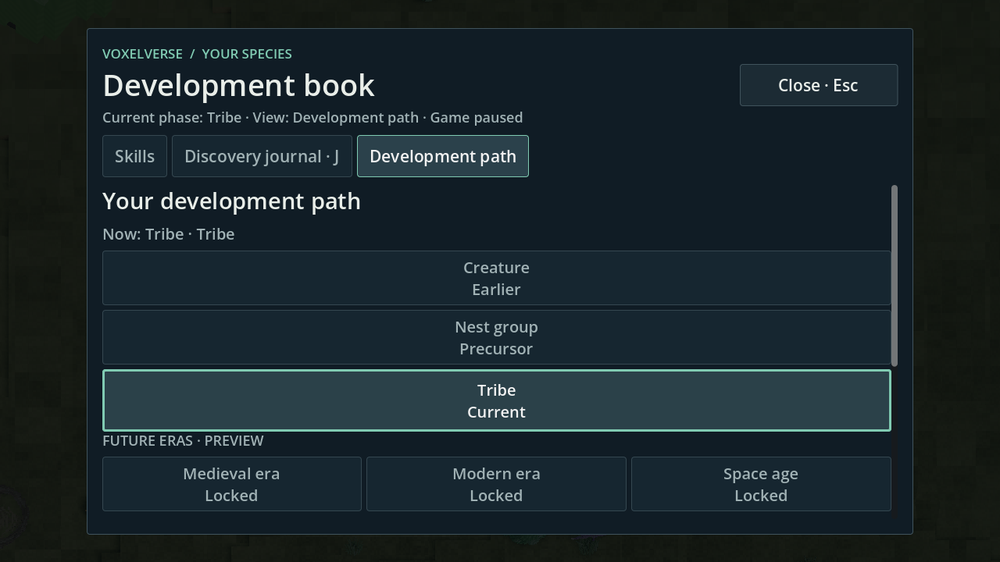
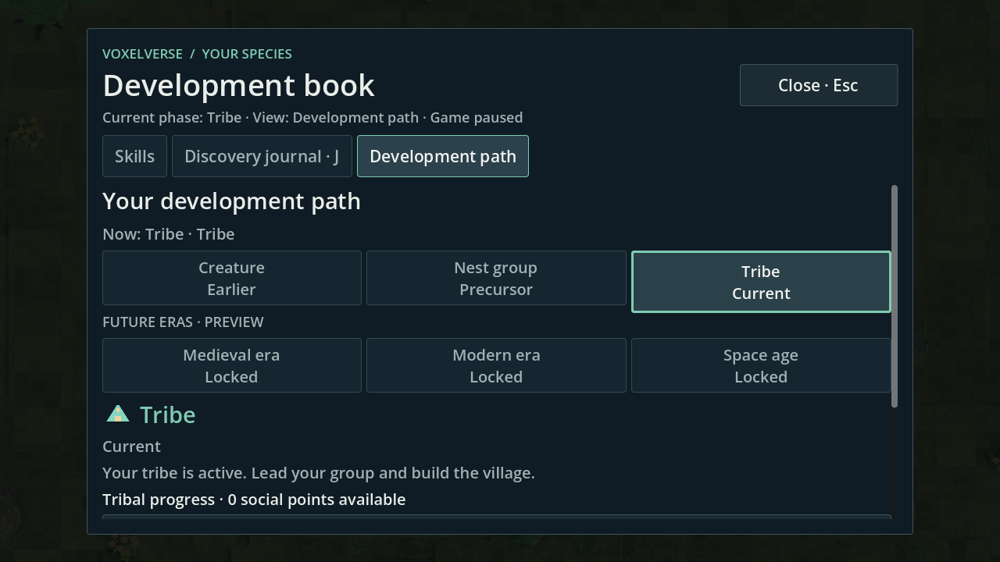

# R32-13 · Entwicklungsbuch · #177

Eigener Branch `agent/r32-13-development-book` von `2a738a4891a8de11d682c469833ade4dc9b01dfb` (Tree `f2bda4f815df1c73b9d740ca5282917523faf618`). Draft [#255](https://github.com/MajorDragonfly/voxelverse/pull/255) gegen `agent/integration-r32-20261002`. AGENTS.md, #137 und der aktuelle Status von #177 wurden gelesen. #177 bleibt offen; dies ist die Fachlieferung, keine Integrations- oder Ziel-PC-Freigabe.

## Korrekturen und Zuständigkeit

Die einzige direkt geänderte Produktdatei ist `ui/development_path_panel.gd`:

- Kapitelname und Zustand stehen in getrennten Zeilen. Gemessene Textbreite und die Ränder aller Buttonzustände verhindern abgeschnittene Statuswörter. Im festen Originalstand waren 21 von 108 Fixture-Ansichten betroffen, darunter drei der angeforderten 720p-Ansichten; in der endgültigen Matrix sind es null.
- Ein blockierter Stamm verwendet das vorhandene `transition.available`. Mittelalter, Neuzeit und Weltraum heißen ausdrücklich „Gesperrt“/„Locked“ und bleiben Vorschauen. Vorhandene Wechselaktionen sind deaktiviert.
- Epochenstatus und Punktestand stehen vor optionalen Erläuterungen. Die acht vorhandenen Meilensteine sind über ihre vorhandene übersetzte Zusammenfassung aufklappbar. Der Button ändert ausschließlich Sichtbarkeit.

Keine neue Fortschrittsverwaltung, Save-Transaktion, Wallet, Phase, Anforderung oder Lokalisierungszeichenfolge wurde eingeführt.

Im echten Spiel wurden zusätzlich drei Fehler des gemeinsamen Buchrahmens sichtbar. Diese Änderungen an `ui/behavior_skill_tree.gd` liegen ausschließlich als Patches für R32-01 bei; alle drei sind gemeinsam auf dem nativen Spielstand und der endgültigen Fachmatrix geprüft:

| Patch | Beleg und Änderung |
|---|---|
| [book-layout-order.patch](attachments/book-layout-order.patch) | Der Host überschreibt nach dem Öffnen die Kapitel-Breakpoints. Bei EN/720p/150 % stehen drei Kapitel dadurch untereinander; der Titel rutscht unter den sichtbaren Bereich. Der Host lässt die vorhandene Kinderlayoutfunktion die Richtung bestimmen. |
| [header-readability.patch](attachments/header-readability.patch) | Die gemeinsame Kopfzeile erreicht bei 720p/100 % nur etwa acht physische Pixel. Die bestehenden Metadatenfonts erhalten eine Untergrenze von zwölf physischen Pixeln. |
| [book-window-fit.patch](attachments/book-window-fit.patch) | Mit der lesbaren Kopfzeile ist das bisher verkleinerte Buch im 800×600-Stresstest zu niedrig. Der Entwicklungsbuchrahmen kompensiert die Verkleinerung des Designcanvas und bleibt innerhalb des Viewports. Die Fähigkeiten-Seite behält ihre vorhandene Größenberechnung. |

## Gerenderter Ablauf im echten Spiel

Der native Probe startet über das bestehende öffentliche Tribal-Playtest-Angebot des Hauptmenüs. Er erzeugt eine wirkliche Kugelwelt mit Seed 15838 und der bestehenden Nestgruppe. Er setzt keine Phasen- oder Freischaltflags. Die normalen Wechselbedingungen, SessionFlow, ProgressionService und SaveGameService bleiben zuständig.

1. Den gewöhnlichen Epochenwechsel-Dialog öffnen: Phase bleibt 0. Mit Esc abbrechen: Dialog und Pause schließen, Phase bleibt 0.
2. Das reale Buch mit K öffnen; alle sechs Kapitel per Enter bedienen und eine Fähigkeit mit ihrer Abhängigkeit per Maus auswählen. Kreaturenphase: DE/1080p/100 % und EN/720p/150 %.
3. Den gewöhnlichen Dialog erneut öffnen und ausdrücklich seinen Bestätigungsbutton anklicken. Der vorhandene Besitzer wechselt zur aktiven Stammesphase und zur Übersichtsteuerung.
4. In dieser realen Stammeskampagne alle zwölf DE/EN × 720p/1080p × 100/125/150-%-Kombinationen bedienen: jedes Kapitel, die Fähigkeit `tribe.social.practice` mit Voraussetzung Arbeitsteilung/Teamwork, Schließen per Maus sowie erneutes Öffnen und Esc.
5. Über den vorhandenen SaveService speichern. In einem frischen Prozess den normalen Slotladeweg ausführen: Stammesphase, zwei Gefährten, Buchzusammenfassung und der vollständige gespeicherte Fortschrittswert bleiben erhalten.

**Bestanden: 893 Kontrollen im nativen Spiel, fünf Neustartkontrollen, 84 Kapitelansichten und 100 native Original-PNGs.** Beim Buchlesen bleiben Phase, vollständiger Fortschritt und Kampagnenzeit exakt unverändert. Die im tatsächlichen Lauf ausgewählten Fähigkeiten sind mangels Punkten noch gesperrt; reale verdiente Wallets, Käufe und Kaufpersistenz decken die bestehenden Verbraucher-Fachtests ab.

[Dialog vor Abbruch](validated/game/00-before-confirmation.png), [Dialog vor ausdrücklicher Bestätigung](validated/game/10-reopened-confirmation.png), [Kreaturenfähigkeit und Abhängigkeit](validated/game/creature-en-1280x720-150-skill-dependencies.png), [Stammesfähigkeit und Abhängigkeit](validated/game/tribe-de-1280x720-150-skill-dependencies.png), [Neustartbericht](validated/game/restart-cases.json), [erwarteter Fortschritt](validated/game/expected-progress.json), [geladener Fortschritt](validated/game/actual-progress.json).

Die zwölf Kontaktblätter wurden vollständig visuell gesichtet. Kapitel, gewählter Titel, aktueller Epochenstatus und Schließen liegen ohne Überdeckung im sichtbaren Bereich. Namen und Sperrzustände werden vollständig gezeigt. Bei 150 % benötigen längere Detailtexte weiterhin Scrollen. Fähigkeiten werden beim Auswählen über die bestehende Scrollfunktion sichtbar gemacht; ihre Abhängigkeit und der gesperrte Kaufbutton sind lesbar. Der Bestätigungsdialog braucht bei 720p/150 % für seinen langen Erklärungstext Scrollen; beide bewussten Entscheidungsbuttons bleiben sichtbar.

| Sprache | 720p / 100 % | 720p / 125 % | 720p / 150 % | 1080p / 100 % | 1080p / 125 % | 1080p / 150 % |
|---|---|---|---|---|---|---|
| DE | [6 Kapitel](validated/gallery/de-1280-100.png) | [6 Kapitel](validated/gallery/de-1280-125.png) | [6 Kapitel](validated/gallery/de-1280-150.png) | [6 Kapitel](validated/gallery/de-1920-100.png) | [6 Kapitel](validated/gallery/de-1920-125.png) | [6 Kapitel](validated/gallery/de-1920-150.png) |
| EN | [6 Kapitel](validated/gallery/en-1280-100.png) | [6 Kapitel](validated/gallery/en-1280-125.png) | [6 Kapitel](validated/gallery/en-1280-150.png) | [6 Kapitel](validated/gallery/en-1920-100.png) | [6 Kapitel](validated/gallery/en-1920-125.png) | [6 Kapitel](validated/gallery/en-1920-150.png) |

Kontaktblätter sind beschriftete, verkleinerte Buchausschnitte aus den Originalen. Alle 100 unveränderten Vollfensterbilder sind unter `validated/game/` dauerhaft enthalten; ihre Auflösung und SHA256 stehen im [nativen Bericht](validated/game/report.json). Die Blattnamen geben Sprache, Fensterbreite und Skalierung an.

## Fachmatrix, Scrollen und Gegenproben

Die getrennte isolierte UI-Fixture benutzt die tatsächlichen Buchcontrols, prüft aber keine geladene Kugelwelt. Sie öffnet das Buch nach jedem Displaywechsel erneut über K und die echten Tabs; dadurch bleibt der Host-Breakpointfehler überprüfbar.

DE/EN × 800×600, 1280×720, 1920×1080 × 100/125/150 % × sechs Kapitel: **108 Ansichten, 164 native PNGs, 1477 Kontrollen bestanden**. Kapitel- und Detailtexte erreichen mindestens zwölf physische Pixel. Alle sechs Kapitel und die gewählte Überschrift sind am oberen Scrollrand sichtbar. Die vorhandene Epochenstatuszeile ist in allen zwölf angeforderten Kombinationen ohne Scrollen sichtbar. Auf- und Zuklappen, Tastaturaktivierung, Maus-Schließen und Esc bestehen ohne Fortschrittsänderung.

Scrollumfang des Stammkapitels mit eingeklappten Meilensteinen im endgültigen Fixture-Stand, in logischen UI-Einheiten:

| Fenster | Skalierung | DE | EN |
|---|---|---:|---:|
| 1280×720 | 100 % | 0 | 0 |
| 1280×720 | 125 % | 0 | 0 |
| 1280×720 | 150 % | 251 | 220 |
| 1920×1080 | 100 % | 68 | 68 |
| 1920×1080 | 125 % | 115 | 115 |
| 1920×1080 | 150 % | 251 | 220 |

Der zusätzliche 800×600-Stresstest hat in allen sechs Sprach-/Skalierungswerten bei eingeklappten Meilensteinen keinen Stamm-Detailscroll. Die gemeinsame Schließen-Beschriftung umbricht dort; die angeforderten 720p/1080p-Ansichten zeigen sie vollständig in einer Zeile. Geöffnete Meilensteine und lange Zukunftsanforderungen bleiben normale scrollbare Details. [800×600](validated/fixture/de-800x600-100-tribe-top.png), [aufgeklappte Meilensteine](validated/fixture/de-1280x720-150-tribe-milestones.png), [unterer Rand mit deaktiviertem Zukunftswechsel](validated/fixture/en-1280x720-150-medieval-bottom.png).

Die Historie behält ihre roten Belege:

- `baseline/`: fester Originalstand, 949 Kontrollen/176 PNGs. Kein Bestehen der neuen Korrekturassertionen behauptet.
- `negative/`: erste Änderung ließ zwölf Ellipsen bei 800×600/100 % übrig; die endgültige Breitenmessung berücksichtigt alle Zustandsränder.
- `candidate-capture/`, `candidate-functional/` und `matrix/`: erste grüne UI-Fixture, 1441 Kontrollen/200 PNGs. Sie maskierte den Hostfehler, weil sie nach Displaywechsel noch nicht regulär neu öffnete. Dies ist ausdrücklich kein endgültiger Spielnachweis.
- `campaign-negative/`: erster Neustartvergleich scheiterte an Integer-/Float-Varianten aus JSON. Der korrigierte Vergleich normalisiert den vollständigen JSON-Wert; keine Fortschrittsfelder werden ausgeschlossen.
- `campaign/` und `screens/host-raster-before.png`: erster grüner Kampagnenlauf mit nur zwei Displaywerten zeigte den später erkannten vertikalen Hostfehler.
- `window-stress-negative/`: lesbarer Kopf mit zu kleinem 800×600-Rahmen, 24 Geometriefehler; durch den beigefügten Rahmenpatch behoben.
- `consumer-pointer-negative/`: bestehender GUI-Verbraucher scheiterte bereits am ersten Entwicklungstab. Zusätzliche Mausbewegung löste es nicht. Der [CI-Trace](consumer-pointer-negative/trace-ci-excerpt.log) belegt ein 64×64-Headlessfenster mit 1920×1920-Zeichenfläche und einen Tab außerhalb des Fensters. [consumer-viewport.patch](attachments/consumer-viewport.patch) setzt vor dem ersten Öffnen eine definierte GUI-Größe. Alle Verbraucher-Assertions bleiben unverändert; der erfolglose Pointer-Patch wird nicht geliefert.

## Prüfstand und Reproduktion

Godot `4.6.3.stable.official.7d41c59c4`, Linux/GitHub Actions, isolierte Nutzerdaten, Xvfb, Compatibility/OpenGL, Mesa llvmpipe und Dummy-Audio. Dies ist eine native Render-/Bedienprüfung; keine Hardware-FPS-Aussage. Der belegte lokale Gemeinschaftshost wurde nicht durch doppelte Godot-Läufe belastet.

| Nachweis | Sauberer geprüfter Commit / Tree | Ergebnis |
|---|---|---|
| [Echtes Spiel, Lauf 36979632647](https://github.com/MajorDragonfly/voxelverse/actions/runs/36979632647/job/110750981822) | `b06ee6e4ecad92a7b7d283fc3f485e00b9bdc4ce` / `40de50cdc602c482fc35f652605ce0559608c179` | 893 + 5, 100 PNGs, Quell-SHA256 `2952e4ec9ed4c6bc294d92d8b595dda3d4c3bf48d6677bbfdd2efa64d400980a` |
| [Vier Fachtests und native Fixture, Lauf 36983168383](https://github.com/MajorDragonfly/voxelverse/actions/runs/36983168383/job/110762110179) | `e8daf5f9855c16b53386cde2d67d5d944c560d71` / `1c0c3c40a5c6d1529129469654fc2fef81502abe` | Alle vier bestanden, 1477 native Kontrollen, Quell-SHA256 `762714a912d342a5a133d274e55d46eed68ef4dbb1ca1d5fa193594481046d54` |

Die vier Fachtests sind `development_path_test`, `skills_localization_test`, `behavior_progression_test` und `r32_13_book_test` (headless 1149 Kontrollen). Quellverträge, Ressourcenimport, Artquellen und vollständige Quellintegrität bestehen. [Fachbericht](validated/functional/results.json), [Fixture-Messwerte](validated/fixture/cases.json), [Fixture-Bericht mit allen 164 Bildprüfsummen](validated/fixture/report.json), [Spiel-Messwerte](validated/game/cases.json).

Vollständige Start-/Endmanifeste sind verlustfrei als `.jsonl.gz` gespeichert und innerhalb jedes Laufs identisch. [compressed-manifests.json](compressed-manifests.json) enthält komprimierte und entpackte SHA256. [source-equivalence.json](validated/source-equivalence.json) belegt: alle UI-/Core-/Autoload-/Kreaturdateien bleiben zwischen Spiel- und finalem Fachlauf gleich. Die gelieferten Fachdateien und angewandten Hostpatches entsprechen diesen geprüften Dateien bytegenau. Spätere Änderungen betreffen die Verbraucher-Fixture, Diagnosewerkzeuge und Dokumentation. Ein neuer gemeinsamer Merge-Tree braucht seine Integrationsprüfung.

Reproduktion auf dem Fachbranch: die drei Hostpatches in Tabellenreihenfolge, `consumer-viewport.patch` und `test-registration.patch` anwenden. Danach die exakten Befehle der Berichte bzw. des beigefügten [Diagnoseworkflows](attachments/ci-evidence.yml) mit Ausgabe außerhalb des Checkouts ausführen. Der Anhang dokumentiert den bereits vorbereiteten Diagnosebranch; auf dem Fachbranch liegen die zentralen Änderungen ausschließlich als Patches.

## Übergabe und offene Grenzen

- R32-01 übernimmt die drei Hostpatches, [consumer-viewport.patch](attachments/consumer-viewport.patch) und [test-registration.patch](attachments/test-registration.patch). Der Registry-Append registriert `r32_13_book_test` genau einmal in `home_progression`. Ohne diesen Anschluss meldet die unveränderte zentrale Registry erwartungsgemäß `Unregistered test`; das ist kein grüner Integrationsstatus. Die gemeinsame CI-Datei bleibt auf dem Fachbranch unberührt.
- R32-15 besitzt die reguläre Skalierungseinstellung. Die feste Basis bietet nur 80–130 % und begrenzt geladenes `ui_scale` auf 135 %. 125/150 % wurden für diese Darstellung über den tatsächlichen DisplaySettings-Canvas ausdrücklich zur Laufzeit gesetzt. Menüauswahl und Erhaltung dieser Werte über Neustart sind damit nicht freigegeben; kein konkurrierender DisplaySettings-Patch wird geliefert.
- Die ursprüngliche Referenzaufnahme C (`60c86223-4416-4380-a02d-911478aa7ec8.png`) fehlt. Laut [#166](https://github.com/MajorDragonfly/voxelverse/issues/166) war sie ein früherer Chat-Anhang ohne GitHub-Datei. Die Vorherbilder stammen aus dem festen Git-Originalstand und ersetzen keinen Vergleich mit Screenshot C.
- Ziel-PC, subjektive Sicht-/Spielspaß-Abnahme, vier Integrationspflichtprüfungen, volle Suite und Exporte bleiben offen bzw. zentral. Draft, kein Merge, #177 nicht geschlossen.
