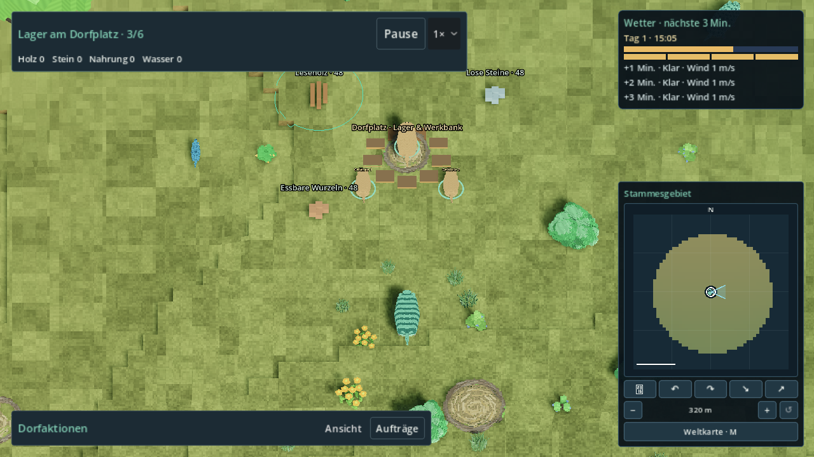
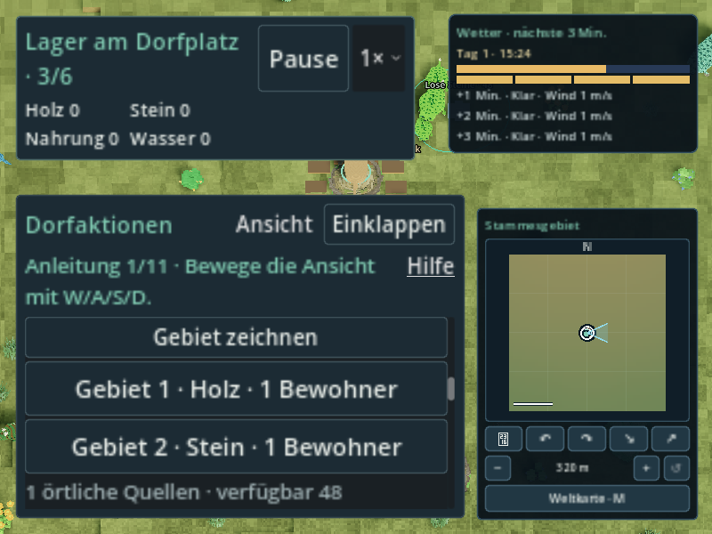
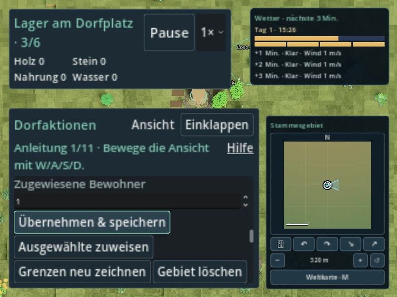
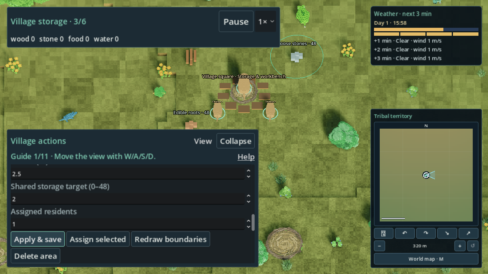
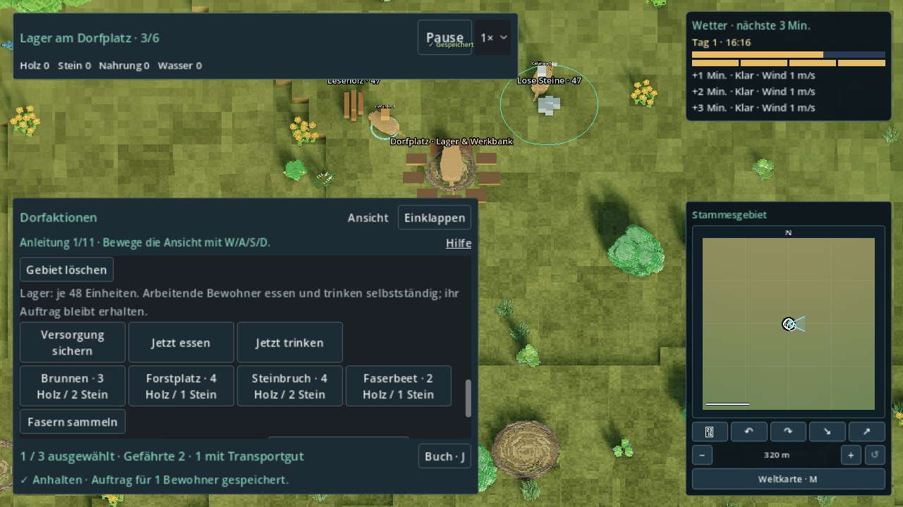

# R32-21 · Sammelgebiete (#208)

Feste Basis: `2a738a4891a8de11d682c469833ade4dc9b01dfb`, Tree
`f2bda4f815df1c73b9d740ca5282917523faf618`. Fachbranch:
`agent/r32-21-gathering-areas`. Kein Merge und keine Ziel-PC-Abnahme.

Fachcode und Besitzer-Overlay sind im isolierten [Originallauf 36978204628](https://github.com/MajorDragonfly/voxelverse/actions/runs/36978204628)
**positiv geprüft**, einschließlich nativer Grenzmarker/Bedienung und realer
Lieferung. [Draft #268](https://github.com/MajorDragonfly/voxelverse/pull/268) bleibt
wegen der noch zentral zu übernehmenden Anschlüsse offen.

## Fachmodell und vorhandene Quellen

Die integrierten Ressourcen-/Arbeitsplatzpanels aus #218 zeigen bereits die
kanonischen Dorfvorkommen und unabhängig platzierte zweite Arbeitsplätze.
Die neue Erweiterung speichert **nur Grenzen und Arbeitszuordnung** unter
`B.tribe.economy.resource_areas`: Format 1, monotone nächste ID und höchstens
acht Einträge. Jeder Eintrag besitzt eine siedlungsbezogene ID, Sequenz,
Körper-ID, präzise persistente Mittelpunktadresse, Radius, Ressourcenart,
Lagerziel und tatsächliche Bewohnerzahl. Gelöschte IDs werden nicht wiederverwendet.

Frei mit der linken Maustaste zeichnen; Esc verwirft die Vorschau. Anlegen
startet keinen Auftrag. Im Panel Art, Radius, gemeinsames Lagerziel und Anzahl
ändern; gezielt ausgewählte Bewohner zuweisen, Grenzen erneut zeichnen und
Löschen bestätigen. Quelle ansehen und Gebiet ansehen bleiben reine Leseaktionen.

Radius 1–8 m; Mittelpunktabstand plus Radius höchstens 20 m um das bestehende
Lager. Das begrenzt auch den gesamten Kreis. Navigation bleibt dieselbe geladene,
physisch geprüfte Dorfgraphik. Kamera, Sichtfokus und Ursprungwechsel ändern
keine gespeicherte Grenze. Der Kreis wird aus diesen Adressen gerendert, nie
als Quelle neuer Arbeitsgrenzen zurückgelesen.

Die ortsbezogene Suche liest für die gewählte Art bestehende `deposits` und
zweite Stationsinstanzen innerhalb des Kreises. Die erste Station teilt weiterhin
exakt die ursprüngliche Quelle; sie wird nicht doppelt angeboten. Aktuell gibt es
kein separates Ortsmengen-/Entnahmemodell für frei herumliegende dekorative Stöcke,
kleine Steine oder Feuerstein. Diese werden bewusst nicht in kostenlos nutzbare
UI-Vorkommen umgewandelt. Zusätzliche echte Quellen benötigen einen vereinbarten
Fachquellenadapter und Erhaltungsbelege.

## Bestehende Arbeits-, Fracht- und Savekette

`resource_area_id` bindet einen Bewohner an das Gebiet, `resource_source_id`
reserviert einen konkreten Quellenplatz auf dem Weg. Die Reservierung ist kein
Material und zahlt nichts aus. Mehrere Gebiete/Bewohner teilen dieselben Quellen;
höchstens so viele aktive Quellenplätze wie verbleibende Einheiten. Leere,
außerhalb liegende oder nicht erreichbare Quellen werden verworfen; ein
Quellenwechsel setzt den Teil-Arbeitstimer zurück. Vorhandene Aufträge bleiben
erhalten. Kein Fallback zu einem Vorkommen außerhalb des Gebiets.

`VillageWork` bleibt der einzige Entnahmewriter: bestehende Weg-/Ankunftsprüfung,
Arbeit, genau eine Entnahme, individuelle `cargo`/`cargo_source_id`, Rückweg und
erst dann Lagerzuwachs/`delivered`. Das Gebiets-Lagerziel zählt denselben gemeinsamen
Bestand einschließlich vorhandener Fracht-/Wiedergewinnungsreservierungen.
Löschen, Redraw und Reassign verändern niemals gehaltene Fracht oder deren Quelle.
Abgezogene Bewohner tragen diese zum Lager zurück. Zuweisung einer konkreten Auswahl
kann andere Gebiete ausdrücklich umverteilen; die Anzahl-Schaltfläche nimmt nur
freie Bewohner und stiehlt keine Bau-/Pflege-/Transportaufträge.

Wirtschaftsformat 4→5 verändert ausschließlich die Versionsnummer, nicht Mengen,
IDs, Adressen, Fracht, Pausen oder Arbeit. Die leere Gebietsverwaltung wird erst
beim expliziten ersten Anlegen ergänzt. Format 4 bleibt vor Migration validierbar.
Neue Gebiets-/Wirtschaftsversionen sperren Backup-Fallback und Überschreiben über
den bestehenden SaveParticipant/SaveGameService. Keine zweite Datei/Saveverwaltung.

Fernarbeit dispatcht dieselben Gebietsbewohner und Quellen ausschließlich über
vorhandene, durch `prepare_far_simulation()` physisch zertifizierte Endpunkte.
Fehlende Straßen erzeugen keine Ankunft. Nah-/Fernbesitzer und Kampagnencursor
bleiben autoritativ. Pause und gleiche Clock produzieren nichts.

## Besitzeranschlüsse

Fachbranch ändert ausschließlich eigene Module, zugeordnetes Gebietspanel,
Fachtests/-helfer/UIDs und Nachweise. **Die folgenden Patches sind noch von
R32-01 bzw. R32-14 seriell zu integrieren:**

- `ports/village-owner.patch`: Economy (Version/Validator/Quelle/Ziel), Work
  (Quellenlücke, Snapshot zweiter Quellen, echte Lagerankunft), Simulation
  (zertifizierter Dispatch), TribeController (Adapter und Auftragswechsel) sowie
  Wirtschaftsforschritt (weiter Format 4 unterstützen).
- `ports/hud-owner.patch`: TribePanel bei R32-14, Drag vor Auswahl, Weltgebiet öffnen.
- `ports/localization-append.json`: 20 neue DE/EN-Texte; Katalog danach regulär erzeugen.
- `ports/registry-append.json`: zwei Fachtests genau einmal im Vertrag `village`.
- `ports/runner-owner.patch`: bestehendes begrenztes Langtestbudget für den Weltfall.
- `ports/evidence-workflow.yml`: optionale isolierte Push-Diagnose; befindet sich
  nur auf `agent/r32-21-area-evidence-20261002`, nicht in diesem Fachbranch.

`tools/review_r32_21_apply_ports.py --project <isolierter Checkout>` reproduziert
alle Anschlüsse auf der festen Basis. Nicht blind auf den veränderten gemeinsamen
R32-Tree anwenden; R32-01 führt die Host-/Schemaüberlappungen seriell zusammen.

## Reproduktion

Auf einem separaten Checkout des Fachbranches zunächst die Besitzeranschlüsse
anwenden. `reproduction-source.json` belegt identische Bytes aller 21 Produktions-,
Test-, Helfer- und Lokalisationsdateien zum QA-Stand; die Registry enthält dieselben
einmaligen Zuordnungen in anderer Reihenfolge. Der reine Vertragscheck meldet
269 Tests in 18 Verträgen; er führt keine Spieltests aus.

```sh
python3 tools/review_r32_21_apply_ports.py --project <isolierter-fachcheckout>
python3 tools/validate_godot.py --godot <godot-4.6.3> --tests r32_21_resource_area_test workplace_instances_test village_work_snapshot_test village_work_observation_test resource_production_contract_test far_simulation_test tribal_economy_progress_test --skip-main --output <neuer-fachtest-ordner>
python3 tools/review_r32_21_capture.py --project <isolierter-fachcheckout> --godot <godot-4.6.3> --xvfb <Xvfb> --output <neuer-native-ordner>
```

Der Capture-Helfer verwendet isolierte Nutzerdateien, strengen ERROR-/Leakfilter
und einen exklusiven Heavy-Lock. Lokal zuerst mit dem R32-02-/R32-07-Slot abstimmen.
CI nutzt einen eigenen Runner und archiviert unveränderte Originale. Native
Software-GL-Capture ist auf höchstens 600 Sekunden begrenzt; das ist ein Prüf-
Timeout und keine Spiel-/FPS-Anforderung.

## Prüffälle und Grenzen

`r32_21_resource_area_test`: radiale Fachfixture, zwei gleichartige Quellen/Gebiete,
konkurrierende letzte Einheit innerhalb eines Gebiets sowie zwischen zwei
überlappenden Gebiets-IDs, Erschöpfung, unerreichbar, Quellenwechsel ohne
Arbeitstransfer, gemeinsamer Lagergrenzwert, Rücknahme/Reassign mit echter
kanonischer Fracht, acht-Gebietsgrenze, fremder Körper, ID-Wiederverwendung,
Korruption, Migration mit alter pausierter Ladung, gemeinsamer nativer Save,
fehlgeschlagenes Staging, frischer Godot-Prozess, derselbe Cursor und Nah/Fern,
Zukunftsschutz einschließlich gültigem älteren Backup. Synthetische Straßen
sind ausdrücklich keine Kollisions-/Ziel-PC-Abnahme.

`r32_21_resource_area_world_test` / `review_r32_21_area_world.gd`: regulärer
Titel→Kugelslot Seed 15838→Heimat→bestätigter Stammesaufstieg. Echte GUI-Buttons,
Welt-Drag/Esc, zwei Gebiete und tatsächliche physische Quellenwege/Entnahme,
Halten der Ladung, Löschbestätigung, Reassign, Save-Rollback, feste Kameragrenzen,
physisch zertifizierte Fernrückwege und Live-Save/Load. DE/EN × 800×600/720p/1080p
× Laufzeitskalierung 100/125/150 %. Bilder und Wirtschaftszustände gehören zum
zugehörigen Originalrun, nicht zu einer nachgebauten Präsentation.

Die Laufzeit protokolliert begrenzte Dispatchkosten (Calls/Summe/Maximum), die
Weltprobe zusätzlich physische Tickabstände auf der Sammelroute. Linux-Software-
Rendering und unbekannte Fremdlast sind keine 60-FPS-Freigabe auf Lars' PC.
Reguläre Einstellungen für 125/150 % bleiben beim Einstellungsbesitzer.

Erste Originale `check-areas-01`/`02` enthalten negative Anschluss-/Fixturefälle
und sechs positive direkte Verbraucher. Quelle und Loghashes bleiben archiviert;
Ergebnisse werden nicht in grün umbenannt. CI-Run 36974441706 (`e5dad38c64479fbff8dfe60ec5386c4db885fced`,
Tree `5a864a436352314719013d3b0eb249044d9d6be8`) enthält sieben positive
Fach-/Verbrauchertests, darunter 53 + 13 Neustartkontrollen des neuen Gebietsfalls.
Der erste native Lauf ist negativ am Prüfhelfer-Input; diese Originale sind archiviert.

Run 36975294425 (`9049f9eb08e04441a1be7ff7bc31791a44b9c4b0`, Tree
`cb8c3acbff6c6b2b0bf7f31c312768eabd0e6455`) bestätigt wiederum alle sieben
Fachtests und den realen Mengenpfad Holz/Stein: zwei Aufnahmen bei Lager 0/0,
Holzrückkehr mit Lager 1/0, gespeicherte Steinladung danach über zertifizierte
Fernstraße zu 1/1 und genau einer weiteren Lieferung. Er bleibt insgesamt
**negativ** wegen der im Helfer pausierten/ausgeblendeten Bildmatrix und des
nicht JSON-normalisierten Live-Savevergleichs. Das sind keine positive
Bedien-/Save-Abnahme; Originalreport, Logs und Ledger bleiben erhalten. Der
korrigierte aktive Bild-/Redraw-/Save-Lauf wird im finalen Handoff ergänzt.

Run 36976595762 (`1c91aecde10c00a768a287afcab9a534fc51e35a`, Tree
`946bffb66c0e13d0e312296d6cab5b1d78960373`) erzeugt 41 originale Bilder und
erfüllt seine Bedien-/Redraw-/Save-/Lieferassertions. Er bleibt durch den
**strengen Logfilter negativ**: der neue Marker rief die vorhandene Bodenabfrage
am falschen Host auf; die bestehende Bewohneranzeige las `remaining` ohne
Quelle aus. Beides ist im neuen Fach-/HUD-Besitzerpatch korrigiert, nicht im
Prüfhelfer ausgeblendet. Frühere Logs enthalten diese Scriptfehler ebenfalls.
Die Originale bleiben erhalten. Der nächste Stand ergänzt außerdem den
Konkurrenzfall zweier unterschiedlicher Gebiets-IDs an derselben letzten Einheit.
Eine positive native Freigabe wird erst nach dem neuen Originallauf behauptet.

Die Patchanhänge enthalten absichtlich die originale Kontext-Einrückung; der
lokale Git-Attributvertrag deaktiviert Whitespace-Prüfung nur für diese Anhänge.
Der tatsächliche angewendete GDScript-Code wird weiterhin regulär geprüft.

Vollsuite (konservativer Overlayplan: 269/269 plus Main/Runtime), gemeinsame
Produktions-/Reisekette, Exporte und vier Pflichtgates gehören R32-01.
Ziel-PC-Sicht-, Bedienkomfort- und 60-FPS-Abnahme bleiben separat offen.

## Abschließender Originalnachweis und Budget

Positiver Originallauf [36978204628](https://github.com/MajorDragonfly/voxelverse/actions/runs/36978204628):
QA-Commit `5dc8f88b80b7421da6442ea91446740b4bd6e97f`, Tree
`26d4f40b9d0dbaec49e15a7aa959c42d506bf261`, Linux-Runner `runnervm8df0l`,
Godot `4.6.3.stable.official.7d41c59c4`. Sauberer Quellindex; Fachrunner
SourceIntegrity `prepared/reusable` nach den normalen generierten Import-/UID-
Dateien. Import, Artquellen, Registry und alle sieben fokussierten Tests bestehen;
neuer Gebietsfall **58 Kontrollen + 13 im echten Neustartprozess**. Ein neues
Teilergebnis ersetzt keine zentrale Vollsuite.

Native Compatibility-GL/Mesa llvmpipe, 1280×720-Startfenster, Dummy-Audio,
`--max-fps 30`, isolierte Nutzerdaten: Exit 0, strenger ERROR-/SCRIPT-ERROR-/Leakfilter
positiv, Dauer 385,331 s. **41 Originalbilder**: 18 DE/EN-Größe-/Skalierungsfälle,
je oben/unten nach tatsächlichem Scrollen, zwei Zeichenvorschauen, Createzustände
und gehaltene Fracht. Neun Gebietcontrols sind in jedem Matrixfall erreichbar.
Die ausgewählten Originale unten wurden visuell geprüft: beide Bodenkreise,
DE 800×600/150 %, EN 720p/125 % und EN 1080p/150 %, Fracht und vorhandene Controls.
Keine nachgebildeten oder bearbeiteten Screenshots.

Der Originalledger zeigt Aufnahmen Holz/Stein bei Lager **0/0**, danach die echte
Holzrückkehr **1/0**, sowie die gespeicherte Steinladung nach zertifiziertem
Fernrückweg **1/1** und `delivered=2`. Wiederholung desselben Cursors und die
Nahbesitzersperre bezahlen nichts erneut. Esc, Redraw mit gleicher ID,
Löschbestätigung, Cross-resource-Reassign, fehlgeschlagener Save und feste
Kameragrenzen bestehen. Fehlende Mengen an dekorativen losen Quellen bleiben
wie oben beschrieben außerhalb dieses Quellenadapters.

| Messung auf der tatsächlichen Sammelroute | Originalwert |
| --- | ---: |
| Gebiets-Dispatchs | 566 |
| CPU-Summe inkl. gecachter Erreichbarkeit | 33,832 ms |
| CPU-Mittel pro Dispatch | 0,0598 ms |
| CPU-Maximum pro Dispatch | 0,280 ms |
| Physische Await-Abstände: Stichproben | 164 |
| Physische Await-Abstände: Median / P95 / Maximum | 8,541 / 518,538 / 539,196 ms |

`budget.json` und der unveränderte Ledger sichern diese Werte. Die Await-Abstände
enthalten Software-Renderstalls, Simulationstempo 2 und aufholende Physikschritte;
sie sind **keine Renderframe-/FPS-Messung**. Der Adapter bleibt begrenzt: acht
Gebiete, Kreisradius 1–8 m innerhalb des 20-m-Dorfbereichs, maximal 128 Cacheeinträge
und 128 Bodenabfragen nur bei geänderter Markergeometrie. Der gemessene eigene
Dispatch liegt deutlich unter 16,67 ms; Gesamtspiel/60 FPS auf Lars' PC sind damit
nicht abgenommen. Gemeinsame Produktions-/Reisekette, Exporte und Ziel-PC-Budget
bleiben bei R32-01 beziehungsweise Lars.

Das vollständige [Originalartefakt](https://github.com/MajorDragonfly/voxelverse/actions/runs/36978204628/artifacts/11214877667)
hat SHA256 `4a50d397b55762df4db149f92338e4599f30340610003b1f80b74194dbaf0d14`.
`ci-36978204628/manifest.json` enthält Hashes aller Originalbilder/Logs; die
Fachlogs, nativen Logs, Report, Quellindex, Ledger und sieben Bildrepräsentanten
sind unverändert archiviert (große Texte verlustfrei gzip-komprimiert). Die drei
negativen Originalläufe bleiben ausdrücklich negativ. Nach dem positiven Run
wurden nur Nachweise ergänzt; Produktions-/Test-/Capturecode blieb unverändert.

### Sichtbare Originalabläufe

Holzgebiet mit dem tatsächlichen Bodenkreis:



DE 800×600 bei 150 %: Gebietsliste und nach dem Scrollen erreichbare Aktionen:





EN 720p bei 125 %: Einstellungen und echte Aktionscontrols:



Gehaltene Ladung: Quellenrest jeweils 47, Lager weiterhin 0/0:


