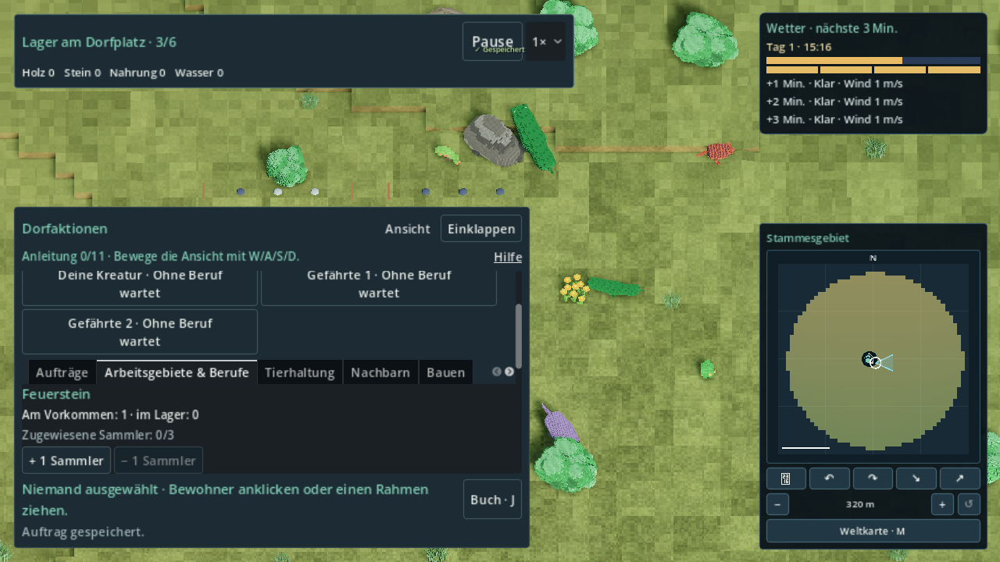
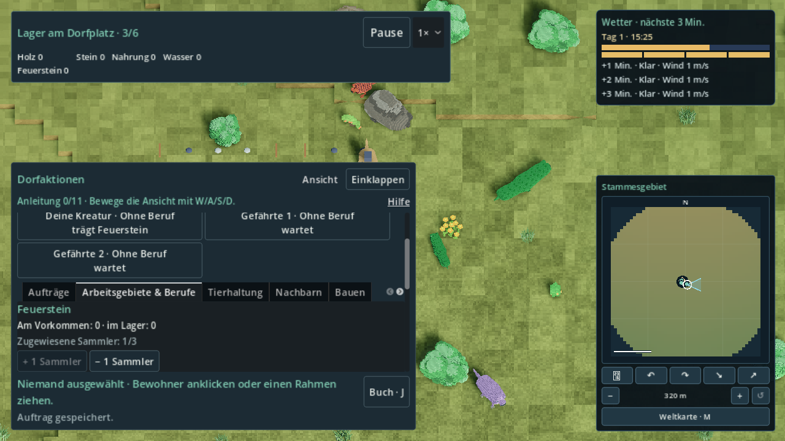
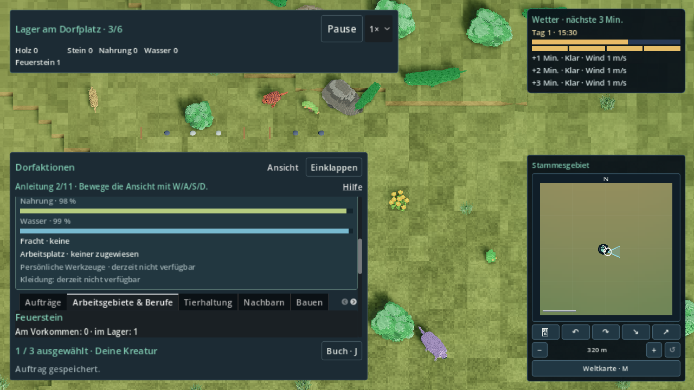
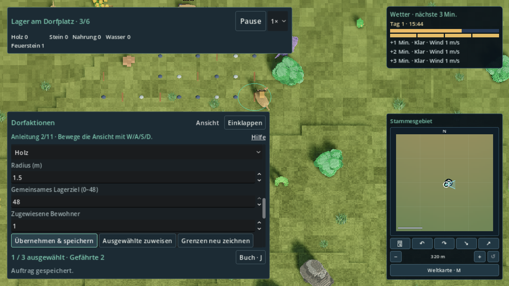

# R33-05 – endliche örtliche Ressourcenquellen (#208)

Feste Basis: `94de70cacd250337976b8f63031fff4afc72e2bb`.
Fachbranch: `agent/r33-05-resource-sources`. Draft: [#280](https://github.com/MajorDragonfly/voxelverse/pull/280).
Die vorhandenen frei gezeichneten, gespeicherten Kreisgebiete aus #268 werden erweitert.

## Quellenvertrag

`economy.local_resource_sources` enthält Schema 1 und höchstens 64 Datensätze.
Ein Datensatz enthält genau `id`, `body_id`, `region_id`, `slot`, `position`,
`resource_id`, `prop_kind`, `initial`, `remaining`, `regeneration`.
Die ID hängt ausschließlich vom Körper und einem kanonischen Cube-Zellslot ab,
nicht von Dorf, Sammelgebiet, Kamera, Ressourcentyp oder Rendernode.
Die coarse Region (`loose1`, Cube-Level minus vier, Face, Zelle/16) ist eine
fachliche Bindung der Quelle; sie ersetzt keine RegionsStore-Region.
Die exakte Cube-Adresse bindet das Objekt an den Ort. Körper, Slot, Typ,
Region und horizontale Adresse werden bei Load strikt gegeneinander geprüft.

Je aufgenommenem losen Stock, kleinen Stein oder Feuerstein gilt `initial=1`,
`remaining=0..1`, `regeneration=none`. Leere Datensätze bleiben als Tombstones
bestehen. Erneute Admission desselben Slots erzeugt keine zusätzliche Einheit;
Zeit, Streaming, Kamera und Neustart regenerieren diese endlichen Funde nicht.
Die gemeinsam besessene Siedlungsvalidierung untersagt dieselbe ID auch in
zwei Siedlungen desselben Körpers, einschließlich leerer Quellen.

Admission prüft vorhandenen Boden, Trockenheit und den tatsächlich fertigen
Navigationsgraphen. Vor Abschluss gibt es keine sammelbaren Props. Der gesamte
Vorrat wird durch die vorhandene Save-Transaktion aufgenommen; beim Savefehler
bleibt das Dorf ohne neuen Vorrat. Ein neuer Versuch folgt erst nach erneuter
Aktivierung. Aufgenommen werden maximal zwei Kandidaten je 0,25 Sekunden aus
einem festen 9×9 Raster um das Dorf, innerhalb der vorhandenen 20-m-Grenze.
Eine noch ausstehende Navigation verbraucht keine Kandidaten.

Nur Props mit diesem Quellenrecord sind sammelbar. Ungebundene größere
Surface-Dekoration bleibt Landschaft. Sie wird nicht bei jedem Klick zu einer
Quelle umgedeutet. Der lokale Adapter materialisiert die drei losen Objektarten
als sichtbare Props aus den kanonischen Records; ein Surface-Erzeugungsanschluss
kann denselben Slot-/ID-Vertrag nutzen, ohne parallel einen Vorrat zu erzeugen.

## Ein Mengenbesitzer

Weltklick und Kreisgebiet lesen denselben geliehenen Quellenrecord.
`VillageWork` entnimmt bei der bestehenden Ankunfts-/Arbeitsbedingung eine
Einheit aus `remaining`, setzt individuelle Fracht und `cargo_source_id`.
Das bestehende Lager wächst ausschließlich nach Ankunft am Dorf.
UI-Angaben, Gebietssummen und Sichtbarkeit sind berechnete Lesemodelle.
Es gibt weder einen UI-Vorrat noch einen Fernsimulations-Vorrat.

Überlappende Gebiete berücksichtigen vorhandene Bewohnerzuordnungen, so dass
die letzte Einheit nur einen Auftrag erhält. Der gemeinsame Entnahmepunkt
verhindert außerdem eine Doppelentnahme konkurrierender direkter Aufträge.
Wegsperre setzt übertragbaren Arbeitsfortschritt zurück. Rücknahme, Gebietslöschen
und Reassign erhalten Fracht und Herkunft. Pausierte Fracht bleibt unverändert.

## Anschlüsse für R33-01

Gemeinsame Dateien werden auf diesem Fachbranch nicht direkt geändert.
[ports/manifest.json](ports/manifest.json) und die engen Patch-Anhänge liefern:

- Economy 5→6: vorhandene Mengen, Adressen, IDs, Gebiete, Cursor und pausierte
  Fracht erhalten; nur Schema erhöhen und `stock.flint=0` ergänzen. Keine Quelle
  wird durch Migration aufgenommen oder aufgefüllt. Ressourcenkatalog-Revision 1
  bleibt erhalten; Feuerstein wird als endlicher Stückrohstoff ergänzt.
- Economy/TribeState: lokale Quellen in Mengenbilanz und Frachtvalidierung;
  VillageWork: tiefe Before-Image-Kopie der mutierbaren Quellen und kanonische
  Entnahme; Controller: Klickdetails, vorhandene Arbeitersteuerung und Endpunkte.
- SettlementCollection: körperweit eindeutige Quellen-IDs. Stockpiles und
  TribePresentation: Feuerstein aus dem vorhandenen Lager. Progression:
  endliche Funde liefern keine Erneuerbaren-Berufsevidenz.
- Vorhandener SaveParticipants-Futureguard delegiert an Economy, anschließend
  `LocalSources.unsupported`. Eine neuere verschachtelte Quellenversion blockiert
  alten Backup-Fallback und Überschreiben. Kein zusätzlicher SaveService.
- Fernsimulation bleibt beim vorhandenen `VillageSimulation`. Nur durch den
  realen Graphen zertifizierte Endpunkte kommen in die bestehenden Roads;
  Pflichtendpunkte haben Vorrang, `MAX_ROADS=128` bleibt unverändert.

Navigation, Surface-Erzeugung, RegionsStore, SaveService und Fernsimulations-
Writer bleiben gemeinsame Besitzer. Eine zusätzliche Regionsspeicherung ist
für diese Dorfkapsel nicht nötig. Kamera erweitert keinen Arbeitsbereich.
Die bestehenden acht Gebiete, Radien 1–8 m und Cachegrenze 128 bleiben erhalten.

Reproduktion in einem **eigenen isolierten Checkout** dieses Fachbranches:

```sh
python3 tools/review_r33_05_apply_ports.py --project /path/to/isolated-checkout
python3 tools/review_r33_05_locked.py --wait-slot 45 --output /path/to/host-evidence -- \
  python3 tools/validate_godot.py --godot /path/to/godot-4.6.3 --skip-main \
  --tests r33_05_local_sources_test r32_21_resource_area_test \
  village_work_snapshot_test village_work_observation_test \
  resource_production_contract_test far_simulation_test tribal_economy_progress_test \
  --output /path/to/focused-evidence
```

`apply_ports` prüft jeden Patch vor Anwendung, ergänzt Registry/Sprachen ohne
Duplikate und regeneriert Übersetzungen. In der Integration muss R33-01 die
Anhänge mit den anderen Besitzern (insbesondere R33-06 Economy/Catalog)
zusammenführen; sie dürfen nicht unbesehen über deren Stand gelegt werden.

R33-06 Equipment-Bilanzanschluss: Eine Bilanz mit `Economy.remaining` (inklusive
lokalem Rest) addiert rechts `LocalSources.initial(data, kind)`; eine Bilanz nur
mit dem ursprünglichen `deposit.remaining` addiert rechts `withdrawn`
(`initial − remaining`). `equipment_spent` bleibt links. Beide APIs lesen
dieselben Records, ohne eigene Budgetzähler. Dieser Anschluss muss im gemeinsamen
R33-01-Tree mit R33-06 geprüft werden; dessen unfertige Blätter sind hier nicht
übernommen.

## Prüfgrenzen

Die Fachtests enthalten reale native Savefehler und einen neuen Godot-Prozess.
Die Weltprobe betritt die Kugelkampagne, nimmt reale Bodenkandidaten auf, klickt
das sichtbare Objekt, sammelt durch vorhandene Bewohnerbewegung und zeichnet
zwei überlappende Kreisgebiete über echte Viewport-Eingaben.
Software-GL auf dem gemeinsamen Host beweist den funktionalen Ablauf.
Volle Integrationssuite, Export, Ziel-PC- und 60-FPS-Abnahme bleiben offen.
[focused/results.json](focused/results.json) belegt sieben grüne Godot-Fach-/
Verbrauchertests plus Source-Verträge am sauberen QA-Head
`dbbd407bd55810f8a518654f1179dc0a2c8f47e3`, Tree
`76ae3a8b35dfdc6f3ba8185573877fc0a140507e`.
SourceRun ist stable/reusable (`183e146c4dd0234863d28b072f800296dc41cba50bff6e2da2ee5cf910295730`).
Originale Logs und vollständige Start-/Endquellinventare sind unverändert gzip-
komprimiert beigefügt; identische Start-/Endinventare haben identische Hashes.
[negative/summary.json](negative/summary.json) erklärt die getrennten negativen
Vorläufe und Korrekturen. Der [native Gesamtlauf](native/report.json) ist ebenfalls grün, ohne SCRIPT ERROR/ERROR;
acht originale 1280×720 PNGs wurden gerendert und visuell geprüft. Sauberer
QA-Head `030ac3bafa30c0dae7e3d5b95ab7294d283bd36f`, Tree
`a1d89c13e8eaf0ecea50ecc6bf6e5d1823a2b607`; SourceRun stable/reusable.
Zwischen Fach- und Renderstand änderten sich ausschließlich die eigenen
Prüfhelfer, keine Produktmodule oder Besitzerpatches.

## Tatsächliche Mengen aus der Weltprobe

[source-ledger.json](native/source-ledger.json) enthält die kanonischen Records,
Bewohner und Lagerstände; [quantity-summary.json](native/quantity-summary.json)
ist ausschließlich daraus berechnet. Aufgenommen wurden 56 Einzelobjekte:
19 lose Stöcke, 19 kleine Steine und 18 Feuersteine.

| Zustand | Rest am betroffenen Objekt | individuelle Fracht | Lager | Lieferungen insgesamt |
| --- | ---: | ---: | ---: | ---: |
| Feuerstein aufgenommen | 0 | 1 Feuerstein | 0 Feuerstein | 0 |
| Feuerstein physisch angekommen | 0 | 0 | 1 Feuerstein | 1 |
| Zwei Holzgebiete, letzte Einheit entnommen | 0 | genau 1 Holz | 0 Holz, 1 Feuerstein | 1 |
| Zertifizierte Fernrückkehr, Near-Besitz zurückgesetzt | 0 | 0 | 1 Holz, 1 Feuerstein | 2 |

Danach verbleiben 54 örtliche Einheiten: 18 Holz, 19 Stein, 17 Feuerstein.
Die zwei erschöpften Records sind dieselben IDs wie beim ursprünglichen
Klick/Entnahme. Wiederholung desselben Ferncursors zahlt keine weitere Einheit.
Die physische Review benutzt wie der bestehende Gebietsreview `Engine.time_scale=2`
für Lauf-/Arbeitsphasen, und 1 während UI-/Admissionprüfungen; keine Position
wird in der Weltprobe geschrieben. Längere Wanduhrfenster gleichen das langsame
Software-GL aus; sie verändern keine Produktions-/Suchbudgets.






[draw-local-0.png](native/draw-local-0.png) und
[draw-local-1.png](native/draw-local-1.png) zeigen die beiden echten Drag-Vorgänge.
Alle Originalbilder und Logs sind unverändert; PNGs sind keine Mockups.

Der Änderungsplan der gepatchten QA-Basis verlangt in der Integration alle
288/288 registrierten Tests und Main-/Runtime-Prüfung. Dieser Fachnachweis
ersetzt den neuen gemeinsamen Merge-Tree nicht. Native Exporte sowie
Ziel-PC-/60-FPS-Abnahme sind weiterhin offen.
