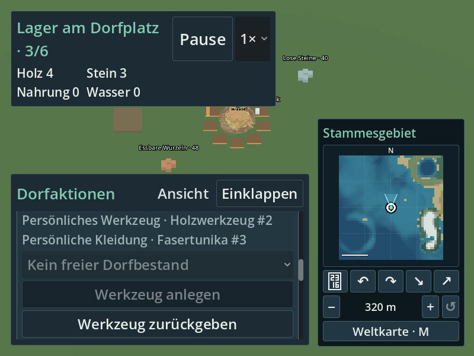
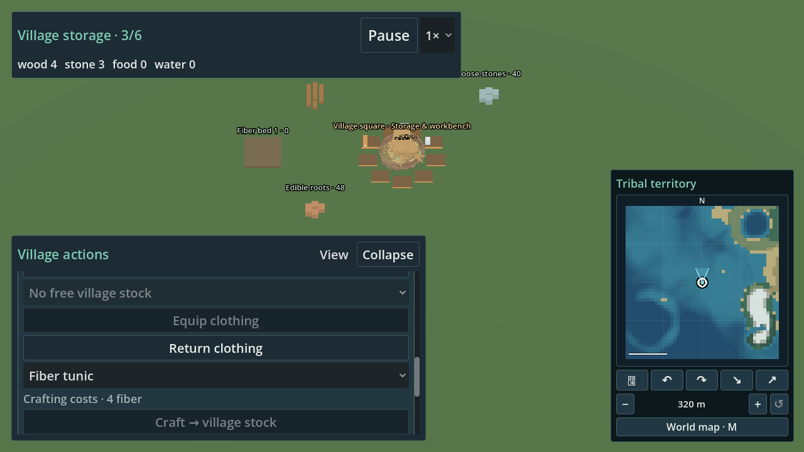
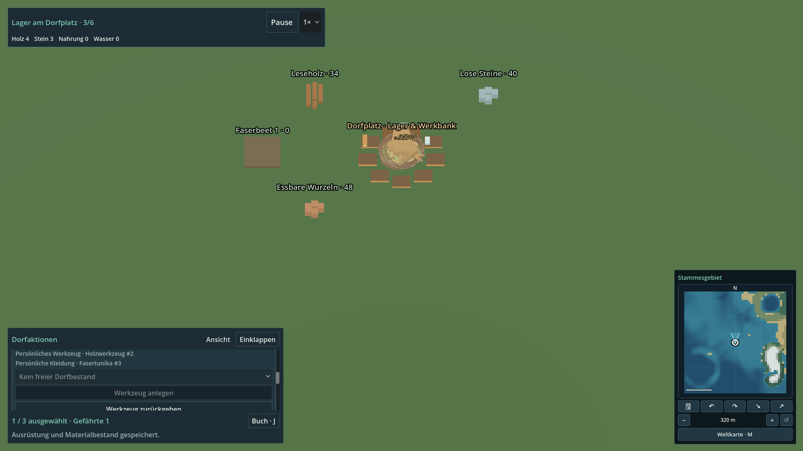
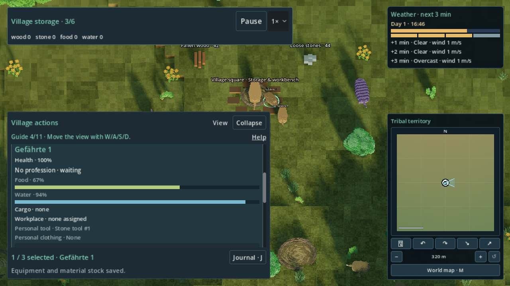
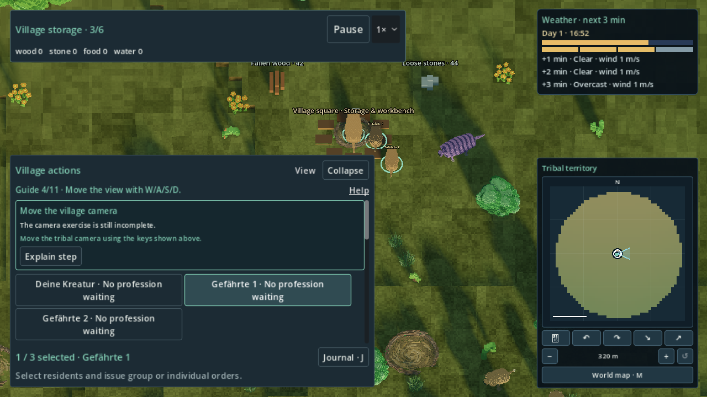

# R33-06 — persönlicher Bewohnerbesitz (#206)

Feste Fachbasis: `94de70cacd250337976b8f63031fff4afc72e2bb`, Tree
`58506a6feba11be547197223fa319e7265cf4d99`. Fachbranch:
`agent/r33-06-resident-equipment`; Draft #275 gegen R33-Integration.
AGENTS.md, R33-Zuordnung #137 und integrierte Bewohnerdetail-Lieferung #258
sind die Grundlage. Technische Fachlieferung; Ziel-PC/Spielkomfort bleibt offen.

## Besitz und Herstellung

Ein fertig hergestellter Gegenstand hat eine stabile Dorf-/Sequenz-ID,
Herstellungsrevision und genau einen Besitzerort. `owner_id=""` bedeutet freier
Dorfbestand; eine Bewohner-ID bedeutet dessen persönlichen Werkzeug- oder
Kleidungsplatz. Der Platz folgt dem Gegenstandstyp, maximal ein Gegenstand je
Bewohner und Platz. Es gibt keine zweite Bestandstabelle im Bewohner oder UI.
Auswahl reserviert nichts. Ausstattung prüft die aktuelle freie ID erneut;
Wechsel gibt die bisherige ID frei, Rückgabe behält ID/Revision/Gegenstand.
Rückgabe erzeugt keine Rohstoffe. Maximal 48 fertige Gegenstände pro Dorf.

Das bisherige Dorf-`tools` bleibt sein gespeicherter Technologie-/Arbeitsport.
Es wird niemals als persönlicher Besitz angezeigt, kopiert oder migriert.
Die erste Handwerksaktion ist unmittelbar am Dorfplatz, mit leerer Fracht und
ohne Bau-/Pflege-/Siedlungstransportbindung. Voraussetzung: bereits tatsächlich
hergestellte gemeinsame Werkzeuge. Material kommt ausschließlich aus aktuellem
spendbarem `stock`; bestehende Bau-/Transportreservierungen, Fracht und
Kapazitätsreservierungen werden nicht als freies Material ausgegeben.

| Herstellungsrezept, Revision 1 | Materialverbrauch | Fertiger Gegenstand |
|---|---|---|
| `equipment.stone_tool` | 3 Holz, 2 Stein | 1 Steinwerkzeug im freien Dorfbestand |
| `equipment.wooden_tool` | 2 Holz, 1 Faser | 1 Holzwerkzeug im freien Dorfbestand |
| `equipment.fiber_tunic` | 4 Fasern | 1 Fasertunika im freien Dorfbestand |

Rezepte ergänzen den vorhandenen Produktionskatalog. Holz/Stein stammen aus
vorhandener Arbeit; Fasern aus dem bestehenden kostenpflichtigen Faserbeet.
Die neue Tunika hat damit einen echten Material- und Besitzpfad. Es gibt keine
neue Bonusverwaltung: bestehende gemeinsame Werkzeug-/Arbeits-/Kooperationseffekte
bleiben an ihren bisherigen Stellen. Kleidung erzeugt weder erfundene Gesundheit
noch Wettereffekte. R33-07/R33-01 besitzen diese Anschlüsse.

## Save, Schema und Lebenszyklus

Optionaler Dorf-Untervertrag `resident_equipment`, Schema 1:

```json
{"schema":1,"next_sequence":1,"items":{}}
```

Jeder Eintrag hat genau `id`, `sequence`, `kind`, `recipe_id`, `recipe_revision`,
`owner_id`. Kein unabhängiger Tribe-/Economy-Schemabump. Altstände ergänzen nur den
leeren Untervertrag; bestehende Bewohner, Werte, Ressourcen und Fremdfelder bleiben
unverändert. Herstellung/Ausstattung/Wechsel/Rückgabe benutzen den vorhandenen
SaveService-Transaktionsport; Schreibfehler stellen den gesamten kanonischen
Vorstand wieder her, einschließlich Material, Sequenz und beider Besitzplätze.
UI/Runtime behalten keine lebenden Dorf-/Bewohner-/Actor-Dictionaries über Loads.

Validierung prüft Mengenlimit, lückenlose Herstellungssequenz, stabile ID,
unterstützte Rezeptrevision, eindeutige Bewohnerbindung und einen Gegenstand pro
Platz. Bezahlte Gegenstände bleiben in der Rohstoffbilanz enthalten:
`remaining + stock/cargo + equipment_spent <= original + produced + freight.net`.
Nach R33-05 kommt rechts dessen **kanonisches** `LocalSources.initial` hinzu;
`Economy.remaining` enthält links bereits deren restliche Einheiten. Kein zweiter
Quellenzähler, keine Wiederauffüllung. Siehe seriellen Patch unten.

Neuere Unterverträge und unbekannte/neue Rezeptrevisionen werden vor Backupfallback
und Schreibversuch geschützt, auch in einer nicht ausgewählten Siedlungsinstanz.
Körper-/Nah-/Fern-/Actorwechsel ändern keinen Besitz. Gegenstände sind zunächst
lagerlokal: ein ausgerüsteter Siedlungsgründer muss am alten Lager zurückgeben,
bevor er das Dorf verlässt. So gibt es weder impliziten Gegenstandstransport noch
verwaiste Besitzer. Abbau/Zerstörung und Gegenstandstransport zwischen Dörfern sind
nicht Bestandteil dieses ersten Pfads.

## Serielle Besitzeranschlüsse für R33-01

Produktionsdateien außerhalb der exklusiven Blätter sind im Fachbranch unangetastet.
`patches/owners.patch` verbindet TribeState, Produktionskatalog, Save-Futureguard,
Settlement-Futureguard/Gründer, Controller, TribePanel-Callables/Erhalt offener Detailmenüs, Übersetzung der
Ausrüstungs-Ergebnisschlüssel im bestehenden Presenter und das bestehende
begrenzte Long-Test-Budget. `localization-append.json` ergänzt 30 DE/EN-Nachrichten;
`test-registry-append.json` registriert genau die drei eigenen Fachtests einmal im
Vertrag `village`. Der Helfer `tools/review_r33_06_overlay.py` wendet diese ausschließlich
in einem separaten QA-Checkout an und lehnt seinen eigenen Fachcheckout ab.

Mit R33-05 abgeglichen in #137, Kommentar 6036443175: erst dessen Quellen-/Economy-
Ports, dann die 06-Ports, dann `patches/after-r33-05.patch` für den einzigen
Bilanzleseanschluss. Die eigenen Lifecycle-Prüfungen führen dann zusätzlich echte
örtliche Entnahme/Fracht/Lieferung, bezahltes Werkzeug und JSON-Restore aus; ohne
05 wird dieser Fall ausdrücklich als noch nicht angewendeter kombinierter Umfang
ausgegeben. Gemeinsame Schema-/Wirtschaftsquellen bleiben bei R33-01/05.

Opt-in `.github/workflows/r33-06-equipment-review.yml` ist nur als Patchvorlage hier
und tatsächlich ausschließlich im Diagnose-Draft #278. Dieser Branch enthält keine
Produktimplementierung und darf nicht als Featuremerge verwendet werden. Er baut
an einer festen Quell-SHA den isolierten QA-Tree und bewahrt Originalartefakte.

## Prüfung und Grenzen

Die eigenen Fachtests prüfen zwei Bewohner/letzte freie ID, bezahlte Materialien,
Wechsel/Rückgabe, Bau-/Frachtreservierung, fremde/mehrdeutige Besitzer, Migration,
Futureguard, den vorhandenen radialen Siedlungs-/Körperadapter und Nah/Fern.
`r33_06_equipment_ui_test` verwendet tatsächliche Maus-/Popup-Tastaturereignisse,
physische Sammel-/Bauwege, echte Save-Schreibfehler samt Bytes/komplettem Rollback,
Actorrekonstruktion und einen frischen Godot-Prozess. Die Layoutmatrix umfasst
DE/EN × 800×600/1280×720/1920×1080 × 100/125/150 %, 36 Originalcaptures.
Die gesonderte `review_r33_06_sphere.gd` nutzt Titel/Playtest/Kugelkampagne, echte
Materiallieferung, gemeinsame Werkzeugproduktion, persönliche Herstellung/
Ausstattung und Titel/Load; keine gratis vorbereiteten Gegenstände oder Vorräte.

### Endstand und Nachweise

Spielcode: `f701442f500dcf1d820f6f723a4815c78a0cc28b`, Tree
`310c184e43f46dae193dc012a8d3ea40c2c9cc44`. Spätere Fachbranch-Commits ergänzen
nur Bilder/Protokolle/Dokumentation; die exakten Spielblatt-Hashes stehen in
[source-leaves.json](source-leaves.json). Der abschließende Draft-PR nennt den
vollständigen Liefer-Head/Tree. Alle Prüfungen verwenden Godot
`4.6.3.stable.official.7d41c59c4` und isolierte Nutzerdaten.

Aktueller kombinierter R33-05→06-Prüfstand:
`2500298a0d28fe4c5cb0a6d1dae747088c92f6d4`, Tree
`e36208b44f9321a848174e762767ac0b90909c9a`. Die aktuelle Gesamt-Portdatei lässt
sich dort vollständig rückwärts prüfen; beide append-Kataloge sind seriell
angewendet (291 Tests, 2678 DE/EN-Nachrichten). Fachmodell 81/81 und kombinierter
Lifecycle 55/55 sind grün. SourceRun **prepared/reusable**, einschließlich des nach
Hostverlust notwendigen einmaligen Imports. Keine nachträgliche Quellenänderung.
Originale: [combined-final-evidence.tar.gz](combined-final-evidence.tar.gz),
[Ergebnisbericht](combined-final-results.json). Lifecycle-Log SHA256:
`34a2c2e7b273b1dcec9e8d1b4e38bd40ec2d0755f60f9c24c321356ffb28d3aa`.

Finaler opt-in CI-Lauf [37623028542](https://github.com/MajorDragonfly/voxelverse/actions/runs/37623028542)
ist vollständig grün, auf exakt dem oben genannten Spielcode. Sein isolierter,
sauberer Besitzer-QA ist `dc8d6554fcf89ba96e78c333d66acfe5dcb89cfa`, Tree
`352b7b4da5acfc246caf54250057ccd72a62dec2`.

| Endprüfung | Ergebnis | Beleg |
|---|---|---|
| Import, Kunstquellen, Test-/DE/EN-Vertrag | grün; notwendiger Import, prepared/reusable | [CI headless](ci-headless-results.json) |
| Fachmodell / Basis-Lifecycle | 81/81 / 47/47; kombinierter Umfang separat 55/55 | CI + kombinierter Bericht |
| Bedienung, Konkurrenz, Wechsel/Rückgabe, drei tatsächliche Schreibfehler, kompletter Rollback, Futureguard, frischer Prozess | 581/581, Kindprozess 4/4 | UI-Log in Originalarchiv |
| Direkte Verbraucher | 7/7 grün: Bewohnermodell/-UI, Arbeits-Snapshot/-Beobachtung, Produktions-/Wirtschaftsvertrag, Settlement-Save | CI headless |
| Native Layout-/Bedienmatrix einschließlich Feedback-Locale | 617/617; 18 Profile, 36 Original-PNGs | [Native](ci-native-results.json) |
| Titel/öffentlicher Playtest/Kugel: tatsächliche Arbeit, bezahltes persönliches Werkzeug, Besitz, Pause, Save/Titel/Load | 62/62; 5 Original-PNGs, nach Load geprüfter Besitz | [Sphere](ci-sphere-results.json) |

Native und Sphere: SourceRun **stable/reusable**, keine geänderten Spielblätter,
Exit 0, keine Script-/Parser-/Shader-/Leakfehler. X11/Xvfb, OpenGL 4.5
`gl_compatibility`, Mesa `25.2.8-0ubuntu0.24.04.4`, llvmpipe LLVM 20.1.2,
`LP_NUM_THREADS=2`, `LIBGL_ALWAYS_SOFTWARE=1`. Der VSync-Hinweis ist die normale
Einschränkung dieses Softwaretreibers. Sämtliche Befehle, Umgebung und Start-/End-
Manifeste liegen in den Originalen. Enginebudgets 240 s native und 540 s sphere
bleiben unverändert; Capture-on-demand rendert die tatsächlichen Frames.

SHA256 UI-Log `4a3eb21acbcaab7eb97ce7ce0119daf57d469861c6f41ff888ccfa89086ef6de`,
natives Log `28f1eef74396d0daebfd0febc34adc4d58909d885ebbff59789e404cefa4ef6d`,
Sphere-Log `d2cc27d90e775a1c2f1a447c3e5eb50fd7d94baaccdef4e5b9531fa07b0f3549`.

Das vollständige CI-Originalarchiv ist dauerhaft in drei unveränderten Byte-Teilen
[01](ci-37623028542.zip.part01), [02](ci-37623028542.zip.part02),
[03](ci-37623028542.zip.part03) erhalten. [Archivmanifest](ci-37623028542-archive.json)
enthält Teilgrößen/-Hashes und Original-SHA256
`cf348affb738af5cae1ffac3aaa98235d453f1fe9330aa3e7f09a62f77e6be93`.
Wiederherstellung aus diesem Verzeichnis:

```sh
cat ci-37623028542.zip.part01 ci-37623028542.zip.part02 ci-37623028542.zip.part03 > /tmp/r33-06-originals.zip
sha256sum /tmp/r33-06-originals.zip
unzip /tmp/r33-06-originals.zip -d /tmp/r33-06-originals
```

### Sichtkontrolle

DE, 800×600, 150 %: echter Holzwerkzeug-/Tunika-Besitz; freier Bestand leer.



EN, 1280×720, 125 %: Tunika-Rezept mit vier Fasern; Herstellung wegen verbrauchten
Faserbestands gesperrt. Kosten und Bedienelemente sind lesbar und per Scroll erreichbar.



DE, 1920×1080, 100 %: gleiche Gegenstandsnummern/Materialbestände. Einzelne unterhalb
des sichtbaren Scrollausschnitts liegende Aktionen werden zum Bedienen gescrollt;
der Test verlangt dann vollständige Einfassung, keine gleichzeitige Anzeige aller Zeilen.



Kugelwelt, EN: bezahltes Steinwerkzeug #1, Kleidung leer; auch die Rückmeldung ist EN.
Gespeicherte Bewohnernamen bleiben absichtlich literal, einschließlich „Gefährte 1“.



Nach tatsächlichem Save/Titel/Load zeigt dieses Bild denselben ausgewählten
Bewohner in der Liste. Das darunter liegende Ausrüstungsdetail ist in diesem
Scrollausschnitt nicht sichtbar. Die Sphere-Prüfung bestätigt nach Load dieselbe
Gegenstands-ID, denselben Besitzer und unverändert leere Kleidung.



### Erhaltene Diagnoseoriginale

[negative-originals.tar.gz](negative-originals.tar.gz) enthält die ursprünglichen
lokalen Fehlerläufe, einschließlich unpassender Bau-/Popup-Testvorbereitung und
JSON-Zahlentypvergleich. [CI 37612691470](negative-ci-37612691470.zip) und
[CI 37616652129](negative-ci-37616652129.zip) bewahren vollständige Originalprotokolle
der früheren fehlgeschlagenen Menüprüfungen; kein Testfehler wurde als Erfolg gezählt.
[local-lifecycle-evidence.tar.gz](local-lifecycle-evidence.tar.gz) bewahrt die erste
kombinierte Diagnose, die nachfolgende stabile 55er-Prüfung und den Xvfb-Bootstrapfehler.

Der später zunächst technisch grüne Lauf
[37620705633](https://github.com/MajorDragonfly/voxelverse/actions/runs/37620705633)
zeigte bei der Bildkontrolle einen eigenen Locale-Fehler: die Rückmeldung blieb
nach einer DE-Aktion auf EN deutsch. [Originalbild](images/negative-locale-sphere-en.png)
und [Quellzuordnung](prior-ci-37620705633.json) bleiben erhalten. Der aktuelle
Runtime schreibt den Ergebnisschlüssel; der vorhandene Presenter übersetzt ihn
beim Anzeigen. Zusätzliche Prüfungen kontrollieren dies in jedem Skalenprofil
und auf der Kugelwelt.

Während der Diagnose wurden die lokalen regulären Hostdateien gelöscht. Git-/CI-
Originale und der schon veröffentlichte kombinierte Beleg konnten wiederhergestellt
werden. Die unveröffentlichte native 240-s-Probe mit 23/36 Bildern verlor dabei ihre
lokalen Rohdateien; ihr negatives Ergebnis steht in #137, Kommentar 6037601122.
Dieser Lauf zählt ausdrücklich nicht als Bedien- oder Bildabnahme. Die vollständig
neuen Endbelege ersetzen ihn. [current-ui-evidence.tar.gz](current-ui-evidence.tar.gz)
hält die danach grüne 563er-UI-/Verbraucherprüfung vor dem letzten Locale-Fix fest.

### Grenzen und Integrationsabschluss

Vollsuite, gemeinsamer Merge-Tree, gemeinsame Produktions-/Reise-/Exportkette und
native Exporte gehören zur R33-01-Integration. Der Diagnose-Draft #278 wird nicht
als Produktcode gemergt. Die Kugelprüfung benutzt den öffentlichen Titel/Playtest-
Port; sie belegt keinen vollständigen organischen Spezies-/Epochenfortschritt und
keine gerenderte Reise zwischen Himmelskörpern. Software-GL-Bilder belegen weder
Ziel-PC-FPS noch Spielkomfort. Diese menschliche Abnahme bleibt offen; #206 wird
mit diesem Fach-Draft nicht geschlossen.
